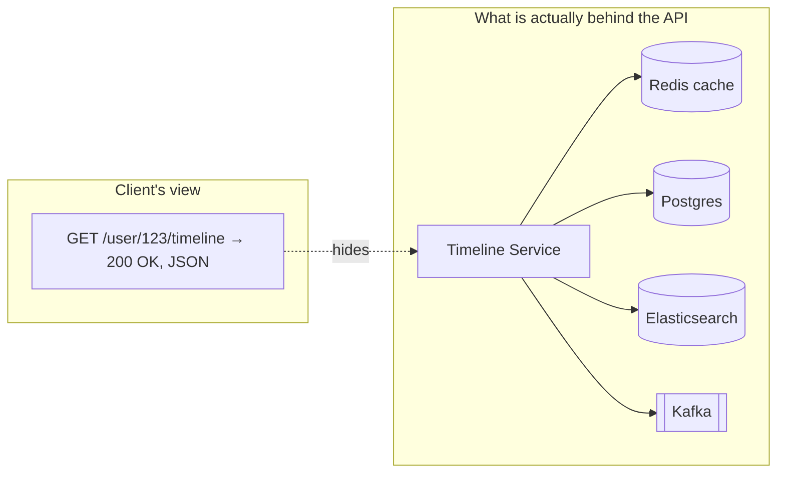
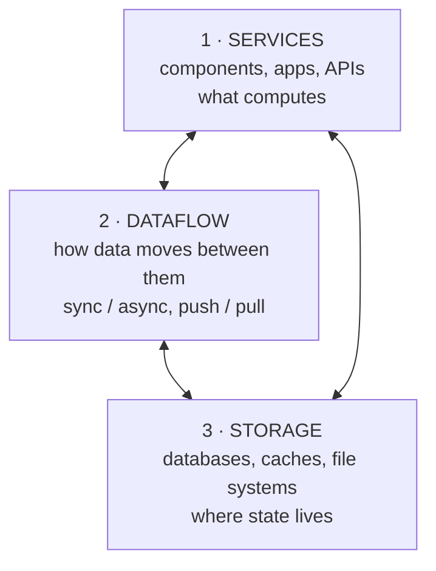

# 1.1.1 — What Is a System Design Interview?

> **Part 1 · Introduction · Basics · Chapter 1 of 5**
> Prerequisites: none. This is the front door.

---

## 🧒 ELI5 — Explain Like I'm 5

Imagine your friend says: **"Build me a LEGO city."**

They do *not* say which bricks to use. They don't say where the fire station goes. They just want a city that works — cars can drive, people can get to school, and if one road is blocked, there's another road.

A **system design interview** is exactly this, but instead of LEGO bricks you get things like:

- **boxes that hold stuff** (databases),
- **boxes that remember stuff quickly** (caches),
- **the roads between boxes** (networks and APIs),
- **traffic police** (load balancers),
- **post offices that hold letters until someone reads them** (message queues).

The interviewer says *"Build me WhatsApp"* and watches **how you think**, not whether you produce the one true answer. There is no one true answer. They want to see you:

1. **Ask what the city is for** — 10,000 people or 1 billion? (requirements)
2. **Guess how big it needs to be** — how many roads, how many houses? (estimation)
3. **Draw the city** — boxes and arrows on a whiteboard. (architecture)
4. **Explain why you picked each brick** — "I used a red brick here because it's stronger, but it costs more." (trade-offs)
5. **Say what breaks** — "If this bridge falls, here's the detour." (failure handling)

The whole interview is: *can this person build something big without it falling over, and can they explain their choices to a teammate?*

That's it. Everything else in this book is learning what each brick does.

---

## The formal definition

**System design** is the process of architecting and planning (often data-intensive) applications by carefully selecting and integrating various data systems to efficiently handle processing and storage needs.

Unpack that sentence, because every word is load-bearing:

| Phrase | What it really means |
|---|---|
| *architecting and planning* | You produce a **design artifact** — a diagram plus written decisions — before code exists. |
| *data-intensive* | The hard part is rarely CPU. It is **volume, velocity, and variety of data**. (Contrast: compute-intensive problems like ray tracing.) |
| *selecting* | You choose from a menu of existing components. You are **not inventing a new database**. |
| *integrating* | The value you add is the **glue** — how components talk, and what guarantees hold across them. |
| *efficiently* | Under cost, latency, and operational-complexity budgets. |

### The composition insight

When you integrate multiple tools to deliver a service, the service's interface or API **conceals the implementation specifics from clients**. By doing this you have effectively constructed a **new, specialised data system out of smaller, general-purpose components**.

This is the single most important idea in the whole discipline.

Your composed system can now offer **guarantees that none of its parts offer alone** — for example, "a read after a write always reflects that write," achieved by writing to Postgres and *invalidating* Redis in the same code path. Postgres doesn't know Redis exists. Redis doesn't know Postgres exists. **You** created the guarantee.

Conversely, a composed system can **destroy** guarantees its parts had. Postgres alone is strictly consistent; Postgres + a lazily-invalidated cache is not. Recognising when you have silently broken a guarantee is what separates a senior answer from a junior one.

🎯 **Interview angle** — When you add a component to your diagram, an excellent interviewer will ask *"what guarantee did you just break?"* Have the answer ready.

---

## System design vs OOP (low-level) design

These are two different interviews. Companies often run both. Do not confuse them.

| | **OOP / Low-Level Design (LLD)** | **System Design / High-Level Design (HLD)** |
|---|---|---|
| **Example prompts** | Design a parking lot. Design a vending machine. Design an elevator controller. Design a deck of cards. | Design WhatsApp. Design Uber. Design a URL shortener. Design Twitter's timeline. |
| **Skills tested** | Writing well-structured OOP code, class inheritance, encapsulation, SOLID, design patterns (Strategy, Factory, Observer) | Architecture, dataflow, scalability, availability, design trade-offs |
| **You are asked to produce** | Class diagrams, interfaces, method signatures, sometimes working code | Architecture diagrams, API contracts, storage schema and choice, resource estimates, trade-off discussion, deep dive on one component |
| **Scale in scope** | One process, one machine | Thousands of machines, multiple regions |
| **Failure discussion** | Exception handling | Node death, network partition, region outage, data-loss windows |
| **Time given** | 45–60 min | 45–60 min |
| **Whiteboard content** | UML-ish class boxes | Boxes-and-arrows infrastructure |
| **"Correct" answers** | Fairly constrained — good and bad designs are distinguishable | Wide open — many valid designs, judged on justification |

🧒 **ELI5 on the difference:** LLD is *"draw the inside of one LEGO fire truck — where do the wheels attach?"* HLD is *"draw the whole city and say where the fire trucks live."*

---

## Who has to go through system design interviews?

System design interviews become more important as engineers progress and take on complex projects or leadership positions.

### Experienced Software Engineer (SDE / SWE — mid-level and above)

As engineers gain experience they are tasked with designing and architecting complex systems, so system design skill becomes crucial. The interview assesses the ability to:

- break a vague problem into tractable sub-problems,
- select appropriate technologies for each sub-problem,
- create scalable and efficient solutions.

At this level a tech interview loop is typically **LeetCode-style coding rounds plus one or two system design rounds**. The design round is frequently the *level differentiator* — coding gets you in the door, design decides whether the offer is L4 or L5.

### Engineering Manager (EM / SDM)

Engineering managers lead and guide teams through development and execution of software projects. They need a strong understanding of system design principles to make informed decisions and ensure successful delivery. Their design round evaluates **technical judgement plus leadership**: how they scope, how they handle disagreement, how they manage risk and phasing.

### Technical Program Manager (TPM)

TPMs oversee the planning, execution, and delivery of technical projects. They need to understand the intricacies of system design to coordinate resources and manage project risk effectively. Their round tests **technical breadth and management of complexity** — usually less depth on any single component, more on dependencies, rollout, and cross-team interfaces.

### Others who encounter it

- **Infrastructure / SRE / Platform engineers** — a harder, more operations-focused variant.
- **Data engineers** — a pipeline-flavoured variant (see Part 6).
- **Solutions architects and sales engineers** — a customer-facing variant.
- **New grads at some companies** — a gentler version, sometimes merged with a coding round.

---

## What exactly are we designing?

System design is the process of designing a complex system to meet specific requirements and goals, typically aimed at providing a **service to an end user**. To achieve this we assemble various technologies and components into a cohesive, functional whole.

Everything you design falls into exactly **three buckets**. Memorise these three words; they organise your whiteboard.

### 1. Services

The components, applications, and APIs that provide specific functionality or processing capability. Services can be designed as a **monolith** or, more commonly at scale, as **microservices** to enable better scalability, maintainability, and flexibility. (Full treatment: [Microservices and Monolithic Architecture](../05-microservices/01-microservices-vs-monolithic.md).)

Questions you must answer for each service:

- What is it responsible for? (one sentence, no "and")
- What is its API?
- Is it stateless? If not, why not, and what pins state to it?
- How many instances, and how do we scale them?

### 2. Dataflow

Designing the flow of data within and between services is crucial for efficient processing, timely communication, and accurate results. This means understanding the **data formats, protocols, and communication patterns** used between services.

Questions:

- Synchronous request/response, or asynchronous message? (Part 2)
- Push or pull? ([Push vs Pull](../../03-scaling-services/04-dataflow/02-push-vs-pull.md))
- What happens if the downstream is down — fail, retry, queue, degrade?
- What is the delivery guarantee — at-most-once, at-least-once, effectively-once?

### 3. Storage

The databases, caches, and file systems required to store and manage data throughout the system. This includes **selecting appropriate storage technologies, data modelling, and ensuring data consistency and durability**.

Questions:

- What is the access pattern? (This determines the database, not the other way round.)
- Relational, key-value, document, search, blob, time-series, OLAP? (Part 4)
- How is it partitioned and replicated? (Part 5)
- What is the consistency model, and can the product tolerate it?

🎯 **Interview angle** — If you get stuck mid-interview, silently walk the three buckets: *"Have I defined my services? Have I defined how they talk? Have I defined where state lives?"* One of the three is almost always the gap.

---

## Functional requirements

**Functional requirements** are the features and capabilities a system must have to fulfil its intended purpose. They describe **what the system is supposed to do** and focus on the specific tasks or functionalities the system should perform. They are often derived from user needs, business objectives, or system specifications.

### Examples of functional requirements

- **User actions** — the actions a user can perform within the system: creating an account, logging in, submitting a form, posting a tweet, sending a message, requesting a ride.
- **Data input and processing** — how the system should process, manipulate, or transform data based on user input or other sources: resizing an uploaded image, computing a fare, ranking a feed, deduplicating an order.

Functional requirements are usually documented and communicated to developers and stakeholders through formats such as **product requirement documents (PRDs)**. These requirements guide the development process and ensure the final product meets the intended objectives and provides the desired functionality.

### How to write them in an interview

Write them as **verb phrases from the user's point of view**, and get the interviewer to confirm. Three to five is right; more and you will run out of time.

> **Design Twitter — functional requirements**
> 1. A user can post a tweet (text ≤ 280 chars, optional media).
> 2. A user can follow another user.
> 3. A user can view a home timeline of tweets from people they follow, newest first.
> 4. *Out of scope, confirmed with interviewer: DMs, search, ads, trends, notifications.*

Explicitly stating what is **out of scope** is one of the cheapest ways to look senior. It shows you know the full problem space and are managing the clock deliberately.

☠️ **Failure mode:** candidates who list twelve features, then design none of them properly. Cut aggressively. The interviewer will tell you if you cut something they cared about.

---

## Non-functional requirements

Besides making things functionally work, the system must also satisfy **non-functional requirements** — properties of *how well* it does what it does. This is where system design interviews are actually won and lost.

### Scalability

A well-designed system should be able to handle increasing amounts of work or users **without compromising performance**. This involves designing for horizontal and vertical scaling, optimising resource usage, and planning for future growth. (Part 3.)

### Availability

High availability is essential for ensuring the system continues to function **even in the face of failures**, such as hardware or network issues. This requires designing for redundancy, failover mechanisms, and monitoring the system's health. ([High Availability](../03-non-functional-requirements/03-high-availability.md).)

### Performance — latency and throughput

- **Latency** — the time taken to respond to requests. Always quote a *percentile*: p50, p95, p99. Never quote an average.
- **Throughput** — the amount of work or number of transactions the system can handle in a given time frame (QPS, records/sec, MB/sec).

These two are **not the same thing** and often trade against each other; batching raises throughput and raises latency. ([Latency](../03-non-functional-requirements/06-latency.md), [Throughput](../03-non-functional-requirements/07-throughput.md).)

### The other three worth naming

Besides the main non-functional requirements there are also:

- **Reliability** — the service returns *correct* results, not merely some result.
- **Consistency** — data is consistent between services and replicas. (Which model? Strong, read-your-writes, monotonic, eventual?)
- **Efficiency** — the service performs minimal redundant operations; cost per request stays sane as you grow.

### Also frequently in scope

| Requirement | Typical interview phrasing |
|---|---|
| Durability | "We must never lose an uploaded photo." |
| Security | "Only the owner can read the document." |
| Privacy / compliance | "GDPR: delete all user data within 30 days." |
| Cost | "This can't cost more than $X per million requests." |
| Operability | "A single engineer must be able to debug it at 3 a.m." |
| Geo-distribution | "Users in India must see under 100 ms latency." |

🎯 **Interview angle** — Turn every non-functional requirement into a **number** before you design. "Highly available" is meaningless. "99.95%, i.e. about 22 minutes of downtime per month, with a 5-minute recovery time objective" is a constraint you can actually satisfy or fail.

---

## What skills do I need to excel at system design interviews?

To excel in system design, engineers need to develop a broad set of skills, including:

1. **Deep technical knowledge of various technologies and components**, such as databases, messaging systems, and batch processing systems. You need to know not just *what* Kafka is, but what it guarantees, what it costs, and when it is the wrong choice.
2. **Architectural and design pattern knowledge**, to identify reusable and scalable approaches instead of inventing something from scratch under time pressure. (Part 7 is exactly this vocabulary.)
3. **An understanding of trade-offs** and the ability to make informed decisions based on constraints and requirements. Every "it depends" must be followed by *"...on X, and here X is Y, so I choose Z."*
4. **Strong analytical and problem-solving skills** to break down complex requirements and design effective solutions under ambiguity.
5. **Effective communication skills** to collaborate with team members and stakeholders and to articulate design decisions. In the interview this is not a soft bonus — an unexplained correct design scores lower than a well-explained adequate one.

### The honest skill matrix

| Skill | How it shows up in the room | How to build it |
|---|---|---|
| Component knowledge | You name the right tool without hesitating | Parts 2–6 of this book |
| Estimation | You produce "about 30 TB/year, 12k QPS peak" in three minutes | [Resource Estimation](../04-resource-estimation/) |
| Trade-off reasoning | Every choice has a stated cost | Every ⚖️ box in this book |
| Structure | The interviewer never has to ask "what's next?" | [Interview Template](02-interview-template.md) |
| Depth | You survive three levels of "why?" on any box you drew | Deep-dive chapters and labs |
| Communication | The interviewer is nodding, not confused | Mock interviews, out loud |

---

## What makes system design interviews hard to prepare for?

Preparing for system design interviews is genuinely difficult, for structural reasons:

**Lack of formal education.** Most university courses focus on theoretical concepts rather than practical experience, making it hard to learn system design from an academic curriculum. There isn't really an academic course you can take on system design. Distributed-systems courses exist, but they teach Paxos and vector clocks, not "should this be a queue or an RPC."

**Limited exposure to large-scale systems.** In many workplaces, engineers mainly work on connecting APIs or managing smaller-scale projects. This lack of experience with large-scale systems makes it harder to grasp the intricacies of system design. Most engineers have never watched a cache stampede take down a service.

**Questionable quality in online resources.** The reliability of information in free content like blogs can be questionable, making it difficult to gauge the correctness of the material when you don't yet know the subject. Confidently-written wrong answers are everywhere.

**Abstract company-specific engineering blogs.** A company's engineering blog can provide real insight into their systems. However, they often assume prior knowledge and are very hard to read cold. They also describe the *end state* after years of iteration, not the reasoning path that got there.

**Disorganised learning resources.** Many courses and books on system design lack a structured approach, which leads to shallow or disorganised content. This leaves learners unsure of how to apply the knowledge to design a system from scratch.

**Memorisation and buzzword stacking.** Due to the absence of a clear learning path, many candidates resort to memorising buzzwords or specific solutions, which may not help in solving new or unique problems. Good interviewers vary the problem *on purpose*, precisely to detect memorisation.

### How to overcome it

- Seek out **comprehensive and structured** learning resources (that is what this repository is).
- Gain **hands-on experience** through personal projects or internships — actually run Kafka, actually shard a Postgres, actually blow up a cache. The labs in Parts 3 and 5 exist for this.
- Practise problem-solving using **first-principles thinking**, so a new problem is solvable rather than recalled.

This develops a deeper understanding of system design concepts and lets you tackle new problems more effectively during interviews.

☠️ **The buzzword trap, concretely.** Saying *"I'd use Kafka"* scores nothing. Saying *"I'd use a log-based queue because I need multiple independent consumer groups to replay the same event stream, and I need ordering per user — Kafka partitions keyed by user ID give me both; the cost is that adding partitions later breaks my ordering guarantee, so I'll over-provision partitions up front"* scores everything. Same technology. Completely different signal.

---

## What do I get from completing this course?

The promise: if you go through all the material in this course, you will get a thorough understanding of the key components and concepts of system design, being able to **reason from first principles to make trade-off decisions and design systems from scratch**.

Concretely, by the end you will be able to:

- [ ] Convert a one-line prompt into scoped functional and non-functional requirements in under five minutes.
- [ ] Produce a back-of-envelope capacity estimate (QPS, storage, bandwidth) in under three minutes.
- [ ] Draw a defensible high-level architecture and narrate it.
- [ ] Choose a database and defend the choice against two alternatives.
- [ ] Explain replication and partitioning, and their failure modes.
- [ ] Design a cache layer and enumerate its five failure modes.
- [ ] Decide sync vs async, push vs pull, and justify it.
- [ ] Name and apply the ten patterns in Part 7.
- [ ] Deep-dive any box you drew for ten minutes without running out of substance.

---

## 📋 Chapter checklist

| Concept | Can you explain it in one sentence to a non-engineer? |
|---|---|
| System design vs low-level design | ☐ |
| The three buckets (services / dataflow / storage) | ☐ |
| Functional vs non-functional requirements | ☐ |
| Why composing components can break guarantees | ☐ |
| Why buzzword answers score zero | ☐ |

---

**Next →** [1.1.2 Interview Template](02-interview-template.md) — the repeatable 45-minute structure that turns all of this into a score.
