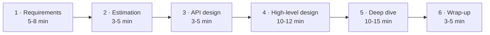
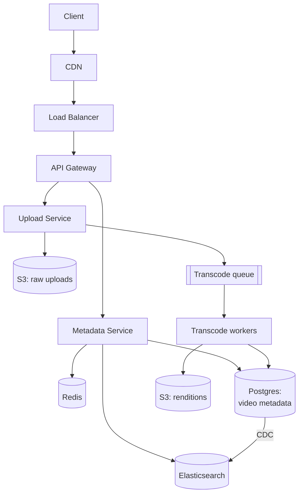

# 1.1.2 — The Interview Template

> **Part 1 · Introduction · Basics · Chapter 2 of 5**
> The single highest-return chapter in this book. Memorise this and you will never freeze.

---

## 🧒 ELI5 — Explain Like I'm 5

When you make a sandwich you always do the same steps in the same order: get bread, put butter, put filling, close it, cut it.

You don't stand in the kitchen wondering *"hmm, what do I do first?"* — you just start, because you know the recipe.

A system design interview is 45 minutes of panic **unless you have a recipe**. This chapter is the recipe.

The recipe has six steps:

1. **Ask what they want** — "You want a cheese sandwich or a jam sandwich? For one person or twenty?"
2. **Count how much you need** — "Twenty people, two slices each, that's forty slices, so two loaves."
3. **Write down the menu** — what the sandwich shop offers (the API).
4. **Draw the kitchen** — where the bread lives, where the toaster is.
5. **Zoom into one tricky bit** — "the toaster only does four slices at a time, so here's how I'll queue them."
6. **Say what could go wrong** — "if we run out of bread, here's the plan."

Do those six, in that order, out loud, every single time. That's the whole trick.

---

## Why a template beats knowledge

Two candidates, equal knowledge. Candidate A wanders: draws a box, adds a database, remembers to ask about scale 20 minutes in, panics, never finishes. Candidate B follows a template and lands every beat on time.

B gets the offer. **Structure is a graded dimension**, and it is the only one you can fully control before you walk in.

An interviewer's scoring rubric almost always includes a line like *"drove the interview / needed prompting."* A template is how you drive.

---

## The template at a glance



| # | Phase | Time (45-min interview) | Deliverable on the board |
|---|---|---|---|
| 1 | Requirements & scope | 5–8 min | Bulleted FR list, NFR list with numbers, explicit out-of-scope |
| 2 | Back-of-envelope estimation | 3–5 min | QPS, storage/year, bandwidth, a "so what" conclusion |
| 3 | API design | 3–5 min | 3–5 endpoints with request/response shapes |
| 4 | High-level design | 10–12 min | The boxes-and-arrows diagram, data model |
| 5 | Deep dive | 10–15 min | One or two components taken to real depth |
| 6 | Wrap-up | 3–5 min | Bottlenecks, failure modes, what you'd do with more time |

⚖️ **Trade-off on timing:** for a 60-minute interview, add 5 minutes to high-level design and 10 to deep dive. For a 30-minute screen, compress estimation to 2 minutes and pick exactly one deep dive.

---

## Phase 1 — Requirements and scope (5–8 min)

**Goal:** convert a four-word prompt into a bounded, numeric problem statement.

### 1a. Clarify the product

Ask 3–5 questions, no more. Good questions are the ones whose answers *change the design*.

| Question | Why it changes the design |
|---|---|
| "Who are the users — consumers or businesses?" | Consumer means read-heavy, spiky, cheap-per-user. B2B means fewer, larger, contract-bound. |
| "Is this read-heavy or write-heavy?" | Decides caching, replication, CQRS. |
| "How fresh must the data be?" | Decides sync vs async, cache TTL, strong vs eventual consistency. |
| "Global or single-region?" | Decides geo-replication, CDN, data residency. |
| "Mobile clients?" | Decides push vs poll, payload size, offline behaviour. |

☠️ **Bad questions:** "What programming language?" "What cloud?" These do not change architecture and burn your clock.

### 1b. Functional requirements

Write 3–5 as user-facing verbs. Then state out-of-scope explicitly.

```
IN SCOPE
  FR1  User uploads a video (≤ 2 GB, mp4)
  FR2  User watches a video, adaptive bitrate
  FR3  User searches videos by title
OUT OF SCOPE (confirmed)
  comments, recommendations, monetisation, live streaming
```

### 1c. Non-functional requirements — **with numbers**

```
NFR1  Availability   99.9% for watch path, 99% for upload path
NFR2  Latency        p99 < 200 ms to start playback
NFR3  Scale          100M DAU, 10M uploads/day
NFR4  Durability     never lose an uploaded video (11 nines)
NFR5  Consistency    eventual is fine for view counts;
                     read-your-writes for "my uploads" page
```

🎯 **Interview angle** — Notice NFR5 splits consistency *per feature*. That single line signals more seniority than an entire correct diagram. Different data has different requirements; saying so proves you think in trade-offs, not absolutes.

### 1d. Say the scope back

> "So: 100 million daily users, 10 million uploads a day, watch path must be 99.9% available with sub-200 ms playback start, and we're skipping comments and recommendations. Sound right?"

This takes 15 seconds and prevents 20 minutes of designing the wrong thing.

---

## Phase 2 — Back-of-envelope estimation (3–5 min)

**Goal:** produce numbers that *drive decisions*. An estimate you don't use is wasted time.

Full method: [Back-of-the-envelope Resource Estimation](../04-resource-estimation/01-back-of-envelope-estimation.md). The short form:

```
DAU                     100,000,000
Watches per user/day    5
Watch QPS (avg)         100M × 5 / 86,400 ≈ 5,800 QPS
Peak factor             ×3 (evening peak)     → ~17,400 QPS

Uploads/day             10,000,000
Upload QPS (avg)        10M / 86,400 ≈ 116 QPS
Avg video size          300 MB (pre-transcode)
Ingest/day              10M × 300 MB = 3 PB/day    ← this is the headline
Storage w/ 5 renditions ≈ 3 PB × 1.6 ≈ 4.8 PB/day
Yearly                  ≈ 1.75 EB/year             ← forces object storage + tiering
```

**Then say the "so what":**

> "3 petabytes a day of ingest means blob storage with lifecycle tiering, not a database. And 17k watch QPS at p99 200 ms means the metadata path must be cache-served — I'll come back to that."

⚖️ **Trade-off:** more precision costs time and buys nothing. Round to one significant figure. `86,400 ≈ 100,000` is a legitimate and expected shortcut.

### Numbers worth memorising

| Quantity | Value |
|---|---|
| Seconds per day | 86,400 ≈ 10^5 |
| 1 million/day | ≈ 12 QPS |
| 1 billion/day | ≈ 12,000 QPS |
| L1 cache reference | 1 ns |
| Main memory reference | 100 ns |
| SSD random read | 100 μs |
| Disk seek | 10 ms |
| Same-datacenter round trip | 0.5 ms |
| Cross-continent round trip | 150 ms |
| Modern server, simple request | 10k–50k QPS |
| Postgres, moderate query | 1k–10k QPS per node |
| Redis, single node | 100k+ ops/sec |

---

## Phase 3 — API design (3–5 min)

**Goal:** pin down the contract, which pins down the data model, which pins down the storage.

Write 3–5 endpoints. Include the *shape*, not just the name.

```http
POST /v1/videos                       # initiate upload
  body: { title, description, size_bytes, content_type }
  200:  { video_id, upload_url, upload_expires_at }

PUT  <upload_url>                     # direct-to-blob, presigned
  body: <bytes>

GET  /v1/videos/{video_id}
  200:  { video_id, title, status, renditions:[{quality, url}] }

GET  /v1/videos?q=<term>&limit=20&cursor=<opaque>
  200:  { items:[...], next_cursor }
```

Three things above earn points:

1. **Presigned direct-to-blob upload** — bytes never traverse your API servers. Says you understand where bandwidth costs live.
2. **Cursor pagination**, not offset. ([Pagination](../02-api-design/03-pagination.md) explains why offset breaks at scale.)
3. **A `status` field** — an implicit admission that transcoding is asynchronous, which sets up your deep dive.

Full treatment: [API Design Intro](../02-api-design/01-api-design-intro.md).

---

## Phase 4 — High-level design (10–12 min)

**Goal:** a diagram the interviewer can read, plus a narrated request path.

### Draw in this order

1. **Client** (left edge)
2. **Entry points** — DNS, CDN, load balancer, API gateway
3. **Services** — one box per bounded responsibility, named after what they do
4. **Storage** — one cylinder per store, labelled with the actual technology
5. **Async paths** — queues, workers, drawn *below* the sync path
6. **Arrows last**, labelled with what flows



### Then narrate one full request

> "A watch request hits the CDN. On miss it goes to the LB, then the gateway authenticates and rate-limits, then the metadata service checks Redis for `video:{id}`. On a hit we return in about 5 ms. On a miss we read Postgres, populate the cache with a 5-minute TTL, and return. The player then fetches segments straight from the CDN, so our servers never touch video bytes."

Narrating the path is what turns a picture into a design. **Do not skip it.**

### Data model, briefly

```sql
videos(video_id PK, owner_id, title, status, created_at, duration_ms)
renditions(video_id FK, quality, blob_key, size_bytes)
views_counter(video_id, bucket_ts, count)   -- append-only, rolled up
```

Say the partition key out loud: *"partitioned by `video_id` hash, because all reads are by ID and I want even spread."*

---

## Phase 5 — Deep dive (10–15 min)

**Goal:** prove you have depth, not just breadth.

The interviewer will usually pick. If they don't, **offer two and let them choose**:

> "The two most interesting parts here are the transcoding pipeline and the read path caching. Which would you rather I dig into?"

That question is free seniority points — it shows you know which parts are hard.

### What a real deep dive contains

For whatever component you pick, cover this checklist:

| Element | Example (transcoding pipeline) |
|---|---|
| The mechanism | Chunk video into 10 s GOP-aligned segments; fan out one job per segment per rendition |
| Concurrency & scale | 10M uploads/day × 5 renditions × ~30 segments = 1.5B jobs/day ≈ 17k jobs/sec |
| The queue choice | Kafka partitioned by `video_id` so segments of one video stay ordered; consumer group of GPU workers |
| Idempotency | Job key = `(video_id, segment_no, quality)`; worker writes to a deterministic blob key, so a retry overwrites harmlessly |
| Failure handling | Visibility timeout 10 min; 3 retries with exponential backoff and jitter; then dead-letter queue with alert |
| Backpressure | If queue lag > 30 min, stop accepting new uploads for free-tier users first |
| Consistency | Video `status` flips to `ready` only when a fan-in counter confirms all segments done ([Fan-Out/Fan-In](../../07-patterns-and-templates/01-patterns/09-fan-out-fan-in.md)) |
| Monitoring | Queue lag, p99 job duration, DLQ rate, cost per transcoded minute |

Hit six of those eight and you have unambiguously demonstrated senior depth.

### Deep-dive topics that are almost always available

- **Hot key / celebrity problem** — one key gets 10% of traffic.
- **Cache stampede** on expiry ([Failure Modes](../../03-scaling-services/03-caching/15-failure-modes.md)).
- **Rate limiting** algorithm choice ([Rate Limiting Patterns](../../07-patterns-and-templates/01-patterns/07-rate-limiting-patterns.md)).
- **Unique ID generation** across shards ([Unique ID Generators](../../07-patterns-and-templates/01-patterns/06-unique-id-generators.md)).
- **Exactly-once semantics** in the async path ([Delivery Guarantees](../../06-big-data/03-stream-processing/04-delivery-guarantees.md)).
- **Sharding key selection** and resharding ([Advanced Partitioning](../../05-scaling-data-storage/02-data-partitioning/02-advanced-partitioning.md)).

---

## Phase 6 — Wrap-up (3–5 min)

**Goal:** demonstrate self-awareness. Interviewers weight this more than candidates expect.

Say three things:

1. **The current bottleneck.** "At 10× growth, the metadata Postgres write path is the first thing to fall over. I'd shard by `owner_id` next."
2. **What you knowingly traded away.** "View counts are eventually consistent and can be up to a minute stale. That's a deliberate choice to keep the write path cheap; if the product needs exact real-time counts we'd need a different design."
3. **What you'd do with more time.** "I'd add regional replicas for the metadata service and design the multi-region failover, and I'd think harder about the abuse/moderation path."

☠️ **Failure mode:** running out of time and having the interviewer stop you mid-sentence. Watch the clock; at minute 40, stop whatever you're doing and wrap up. Finishing cleanly beats one more half-explained detail.

---

## The one-page cheat card

```
1 REQUIREMENTS   (5-8')   3-5 questions → FRs → NFRs WITH NUMBERS → out-of-scope → repeat back
2 ESTIMATION     (3-5')   QPS avg & peak → storage/yr → bandwidth → "so what" conclusion
3 API            (3-5')   3-5 endpoints, request/response shapes, pagination style
4 HIGH-LEVEL     (10-12')  client → edge → services → storage → async; then NARRATE one request
5 DEEP DIVE      (10-15')  offer two, take one; mechanism, scale, failure, idempotency, monitoring
6 WRAP-UP        (3-5')   bottleneck at 10x · what you traded away · what's next
```

### Phrases that buy time and score points

- *"Let me state my assumptions so you can correct me early."*
- *"There are two reasonable options here — A and B. I'll pick A because [constraint], but let me name the cost."*
- *"I'm going to defer that; let me first get the skeleton on the board."*
- *"That's a good catch — it breaks my consistency assumption. Here's how I'd fix it."*

---

## 📋 Chapter checklist

| Skill | Ready? |
|---|---|
| Can recite the six phases with times, from memory | ☐ |
| Have 5 clarifying questions ready that change the design | ☐ |
| Can convert "highly available" into a number | ☐ |
| Know the 12 magnitude numbers above | ☐ |
| Can name 3 deep-dive topics for any prompt | ☐ |
| Practise: run this template on "Design a URL shortener," out loud, timed | ☐ |

---

**← Previous** [1.1.1 What Is a System Design Interview?](01-what-is-a-system-design-interview.md)
**Next →** [1.1.3 Core Challenges in Web-scale System Design](03-core-challenges.md)
