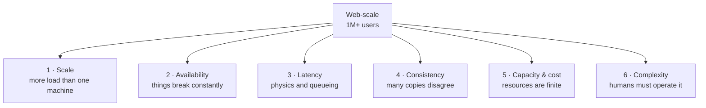
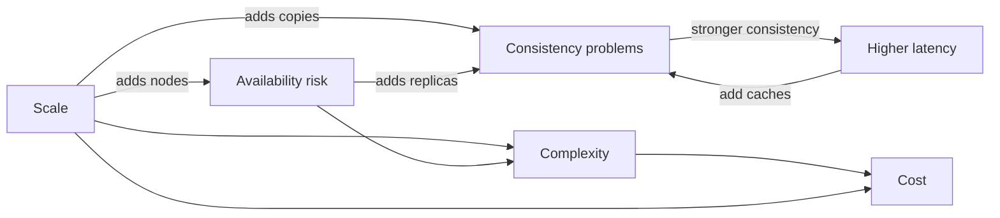

# 1.1.3 — Core Challenges in Web-scale System Design (and How to Tackle Them)

> **Part 1 · Introduction · Basics · Chapter 3 of 5**
> Every design problem in this book is one of six challenges wearing a costume.

---

## 🧒 ELI5 — Explain Like I'm 5

Imagine you run a lemonade stand.

**One customer:** easy. You pour, they pay, done.

Now imagine **a million customers show up at once.** Suddenly you have six brand-new problems that never existed before:

1. **Too many people at once** — one person can't pour fast enough. You need more people pouring. *(Scale)*
2. **What if you get sick?** — the stand closes and nobody gets lemonade. You need a backup you. *(Availability)*
3. **The queue is too long** — people wait 40 minutes and leave. *(Latency)*
4. **You and your backup have different jugs** — your jug has sugar, theirs doesn't. Customers get different lemonade. *(Consistency)*
5. **You run out of lemons** — you need to know how many lemons a million cups needs, *before* you run out. *(Capacity)*
6. **Now there are 50 stands, 50 people, 12 jugs** — nobody knows what's broken when it breaks. *(Complexity)*

Every single hard thing in system design is one of those six. Every technique in this book — caching, sharding, replicas, queues — exists to fight one of those six.

---

## The six core challenges

They are not independent. Fixing one usually worsens another — that interaction *is* system design.

---

## Challenge 1 — Scale

### The problem

A single machine has hard ceilings: roughly 100 cores, a few TB of RAM, tens of TB of local disk, ~25 Gbps of network. Scale up and price grows **superlinearly** while capability grows sublinearly. Beyond a point, one machine simply cannot do it.

🔢 **Numbers:** a well-tuned single server handles ~10k–50k simple HTTP requests/sec. A single Postgres node handles maybe 5k–20k simple queries/sec. Twitter-scale is ~500M tweets/day (~6k writes/sec average, ~30k peak) with ~300k timeline reads/sec. Storage: 100M users × 1 MB profile data = 100 TB. No single box.

### The three axes of scaling (the "scale cube")

| Axis | Meaning | Example |
|---|---|---|
| **X — horizontal duplication** | Run N identical copies behind a load balancer | 50 stateless API servers |
| **Y — functional decomposition** | Split by *what it does* | Auth service, billing service, feed service |
| **Z — data partitioning** | Split by *whose data it is* | Shard users A–M / N–Z |

Most real systems use all three. In an interview, say which axis you are using and why.

### How to tackle it

1. **Make everything stateless** so X-scaling is trivial. ([Stateless vs Stateful](../../03-scaling-services/01-horizontal-scaling/02-stateless-vs-stateful.md))
2. **Put a load balancer in front.** ([Load Balancer](../../03-scaling-services/01-horizontal-scaling/04-load-balancer.md))
3. **Separate reads from writes** — reads usually outnumber writes 10:1 to 1000:1. ([Read-Write Separation](../../03-scaling-services/02-read-write-separation/01-read-write-separation.md))
4. **Cache aggressively** — the cheapest request is the one that never reaches your database. (Part 3, Caching)
5. **Partition the data** when one database node is the ceiling. (Part 5)
6. **Move work off the request path** into queues. (Part 2)

⚖️ **Trade-off:** every scaling technique adds a moving part, which feeds Challenge 6 (complexity) and Challenge 4 (consistency). Scaling is never free.

☠️ **Failure mode: the stateful sticky server.** You scale to 20 servers, but sessions live in server memory, so you enable sticky sessions. Now one server dies and 5% of users are logged out; and traffic is unevenly distributed forever. Fix: session state in Redis or a signed token.

---

## Challenge 2 — Availability

### The problem

At scale, **failure is continuous, not exceptional.** With 10,000 servers and a 3-year MTBF per server, you lose roughly 9 servers a day just to hardware. Add bad deploys, network partitions, DNS mistakes, expired certs, and dependency outages.

> "Everything fails all the time." — Werner Vogels

### The availability arithmetic you must know

| Availability | Downtime per year | Per month | Per day |
|---|---|---|---|
| 99% ("two nines") | 3.65 days | 7.2 h | 14.4 min |
| 99.9% | 8.77 h | 43.8 min | 1.44 min |
| 99.99% | 52.6 min | 4.4 min | 8.6 s |
| 99.999% | 5.26 min | 26 s | 0.86 s |

**Serial dependencies multiply:**
Five services in a request path, each 99.9% → 0.999^5 = **99.5%**, i.e. 43 hours down per year. Adding services *reduces* availability by default.

**Redundant components add nines:**
Two independent replicas at 99% each → 1 − 0.01² = **99.99%** — *if* failures are independent. They usually are not (same rack, same deploy, same config bug).

### How to tackle it

1. **Redundancy at every layer** — N+2 instances, multi-AZ, sometimes multi-region.
2. **Remove single points of failure.** Walk your diagram and circle every box that exists exactly once. That is your SPOF list.
3. **Health checks and automatic failover.** ([How to Achieve High Availability](../03-non-functional-requirements/04-how-to-achieve-high-availability.md))
4. **Fail fast, degrade gracefully.** A feed without recommendations beats no feed. ([Fallbacks](../../02-microservices-and-dataflow/01-synchronous-communication/08-fallbacks.md))
5. **Isolate blast radius** — bulkheads, cells, per-tenant quotas.
6. **Circuit breakers** so one sick dependency doesn't take down its callers. ([Circuit Breaker](../../02-microservices-and-dataflow/01-synchronous-communication/07-circuit-breaker.md))

☠️ **Failure mode: retry storms.** Downstream slows down → every caller retries 3× → downstream now receives 4× traffic → it dies completely. Fix: exponential backoff **with jitter**, retry budgets, and circuit breakers. ([Retries](../../02-microservices-and-dataflow/01-synchronous-communication/06-retries.md))

---

## Challenge 3 — Latency

### The problem

Latency comes from three places, and only one of them is your code:

1. **Physics.** Light in fibre travels ~200,000 km/s. New York ↔ London round trip has a *floor* of ~56 ms. You cannot optimise this; you can only move the data closer.
2. **Queueing.** As utilisation ρ approaches 1, waiting time explodes as roughly `1/(1−ρ)`. At 80% utilisation you wait 4× the service time; at 95%, 19×. **This is why you never run servers at 95% CPU.**
3. **Work.** Actual computation, disk I/O, serialisation.

### The tail is what matters

🔢 If a page makes 100 parallel backend calls and each has a p99 of 1 s, the probability *all* are fast is 0.99^100 ≈ 37%. So **63% of page loads hit at least one 1-second call.** Your p50 is irrelevant; the tail defines the user experience. This is *tail amplification*.

### The latency numbers (Jeff Dean's table, rounded)

| Operation | Time | Human-scale analogy (×1B) |
|---|---|---|
| L1 cache reference | 1 ns | 1 second |
| Branch mispredict | 3 ns | 3 s |
| L2 cache reference | 4 ns | 4 s |
| Mutex lock/unlock | 17 ns | 17 s |
| Main memory reference | 100 ns | 1.7 min |
| Compress 1 KB with Snappy | 2 μs | 33 min |
| Send 1 KB over 1 Gbps | 10 μs | 2.8 h |
| SSD random read | 150 μs | 1.7 days |
| Read 1 MB sequentially from memory | 250 μs | 2.9 days |
| Round trip within datacenter | 500 μs | 5.8 days |
| Read 1 MB from SSD | 1 ms | 11.6 days |
| Disk seek | 10 ms | 4 months |
| Read 1 MB from disk | 20 ms | 7.8 months |
| Packet CA → Netherlands → CA | 150 ms | 4.8 years |

The point of memorising these: **you can tell instantly whether a design is plausible.** "We'll do 50 sequential database round trips per request" — 50 × 0.5 ms network + query time — is already over your 200 ms budget before any work happens.

### How to tackle it

1. **Move data closer** — CDN, edge caches, regional replicas.
2. **Do less work** — cache, precompute, materialise. ([Pre-Computing Pattern](../../07-patterns-and-templates/01-patterns/03-pre-computing-pattern.md))
3. **Do work in parallel** rather than sequentially — scatter-gather.
4. **Move work off the critical path** — async queues, write-behind.
5. **Keep utilisation moderate** (target 50–70%) so queueing doesn't explode.
6. **Hedge requests** — send to two replicas, take the first answer. Costs ~5% extra load, cuts p99 dramatically.
7. **Reduce fan-out** or make it bounded.

⚖️ **Trade-off:** every latency fix costs money (more replicas, more cache RAM), staleness (caching), or complexity (parallelism).

---

## Challenge 4 — Consistency

### The problem

The instant you have **more than one copy of data**, the copies can disagree. And you always have more than one copy, because Challenge 1 and 2 forced you to.

### CAP, stated correctly

During a **network partition (P)** you must choose between **consistency (C)** and **availability (A)**. That's it. CAP says nothing about the non-partitioned case, and "pick two" is a misleading summary.

**PACELC** is the more useful version:
> **if P**artition then **A** or **C**, **e**lse **L**atency or **C**onsistency.

Even with no partition, stronger consistency costs latency (you must talk to more replicas before answering).

### The consistency menu

| Model | Guarantee | Cost | Typical use |
|---|---|---|---|
| **Strict serialisable** | Behaves like one machine, in real-time order | Highest latency, consensus per write | Financial ledgers |
| **Linearizable** | Reads see the latest committed write | Quorum reads/writes | Locks, leader election |
| **Sequential** | All nodes see the same order, maybe delayed | Moderate | Some replicated logs |
| **Causal** | If A caused B, everyone sees A before B | Metadata tracking | Comment threads, chat |
| **Read-your-writes** | You see your own writes | Session pinning or write-through cache | "My posts" page |
| **Monotonic reads** | You never see time go backwards | Sticky replica | Feeds |
| **Eventual** | Converges, eventually | Cheapest, fastest | View counts, likes |

🎯 **Interview angle** — Never say "we'll use eventual consistency" as a blanket statement. Say *which data* is eventual and *which is not*, and what the user-visible symptom of staleness is. "A like count may lag by up to 30 seconds; that's acceptable. A payment balance may not lag at all."

### How to tackle it

1. **Segment data by consistency need** — most data tolerates eventual, a small critical core does not.
2. **Single-writer-per-key** designs avoid conflicts entirely.
3. **Idempotency keys** so retries are safe.
4. **Sagas with compensating transactions** instead of distributed 2PC. ([Saga Pattern](../../07-patterns-and-templates/01-patterns/10-saga-pattern.md))
5. **CDC / outbox** so your database and your event stream can't diverge. ([CDC](../../05-scaling-data-storage/01-data-replication/05-change-data-capture.md))
6. **Version vectors / last-write-wins with care** for multi-master.

☠️ **Failure mode: dual writes.** Service writes to Postgres, then publishes to Kafka. The process dies between the two. Now the database and the stream disagree, forever, silently. Fix: transactional outbox + CDC.

---

## Challenge 5 — Capacity and cost

### The problem

Resources are finite and metered. A design that works but costs $4M/month for a product earning $200k/month is a failed design. Interviewers increasingly probe cost.

### The four resources to budget

| Resource | Question to ask | Common ceiling |
|---|---|---|
| **Compute** | QPS ÷ per-instance capacity = instance count | CPU or memory per box |
| **Storage** | bytes/day × retention × replication factor | Cost per TB-month; IOPS |
| **Network** | bytes/sec in and out; egress is the expensive direction | Cloud egress is often the #1 line item |
| **Connections / file descriptors** | concurrent connections per node | ~64k ports per source IP pair |

🔢 **Rules of thumb:** cloud egress ≈ $0.05–$0.09/GB (in-region traffic is far cheaper). Object storage ≈ $0.02/GB-month. General-purpose SSD volumes ≈ $0.08–$0.10/GB-month. RAM in a managed cache ≈ 100× the cost per GB of object storage — which is exactly why caches are small and hot-set design matters.

### How to tackle it

1. **Estimate first, design second.** ([Resource Estimation](../04-resource-estimation/))
2. **Tier storage** — hot in SSD, warm in object storage, cold in archive.
3. **Compress and batch** — 5–10× reductions are routine.
4. **Cache to cut both latency and egress.**
5. **Right-size, then autoscale.** ([Auto Scaling](../../03-scaling-services/01-horizontal-scaling/06-auto-scaling.md))
6. **Sample or aggregate telemetry** — observability data volume often exceeds product data volume.

---

## Challenge 6 — Complexity (the human one)

### The problem

A system nobody can understand, deploy, or debug will fail regardless of its architecture. Complexity is a first-class engineering cost, and it is the one most often ignored in interview answers.

Symptoms: a change requires touching six repos; nobody knows the full request path; incidents take hours to diagnose; onboarding takes three months.

### How to tackle it

1. **Prefer boring technology.** Every distinct technology in the stack has an operational tax: upgrades, backups, monitoring, on-call expertise, security patches.
2. **Clear service boundaries** with one owner each.
3. **Observability from day one** — structured logs, metrics (RED: rate, errors, duration), distributed tracing with a request ID propagated everywhere.
4. **Runbooks and dashboards** per service.
5. **Automate everything repeated** — deploys, failover, scaling.
6. **Design for debuggability** — can you answer "what happened to request X?" in under five minutes?

🎯 **Interview angle** — Saying *"I'd start with a modular monolith and one Postgres, and only split out services when a specific scaling or ownership pressure forces it"* is a **strong senior signal**, not a weak answer. Reaching for 12 microservices on a greenfield problem is a junior signal.

---

## How the six challenges interact

Read that diagram as: **there is no move that only helps.** Naming the induced cost of your own decision is the behaviour interviewers reward most.

### The standard cascade, in one paragraph

You add servers to handle load *(scale)*. Now you need a load balancer, which is a new single point of failure *(availability)*, so you make it redundant. Sessions can no longer live in memory, so you add Redis *(complexity)*. Your database is now the bottleneck, so you add read replicas *(scale)* — which are asynchronous, so users sometimes don't see their own writes *(consistency)*. You fix that by routing reads-after-write to the primary *(complexity)*. Replicas cost money *(cost)*. Your p99 is now dominated by a cache miss path, so you add a second cache tier *(latency)* — which introduces a new staleness window *(consistency)*. **This cascade is the job.**

---

## The tackle-it cheat sheet

| Challenge | First move | Second move | Third move |
|---|---|---|---|
| Scale | Stateless + LB | Cache | Partition |
| Availability | Redundancy + health checks | Graceful degradation | Multi-region |
| Latency | Cache / CDN | Precompute | Parallelise, hedge |
| Consistency | Segment by need | Idempotency | Outbox/CDC, saga |
| Capacity/cost | Estimate | Tier and compress | Autoscale |
| Complexity | Boring tech | Observability | Automation |

---

## 📋 Chapter checklist

| Concept | Ready? |
|---|---|
| Name all six challenges without looking | ☐ |
| Recite the availability table (99% → 99.999%) | ☐ |
| Explain why 5 serial 99.9% services give 99.5% | ☐ |
| Explain tail amplification with the 100-call example | ☐ |
| State PACELC correctly | ☐ |
| Name the induced cost of any fix you propose | ☐ |

---

**← Previous** [1.1.2 Interview Template](02-interview-template.md)
**Next →** [1.1.4 How to Scale a System](04-how-to-scale-a-system.md)
