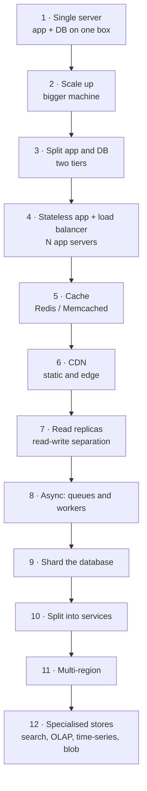
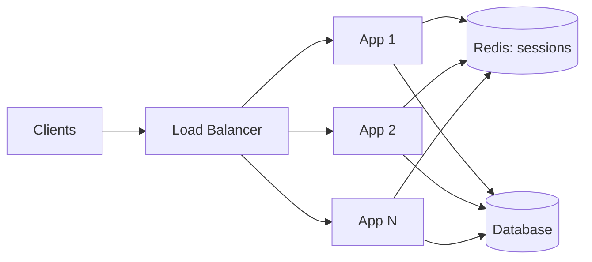
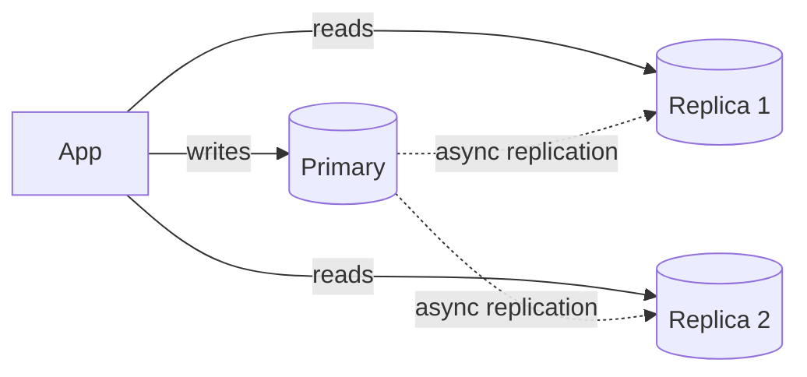
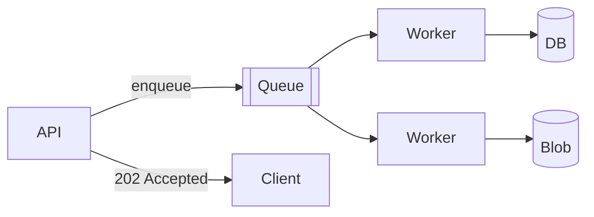

# 1.1.4 — How to Scale a System

> **Part 1 · Introduction · Basics · Chapter 4 of 5**
> The staircase from one laptop to a global system, one step at a time — and the reason for each step.

---

## 🧒 ELI5 — Explain Like I'm 5

You open a pizza shop in your kitchen.

- **Day 1 — one customer.** You cook, you serve, you wash up. One kitchen, one you. Fine.
- **Week 2 — ten customers.** You buy a bigger oven. *(That's "scaling up" — buy a bigger thing.)*
- **Month 2 — the oven can't get bigger.** So you open a **second kitchen** and hire a second cook. Now someone has to stand at the door and send customers to whichever kitchen is free. That door person is a **load balancer**. *(That's "scaling out" — buy more things.)*
- **Problem:** the recipe book lives in kitchen 1. Kitchen 2 can't cook. So you move the recipe book to a **shared shelf** both kitchens can reach. *(Making servers stateless.)*
- **Problem:** everyone orders margherita. You keep making the same pizza from scratch. So you pre-make margheritas and keep them warm. *(That's a **cache**.)*
- **Problem:** one shelf, twenty cooks grabbing recipes. The shelf is the jam. So you make **copies of the recipe book** for reading, and only write new recipes into the master copy. *(Read replicas.)*
- **Problem:** too many recipes for one shelf. So you split them: shelf A holds recipes starting A–M, shelf B holds N–Z. *(That's **sharding**.)*
- **Problem:** washing up slows down cooking. So you throw dirty plates in a bin and someone washes them later. *(That's a **queue** — do slow work later.)*
- **Problem:** customers in another city wait an hour for delivery. So you open a shop in that city too. *(Multi-region / CDN.)*

That list — in that order — is the entire scaling story. Nothing else. Everything technical in this book is a detail of one of those steps.

---

## The scaling staircase

Do **not** jump to step 8. Interviewers want to see you know the order and the trigger for each step.

Each step has a **trigger** (the symptom that justifies it) and a **cost** (what you now have to live with).

---

## Step 1 — Single server

Everything on one box: web server, application, database, files.

| | |
|---|---|
| **Handles** | Up to a few hundred QPS, a few thousand users |
| **Trigger to move on** | CPU or RAM saturated; a database query blocks page rendering |
| **Cost** | Total SPOF; deploys cause downtime |

🎯 In an interview, **start here out loud** and move up. "For 1,000 users this is a single VM with Postgres, and that's genuinely the right answer. Let me now assume 100M users, which forces..." — this shows judgement, and it takes 20 seconds.

---

## Step 2 — Scale up (vertical scaling)

Buy a bigger machine: more cores, more RAM, faster NVMe.

| | |
|---|---|
| **Handles** | Surprisingly far. Modern boxes: 192 vCPU, 2–24 TB RAM. StackOverflow famously served billions of requests/month on a handful of large servers. |
| **Trigger to move on** | Price grows superlinearly; still a SPOF; hard ceiling reached |
| **Cost** | Downtime to resize; single failure domain |

⚖️ **Trade-off:** vertical scaling is *underrated*. It requires zero architectural change and no distributed-systems bugs. Reach for it first. Say so.

---

## Step 3 — Split application and database

Two tiers on separate machines.

**Why it matters:** the app tier and database tier have completely different resource profiles (CPU/concurrency vs memory/IO) and different scaling curves. Separating them lets you scale each independently — and it is the prerequisite for step 4.

| **Trigger** | The database and app compete for the same RAM and CPU |
| --- | --- |
| **Cost** | Network hop added (~0.5 ms); two things to operate |

---

## Step 4 — Make the app stateless, add a load balancer

The pivotal step. Everything after depends on it.

**Stateless** means: any request can be served by any instance, because instances hold no per-user data between requests.

What must move out of process memory:

| State | Where it goes |
|---|---|
| Session data | Redis, or a signed JWT held by the client |
| Uploaded files | Object storage (S3/GCS) |
| In-memory caches | Shared cache tier (accept per-instance caches only as an optimisation) |
| Background timers/cron | A dedicated scheduler or queue |
| WebSocket connections | Still pinned — use a connection-registry service and route via pub/sub |

Then put a load balancer in front and run N instances.

| **Trigger** | One app server is saturated, or you need zero-downtime deploys |
| --- | --- |
| **Cost** | Session store is now a dependency; the LB itself must be made redundant |

☠️ **Failure mode:** using sticky sessions as a shortcut instead of externalising state. It works until a node dies or traffic skews, then it fails in a way that is hard to reverse. Details: [Stateless vs Stateful](../../03-scaling-services/01-horizontal-scaling/02-stateless-vs-stateful.md).

---

## Step 5 — Add a cache

The database is now the bottleneck because N app servers all hammer it.

Most workloads are **read-heavy and skewed**: a small fraction of keys receive most of the reads. Caching that hot set removes the majority of database load.

🔢 **Cache maths.** At a 90% hit rate you cut database reads by 10×. Going 90% → 95% halves database load *again*. The last few points of hit rate are worth a lot — which is why sizing and key design matter.

| **Trigger** | Database CPU high; repeated identical reads; p99 dominated by query time |
| --- | --- |
| **Cost** | Staleness; invalidation logic; a new failure mode (stampede); another system to run |

Full 18-chapter treatment: [Caching](../../03-scaling-services/03-caching/).

---

## Step 6 — Push static and edge content to a CDN

Images, JS, CSS, video segments, and increasingly cacheable API responses served from points of presence near the user.

**Two wins:** latency (50 ms instead of 300 ms) and cost/load (your origin never sees the request).

| **Trigger** | Geographically spread users; heavy static assets; bandwidth bills |
| --- | --- |
| **Cost** | Cache invalidation across PoPs; harder to personalise cached content |

See [CDN vs Application Cache](../../03-scaling-services/03-caching/03-cdn-vs-app-cache.md).

---

## Step 7 — Read replicas (read-write separation)

Writes go to the primary; reads fan out across replicas.

| **Trigger** | Read QPS exceeds what the primary can serve, but write QPS is fine |
| --- | --- |
| **Cost** | **Replication lag.** A user updates their profile, then reads a replica, and sees the old value. |

Standard fixes for lag: route reads-after-write to the primary for N seconds; pin a session to one replica (monotonic reads); or read your own writes from cache.

Details: [Read-Write Separation](../../03-scaling-services/02-read-write-separation/01-read-write-separation.md), [CQRS](../../03-scaling-services/02-read-write-separation/02-cqrs.md).

---

## Step 8 — Go asynchronous

Move anything not needed for the response off the request path: emails, thumbnails, transcoding, search indexing, analytics, webhooks, fan-out.

**Wins:** lower p99, natural load smoothing (a spike becomes queue depth instead of errors), retries for free, independent scaling of workers.

| **Trigger** | Request latency dominated by side effects; traffic spikes cause errors |
| --- | --- |
| **Cost** | Eventual consistency visible to users ("your video is processing"); duplicate delivery must be handled idempotently; a queue to operate and monitor |

Details: Part 2, [Asynchronous Communication](../../02-microservices-and-dataflow/02-asynchronous-communication/).

---

## Step 9 — Shard the database

One primary can no longer absorb the **write** load or hold the dataset.

Split rows across N independent databases by a **partition key**.

| Strategy | How | Watch out for |
|---|---|---|
| Hash of key | `shard = hash(user_id) % N` | Resharding moves nearly everything — use consistent hashing |
| Range | A–M / N–Z, or by date | Hotspots; recent-date shard takes all writes |
| Directory/lookup | A service maps key → shard | The lookup service becomes critical infrastructure |
| Geographic | By region | Cross-region queries; data residency rules |

**What you lose:** cross-shard joins, cross-shard transactions, and global `ORDER BY`/aggregates become application-level work. Auto-increment IDs stop working (see [Unique ID Generators](../../07-patterns-and-templates/01-patterns/06-unique-id-generators.md)).

| **Trigger** | Write QPS or dataset size exceeds one node |
| --- | --- |
| **Cost** | The largest complexity jump on the whole staircase. Delay it as long as honestly possible. |

Details: Part 5, [Data Partitioning](../../05-scaling-data-storage/02-data-partitioning/).

---

## Step 10 — Split into services

Decompose the monolith along **bounded contexts** — usually driven by *team ownership* and *differential scaling needs*, not by aesthetics.

Good reasons to split: one component needs 50× the instances of the rest; two teams keep blocking each other's deploys; one component needs a different runtime or hardware (GPU); regulatory isolation.

Bad reasons: "microservices are modern"; "the file is big."

| **Trigger** | Organisational or scaling pressure, not code size |
| --- | --- |
| **Cost** | Network calls replace function calls (latency, partial failure); distributed transactions; deployment and observability overhead |

Details: [Microservices vs Monolithic](../05-microservices/01-microservices-vs-monolithic.md).

---

## Step 11 — Multi-region

Serve users from the nearest region and survive the loss of an entire region.

| Topology | Reads | Writes | Complexity |
|---|---|---|---|
| Active–passive | Local in primary region | Primary only | Low — but failover is a real, practised procedure |
| Active–active, partitioned by user home region | Local | Local for home-region users | Medium |
| Active–active, multi-master | Local | Anywhere, conflicts possible | High — needs CRDTs or explicit conflict rules |

| **Trigger** | Global latency requirements; regional-outage survival; data-residency law |
| --- | --- |
| **Cost** | Cross-region replication lag (~100 ms+), conflict resolution, doubled infrastructure, very hard testing |

---

## Step 12 — Specialised data stores

One database cannot serve every access pattern. Add purpose-built stores fed from the source of truth via CDC or events.

| Need | Store |
|---|---|
| Full-text / fuzzy search | Elasticsearch, OpenSearch |
| Analytics over billions of rows | ClickHouse, BigQuery, Snowflake, Redshift |
| Metrics over time | Prometheus, InfluxDB, TimescaleDB |
| Graph traversal | Neo4j, or adjacency lists in a KV store |
| Large binary objects | S3, GCS, Azure Blob |
| Ultra-low-latency KV | Redis, DynamoDB |

| **Trigger** | A query pattern your primary database serves badly (`LIKE '%term%'`, huge aggregations) |
| --- | --- |
| **Cost** | Multi-system data sync — see [Multi-System Data Sync](../../07-patterns-and-templates/01-patterns/05-multi-system-data-sync.md) |

---

## Scaling by the numbers: when does each step trigger?

| Users / load | Typical architecture |
|---|---|
| < 10k users, < 100 QPS | Steps 1–2. One box, or one app VM + one managed database. |
| 10k–100k users, ~1k QPS | Steps 3–5. LB + a few app servers + managed database + Redis. |
| 100k–1M users, ~10k QPS | Steps 6–8. CDN, read replicas, queues and workers. |
| 1M–10M users, ~100k QPS | Step 9–10. Sharding, service split, dedicated search. |
| 10M+ users | Steps 11–12. Multi-region, specialised stores, cells. |

These are rough. The point is the **ordering and the triggers**, not the exact thresholds.

---

## Two laws that bound all of this

**Amdahl's law.** If a fraction `s` of the work is inherently serial, maximum speed-up is `1/s` no matter how many machines you add. 5% serial work caps you at 20×. In systems, the "serial part" is usually a shared lock, a single primary, or a coordinator.

**Universal Scalability Law.** Adds a *coherency* penalty: as nodes must coordinate, throughput eventually **decreases** with more nodes. This is why adding servers sometimes makes things slower, and why "shared-nothing" designs win.

🎯 **Interview angle** — "Adding more app servers won't help here, because the bottleneck is the single primary's write lock — that's the serial fraction. I need to shard to remove it." That sentence is worth a lot.

---

## The anti-patterns

| Anti-pattern | Why it fails |
|---|---|
| Jumping straight to microservices + Kafka + sharding for a greenfield app | Enormous complexity, no evidence it's needed, slow to build |
| Caching without an invalidation story | Silent stale-data bugs users report and you can't reproduce |
| Sharding on a key that skews (e.g. `country_id`) | One shard holds 60% of data and takes 60% of writes |
| Adding replicas to fix write load | Replicas don't help writes at all |
| Autoscaling a service whose bottleneck is the database | You scale the thing that isn't the problem and DDoS your own database |
| "We'll add monitoring later" | You cannot debug what you cannot see |

---

## 📋 Chapter checklist

| Skill | Ready? |
|---|---|
| Recite the 12 steps in order | ☐ |
| State the trigger and cost for each step | ☐ |
| Explain why statelessness is the pivotal step | ☐ |
| Explain why read replicas don't help write load | ☐ |
| Explain Amdahl's law in systems terms | ☐ |
| Name three sharding strategies and their hotspot risks | ☐ |

---

**← Previous** [1.1.3 Core Challenges](03-core-challenges.md)
**Next →** [1.1.5 Study Guide](05-study-guide.md)
