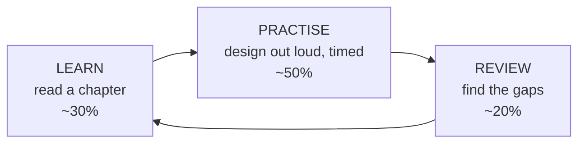

# 1.1.5 — Study Guide

> **Part 1 · Introduction · Basics · Chapter 5 of 5**
> How to actually use this book, depending on how much time you have.

---

## 🧒 ELI5 — Explain Like I'm 5

You can't learn to swim by reading about swimming.

You learn by getting in the water, splashing badly, and doing it again tomorrow.

System design is the same. Reading this book cover to cover and *understanding* everything will still leave you frozen in the real interview, because understanding and **producing under time pressure** are different skills.

So the plan is simple:

- **Read a bit** (learn the bricks).
- **Then immediately build something out loud** (use the bricks).
- **Then have someone poke holes in it** (find what you don't know).
- **Repeat.**

Two thirds of your time should be *talking*, not reading. That feels wrong. Do it anyway.

---

## The three-mode learning loop

**Learn** — read one chapter. Close it. Write the summary from memory in 5 bullets. If you can't, reread.

**Practise** — pick a problem, set a 45-minute timer, run the [template](02-interview-template.md), and **speak out loud**. Record yourself. This is the single highest-value activity and the one everybody skips.

**Review** — listen to the recording. Note every moment you hesitated, hand-waved, or said "somehow." Each of those is a chapter you need to reread.

---

## Plan A — 14 days (interview soon)

Assumes ~2 hours/day. This is the plan in the README, expanded.

| Day | Read | Practise |
|---|---|---|
| 1 | Part 1 Basics (all 5 chapters) | Write the six-phase template from memory. Memorise the latency numbers. |
| 2 | Part 1 API Design (6 chapters) | Design the API for a URL shortener and a chat app. 15 min each. |
| 3 | Part 1 Non-functional Reqs (7) | Convert 5 vague requirements into numbers. |
| 4 | Part 1 Resource Estimation (3) | Estimate: Twitter, YouTube, Uber, WhatsApp. 3 min each, out loud. |
| 5 | Part 1 Microservices + Part 2 Sync (10) | **Full mock: Design a URL shortener.** 45 min, recorded. |
| 6 | Part 2 Async (7) | Redo the shortener's async paths. Design a notification system. |
| 7 | Part 3 Horizontal Scaling + R/W (8) | **Full mock: Design Twitter's timeline.** Recorded. |
| 8 | Part 3 Caching ch. 1–9 | Do the Read Drill and Write Drill labs. |
| 9 | Part 3 Caching ch. 10–18 + Dataflow (3) | Do the Disaster Drill. **Mock: Design a news feed.** |
| 10 | Part 4 all (13) | For 6 systems, pick the database and defend it in 2 min each. |
| 11 | Part 5 all (9) | Pick shard keys for 5 systems; find the hotspot in each. |
| 12 | Part 6 all (18, skim labs) | **Mock: Design a real-time analytics dashboard.** |
| 13 | Part 7 Patterns (10) | Name which pattern applies to 10 prompts, 30 s each. |
| 14 | Part 7 Template (2) + reread your notes | **Two full mocks** with a human if possible. |

⚖️ **If you only have 3 days:** Day 1 = Part 1 Basics + Estimation + Template. Day 2 = Caching + Storage choice + Replication/Partitioning headlines. Day 3 = three timed mocks. Skip Part 6 entirely unless the role is data-focused.

---

## Plan B — 8 weeks (proper foundation)

| Week | Focus | Outcome |
|---|---|---|
| 1 | Part 1 Introduction, all sections | Template automatic; estimation fast |
| 2 | Part 2 Microservices & data flow | Sync failure handling fluent; queues understood |
| 3 | Part 3 Horizontal scaling, R/W separation, dataflow | Scaling staircase internalised |
| 4 | Part 3 Caching (all 18) | Caching is your strongest area — it appears in every problem |
| 5 | Part 4 Data storage | Can pick and defend any database |
| 6 | Part 5 Replication + partitioning, with codelabs | Can design a sharded system end to end |
| 7 | Part 6 Big data | Comfortable with batch/stream, Lambda/Kappa |
| 8 | Part 7 Patterns + templates + mocks | Vocabulary complete; 6+ recorded mocks done |

Run **one mock interview per week from week 2 onward**, not just at the end.

---

## Plan C — Ongoing (build real depth)

Once through the book, depth comes from three habits:

1. **Read one engineering blog post per week** and reverse-engineer the design. Ask: what were their six challenges? Which staircase step were they on? What did they trade?
2. **Operate something.** Run Kafka locally. Shard a Postgres. Kill a Redis node while your app is running and watch what happens. The labs in this book are the on-ramp.
3. **Write designs at work.** A one-page design doc before you code — requirements, options, choice, trade-offs, failure modes — is the same artifact as the interview answer.

---

## The practice problem ladder

Work down this list. Each introduces a new core difficulty.

| # | Problem | New thing it teaches |
|---|---|---|
| 1 | URL shortener | ID generation, KV storage, cache, read-heavy skew |
| 2 | Pastebin | Blob storage, TTL/expiry, quota |
| 3 | Rate limiter | Distributed counters, algorithms, hot keys |
| 4 | Web crawler | Frontier queues, politeness, dedup at scale, DAG scheduling |
| 5 | Notification system | Fan-out, third-party gateways, retries, idempotency |
| 6 | News feed / Twitter timeline | Push vs pull, celebrity problem, precomputation |
| 7 | Chat / WhatsApp | Long-lived connections, presence, ordering, delivery receipts |
| 8 | Instagram / photo sharing | Blob + metadata split, CDN, thumbnails, feed |
| 9 | YouTube / video platform | Transcoding pipeline, adaptive bitrate, petabyte storage |
| 10 | Google Drive / Dropbox | Chunking, dedup, sync conflict resolution, delta sync |
| 11 | Uber / ride matching | Geospatial indexing, real-time matching, state machines |
| 12 | Ticketmaster / booking | Strong consistency, inventory locking, thundering herds |
| 13 | Payment system | Exactly-once, idempotency keys, ledgers, saga |
| 14 | Search autocomplete | Tries, prefix indexes, ranking, precompute |
| 15 | Ad click aggregation | Stream processing, windowing, late events, exactly-once |
| 16 | Distributed job scheduler | Leader election, leases, at-least-once execution |
| 17 | Metrics/monitoring system | Time-series storage, downsampling, cardinality |
| 18 | Collaborative editor | OT vs CRDT, causal consistency, presence |

Problems 1–9 cover the vast majority of real interviews. 10–18 are for senior/staff loops.

---

## How to run a solo mock interview

1. Pick a problem. Set a 45-minute timer. Open a blank drawing tool.
2. **Say everything out loud.** Record audio.
3. Follow the six phases without looking at the template.
4. When you feel yourself hand-waving, say the words *"I'm hand-waving here"* out loud and continue. This makes gaps findable later.
5. At the end, before listening back, write down what you think went badly.
6. Listen back. Compare. The difference between what you *thought* went badly and what actually did is your real blind spot.

### Self-scoring rubric

Score yourself 1–4 on each. Interviewers use something very close to this.

| Dimension | 1 — Poor | 4 — Strong |
|---|---|---|
| **Requirements** | Started designing immediately | Scoped, quantified, confirmed, stated out-of-scope |
| **Estimation** | Skipped or unused | Fast, rounded, and *used* to drive a decision |
| **Structure** | Wandered, needed prompting | Drove the whole session, clear phases |
| **Breadth** | Missed major components | Complete architecture, nothing important absent |
| **Depth** | Fell apart on the second "why?" | Survived three levels of why on any box |
| **Trade-offs** | Asserted choices | Named alternatives and the cost of each choice |
| **Failure handling** | Not mentioned | Failure modes, degradation, and recovery for key paths |
| **Communication** | Interviewer confused | Interviewer never had to ask what you meant |

Anything scoring 1 or 2 twice in a row is your next study target.

---

## Common failure patterns, and the fix

| Pattern | Fix |
|---|---|
| **Freezing at the start** | Recite the six phases. Phase 1 is always "ask questions." You can never be stuck at minute 0. |
| **Running out of time** | Timebox with a visible clock. At minute 40, wrap up regardless. |
| **Going too deep too early** | Skeleton first, always. "Let me get the whole picture up, then dive." |
| **Buzzword stacking** | For every technology you name, immediately say *why* and *what it costs*. Make it a reflex. |
| **Silent thinking** | Narrate. "I'm weighing X vs Y; the deciding factor is Z." Silence reads as not knowing. |
| **Ignoring the interviewer's hints** | If they ask about something twice, that is not curiosity — it's a rescue. Follow it immediately. |
| **Defending a broken design** | When they find a real flaw, say "you're right, that breaks — here's the fix." Adaptability is graded. |
| **No numbers anywhere** | Force at least one estimate. It anchors everything else. |

---

## Minimum viable knowledge (if you cram nothing else)

- The **six-phase template** and its timings.
- The **latency numbers** table.
- **QPS ≈ daily count ÷ 100,000**, and peak ≈ 2–3× average.
- **Availability table** and the fact that serial dependencies multiply.
- **Cache-aside** and its five failure modes.
- **Read replicas fix reads, sharding fixes writes.**
- **Sync vs async**, and when a queue is the right answer.
- **SQL vs NoSQL** decision criteria based on access pattern.
- **Consistent hashing** — what problem it solves.
- **Idempotency** — what it is and how to implement it with a key.
- Three patterns: **rate limiting, fan-out/fan-in, saga**.

That list fits on one page and covers roughly 80% of what a mid-level interview probes.

---

## 📋 Chapter checklist

| Habit | Started? |
|---|---|
| Picked a plan (A, B, or C) and put it in a calendar | ☐ |
| Recorded at least one full mock | ☐ |
| Scored yourself on the eight-dimension rubric | ☐ |
| Identified your two weakest dimensions | ☐ |
| Scheduled a weekly engineering-blog teardown | ☐ |

---

**← Previous** [1.1.4 How to Scale a System](04-how-to-scale-a-system.md)
**Next →** [1.2.1 API Design Intro](../02-api-design/01-api-design-intro.md)
