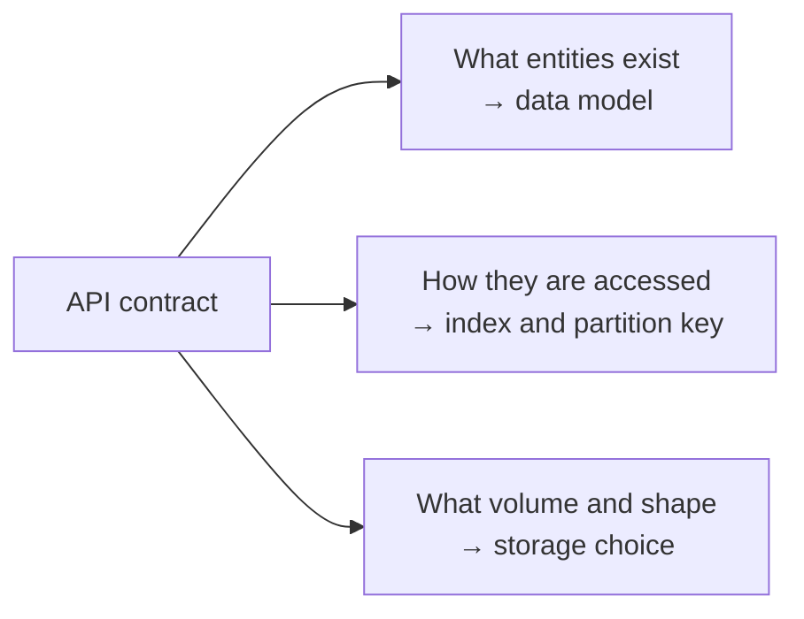

# 1.2.1 — API Design Intro

> **Part 1 · Introduction · API Design · Chapter 1 of 6**
> The API is the contract. Get it right and the data model and storage follow almost automatically.

---

## 🧒 ELI5 — Explain Like I'm 5

An API is a **restaurant menu**.

You don't walk into the kitchen and start cooking. You look at the menu, which says exactly what you can order and what you'll get:

> **Cheeseburger — £8 — comes with fries**

The menu is a **promise**. It hides the kitchen. The chef can buy a new oven, hire new cooks, or move the whole kitchen to a different building — and you don't care, because the menu still says "cheeseburger, £8, comes with fries."

A good menu:
- has **clear names** (not "Item #7"),
- says **exactly what you get back**,
- says **what happens if they're out of cheese** (an error),
- doesn't change meaning tomorrow (if it must change, they print a **new menu** — that's versioning),
- doesn't let you order 10,000 burgers at once and jam the kitchen (that's **rate limiting**),
- lets you say "just show me the first 20 things" (that's **pagination**).

API design is writing a good menu. That's it.

---

## Why API design comes so early in an interview

The API pins down three things at once:



Once you have written `GET /videos/{id}` you have implicitly declared: there is a `Video` entity, it has a stable ID, and it is looked up by that ID. That immediately suggests a key-value or primary-key access pattern, which suggests a shard key of `video_id`.

🎯 **Interview angle** — Spend 3–5 minutes here. Skipping it means designing storage without knowing the access pattern, which is backwards and interviewers notice.

---

## The four API styles

| Style | Shape | Best for | Weakness |
|---|---|---|---|
| **REST** | Resources + HTTP verbs | Public APIs, CRUD, caching | Over/under-fetching; many round trips |
| **GraphQL** | One endpoint, client-specified query | Varied clients, mobile, nested data | Caching is hard; N+1 on the server; complex cost control |
| **gRPC / RPC** | Typed method calls over HTTP/2 | Internal service-to-service | Not browser-native; binary payloads are harder to debug |
| **WebSocket / SSE** | Long-lived, server-push | Chat, live feeds, notifications | Stateful connections break statelessness (step 4 of the staircase) |

**Default answer in an interview:** REST for the public/client API, gRPC internally, WebSocket only where genuine server push is required. Say that in one sentence and move on unless probed.

⚖️ **Trade-off — GraphQL:** it solves mobile over-fetching beautifully and destroys your HTTP caching story. If you propose it, immediately say how you'll handle caching (persisted queries + response caching by query hash) and query-cost limits (depth/complexity budgets).

---

## REST done properly

### Resources are nouns; verbs are HTTP methods

| Bad | Good |
|---|---|
| `POST /createUser` | `POST /users` |
| `GET /getUserById?id=5` | `GET /users/5` |
| `POST /users/5/delete` | `DELETE /users/5` |
| `GET /getUserOrdersList` | `GET /users/5/orders` |

### Method semantics you must know

| Method | Safe? | Idempotent? | Meaning |
|---|---|---|---|
| `GET` | Yes | Yes | Read. Must have no side effects. Cacheable. |
| `HEAD` | Yes | Yes | Headers only. |
| `POST` | No | **No** | Create, or "do something." |
| `PUT` | No | **Yes** | Replace entire resource at a known URI. |
| `PATCH` | No | Not necessarily | Partial update. |
| `DELETE` | No | **Yes** | Remove. Second call returns 404 or 204 — still idempotent in effect. |

🎯 **Interview angle** — "`POST` is not idempotent, so I'll require an `Idempotency-Key` header on payment creation and store the key with the result for 24 hours; a retry with the same key returns the original response rather than charging twice." That single sentence covers a topic interviewers love.

### Status codes that matter

| Code | Use it when |
|---|---|
| `200 OK` | Success with a body |
| `201 Created` | Resource created; include a `Location` header |
| `202 Accepted` | Work queued, not done — the async pattern |
| `204 No Content` | Success, nothing to return (often `DELETE`) |
| `400 Bad Request` | Malformed input |
| `401 Unauthorized` | Not authenticated (misnamed — it means unauthenticated) |
| `403 Forbidden` | Authenticated but not allowed |
| `404 Not Found` | Missing — also used to hide existence from unauthorised callers |
| `409 Conflict` | Version conflict, duplicate unique key |
| `412 Precondition Failed` | `If-Match` ETag mismatch — optimistic concurrency |
| `422 Unprocessable Entity` | Syntactically fine, semantically invalid |
| `429 Too Many Requests` | Rate limited; include `Retry-After` |
| `500` / `503` | Server error / temporarily unavailable |

`202 Accepted` is the status code that signals "I understand asynchronous design." Use it for uploads, exports, transcoding, and bulk jobs, and return a polling URL:

```http
POST /v1/exports
202 Accepted
Location: /v1/exports/exp_9f2/status
{ "export_id": "exp_9f2", "status": "queued" }
```

---

## Designing a request and response

### Request shape

```http
POST /v1/orders HTTP/1.1
Authorization: Bearer <token>
Idempotency-Key: 8f1c-...-a9
Content-Type: application/json

{
  "items": [ { "sku": "ABC-1", "qty": 2 } ],
  "shipping_address_id": "addr_44",
  "currency": "GBP"
}
```

### Response shape

```json
{
  "order_id": "ord_01HX...",
  "status": "pending_payment",
  "total_minor": 1799,
  "currency": "GBP",
  "created_at": "2026-08-31T10:04:11Z",
  "links": { "payment": "/v1/orders/ord_01HX.../payment" }
}
```

Five rules that earn points:

1. **Money in minor units as integers** (`1799`, not `17.99`). Floats and money do not mix.
2. **Timestamps in UTC, ISO-8601, with a `Z`.** Never local time, never a bare epoch without units.
3. **Opaque string IDs**, not raw auto-increment integers — they don't leak volume and survive sharding.
4. **`status` as an explicit enum**, not booleans that accumulate (`is_paid`, `is_shipped`, `is_cancelled` becomes unrepresentable-state hell).
5. **Envelope errors consistently.**

### Error shape

```json
{
  "error": {
    "code": "insufficient_inventory",
    "message": "SKU ABC-1 has 1 unit available, 2 requested",
    "field": "items[0].qty",
    "request_id": "req_7d1a",
    "retryable": false
  }
}
```

`request_id` is not decoration — it is how support and tracing correlate a user complaint with a log line.

---

## Versioning

| Strategy | Example | Notes |
|---|---|---|
| **URI path** | `/v1/users` | Simplest, most visible, most common. Default to this. |
| **Header** | `Accept: application/vnd.api+json; version=2` | Cleaner URIs, worse discoverability and caching |
| **Query param** | `/users?version=2` | Easy but pollutes caching keys |
| **Date-based** | `Anthropic-Version: 2026-01-01` | Used by several major APIs; pins behaviour to a date |

**The rules that matter more than the strategy:**

- **Additive changes are free** — adding an optional field or endpoint doesn't need a version bump.
- **Removing or renaming a field, changing a type, tightening validation, or changing default behaviour is breaking** — that needs a version.
- Clients must **ignore unknown fields**. State this; it is what makes additive evolution possible.
- Deprecate with a timeline and a `Deprecation` / `Sunset` header, not silently.

---

## Non-negotiables for any API at scale

### 1. Pagination
Never return an unbounded list. Cursor-based, not offset. See [Pagination](03-pagination.md).

### 2. Filtering, sorting, sparse fields
```
GET /v1/orders?status=shipped&sort=-created_at&fields=order_id,total_minor&limit=50
```
Every filterable field must be backed by an index, or you have designed a full table scan into your contract.

### 3. Rate limiting
Return limits in headers so clients can behave:
```http
429 Too Many Requests
Retry-After: 12
X-RateLimit-Limit: 1000
X-RateLimit-Remaining: 0
X-RateLimit-Reset: 1756633451
```
Algorithms and distributed implementation: [Rate Limiting Patterns](../../07-patterns-and-templates/01-patterns/07-rate-limiting-patterns.md).

### 4. Idempotency
Any non-idempotent operation that a client may retry (payments, orders, sends) takes an `Idempotency-Key`. Store `key → (status, response, expiry)`; on replay, return the stored response.

### 5. Caching headers
```http
Cache-Control: public, max-age=60, stale-while-revalidate=300
ETag: "a7f3c1"
```
`ETag` + `If-None-Match` gives you cheap `304 Not Modified` responses and doubles as optimistic concurrency control via `If-Match` on writes.

### 6. Bulk endpoints
`POST /v1/users/batch-get` with 100 IDs beats 100 round trips. Cap the batch size and document partial-failure semantics explicitly.

### 7. Compression and payload size
`Accept-Encoding: gzip` (or brotli). Cap request bodies. Reject oversized payloads at the gateway, not in the application.

---

## API design checklist for the interview

```
□ 3-5 endpoints, no more
□ Nouns, correct verbs
□ Request body shape shown
□ Response body shape shown
□ Pagination style stated (cursor)
□ Auth mechanism named (bearer token / OAuth)
□ Idempotency for unsafe retryable ops
□ One async endpoint returning 202 if the system has slow work
□ Error shape shown once
□ Rate limit mentioned
```

Ten lines. Three minutes. It reads as thorough because it is.

---

## ☠️ Failure modes and anti-patterns

| Anti-pattern | Consequence |
|---|---|
| Unbounded list endpoints | One client asks for everything, database melts |
| Offset pagination on large tables | `OFFSET 1000000` scans a million rows every page |
| Verbs in paths (`/getUser`) | Signals no REST familiarity |
| Leaking internal IDs and enums | You can never change internals without breaking clients |
| Booleans instead of a status enum | Impossible states become representable |
| Errors as `200 OK` with `{"success": false}` | Breaks every generic client, retry, and monitor |
| No request ID | Incidents become unsolvable |
| Chatty APIs forcing N+1 client calls | Mobile latency disaster; add batch or a BFF |
| Breaking changes without a version | Silent client breakage in production |

---

## 📋 Chapter checklist

| Concept | Ready? |
|---|---|
| Choose between REST / gRPC / GraphQL / WebSocket with a reason | ☐ |
| Recite which HTTP methods are idempotent | ☐ |
| Know when to return 202, 409, 412, 429 | ☐ |
| Write an idempotency-key flow | ☐ |
| Write an error envelope from memory | ☐ |
| Name the ten-line interview checklist | ☐ |

---

**← Previous** [1.1.5 Study Guide](../01-basics/05-study-guide.md)
**Next →** [1.2.2 API Design Example](02-api-design-example.md)
