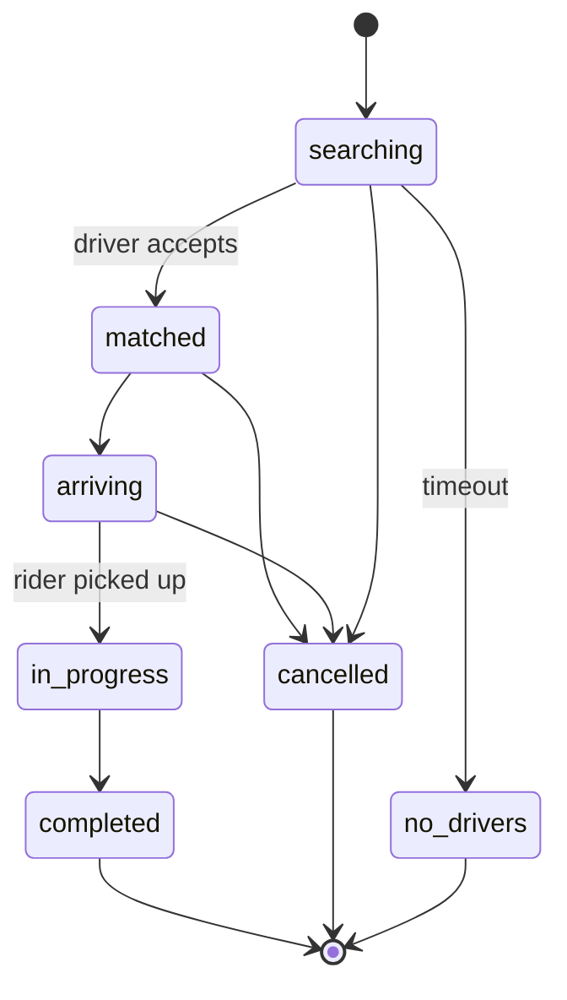

# 1.2.2 — API Design Example

> **Part 1 · Introduction · API Design · Chapter 2 of 6**
> One worked example, start to finish: the API for a URL shortener, then a harder one for a ride-hailing app.

---

## 🧒 ELI5 — Explain Like I'm 5

We're going to write the **menu** for a machine that turns long web addresses into short ones.

What can a customer ask for?

1. *"Here's a long link — give me a short one."*
2. *"Here's a short one — take me to the long one."*
3. *"How many people clicked my short link?"*
4. *"Delete my short link."*

That's four things. Now we write each one down carefully: what you hand over, what you get back, and what happens when something goes wrong. That's the whole exercise.

Then we do it again for a harder machine (booking a taxi), where the answers arrive **later** — so the menu has to say *"your food is being cooked, here's a buzzer"* instead of handing you the plate immediately.

---

## Example 1 — URL shortener

### Step 1: What are the resources?

Nouns first. There is exactly one: a **link**. Analytics is a sub-resource of a link.

```
/v1/links
/v1/links/{code}
/v1/links/{code}/stats
```

### Step 2: The endpoints

#### Create a short link

```http
POST /v1/links
Authorization: Bearer <token>
Idempotency-Key: 4f2e9c1a-...
Content-Type: application/json

{
  "long_url": "https://example.com/a/very/long/path?with=params",
  "custom_alias": "launch",          // optional
  "expires_at": "2027-01-01T00:00:00Z",  // optional
  "password": null                    // optional
}
```

```http
201 Created
Location: https://sho.rt/launch

{
  "code": "launch",
  "short_url": "https://sho.rt/launch",
  "long_url": "https://example.com/a/very/long/path?with=params",
  "owner_id": "usr_88",
  "created_at": "2026-08-31T10:00:00Z",
  "expires_at": "2027-01-01T00:00:00Z"
}
```

Design decisions embedded here, each worth saying out loud:

| Decision | Reason |
|---|---|
| `custom_alias` is optional | Custom aliases need a uniqueness check against the same keyspace as generated codes — one namespace, one index |
| `Idempotency-Key` | A mobile client retrying on flaky network must not create two links |
| `expires_at` | Lets storage apply TTL and reclaim space; without it the dataset only grows |
| `201` + `Location` | Correct REST semantics |

#### Resolve a short link

```http
GET /{code}
```
```http
301 Moved Permanently        # or 302, see below
Location: https://example.com/a/very/long/path?with=params
Cache-Control: public, max-age=86400
```

⚖️ **Trade-off — 301 vs 302.** `301` is cached by browsers and intermediaries forever-ish: fastest for the user, near-zero load for you, but **you lose click analytics** and can never change the target. `302` forces the browser back to you every time: full analytics and editable targets, but every click costs a request. **Choose based on whether analytics is a functional requirement.** In this design analytics *is* required, so: `302`, plus a CDN-level cache with a short TTL for the redirect itself.

This one question is the single most common follow-up in a URL-shortener interview.

#### Stats

```http
GET /v1/links/launch/stats?from=2026-08-01&to=2026-08-31&granularity=day
```
```json
{
  "code": "launch",
  "total_clicks": 128441,
  "unique_visitors_approx": 91002,
  "series": [
    { "ts": "2026-08-01", "clicks": 4120 },
    { "ts": "2026-08-02", "clicks": 3980 }
  ],
  "top_referrers": [ { "host": "twitter.com", "clicks": 51200 } ],
  "generated_at": "2026-08-31T10:04:00Z",
  "freshness": "up to 60s stale"
}
```

Two senior signals: `unique_visitors_approx` (an admission that exact distinct counts at scale means HyperLogLog, not `COUNT(DISTINCT)`), and an explicit **`freshness`** field declaring the consistency contract to the client.

#### Delete

```http
DELETE /v1/links/launch
204 No Content
```

Soft-delete internally (tombstone), because the code must not be reissued to someone else while old links are still circulating.

#### List my links

```http
GET /v1/links?limit=50&cursor=eyJpZCI6...&sort=-created_at
```
```json
{ "items": [ ... ], "next_cursor": "eyJpZCI6MTIzfQ", "has_more": true }
```

### Step 3: What the API just told us about storage

Reading the contract back:

| API fact | Storage consequence |
|---|---|
| Every read is `GET /{code}` | Primary access is a single-key lookup → key-value store, shard by `code` |
| Reads vastly outnumber writes | Cache `code → long_url` with a long TTL; 95%+ hit rate expected |
| `code` must be globally unique | Needs an ID generator: counter + base62, or random with collision retry ([Unique ID Generators](../../07-patterns-and-templates/01-patterns/06-unique-id-generators.md)) |
| Stats are time-bucketed aggregates | Separate store: append clicks to a stream, aggregate into a time-series/OLAP store — never `COUNT(*)` on the click table |
| `expires_at` exists | TTL-capable store, or a sweeper job |
| Listing by owner, sorted by time | Secondary index on `(owner_id, created_at)` |

🎯 That table **is** the transition from phase 3 to phase 4 of the interview template. Say it out loud and your storage section is already half-argued.

---

## Example 2 — Ride hailing (the async-heavy case)

Harder because the interesting operations do not complete within the request.

### Resources

```
/v1/rides
/v1/rides/{ride_id}
/v1/drivers/{driver_id}/location
/v1/rides/{ride_id}/events   (stream)
```

### Request a ride — accepted, not completed

```http
POST /v1/rides
Idempotency-Key: ride-attempt-771

{
  "pickup":  { "lat": 51.5074, "lng": -0.1278 },
  "dropoff": { "lat": 51.4700, "lng": -0.4543 },
  "product": "standard",
  "payment_method_id": "pm_31"
}
```
```http
202 Accepted
Location: /v1/rides/rid_9f2

{
  "ride_id": "rid_9f2",
  "status": "searching",
  "fare_estimate_minor": 2450,
  "currency": "GBP",
  "expires_at": "2026-08-31T10:06:00Z"
}
```

`202` + a `status` enum is the correct shape whenever matching, transcoding, payment capture, or any human/asynchronous process sits between the request and the result.

### The status lifecycle is part of the contract



Publishing the state machine in your API docs prevents a whole class of client bugs. In an interview, drawing it takes 40 seconds and reads as very senior.

### Getting the updates to the client

Three options; name all three, pick one, justify:

| Option | Latency | Server cost | When to use |
|---|---|---|---|
| **Client polls** `GET /v1/rides/{id}` every 2 s | ~2 s | High: QPS = riders ÷ 2 | Simple, fine for low concurrency |
| **Server-Sent Events** on `/v1/rides/{id}/events` | Sub-second | One long connection per active ride | Good default — unidirectional, works over plain HTTP |
| **WebSocket** | Sub-second, bidirectional | Connection state per client | Needed when the client also streams (driver location) |

Design answer: **SSE for the rider** (they only receive), **WebSocket for the driver app** (it also pushes location every 4 seconds).

### High-frequency writes need their own contract

```http
POST /v1/drivers/drv_12/location
{ "lat": 51.5, "lng": -0.12, "heading": 271, "ts": "2026-08-31T10:04:03.221Z", "accuracy_m": 8 }
204 No Content
```

🔢 100,000 active drivers × one ping per 4 s = **25,000 writes/sec** of data that is worthless 10 seconds later. Consequences you should state immediately:

- Do **not** put this in the transactional database. It goes to an in-memory geospatial index (Redis `GEOADD`) plus a stream for history.
- Batch: allow the client to send up to 5 buffered points per call, cutting request count 5×.
- `204 No Content` — no response body needed, saves bandwidth at 25k QPS.
- Accept lossy: dropping a location ping is fine. Say so; it justifies a cheap path.

---

## The generic method: how to derive any API in 4 minutes

1. **List the nouns** in the functional requirements. Those are your resources. (Ride, Driver, Link, Video, Message.)
2. **For each user action, pick the verb.** Create → `POST`, read → `GET`, replace → `PUT`, remove → `DELETE`.
3. **Ask "does this finish inside the request?"** If no → `202` + status resource + push/poll mechanism.
4. **Ask "is this a list?"** If yes → pagination, filtering, and an index to back it.
5. **Ask "can the client safely retry this?"** If it mutates → idempotency key.
6. **Write one error envelope** and reuse it.
7. **Read the contract back** and say what it implies for storage.

---

## ☠️ Failure modes in worked examples

| Mistake | What it costs |
|---|---|
| Returning the full long URL list in `GET /v1/links` with no limit | One power user with 2M links takes the service down |
| `301` redirect when analytics is a requirement | Analytics silently under-counts by 90%; unfixable after the fact |
| Storing driver locations in Postgres | 25k writes/sec of ephemeral data destroys your primary |
| No idempotency on `POST /rides` | Network retry creates two rides and two charges |
| Booleans (`is_matched`, `is_cancelled`) instead of a `status` enum | `is_matched=true, is_cancelled=true` becomes representable and someone will produce it |
| No `expires_at` on the ride offer | Zombie ride requests accumulate forever |

---

## 📋 Chapter checklist

| Skill | Ready? |
|---|---|
| Derive 4 endpoints from 4 functional requirements in 3 min | ☐ |
| Argue 301 vs 302 for a shortener | ☐ |
| Know when to return 202 and what to return with it | ☐ |
| Draw a status state machine for an async operation | ☐ |
| Choose polling vs SSE vs WebSocket with a reason | ☐ |
| Read an API back and state its storage implications | ☐ |

---

**← Previous** [1.2.1 API Design Intro](01-api-design-intro.md)
**Next →** [1.2.3 API Design — Pagination](03-pagination.md)
