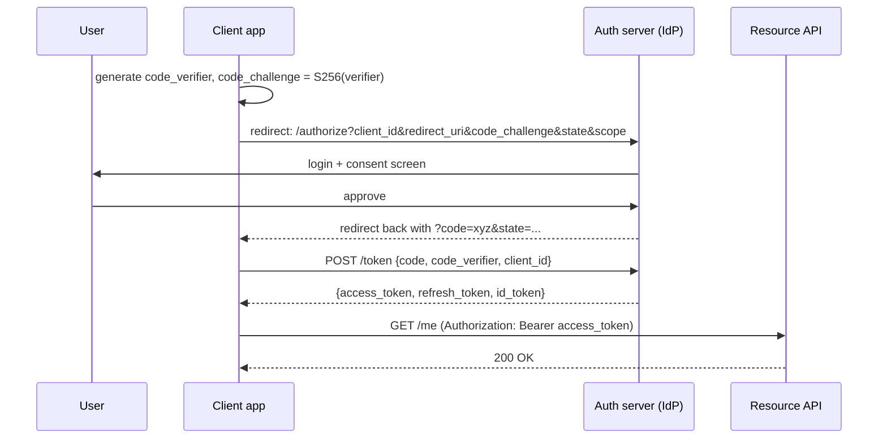
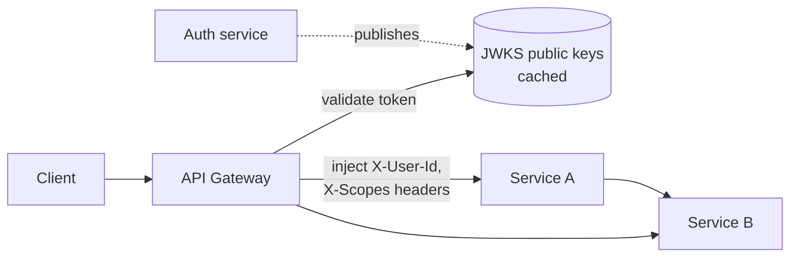

# 1.2.4 — API Authentication

> **Part 1 · Introduction · API Design · Chapter 4 of 6**
> **Authentication answers "who are you?"** Authorization (next chapter) answers "what may you do?"

---

## 🧒 ELI5 — Explain Like I'm 5

**Authentication is showing your face at the door.**

There are a few ways a club can check you're really you:

1. **You say your name and password every time.** Annoying, and if someone overhears once, they're you forever. *(HTTP Basic auth.)*
2. **You show ID once, and they give you a wristband.** After that you just flash the wristband. Fast — but anyone who steals the wristband gets in. So wristbands **expire at midnight**. *(Session tokens / JWTs.)*
3. **The wristband has your details printed on it and a special stamp** that only the club can make. The bouncer doesn't need to phone the office to check who you are — they just look at the stamp. Very fast, but if you get banned at 8pm, your wristband still works until midnight. *(JWT — self-contained, hard to revoke.)*
4. **A robot delivery driver has a permanent staff badge** instead of a face. *(API keys for machines.)*
5. **You want a photo app to see your Google photos.** You don't give the app your Google password. Instead Google asks *you* "allow this app to see photos?" and hands the app a **limited ticket**. *(OAuth 2.0.)*

That's every authentication scheme you will ever discuss.

---

## The vocabulary (get this right)

| Term | Meaning | Common confusion |
|---|---|---|
| **Authentication (AuthN)** | Proving identity | HTTP `401 Unauthorized` actually means *unauthenticated* |
| **Authorization (AuthZ)** | Deciding permissions | `403 Forbidden` means authenticated but not permitted |
| **Identity provider (IdP)** | The system that verifies credentials | Google, Okta, your own auth service |
| **Access token** | Short-lived credential presented to APIs | Minutes to an hour |
| **Refresh token** | Long-lived credential used only to get new access tokens | Days to months; must be storable securely |
| **Session** | Server-side record of a logged-in user | Requires a lookup |
| **Claim** | A statement inside a token (`sub`, `role`, `exp`) | |

---

## The mechanisms

### 1. Session cookies (stateful)

```mermaid
sequenceDiagram
    participant B as Browser
    participant A as API
    participant R as Session store (Redis)
    B->>A: POST /login {user, pass}
    A->>A: verify password hash
    A->>R: SET session:abc123 = {user_id, exp}
    A-->>B: Set-Cookie: sid=abc123; HttpOnly; Secure; SameSite=Lax
    B->>A: GET /orders (Cookie: sid=abc123)
    A->>R: GET session:abc123
    R-->>A: {user_id: 44}
    A-->>B: 200 OK
```

| ✅ | ❌ |
|---|---|
| **Instant revocation** — delete the key | A lookup on every request (though Redis is ~0.5 ms) |
| Small cookie, no data leakage | Session store is a shared dependency and a scaling concern |
| Browser handles it automatically | CSRF risk — needs `SameSite` and/or CSRF tokens |
| Easy to enumerate and kill all sessions of a user | Doesn't fit non-browser or cross-domain clients well |

Cookie flags are not optional: `HttpOnly` (JS cannot read it — blocks XSS token theft), `Secure` (HTTPS only), `SameSite=Lax` or `Strict` (blocks CSRF), plus a sensible `Domain`/`Path` and `Max-Age`.

### 2. JWT — JSON Web Token (stateless)

```
header.payload.signature

{"alg":"RS256","typ":"JWT","kid":"key-2026-08"}
{"sub":"usr_44","iss":"https://auth.example.com","aud":"api.example.com",
 "exp":1756636800,"iat":1756633200,"jti":"tok_9f2","scope":"orders:read"}
<signature over base64(header) + "." + base64(payload)>
```

The API verifies the signature with a public key and trusts the claims — **no database lookup**. This is the entire appeal.

| ✅ | ❌ |
|---|---|
| No lookup: scales trivially across services and regions | **Revocation is the hard problem** — a valid token stays valid until `exp` |
| Self-contained: services read `sub`, `scope`, `tenant` locally | Payload is **base64, not encrypted** — anyone can read it. Never put secrets in it |
| Works cross-domain and for mobile | Bigger than a session ID; sent on every request |
| Asymmetric signing (RS256/ES256) lets services verify without holding the signing key | Algorithm-confusion and `alg: none` vulnerabilities if the library is misused |

**Revocation strategies** (you will be asked):

| Strategy | How | Cost |
|---|---|---|
| Short expiry (5–15 min) + refresh token | Damage window is bounded | Refresh endpoint traffic |
| Denylist of `jti` in Redis until `exp` | Exact revocation | Reintroduces a lookup — but only for revoked tokens, and the set stays small |
| Token version per user (`tv` claim) | Bump `users.token_version` to invalidate all | One cached lookup per request |
| Rotate the signing key | Nuclear: invalidates everyone | Mass logout |

🎯 **Interview angle** — "I'll use JWTs with a 15-minute expiry and refresh tokens, plus a Redis denylist keyed by `jti` for explicit logout and compromise. That keeps 99.9% of requests lookup-free while making revocation exact within the denylist TTL." That answers the standard follow-up before it's asked.

☠️ **Security failure modes:** accepting `alg: none`; accepting `HS256` when you expect `RS256` (attacker signs with your public key as the HMAC secret); not validating `aud`/`iss`; storing JWTs in `localStorage` where XSS can read them (prefer `HttpOnly` cookies for browsers); no `kid` so key rotation is impossible.

### 3. API keys (machine-to-machine)

```http
Authorization: Bearer sk_live_9f2a...
```

Long-lived opaque secrets for server-to-server calls. Practices that matter:

- Store only a **hash** of the key (like a password); show the plaintext once at creation.
- Prefix keys so they are greppable and scannable in leaked repos (`sk_live_`, `sk_test_`).
- Scope each key (read-only, specific resources) and bind to IP allowlists where possible.
- Support **two active keys** per account so rotation needs no downtime.
- Log last-used timestamps to find dead keys.

### 4. OAuth 2.0 + OpenID Connect (delegated identity)

**OAuth 2.0 is an authorization-delegation framework; OpenID Connect (OIDC) is the thin identity layer on top of it** that adds the `id_token`. If you need "log in with Google," you need OIDC, not bare OAuth.

The correct modern flow for both web and mobile is **Authorization Code with PKCE**:



Why each piece exists:
- **Authorization code** (not the token) travels through the browser redirect, so the token is never in a URL or browser history.
- **PKCE** (`code_verifier`/`code_challenge`) proves the app redeeming the code is the same app that started the flow — this is what makes the flow safe for public clients (mobile/SPA) that cannot keep a secret.
- **`state`** is a CSRF nonce for the redirect.
- **Implicit flow is deprecated.** Do not propose it.

| Grant type | Use |
|---|---|
| Authorization Code + PKCE | Web apps, SPAs, mobile — **the default** |
| Client Credentials | Machine-to-machine, no user involved |
| Device Code | TVs, CLIs, input-constrained devices |
| Refresh Token | Renewing access tokens |
| ~~Implicit~~, ~~Password~~ | Deprecated; don't use |

### 5. mTLS (mutual TLS)

Both sides present certificates. Common inside service meshes and for high-assurance B2B (banking, healthcare). Strong identity, no bearer token to steal — but certificate lifecycle management is real operational work. Mention it for internal service-to-service auth in a zero-trust design.

---

## Choosing, in one table

| Client | Recommended |
|---|---|
| Browser, same-domain web app | Session cookie (`HttpOnly`, `Secure`, `SameSite`) — simplest and safest |
| SPA on a different domain | OIDC Authorization Code + PKCE; keep the access token in memory, refresh token in an `HttpOnly` cookie |
| Mobile app | OIDC Authorization Code + PKCE; refresh token in the OS keychain |
| Third-party developer integration | OAuth 2.0 with scopes |
| Your own backend service → your other backend service | mTLS, or a short-lived signed service token |
| Cron job / partner server | API key with scopes and IP allowlist |

---

## Password handling (if you own identity)

- **Hash with a memory-hard function:** Argon2id (preferred), scrypt, or bcrypt. **Never** SHA-256 alone, never MD5, never unsalted.
- Salt per user (built into all three above), plus optionally a server-side pepper held in a secrets manager.
- Enforce length, not silly composition rules (NIST guidance: minimum 8, check against breach lists, no forced periodic rotation).
- Rate-limit and progressively delay login attempts **per account and per IP**; lockouts alone enable denial-of-service against users.
- Constant-time comparison; identical error messages and identical timing for "user not found" vs "wrong password" (otherwise you have a user-enumeration oracle).
- Offer **MFA** (TOTP or WebAuthn). WebAuthn/passkeys are phishing-resistant and worth naming.

---

## Where authentication lives in the architecture



**Terminate authentication at the gateway**, verify once, and pass a trusted, signed internal identity header to downstream services. Benefits: services don't each implement token parsing; one place to patch; consistent audit logging.

⚠️ **The catch:** those internal headers are now trusted, so the network path between gateway and services must be closed (mesh mTLS, network policy). Otherwise anyone who reaches a service directly can set `X-User-Id: 1` and be an admin. Say this — it's the follow-up question.

---

## 📋 Chapter checklist

| Concept | Ready? |
|---|---|
| Difference between 401 and 403 | ☐ |
| Session vs JWT trade-off, stated in one sentence | ☐ |
| Four JWT revocation strategies | ☐ |
| Why PKCE exists | ☐ |
| Why implicit flow is deprecated | ☐ |
| Correct cookie flags and what each blocks | ☐ |
| Why Argon2/bcrypt and not SHA-256 | ☐ |
| The risk of gateway-injected identity headers | ☐ |

---

**← Previous** [1.2.3 Pagination](03-pagination.md)
**Next →** [1.2.5 API Authorization](05-api-authorization.md)
