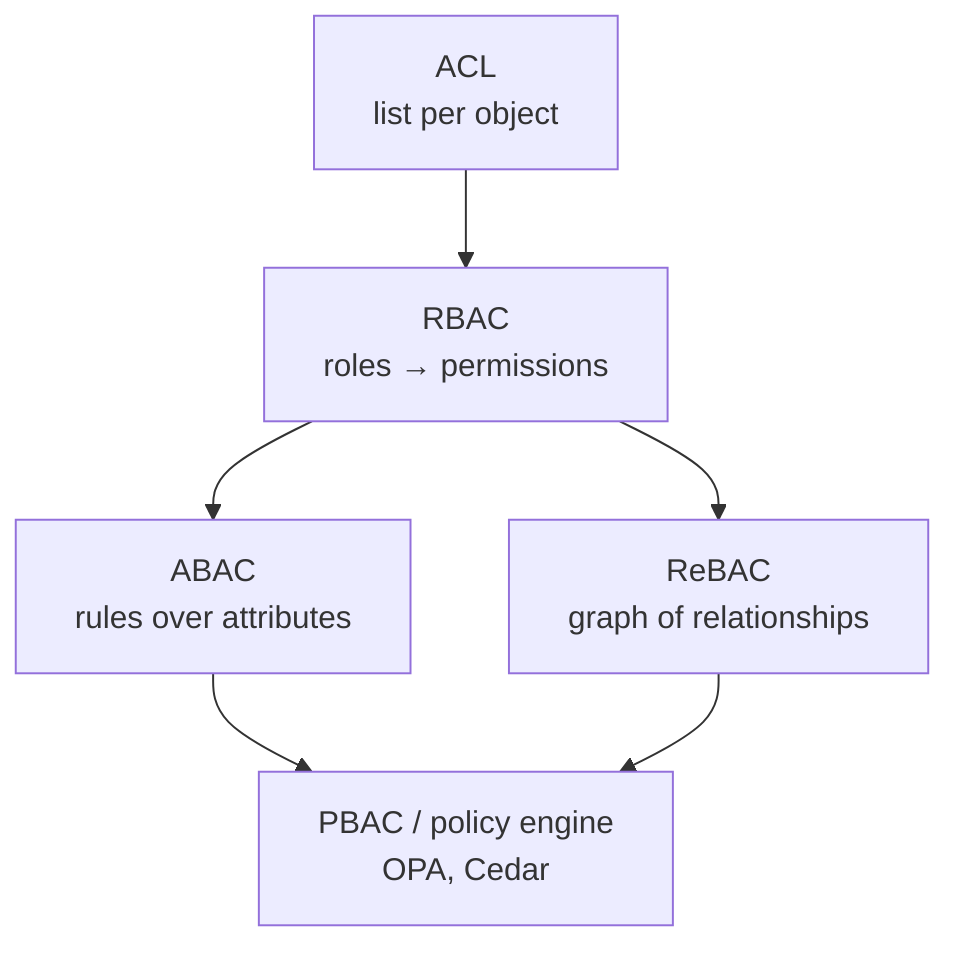
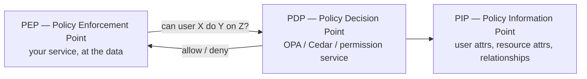

# 1.2.5 — API Authorization

> **Part 1 · Introduction · API Design · Chapter 5 of 6**
> Authentication proved *who* you are. Authorization decides *what you may do*, on *which object*.

---

## 🧒 ELI5 — Explain Like I'm 5

You got into the club (that was authentication — the bouncer checked your face).

Now: **which rooms can you go into?**

- You have a **normal ticket** → dance floor only.
- You have a **VIP ticket** → dance floor *and* the VIP lounge.
- You are **staff** → everywhere, including the office.

That's **role-based access**: your ticket type decides your rooms.

But sometimes the rule isn't about your ticket type at all:

- *"You can go into locker 42 because **locker 42 is yours**."* Nothing to do with VIP.
- *"You can enter the balcony **only after 9pm** and **only if it's not raining**."*

Those are rules about **the specific thing** and **the situation**. That's **attribute-based** and **relationship-based** access.

And the golden rule: **the bouncer checks at every door, not just the front door.** If you check only at the entrance, anyone who sneaks in a window walks freely. That's why authorization must be enforced at the resource, every time.

---

## The models



### 1. ACL — Access Control List
Each object carries a list: *"user 5 can read, user 9 can write."*

Simple, precise, and it does not scale organisationally — 10,000 users × 1,000 documents is 10M entries to maintain, and "who can read X?" is easy while "what can user Y read?" is a full scan.

Use for: file systems, small object counts, per-object sharing where the list is short.

### 2. RBAC — Role-Based Access Control
Users get **roles**; roles carry **permissions**.

```
user_44 → [editor, billing_viewer]
editor  → [posts:create, posts:update, posts:delete_own]
billing_viewer → [invoices:read]
```

The workhorse of ~80% of systems. Easy to reason about, easy to audit, easy to explain in an interview.

**Where it breaks:** "editor, but only for posts in *their own* workspace." You cannot express *which* objects without either multiplying roles per workspace (role explosion) or adding scope.

**The standard fix — scoped RBAC:** roles are granted *within a scope*, not globally.

```
(user_44, workspace_7, editor)
(user_44, workspace_9, viewer)
```

This handles the vast majority of multi-tenant SaaS. Propose this by default.

### 3. ABAC — Attribute-Based Access Control
Decisions are computed from attributes of the **subject**, **resource**, **action**, and **environment**.

```
ALLOW if
  subject.department == resource.department
  AND resource.classification <= subject.clearance
  AND environment.time within business_hours
  AND environment.ip in corporate_range
```

Extremely expressive; harder to audit ("who can see this document?" requires evaluating rules against every user).

Use for: compliance-heavy domains, healthcare, government, data classification.

### 4. ReBAC — Relationship-Based Access Control
Permissions derive from a **graph of relationships**. Google's Zanzibar is the canonical design; open implementations include SpiceDB, OpenFGA, and Ory Keto.

```
document:readme#owner@user:44
document:readme#parent@folder:eng
folder:eng#viewer@group:engineering#member
group:engineering#member@user:88
```

Question: *can user 88 view document readme?* → traverse: readme's parent is folder eng; eng's viewers include members of group engineering; user 88 is a member. **Allow.**

This is how Google Docs, GitHub, and Dropbox-style nested sharing actually work. Mention Zanzibar when a design involves hierarchical or inherited sharing — it is a strong signal.

⚖️ **Trade-off:** ReBAC handles inheritance and sharing elegantly but requires a dedicated, low-latency, consistent permission service. Zanzibar's hard part is not the graph — it is making the graph **consistent with your data** (they solved it with "zookies," snapshot tokens that pin a check to a version, avoiding the "new ACL, stale check" security bug).

---

## The rule that matters more than the model

> **Authorize at the resource, on every request, in the code path that touches the data.**

Not at the gateway. Not in the UI. Not once at login.

The gateway can do **coarse** checks (is this token valid, does it have the `orders` scope). Only the service holding the data knows whether *this* user owns *this* order.

☠️ **IDOR — Insecure Direct Object Reference.** The single most common real-world authorization bug:

```python
# BROKEN — authenticated, but not authorized
@app.get("/orders/{order_id}")
def get_order(order_id, user=Depends(auth)):
    return db.query("SELECT * FROM orders WHERE id = ?", order_id)
# user 5 requests order 999 (owned by user 6) and gets it
```

```python
# CORRECT — ownership is part of the query, not a separate check
@app.get("/orders/{order_id}")
def get_order(order_id, user=Depends(auth)):
    row = db.query(
        "SELECT * FROM orders WHERE id = ? AND owner_id = ?",
        order_id, user.id)
    if not row:
        raise HTTPException(404)   # 404, not 403 — don't leak existence
    return row
```

Two details in that fix are worth stating in an interview:

1. **Push the authorization predicate into the query** (`AND owner_id = ?`). A separate `if row.owner_id != user.id` check is correct but is the thing engineers forget to add on the next endpoint. Better: make it structurally impossible by having a repository layer that always takes a tenant/owner scope.
2. **Return 404, not 403**, for objects the caller may not see — otherwise the error code itself confirms the object exists, which is an information leak (and lets an attacker enumerate IDs).

---

## Multi-tenancy: the authorization case that appears constantly

Every row belongs to a tenant. Every query must be tenant-scoped. One missed `WHERE tenant_id = ?` is a cross-tenant data breach.

| Approach | Isolation | Cost | Notes |
|---|---|---|---|
| **Shared tables + `tenant_id` column** | Weakest | Cheapest | Requires discipline; use row-level security to enforce |
| **Schema per tenant** | Medium | Medium | Migrations × N schemas becomes painful past a few hundred tenants |
| **Database per tenant** | Strongest | Highest | Natural for enterprise/regulated customers; poor for a long tail of small tenants |

**Defence in depth for the shared-table case** — Postgres row-level security makes the database itself enforce the rule, so a forgotten `WHERE` clause fails closed:

```sql
ALTER TABLE orders ENABLE ROW LEVEL SECURITY;
CREATE POLICY tenant_isolation ON orders
  USING (tenant_id = current_setting('app.tenant_id')::uuid);
```

The application sets `app.tenant_id` once per connection/transaction from the authenticated identity.

---

## Where the decision is made



| Placement | Latency | Consistency | Use |
|---|---|---|---|
| **In-process library** (rules compiled in) | ~microseconds | Policy updates need a deploy or a poll | Simple RBAC |
| **Sidecar policy engine** (OPA) | ~1 ms | Policy bundle distributed centrally | Kubernetes-native, many services |
| **Central permission service** (Zanzibar-style) | ~5–20 ms + cache | Strongest, supports relationship graphs | Nested sharing, cross-service objects |

For a central service, **caching is mandatory** (checks happen many times per request) and **cache invalidation is the security-critical part**: a stale *allow* after a revocation is a breach. Zanzibar's answer is snapshot tokens; a simpler answer is short TTLs (seconds) plus explicit invalidation on permission change, and never caching *deny → allow* transitions optimistically.

---

## Scopes vs permissions

**Scopes** limit what a *token* may do (delegated by the user to an app). **Permissions** limit what the *user* may do. Both must pass.

```
Effective access = user's permissions  ∩  token's scopes
```

A user who is an admin, using an app granted only `orders:read`, may **only** read orders. Getting this intersection right is what stops a third-party integration from doing everything its user can do.

---

## Practical checklist for a design

```
□ Model chosen and justified (scoped RBAC by default)
□ Tenant isolation strategy stated
□ Authorization enforced in the data access path, not the gateway
□ Ownership predicate pushed into the query
□ 404 (not 403) for objects the caller may not see
□ Scopes intersected with user permissions
□ Admin/impersonation path exists, is audited, and is time-bounded
□ Every deny and every privileged action is logged with actor, target, and reason
□ Permission cache TTL short; explicit invalidation on revoke
□ Default deny — unknown route or unknown action is denied, not allowed
```

**Default deny** is worth saying explicitly. Systems that default to allow fail open, and failing open on authorization is how breaches happen.

---

## ☠️ Failure modes

| Failure | Consequence |
|---|---|
| Checking only at the gateway | Direct service access bypasses everything |
| Trusting a client-supplied `user_id` in the body | Trivial privilege escalation |
| UI-only enforcement (hidden buttons) | The API is wide open to anyone with `curl` |
| 403 for objects that exist, 404 for those that don't | Object enumeration oracle |
| Role explosion (`editor_ws1`, `editor_ws2`, ...) | Unmaintainable; use scoped roles |
| Long permission cache with no invalidation | Revoked users retain access |
| Mass-assignment: `PATCH /users/me` with `{"role":"admin"}` | Self-promotion; allowlist writable fields |
| No audit log | Cannot answer "who accessed this?" after an incident |

---

## 📋 Chapter checklist

| Concept | Ready? |
|---|---|
| Explain RBAC vs ABAC vs ReBAC and pick one with a reason | ☐ |
| Explain scoped RBAC for multi-tenant SaaS | ☐ |
| Write the IDOR bug and its fix from memory | ☐ |
| Explain why 404 beats 403 for hidden objects | ☐ |
| Describe Zanzibar in two sentences | ☐ |
| Explain the scopes ∩ permissions rule | ☐ |
| Name three tenant isolation strategies with costs | ☐ |

---

**← Previous** [1.2.4 API Authentication](04-api-authentication.md)
**Next →** [1.2.6 API Gateway](06-api-gateway.md)
