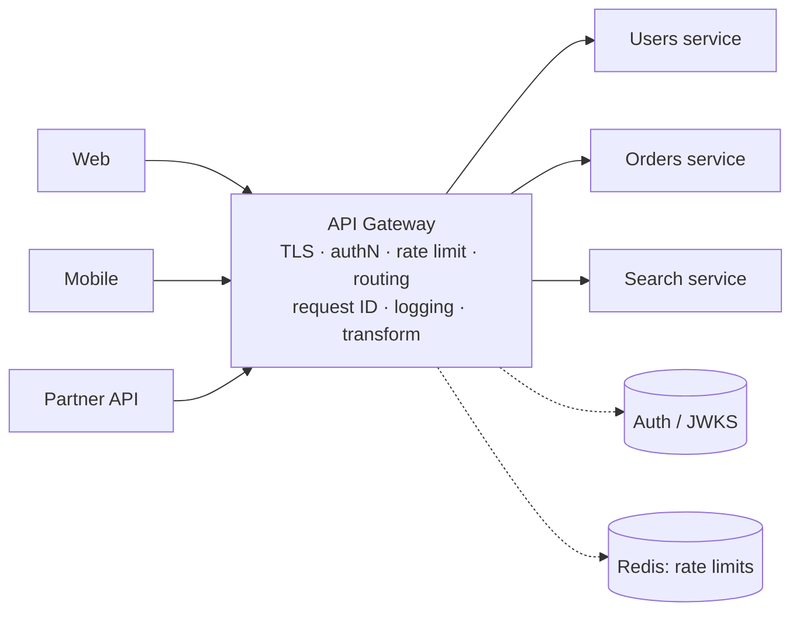
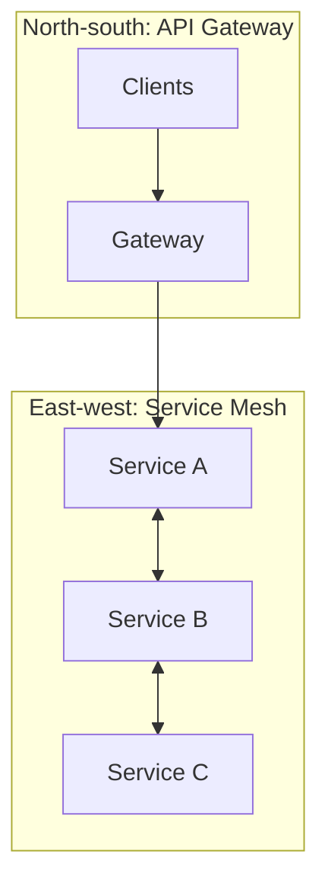
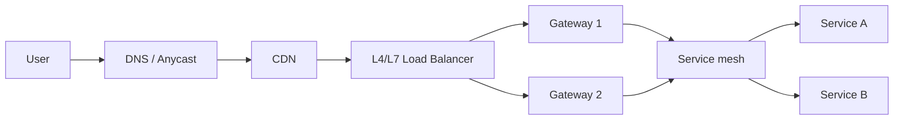

# 1.2.6 — API Gateway

> **Part 1 · Introduction · API Design · Chapter 6 of 6**
> The single front door that does the boring work so your services don't have to.

---

## 🧒 ELI5 — Explain Like I'm 5

Imagine an office building with 50 different companies inside.

**Without a front desk:** every visitor wanders in, knocks on random doors, and *each* company has to check IDs, keep a visitor log, tell people to stop banging on the door, and give directions. Fifty companies all doing the same boring job, fifty different ways, and one of them will forget to check IDs.

**With a front desk:** one desk at the entrance. It:

- **checks your ID** (authentication),
- **looks up which company you want** (routing),
- **stops you if you come back 500 times in a minute** (rate limiting),
- **writes down that you visited** (logging),
- **gives you a visitor number** so if anything goes wrong they can trace your whole path (request ID),
- **tells you "come back later" politely** if the company is closed (error handling, retries).

That front desk is an **API gateway**. One place, one implementation, every visitor.

The catch: if the front desk closes, **nobody gets in at all**. So you need more than one front desk. And if the front desk starts doing actual company work — filing their taxes, answering their emails — it turns into a monster nobody can maintain. Keep the front desk doing front-desk things.

---

## What a gateway does



| Responsibility | Why it belongs at the edge |
|---|---|
| **TLS termination** | Certificate management in one place |
| **Authentication** | Verify the token once; downstream gets a trusted identity |
| **Rate limiting / quotas** | Protects everything behind it; per-key and per-IP |
| **Routing** | Path/host/header-based dispatch to services; the client sees one domain |
| **Request/response transformation** | Version shims, header injection, field stripping |
| **Aggregation** | Combine a few backend calls into one client response (careful — see anti-patterns) |
| **Protocol translation** | REST/JSON at the edge → gRPC internally; HTTP/3 or WebSocket termination |
| **Observability** | Assign `X-Request-Id`, emit access logs, start the trace span |
| **Caching** | Cache-Control-aware response caching for public GETs |
| **Circuit breaking / retries / timeouts** | Uniform resilience policy |
| **Request validation** | Reject malformed bodies and oversized payloads before they reach services |
| **CORS, compression, canary/blue-green routing** | Cross-cutting policy in one place |

---

## Gateway vs load balancer vs service mesh vs BFF

These are constantly confused. Getting the distinction right is a strong signal.

| | Operates at | Knows about | Primary job |
|---|---|---|---|
| **Load balancer (L4)** | TCP/UDP | IPs and ports | Spread connections; fast, dumb |
| **Load balancer (L7)** | HTTP | Paths, headers | Spread requests; some routing |
| **API Gateway** | HTTP/gRPC | APIs, consumers, auth, quotas | **North-south** (client → system) policy |
| **Service mesh** (Istio, Linkerd) | HTTP/gRPC/TCP, sidecars | Service identity | **East-west** (service → service): mTLS, retries, traffic shifting |
| **BFF (Backend for Frontend)** | HTTP | One client's needs | Client-specific aggregation and shaping — it contains *product logic*, a gateway does not |



**The BFF pattern:** when the web app, iOS app, and partner API need genuinely different response shapes, don't bloat one gateway with three sets of logic. Run **one BFF per client type**, each owned by that client's team, all sitting behind the shared gateway.

---

## The critical trade-offs

### ✅ What you gain
- **Cross-cutting concerns implemented once**, correctly, and patched once.
- Services get simpler: no auth parsing, no rate-limit code.
- One public surface: clients see one domain, one auth scheme, one error format.
- A natural place for canary routing, A/B splits, and API versioning shims.

### ❌ What you pay

| Cost | Mitigation |
|---|---|
| **Single point of failure** | Multiple instances, multi-AZ, behind a load balancer or anycast; health checks; fail-open on non-critical filters |
| **Extra network hop** (~1–5 ms) | Usually acceptable; keep it in the same region/AZ as services |
| **Deployment bottleneck** — every team needs config changes | Declarative, per-service config owned by each team (Kubernetes `Ingress`/`Gateway API` CRDs), not a central file |
| **The god-object risk** | Hard rule: **no business logic in the gateway** |
| **Chokepoint under load** | Autoscale; keep filters cheap; move heavy aggregation to BFFs |

☠️ **The classic failure:** a gateway that grew request-body business logic, so every product change requires a gateway deploy, and a gateway bug takes down all 40 services at once. Say the hard rule out loud: *routing, security, and policy only.*

---

## Rate limiting at the gateway

The most valuable single gateway function, because it protects everything downstream.

```
Limit dimensions (apply several simultaneously):
  per API key      1,000 req/min      ← business tier
  per user ID      100 req/min        ← fairness
  per IP           300 req/min        ← abuse control
  per endpoint     /search: 20/min    ← protect expensive paths
  global           50,000 req/sec     ← protect the system
```

Return the standard headers so clients can self-regulate:

```http
429 Too Many Requests
Retry-After: 30
RateLimit-Limit: 1000
RateLimit-Remaining: 0
RateLimit-Reset: 1756633451
```

Distributed counting across gateway instances is the interesting part — a shared Redis with atomic increments, or local counters with periodic reconciliation (approximate but far cheaper). Algorithms, accuracy, and the hot-key problem: [Rate Limiting Patterns](../../07-patterns-and-templates/01-patterns/07-rate-limiting-patterns.md).

---

## Authentication at the gateway — and the trap

The gateway validates the JWT (fetching and caching the IdP's JWKS public keys), then forwards an internal identity:

```http
X-User-Id: usr_44
X-Tenant-Id: ten_7
X-Scopes: orders:read,orders:write
X-Request-Id: req_9f2a
```

⚠️ **Two rules, both mandatory:**

1. **Strip these headers from inbound client requests.** If a client can set `X-User-Id`, the whole scheme is a trivial impersonation vulnerability. Gateways do not do this by default — you must configure it.
2. **Make the network path trustworthy.** Services must be unreachable except through the gateway (network policy), or the identity headers must be signed/mTLS-authenticated. Otherwise anyone inside the network is anyone they choose to be.

And, as in [Authorization](05-api-authorization.md): the gateway does **coarse** authorization (valid token, correct scope). Object-level ownership checks stay in the service.

---

## Aggregation: when it's right and when it's wrong

**Right:** a mobile home screen needs profile + unread count + top 3 notifications. One client call instead of three saves two mobile round trips (~300 ms on a poor network). Put it in a **BFF**.

**Wrong:** a gateway that fans out to seven services, applies business rules to merge them, and owns the failure semantics of each. That is a service — give it a name, a team, and its own deploy pipeline. Also: aggregation multiplies failure probability (seven 99.9% calls → 99.3%) and creates tail amplification, so it needs per-call timeouts, partial-response semantics, and fallbacks.

---

## Implementations worth naming

| Category | Examples |
|---|---|
| Managed | AWS API Gateway, Google Apigee / Cloud Endpoints, Azure API Management, Cloudflare |
| Self-hosted | Kong, Envoy (+ Gateway API), Traefik, NGINX / OpenResty, Tyk, KrakenD |
| Kubernetes-native | Ingress controllers, Gateway API, Istio ingress gateway |

Envoy is the substrate under many of the others (Istio, Contour, Gloo, AWS App Mesh) — worth knowing.

⚖️ **Managed vs self-hosted:** managed gateways remove operations but bring per-request pricing that becomes significant at high QPS, and cold-start/limit quirks. Self-hosted Envoy or Kong is cheaper at scale and more configurable, at the cost of running it. State the crossover reasoning if asked.

---

## Where the gateway sits in the full picture



Note the gateway is **replicated behind a load balancer** — that is the answer to "isn't it a single point of failure?"

---

## 📋 Chapter checklist

| Concept | Ready? |
|---|---|
| List eight gateway responsibilities | ☐ |
| Distinguish gateway / load balancer / mesh / BFF | ☐ |
| State the "no business logic" rule and why | ☐ |
| Explain how the SPOF concern is addressed | ☐ |
| Name the two mandatory rules for identity headers | ☐ |
| Explain when aggregation belongs in a BFF instead | ☐ |
| Give the rate-limit dimensions and 429 headers | ☐ |

---

**← Previous** [1.2.5 API Authorization](05-api-authorization.md)
**Next →** [1.3.1 Non-functional Requirements](../03-non-functional-requirements/01-non-functional-requirements.md)
