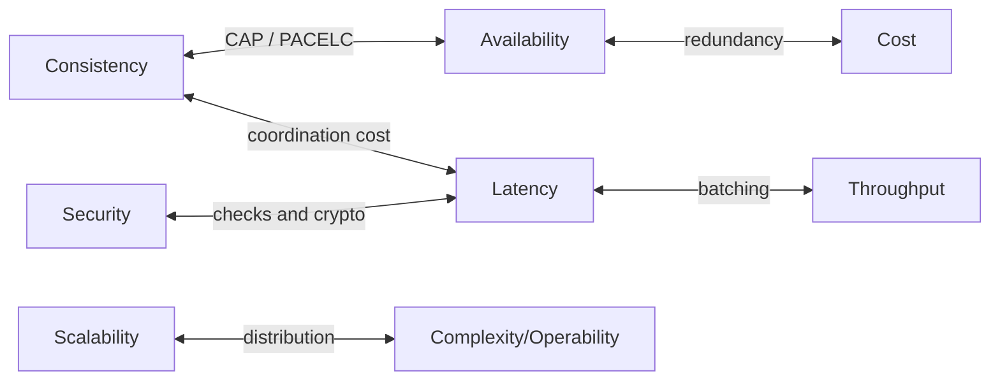

# 1.3.1 — Non-functional Requirements

> **Part 1 · Introduction · Non-functional Requirements · Chapter 1 of 7**
> Functional requirements decide *whether it works*. Non-functional requirements decide *whether it survives*.

---

## 🧒 ELI5 — Explain Like I'm 5

Someone asks you to build a bridge.

**Functional requirement:** "cars can cross the river." That's *what it does*.

**Non-functional requirements** are all the questions that decide whether your bridge is a plank of wood or the Golden Gate:

- **How many cars per hour?** (throughput) — 10 or 100,000?
- **How fast can they cross?** (latency)
- **How often is it allowed to be shut?** (availability) — an hour a year, or a week a year?
- **What if a truck is too heavy?** (reliability, graceful degradation)
- **Can it grow later if the city doubles?** (scalability)
- **How much can it cost?** (cost)
- **Can two workers fix it, or do you need an army?** (operability)

Here's the important bit: **the answers change what you build entirely.** A bridge for 10 cars a day and a bridge for 100,000 cars an hour are not the same bridge with more paint. They are different designs from the first sketch.

That's why you ask these questions **before** drawing anything.

---

## The definition

**Non-functional requirements (NFRs)** describe *how well* a system performs its functions, rather than *what* functions it performs. They are also called *quality attributes* or, in operations, *service level objectives*.

Besides making things functionally work, the system must satisfy — most notably — **scalability, availability, and performance (latency and throughput)**. Beyond those there are **reliability** (the service returns correct results), **consistency** (data agrees across services), and **efficiency** (minimal redundant work).

---

## The full catalogue

| NFR | Question it answers | How to quantify |
|---|---|---|
| **Scalability** | Can it grow without redesign? | "10× traffic with linear cost, no architecture change" |
| **Availability** | What fraction of time does it work? | 99.9% / 99.99%; error budget in minutes |
| **Latency** | How fast is a single request? | p50 / p95 / p99 / p999 in ms |
| **Throughput** | How much work per unit time? | QPS, records/sec, MB/sec |
| **Reliability** | Are the results *correct*? | Error rate, data-corruption rate, MTBF |
| **Durability** | Can data be lost? | "11 nines", RPO in seconds |
| **Consistency** | Do copies agree, and when? | Model name + staleness bound ("≤ 5 s") |
| **Recoverability** | How fast after disaster? | RTO (time to restore), RPO (data lost) |
| **Security** | Who can do what; what's protected? | Threat model, encryption at rest/in transit |
| **Privacy / compliance** | Legal obligations | GDPR/CCPA/HIPAA/PCI-DSS; data residency |
| **Cost** | What does it cost to run? | $ per million requests, $ per TB-month |
| **Operability** | Can humans run it? | MTTR, on-call load, deploy frequency |
| **Observability** | Can you see inside? | Trace coverage, log retention, alert precision |
| **Maintainability** | Can it be changed safely? | Time to add a feature; test coverage |
| **Portability** | Can it move? | Cloud-agnostic? Data export format? |

You will not discuss all fifteen in an interview. Pick the 4–6 that **actually shape this design** and quantify those.

---

## The single most important habit: turn adjectives into numbers

Every vague word must become a measurable target. This is the difference between a requirement and a wish.

| ❌ Vague | ✅ Quantified |
|---|---|
| "Highly available" | 99.95% monthly → ≤ 21.9 min downtime/month; RTO 5 min, RPO 30 s |
| "Fast" | p99 < 200 ms for reads, p99 < 500 ms for writes, measured at the load balancer |
| "Scalable" | 50k QPS today, must reach 500k in 18 months with linear cost |
| "Secure" | All PII encrypted at rest (AES-256) and in transit (TLS 1.3); no plaintext PII in logs |
| "Real-time" | End-to-end p95 < 2 s from event to dashboard |
| "Never lose data" | RPO = 0 for payments; RPO ≤ 5 min for analytics |
| "Consistent" | Read-your-writes for the author; ≤ 30 s staleness for other viewers |

🎯 **Interview angle** — "Real-time" is the most dangerous word in system design. It means *sub-millisecond* to a trading engineer and *within a minute* to a dashboard user. **Always ask for the number.** Asking "when you say real-time, do you mean under a second, or under a minute?" is a genuinely senior move, because the two answers produce completely different architectures.

---

## SLI, SLO, SLA — the professional vocabulary

| Term | Meaning | Example |
|---|---|---|
| **SLI** — Service Level *Indicator* | The measurement | "fraction of requests served in < 200 ms" |
| **SLO** — Service Level *Objective* | Your internal target | "99% of requests < 200 ms over 28 days" |
| **SLA** — Service Level *Agreement* | The contractual promise, with penalties | "99.9% uptime or 10% credit" |

**Rule: SLA < SLO < actual performance.** You promise less than you target, and target less than you achieve, so you have room to absorb a bad week without breaching a contract.

### Error budgets — the idea that makes SLOs useful

An SLO of 99.9% means **0.1% of requests are allowed to fail**. Over 30 days that is 43 minutes of full downtime, or an equivalent amount of partial failure. That's your **error budget**.

```
Monthly requests            1,000,000,000
SLO                         99.9% success
Allowed failures            1,000,000
Failures so far this month  310,000
Budget remaining            69%
```

The budget converts a philosophical argument into an engineering rule:

- **Budget remaining** → ship features, take risks, deploy on Friday.
- **Budget exhausted** → feature freeze, reliability work only.

🎯 Mentioning error budgets in an interview signals you have worked somewhere with real production discipline.

### Choosing a good SLI

Measure **what the user experiences**, not what is convenient. Server-side latency excludes network and client rendering, so it flatters you. Prefer the load balancer's view, or real-user monitoring. Count only *valid* requests (exclude 4xx caused by client bugs, or you'll be blamed for their mistakes — but *do* count 429s, because rate limiting is your choice).

---

## NFRs conflict — that is the whole game



Named tensions worth being able to state:

- **Consistency ↔ availability** — during a partition you must sacrifice one (CAP).
- **Consistency ↔ latency** — even with no partition, stronger consistency means talking to more replicas (PACELC).
- **Latency ↔ throughput** — batching and queueing raise throughput and raise latency. Running at high utilisation raises throughput and destroys tail latency.
- **Availability ↔ cost** — each additional nine typically costs several times more than the last.
- **Security ↔ latency/usability** — every check adds a hop; MFA adds friction.
- **Scalability ↔ operability** — distributed systems scale and are far harder to debug.

⚖️ The senior behaviour is not resolving these tensions — it is **naming which side you chose and why**.

---

## Deriving NFRs in the interview (a 90-second script)

Ask these five questions, then write the answers as numbers on the board:

1. **"How many users, and what's the growth expectation?"** → scalability target
2. **"Is this read-heavy or write-heavy, and how spiky?"** → throughput and peak factor
3. **"What's the latency expectation from the user's point of view?"** → latency SLO
4. **"What's the cost of being down for an hour? For a day?"** → availability target
5. **"What's the cost of showing slightly stale data?"** → consistency model

Then write:

```
NFR1 Scale         10M DAU, 40k QPS peak, 3x headroom for 18 months
NFR2 Latency       p99 < 150 ms read, < 400 ms write (at the LB)
NFR3 Availability  99.95% read path, 99.9% write path
                   RTO 5 min, RPO 60 s
NFR4 Consistency   read-your-writes for author; ≤ 30 s staleness for others
NFR5 Durability    no acknowledged write may be lost
NFR6 Cost          < $0.20 per 1M requests
```

Six lines. Every subsequent design decision now has something to be justified *against*, which is exactly what makes the rest of the interview easy to argue.

---

## Per-feature NFRs — the advanced move

Do not apply one availability or consistency target to the whole system. Different features deserve different guarantees, and saying so is a strong signal.

| Feature | Availability | Consistency | Latency |
|---|---|---|---|
| Read a post | 99.99% | Eventual (≤ 30 s) | p99 100 ms |
| Publish a post | 99.9% | Read-your-writes | p99 500 ms |
| Like counter | 99.9% | Eventual (≤ 60 s), approximate | p99 100 ms |
| Payment | 99.99% | **Strong, exactly-once** | p99 2 s acceptable |
| Analytics dashboard | 99% | Hours stale is fine | p99 5 s |

This immediately tells the interviewer where you will spend engineering effort — and where you deliberately won't.

---

## ☠️ Failure modes

| Mistake | Consequence |
|---|---|
| Skipping NFRs and designing from FRs alone | You build the wrong scale of system and can't justify anything |
| Using adjectives instead of numbers | No criterion to design or verify against |
| Applying the strictest NFR everywhere | Massively over-engineered and over-priced |
| Quoting averages instead of percentiles | Hides the tail, which is what users actually feel |
| Promising an SLA equal to your SLO | First bad week breaches the contract |
| Ignoring cost as an NFR | A technically correct, commercially dead design |
| Ignoring operability | Nobody can run it at 3 a.m. |

---

## 📋 Chapter checklist

| Skill | Ready? |
|---|---|
| List the six headline NFRs | ☐ |
| Convert five adjectives into numbers | ☐ |
| Define SLI, SLO, SLA and their ordering | ☐ |
| Compute an error budget from an SLO | ☐ |
| Name four NFR tensions | ☐ |
| Produce per-feature NFRs for one system | ☐ |

---

**← Previous** [1.2.6 API Gateway](../02-api-design/06-api-gateway.md)
**Next →** [1.3.2 System Design Components](02-system-design-components.md)
