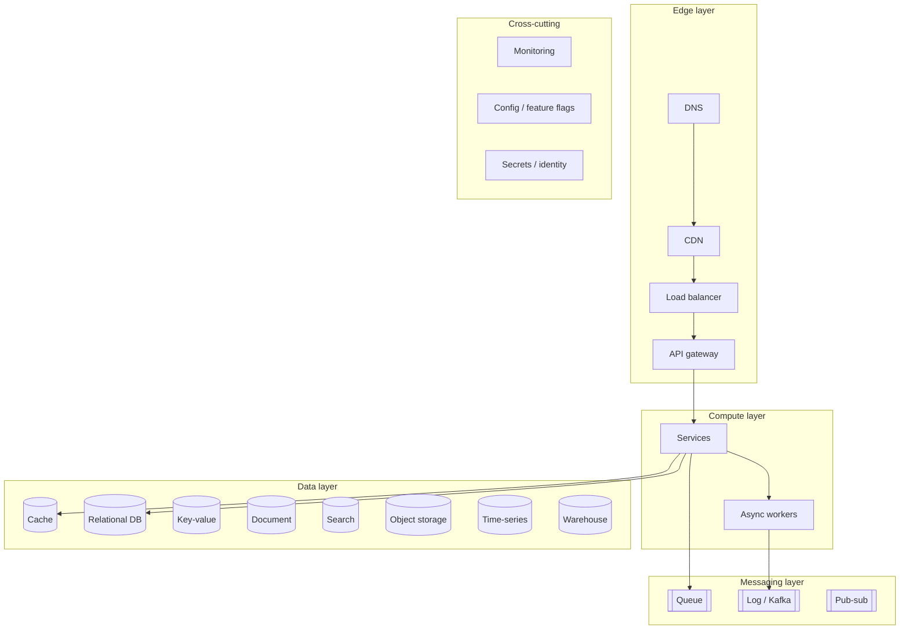
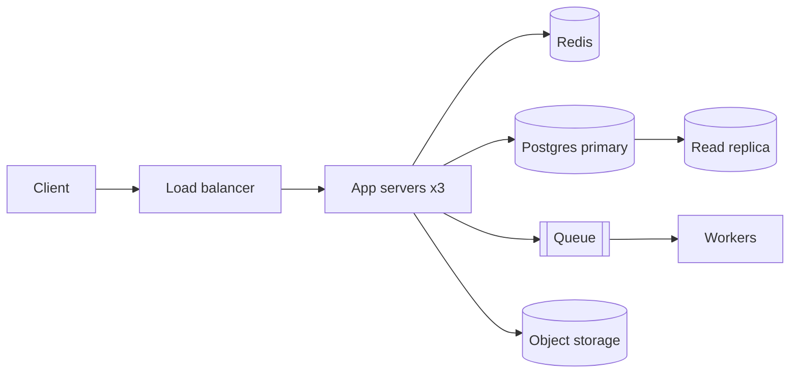

# 1.3.2 — System Design Components

> **Part 1 · Introduction · Non-functional Requirements · Chapter 2 of 7**
> The complete parts catalogue. Every box you will ever draw is on this page.

---

## 🧒 ELI5 — Explain Like I'm 5

Think of a big toolbox. Every job has a right tool.

- **Hammer** — bangs nails. *(Load balancer: spreads work across workers.)*
- **Fridge** — keeps the milk you use every day right at the front so you don't walk to the shop. *(Cache.)*
- **Filing cabinet** — keeps everything, forever, neatly, so you can find it later. *(Database.)*
- **Big garage** — stores huge bulky things you rarely touch. *(Blob storage.)*
- **Postbox** — you drop a letter and walk away; someone collects it later. *(Message queue.)*
- **Conveyor belt** — things flow past and get worked on as they go. *(Stream processor.)*
- **Index at the back of a book** — find any word fast. *(Search engine.)*
- **Reception desk** — checks everyone at the door. *(API gateway.)*
- **CCTV and alarms** — tells you when something's wrong. *(Monitoring.)*
- **Shop near your house** instead of the warehouse across the country. *(CDN.)*

You don't use every tool for every job. **Using a chainsaw to hang a picture is a bad answer**, and using a hammer on a screw is worse. Knowing which tool for which job *is* system design.

---

## The catalogue

---

## 1. Edge components

| Component | What it does | Pick it when | Cost |
|---|---|---|---|
| **DNS** | Name → IP; can do geo and weighted routing | Always | TTL means failover is slow (minutes) |
| **CDN** | Caches content at PoPs near users | Static assets, media, cacheable GETs | Invalidation across PoPs; personalisation is hard |
| **Load balancer** | Distributes requests across instances; health checks | The moment you have ≥ 2 instances | Itself needs redundancy |
| **API gateway** | AuthN, rate limiting, routing, observability | Multiple services or public API | Extra hop; chokepoint risk |
| **Reverse proxy** (NGINX/Envoy) | TLS, compression, buffering, static serving | Nearly always, often merged with LB/gateway | — |
| **WAF / DDoS protection** | Blocks malicious traffic | Public internet exposure | False positives |

---

## 2. Compute components

| Component | What it is | Pick it when | Cost |
|---|---|---|---|
| **Stateless app servers** | Your service, N identical instances | Default for request handling | Requires externalised state |
| **Async workers** | Consume from a queue, do slow work | Anything off the request path | Eventual consistency visible to users |
| **Cron / scheduler** | Time-triggered jobs | Reports, cleanup, billing runs | Needs leader election to avoid double-runs |
| **Serverless functions** | Per-invocation compute | Spiky, low-baseline, event-driven work | Cold starts; per-invocation cost; limited runtime |
| **Batch cluster** (Spark) | Large offline computation | Terabyte-scale transforms | Latency in minutes/hours |
| **Stream processor** (Flink) | Continuous computation over events | Sub-second aggregation, alerting | State management, exactly-once complexity |

---

## 3. Storage components — the decision table

| Store | Data model | Strengths | Weaknesses | Typical use |
|---|---|---|---|---|
| **Relational (Postgres, MySQL)** | Tables, rows, joins, transactions | ACID, flexible queries, mature | Vertical write ceiling; sharding is manual | Orders, users, anything with invariants |
| **Key-value (Redis, DynamoDB)** | `key → value` | Fastest; scales horizontally trivially | No joins; query only by key | Sessions, counters, hot lookups |
| **Document (MongoDB, DynamoDB doc)** | JSON documents | Flexible schema, nested data in one read | Cross-document consistency; unbounded documents | Catalogues, user profiles, CMS |
| **Wide-column (Cassandra, HBase, Bigtable)** | Partition key + clustering columns | Huge write throughput, linear scale, multi-DC | Query must match the key; no ad-hoc queries | Time-ordered event data, messaging |
| **Search (Elasticsearch, OpenSearch)** | Inverted index | Full-text, fuzzy, faceting, ranking | Not a source of truth; near-real-time only | Search, log analytics |
| **Object/blob (S3, GCS)** | `key → bytes` | Effectively unlimited, cheap, 11 nines durability | High latency; no partial update; no query | Images, video, backups, data lake |
| **Time-series (Prometheus, InfluxDB, Timescale)** | `(metric, tags, ts) → value` | Compression, downsampling, range queries | Cardinality explosions | Metrics, IoT, telemetry |
| **OLAP / warehouse (ClickHouse, BigQuery, Snowflake)** | Columnar tables | Aggregations over billions of rows | Not for point writes/reads | Analytics, dashboards, BI |
| **Graph (Neo4j)** | Nodes and edges | Multi-hop traversal | Scaling; often replaceable by adjacency lists | Social graph, fraud rings, permissions |

🎯 **Interview angle** — Choose storage from the **access pattern**, in this order: (1) how is it read? (2) how is it written? (3) how big does it get? (4) what consistency does it need? Never from familiarity. Full treatment in Part 4.

---

## 4. Caching components

| Layer | Where | Typical latency | Invalidation difficulty |
|---|---|---|---|
| Client / browser | User device | 0 | Very hard — you can't reach it |
| CDN / edge | PoP | 10–50 ms | Hard — purge APIs, versioned URLs |
| Reverse proxy | Your edge | 1–5 ms | Medium |
| Application in-process | Service memory | ~100 ns | Medium — N copies to invalidate |
| Distributed cache (Redis/Memcached) | Cache tier | 0.5–2 ms | Easiest — one place |
| Database buffer pool | Inside the database | — | Automatic |
| Materialised view | Precomputed table | Query-time | Refresh strategy |

Full treatment: [Caching](../../03-scaling-services/03-caching/) — 18 chapters, because it is the highest-yield topic in the book.

---

## 5. Messaging components

| Component | Semantics | Pick it when | Cost |
|---|---|---|---|
| **Task queue** (SQS, RabbitMQ, Celery) | Work distributed to one consumer; message deleted after ack | Background jobs, fan-out of work | Ordering is weak; duplicates possible |
| **Log** (Kafka, Pulsar, Kinesis) | Ordered, retained, replayable; many independent consumer groups | Event sourcing, multi-consumer, replay, stream processing | Partitions fix ordering and parallelism; operationally heavier |
| **Pub/sub** (Redis pub/sub, SNS, Google Pub/Sub) | Broadcast to N subscribers | Notifications, cache invalidation | Redis pub/sub has no durability — a disconnected subscriber loses messages |
| **Outbox + CDC** (Debezium) | Database change → event stream | Guaranteeing DB and stream agree | Extra moving parts |
| **WebSocket / SSE hub** | Server → client push | Live UI updates | Connection state; scaling connections |

The queue-vs-log distinction is asked constantly. One line: **a queue distributes work and forgets; a log records history and lets many independent readers replay it.** Details: [Log-based message queues](../../02-microservices-and-dataflow/02-asynchronous-communication/05-log-based-message-queues.md).

---

## 6. Coordination components

| Component | Purpose | Examples |
|---|---|---|
| **Consensus / coordination service** | Leader election, distributed locks, config, membership | ZooKeeper, etcd, Consul |
| **Service discovery** | Find healthy instances of a service | Consul, etcd, Kubernetes DNS, Eureka |
| **Distributed lock** | Mutual exclusion across processes | Redis Redlock (with caveats), etcd leases, ZooKeeper ephemeral nodes |
| **Feature flags / config** | Change behaviour without deploying | LaunchDarkly, Unleash, a config service |
| **Secrets management** | Store and rotate credentials | Vault, AWS Secrets Manager, KMS |

⚠️ Distributed locks are subtly dangerous — a lock holder can pause (GC, VM migration) past its lease and still believe it holds the lock. If correctness depends on it, you need **fencing tokens** (a monotonically increasing number the resource checks), not just a lock.

---

## 7. Observability components

| Pillar | Tool | Question it answers |
|---|---|---|
| **Metrics** | Prometheus, Datadog, CloudWatch | "Is it healthy right now?" (rate, errors, duration) |
| **Logs** | ELK/OpenSearch, Loki, Splunk | "What exactly happened to request X?" |
| **Traces** | Jaeger, Zipkin, OpenTelemetry | "Where did the 800 ms go across 9 services?" |
| **Alerting** | Alertmanager, PagerDuty | "Wake someone up — and only for real problems" |
| **Dashboards** | Grafana | "What does normal look like?" |
| **Profiling** | pprof, continuous profilers | "Which function burns the CPU?" |

The **RED** method for services (Rate, Errors, Duration) and **USE** for resources (Utilisation, Saturation, Errors) are the two acronyms to name.

---

## Choosing components: the six questions

For every box you are tempted to add:

1. **What problem does this solve that the existing boxes don't?** If none, delete it.
2. **What is the simplest thing that would work?** Start there, justify moving up.
3. **What new failure mode does it introduce?** Every box can be down.
4. **What is the operational cost?** Upgrades, backups, monitoring, expertise, on-call.
5. **What does it cost in money?** Per request, per GB, per month.
6. **What guarantee does it break?** (See the composition insight in [Chapter 1.1.1](../01-basics/01-what-is-a-system-design-interview.md).)

☠️ **The over-engineering trap.** A candidate draws Kafka, Elasticsearch, Redis, Cassandra, and a Spark cluster for a system with 100 QPS. Every box is a *liability* you must defend. The strongest answers use the **fewest** components that meet the stated NFRs, and explicitly say which components they would add at which growth trigger.

---

## The minimum viable architecture (know this cold)

For any prompt, this is the honest starting point before scale forces more:

Six components. It serves millions of users for most products. Everything else in this book is a *justified deviation* from this picture.

---

## 📋 Chapter checklist

| Skill | Ready? |
|---|---|
| Name every component in the catalogue from memory | ☐ |
| Choose a store from an access pattern in 20 seconds | ☐ |
| State the queue vs log difference in one sentence | ☐ |
| Name the three pillars of observability | ☐ |
| Draw the minimum viable architecture | ☐ |
| Justify deleting a component someone else added | ☐ |

---

**← Previous** [1.3.1 Non-functional Requirements](01-non-functional-requirements.md)
**Next →** [1.3.3 High Availability](03-high-availability.md)
