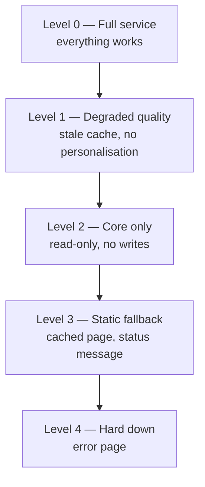

# 1.3.3 — High Availability

> **Part 1 · Introduction · Non-functional Requirements · Chapter 3 of 7**
> What availability actually means, how it is measured, and the arithmetic that governs it.

---

## 🧒 ELI5 — Explain Like I'm 5

**Availability is: "when I go to use it, does it work?"**

Imagine a shop.

- Open 365 days a year, never shut → **100% available**. Impossible in real life (someone has to restock).
- Shut for 3 days a year → about **99%**.
- Shut for 9 hours a year → about **99.9%**.
- Shut for 52 minutes a year → **99.99%**.
- Shut for 5 minutes a year → **99.999%** ("five nines"). Almost nobody achieves this.

Now the two important ideas:

**Idea 1 — chains are weak.** If getting your sandwich needs the bakery *and* the cheese shop *and* the delivery van, and each is shut 1 day a year, you can't get a sandwich on **three** days a year. **Things in a chain add up their badness.**

**Idea 2 — spares are strong.** If you have **two** bakeries, and each is shut 1 day a year, the chance *both* are shut on the same day is tiny. **Spares multiply your goodness.**

That's all of high availability: **fewer things in the chain, more spares beside each thing.**

---

## The definition and the arithmetic

$$\text{Availability} = \frac{\text{Uptime}}{\text{Uptime} + \text{Downtime}} = \frac{\text{MTBF}}{\text{MTBF} + \text{MTTR}}$$

- **MTBF** — mean time between failures (how often it breaks)
- **MTTR** — mean time to recovery (how long it stays broken)

🎯 **The insight everyone misses:** availability improves *just as much* from reducing MTTR as from increasing MTBF — and **reducing MTTR is far easier**. You cannot stop hardware failing. You *can* make failover automatic and cut recovery from 30 minutes to 30 seconds. Most real availability work is MTTR work: health checks, automated failover, fast rollback, good runbooks, good alerting.

### The nines table — memorise this

| Availability | Per year | Per month | Per week | Per day |
|---|---|---|---|---|
| 90% ("one nine") | 36.5 days | 72 h | 16.8 h | 2.4 h |
| 99% | 3.65 days | 7.2 h | 1.68 h | 14.4 min |
| 99.5% | 1.83 days | 3.6 h | 50.4 min | 7.2 min |
| 99.9% ("three nines") | 8.77 h | 43.8 min | 10.1 min | 1.44 min |
| 99.95% | 4.38 h | 21.9 min | 5.04 min | 43.2 s |
| 99.99% ("four nines") | 52.6 min | 4.38 min | 1.01 min | 8.64 s |
| 99.999% ("five nines") | 5.26 min | 26.3 s | 6.05 s | 864 ms |

**Quick mental trick:** 99.9% ≈ **43 minutes/month**. Each extra nine divides by 10. So 99.99% ≈ 4.3 min/month, 99.999% ≈ 26 s/month.

⚖️ **Each nine costs roughly 3–10× more than the last.** Going 99.9% → 99.99% typically means multi-AZ everything, automated failover, and 24/7 on-call. 99.99% → 99.999% means multi-region active-active, and it usually costs more than the downtime it prevents. **Most products should target 99.9%–99.99% and spend the savings elsewhere.** Saying that shows commercial judgement.

---

## Serial dependencies multiply (the chain)

If a request must traverse N components in sequence, and each is independently available with probability `a_i`:

$$A_{\text{serial}} = \prod_{i=1}^{N} a_i$$

| Components in path | Each at 99.9% | Result | Downtime/year |
|---|---|---|---|
| 1 | 99.9% | 99.9% | 8.8 h |
| 3 | 99.9% | 99.7% | 26.3 h |
| 5 | 99.9% | 99.5% | 43.8 h |
| 10 | 99.9% | 99.0% | 87.6 h |
| 20 | 99.9% | 98.0% | 175 h |

☠️ **This is the hidden cost of microservices.** Splitting a monolith into 10 services on the critical path drops availability from 99.9% to 99.0% — a **10× increase in downtime** — unless every hop gets timeouts, retries, circuit breakers, and fallbacks. This is the strongest technical argument against gratuitous service decomposition, and a great thing to say out loud.

---

## Redundancy adds nines (the spares)

For N redundant components where **any one** suffices, with individual unavailability `u = 1 − a`:

$$A_{\text{parallel}} = 1 - u^{N}$$

| Redundancy | Each at 99% | Combined |
|---|---|---|
| 1 | 99% | 99% |
| 2 | 99% | 99.99% |
| 3 | 99% | 99.9999% |

Two 99% components in parallel give 99.99%. This is why redundancy is the primary tool.

### ⚠️ The independence assumption is usually false

The formula assumes failures are **independent**. In reality they correlate:

| Correlated failure | Why redundancy didn't help |
|---|---|
| Same rack / same power feed | One PDU dies, both replicas die |
| Same availability zone | AZ-wide network event |
| Same deploy | A bad build goes to all replicas |
| Same config | One bad config push, global outage |
| Same certificate | Expires everywhere simultaneously |
| Same dependency | All replicas call the same failing database |
| Overload | Replica 1 dies, its traffic kills replica 2, cascade |

🎯 **Interview angle** — "Three replicas gives me 99.9999% *if failures are independent*, which they aren't. My real risks are correlated: same-AZ power, same deploy, and cascading overload. So I'll spread across AZs, do staged rollouts with automatic rollback, and provision N+2 so losing one replica doesn't overload the rest." That paragraph is worth more than any diagram.

**Correlated-failure countermeasures:** spread across failure domains (rack → AZ → region), stagger deploys with canaries, stagger certificate expiry, use different upstream providers for critical paths (e.g. two DNS providers), and provision for N−1 or N−2 capacity so failover doesn't cause overload.

---

## Availability of what, exactly?

"The system is 99.9% available" is ambiguous. Specify:

| Dimension | Question |
|---|---|
| **Which path?** | Read path and write path usually have different targets |
| **Measured where?** | Server-side, load balancer, or real user? (Real-user is honest, server-side flatters) |
| **What counts as down?** | 5xx only? Latency > 1 s? Wrong results? |
| **Over what window?** | Rolling 28 days is standard; a monthly reset lets you game it |
| **Whose requests?** | 99.9% overall can hide 100% failure for one tenant |

**Partial availability** is the useful frame: modern systems rarely go fully down; they degrade. Measure *fraction of successful requests*, not *minutes of total outage*. That is exactly what an error budget counts.

---

## Degradation levels — design them explicitly

Worked example — an e-commerce site:

| Level | Behaviour | Triggered by |
|---|---|---|
| 0 | Personalised recommendations, live inventory, reviews | Normal |
| 1 | Generic recommendations, cached inventory counts | Recommendation service down |
| 2 | Browse and buy work; reviews and recommendations hidden | Multiple non-critical services down |
| 3 | Read-only catalogue from CDN, "checkout temporarily unavailable" | Database primary failover in progress |
| 4 | Static maintenance page with status link | Region loss |

☠️ Systems that only know "up" and "down" fail catastrophically. **Design degradation levels explicitly** and say which dependency drops you to which level. This is one of the highest-value things to mention in a wrap-up.

---

## RTO and RPO

| Term | Question | Determined by |
|---|---|---|
| **RTO** — Recovery Time Objective | How long until service is restored? | Failover automation, runbooks, practice |
| **RPO** — Recovery Point Objective | How much data may be lost? | Replication mode and backup frequency |

| Setup | RPO | RTO |
|---|---|---|
| Nightly backup only | Up to 24 h | Hours |
| Async replica, manual failover | Seconds to minutes | 10–60 min |
| Async replica, automated failover | Seconds | 30 s – 5 min |
| Synchronous replica | **0** | Seconds |
| Multi-region active-active | ~0 | Seconds (DNS/anycast) |

⚖️ **RPO = 0 requires synchronous replication, which adds a full round trip to every write.** Cross-region synchronous replication adds 50–150 ms per write. That is the price of losing nothing, and it is often the wrong price to pay for anything except money movement.

---

## The SPOF audit — do this on every diagram

Walk your architecture and circle every component that exists exactly **once**. Then for each, answer: *what happens when it dies?*

| Usual suspects | Fix |
|---|---|
| Single database primary | Replica + automated failover; accept the failover window |
| Single load balancer | Redundant LBs; DNS/anycast in front |
| Single cache node | Cluster with replicas; and the app must survive a total cache loss |
| Single queue broker | Clustered broker with replicated partitions |
| One availability zone | Spread across ≥ 3 AZs |
| A shared config service | Cache config locally; fail with last-known-good |
| A single third-party API | Timeout + fallback + cached response; a second provider if critical |
| DNS provider | Secondary DNS provider |
| The certificate | Automated renewal with alerting well before expiry |
| **The deploy pipeline** | Often forgotten: if you can't deploy, you can't fix |

🎯 Doing this audit out loud during wrap-up — "let me walk the diagram for single points of failure" — is a reliable way to end an interview strongly.

---

## 📋 Chapter checklist

| Skill | Ready? |
|---|---|
| Recite the nines table (year and month) | ☐ |
| Explain availability = MTBF/(MTBF+MTTR) and why MTTR is the lever | ☐ |
| Compute serial availability for 5 × 99.9% | ☐ |
| Compute parallel availability for 2 × 99% | ☐ |
| Name five correlated-failure sources | ☐ |
| Define RTO and RPO and the cost of RPO = 0 | ☐ |
| Design four degradation levels for a product | ☐ |
| Run a SPOF audit on any diagram | ☐ |

---

**← Previous** [1.3.2 System Design Components](02-system-design-components.md)
**Next →** [1.3.4 How to Achieve High Availability](04-how-to-achieve-high-availability.md)
