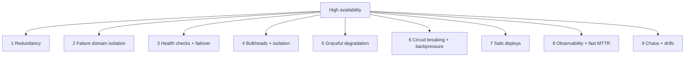

# 1.3.4 — How to Achieve High Availability

> **Part 1 · Introduction · Non-functional Requirements · Chapter 4 of 7**
> The techniques. Previous chapter was the theory; this is what you actually build.

---

## 🧒 ELI5 — Explain Like I'm 5

You want the shop to (almost) never be shut. Here's how, in plain steps:

1. **Have spares.** Two tills, not one. Two staff, not one. *(Redundancy.)*
2. **Put the spares in different places.** If both tills are on the same broken power socket, you have one till. *(Failure domains.)*
3. **Notice quickly when something breaks.** A bell that rings when a till stops working. *(Health checks.)*
4. **Switch over automatically.** The moment till 1 dies, customers are sent to till 2 — no manager needed. *(Automatic failover.)*
5. **Don't let one bad customer ruin everyone's day.** If someone orders 500 sandwiches, put them in their own line. *(Bulkheads and rate limits.)*
6. **If the bread machine is broken, still sell drinks.** Don't shut the whole shop. *(Graceful degradation.)*
7. **Stop asking the broken machine.** If the bread machine has failed ten times in a row, stop trying for five minutes; it just wastes time. *(Circuit breaker.)*
8. **Practise the fire drill.** Deliberately turn off a till during a quiet hour and check the plan works. *(Chaos engineering.)*
9. **Change one thing at a time.** Don't repaint the whole shop at once — do one wall, check nobody hates it. *(Canary deploys.)*

That's the whole playbook.

---

## The nine techniques



---

## 1. Redundancy

**N + K provisioning:** run enough capacity that losing K instances still serves peak load.

| Model | Meaning | Cost | Failover time |
|---|---|---|---|
| **Active–active** | All instances serve traffic | Efficient — spare capacity is used | Instant (LB removes the dead one) |
| **Active–passive (hot standby)** | Standby is running, not serving | ~2× | Seconds |
| **Active–passive (warm)** | Standby needs startup | ~1.2× | Minutes |
| **Cold standby** | Provisioned on demand | Cheapest | Tens of minutes |

**Prefer active–active** wherever state allows: the spare capacity is doing useful work, and — crucially — you *know it works*, because it is serving traffic right now. An untested standby is a hypothesis, not a plan.

⚠️ **Capacity after failure.** With 3 instances at 70% utilisation, losing one puts the remaining two at 105% — they die too, and you have a cascade. **Size for N−1 (or N−2) at peak.** With 3 nodes, run at ≤ 66%; with 5, ≤ 80%.

---

## 2. Failure domain isolation

Spread redundancy across boundaries that fail independently.

```
Process  →  Host  →  Rack  →  Availability Zone  →  Region  →  Cloud provider
    weakest isolation ─────────────────────────────► strongest
```

| Level | Protects against | Typical cost |
|---|---|---|
| Multi-process | Process crash, memory leak | Free |
| Multi-host | Hardware failure | Free (you needed N instances anyway) |
| Multi-rack | Power/switch failure | Free with rack-aware placement |
| **Multi-AZ** | Datacenter power, cooling, network | Small cross-AZ data transfer cost — **this is the default for production** |
| Multi-region | Regional disaster, provider region outage | High: 2× infrastructure, replication lag, hard consistency |
| Multi-cloud | Provider-wide outage | Very high; usually not worth it |

**Cell-based architecture** (used at AWS, Slack, and others) is the advanced form: partition users into independent "cells," each a full stack serving a subset of customers. A bad deploy or poison request takes down one cell — say 1/20th of users — not everyone. Mentioning cells in a senior interview is a strong signal.

---

## 3. Health checks and automatic failover

**Two kinds of health check, and confusing them causes outages:**

| Check | Question | On failure |
|---|---|---|
| **Liveness** | Is the process wedged? | Restart it |
| **Readiness** | Can it serve traffic *right now*? | Remove from load balancer, don't restart |

☠️ A common outage: the readiness check calls the database. The database has a blip → **every instance simultaneously reports unready** → the load balancer has zero healthy targets → total outage from a partial degradation. **Health checks should test the instance, not its dependencies.** If you must check dependencies, use it for a *degraded* signal, not removal — and configure the load balancer to fail open when *all* targets are unhealthy (serve to everyone rather than no one).

**Failover components:**

| Element | Detail |
|---|---|
| Detection | 2–3 consecutive failed checks at 5 s intervals ≈ 10–15 s detection |
| Election | Consensus (Raft) or an external coordinator (etcd, ZooKeeper) |
| Promotion | Standby becomes primary; must be **fenced** so the old primary can't keep writing |
| Redirection | Update DNS (slow, TTL-bound), a VIP, or a proxy (fast) — prefer a proxy such as PgBouncer/ProxySQL/Envoy |
| Verification | Confirm and alert; never silently flap |

⚠️ **Split brain** is the danger: the old primary is alive but partitioned, and both nodes accept writes. Prevent with **quorum** (a majority must agree) and **fencing** (STONITH, lease expiry, or a monotonic epoch number the storage layer checks). Never build failover on a simple heartbeat between two nodes — two nodes cannot form a majority.

---

## 4. Bulkheads and isolation

Named after ship compartments: a hole in one doesn't sink the vessel.

| Bulkhead | Implementation |
|---|---|
| **Separate thread/connection pools per dependency** | A slow payment API exhausts only its own pool, not the shared one |
| **Separate instance groups per tenant tier** | Free-tier traffic can't starve enterprise |
| **Separate read and write paths** | A write outage still allows browsing |
| **Per-endpoint rate limits** | An expensive `/search` can't consume all capacity |
| **Queue per priority** | Critical work isn't stuck behind a bulk backfill |

☠️ **The shared thread pool disaster:** service A calls B and C from one 200-thread pool. C gets slow (5 s instead of 50 ms). Within seconds, all 200 threads are blocked on C. Calls to B now fail too — **even though B is perfectly healthy.** One slow dependency took out an unrelated feature. Separate pools would have contained it. This is a great story to tell in an interview.

---

## 5. Graceful degradation

Decide, in advance, what to drop.

| Technique | Example |
|---|---|
| **Serve stale** | Cache expired and the origin is down → serve stale with a "last updated" note (`stale-if-error`) |
| **Default response** | Recommendation service down → show the globally popular list |
| **Feature flag kill switch** | Disable the expensive feature instantly, no deploy |
| **Read-only mode** | Database primary failing over → browsing works, writes are queued or rejected clearly |
| **Shed load** | Reject the lowest-value traffic first (bots, then free tier, then non-critical endpoints) |
| **Reduce quality** | Lower video bitrate, fewer feed items, smaller images |

**Load shedding is the counter-intuitive one:** when overloaded, **rejecting 20% of requests fast keeps 80% healthy**, whereas accepting everything makes 100% time out. Rejecting early (at the edge, before work is done) is the cheapest possible failure. Say "I'd shed load at the gateway with priority classes" and you sound like someone who has been paged.

---

## 6. Circuit breaking and backpressure

**Circuit breaker** — stop calling a failing dependency so you don't waste resources and so it can recover.

```
CLOSED ──(failure rate > 50% over 20 reqs)──► OPEN
OPEN ──(after 30 s cool-down)──► HALF-OPEN
HALF-OPEN ──(probe succeeds)──► CLOSED
HALF-OPEN ──(probe fails)──► OPEN
```

**Backpressure** — tell upstream to slow down instead of silently queueing forever. Bounded queues that reject when full are backpressure; unbounded queues are a way to convert a latency problem into an out-of-memory crash.

**Timeouts** — every network call needs one, and it must be *shorter* than the caller's own deadline. Propagate deadlines: if the client has 1 s and 300 ms is already spent, the downstream call gets 700 ms, not a fresh 1 s.

**Retries** — with exponential backoff **and jitter**, a retry budget (e.g. retries ≤ 10% of requests), and only for idempotent operations. Retries without these amplify an incident: 3 retries turns a struggling service's load into 4×.

Full detail: [Timeout](../../02-microservices-and-dataflow/01-synchronous-communication/05-timeout.md), [Retries](../../02-microservices-and-dataflow/01-synchronous-communication/06-retries.md), [Circuit Breaker](../../02-microservices-and-dataflow/01-synchronous-communication/07-circuit-breaker.md).

---

## 7. Safe deploys — because most outages are self-inflicted

🔢 Industry surveys and public postmortems consistently attribute the majority of outages to **changes** — deploys, config pushes, certificate and credential changes — not hardware.

| Practice | Effect |
|---|---|
| **Canary** — 1% → 5% → 25% → 100%, with automatic rollback on error-rate regression | Limits blast radius; catches most bad builds |
| **Blue-green** | Instant rollback by switching traffic back |
| **Feature flags** | Decouple deploy from release; disable without redeploying |
| **Staged config rollout** | Config is code — never push it globally at once |
| **Schema migrations in phases** | Expand → backfill → contract; never a breaking migration in one step |
| **Automated rollback** | Rollback triggered by SLO breach, not by a human noticing |
| **Deploy freeze windows** | No risky changes during peak business events |

The **expand/contract** migration pattern is worth knowing precisely: (1) add the new column, nullable; (2) write to both old and new; (3) backfill; (4) read from new; (5) stop writing old; (6) drop old. Each step is independently reversible.

---

## 8. Observability and fast MTTR

Because availability = MTBF/(MTBF+MTTR), and MTTR is the tractable half.

| Practice | Effect on MTTR |
|---|---|
| Alert on **symptoms** (SLO burn), not causes (CPU) | Fewer false pages, faster relevance |
| Dashboards that answer "what's broken?" in 30 s | Cuts diagnosis time drastically |
| Distributed tracing with a request ID everywhere | Turns "somewhere in 12 services" into "here" |
| Runbooks linked from every alert | No 3 a.m. improvisation |
| Automated remediation for known failures | MTTR → seconds |
| Blameless postmortems with action items | Raises MTBF over time |

**Alert on burn rate**, not raw error counts: "we are consuming the monthly error budget 14× faster than sustainable" is actionable; "errors > 100" is noise.

---

## 9. Chaos engineering and drills

You do not know your failover works until you have done it on purpose.

| Drill | Question it answers |
|---|---|
| Kill a random instance | Does the LB notice? Does capacity hold? |
| Kill the database primary | Does failover complete within RTO? |
| Add 200 ms latency to a dependency | Do timeouts and circuit breakers fire correctly? |
| Fill a disk | Does it degrade or corrupt? |
| Expire a certificate in staging | Does anything alert *before* production? |
| Take an AZ offline | Does the remaining capacity cope? |
| **Restore from backup** | Does the backup actually restore? (Untested backups fail surprisingly often) |
| GameDay: full region failover | Does the runbook match reality? |

Start in staging, then move to production during low traffic with an abort switch. **A backup you have never restored is not a backup.**

---

## Putting it together — an availability budget for a design

| Layer | Technique | Target |
|---|---|---|
| DNS | Two providers, low TTL | 99.999% |
| CDN | Provider SLA + origin fallback | 99.99% |
| LB | Multi-AZ, managed | 99.99% |
| App tier | N+2, 3 AZs, stateless, canary deploys | 99.99% |
| Cache | Cluster + must survive total loss | 99.9% (app degrades, not fails) |
| Database | Primary + 2 replicas, automated failover, quorum | 99.95% |
| **End-to-end** | With degradation for cache and non-critical services | **~99.9%** |

Writing this table in a wrap-up is a very strong close: it shows you can reason about availability *quantitatively* rather than just naming techniques.

---

## 📋 Chapter checklist

| Skill | Ready? |
|---|---|
| Name all nine techniques | ☐ |
| Explain N−1 capacity sizing with the 3-node example | ☐ |
| Distinguish liveness and readiness, and the dependency-check trap | ☐ |
| Explain split brain and two preventions | ☐ |
| Tell the shared-thread-pool bulkhead story | ☐ |
| Justify load shedding | ☐ |
| Describe expand/contract migration | ☐ |
| List five chaos drills | ☐ |

---

**← Previous** [1.3.3 High Availability](03-high-availability.md)
**Next →** [1.3.5 Tech Stacks to Achieve High Availability](05-tech-stacks-for-high-availability.md)
