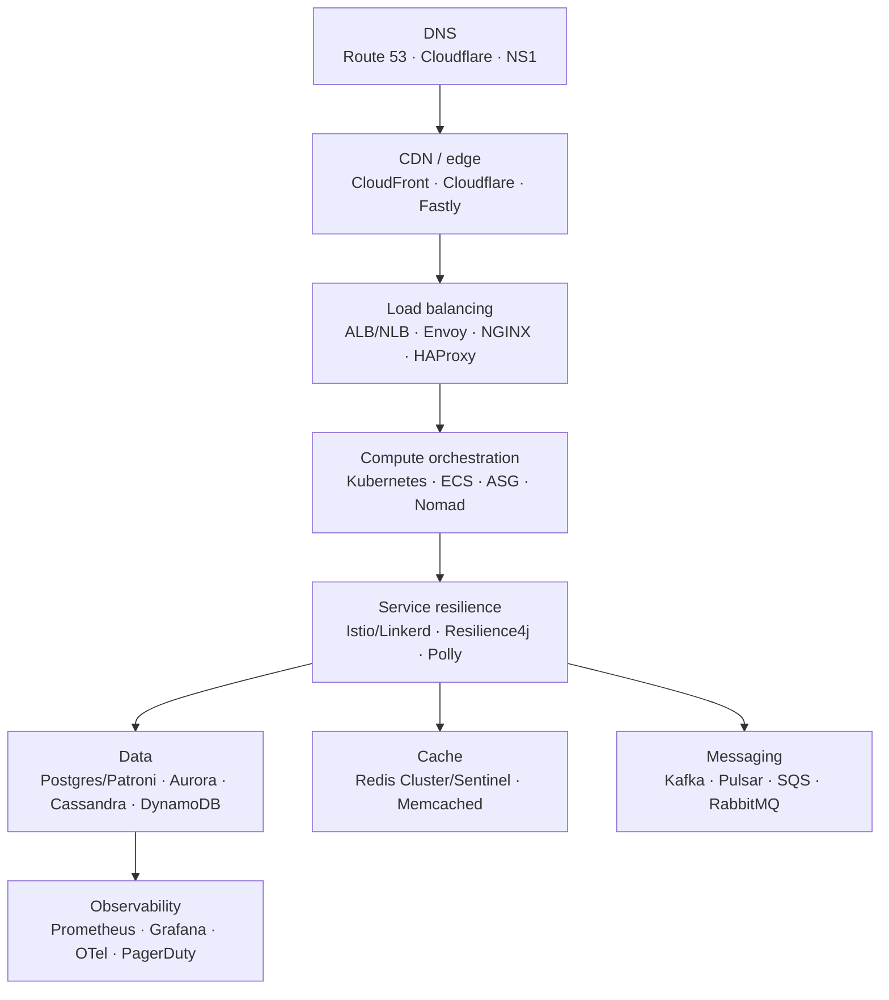

# 1.3.5 — Tech Stacks to Achieve High Availability

> **Part 1 · Introduction · Non-functional Requirements · Chapter 5 of 7**
> The concrete technologies, layer by layer, and what each actually guarantees.

---

## 🧒 ELI5 — Explain Like I'm 5

Last chapter was *"have spares, notice breakages, switch over automatically."*

This chapter is the **shopping list**: which actual products do those jobs.

- Need a traffic director that never sleeps? → a cloud load balancer, or NGINX/Envoy.
- Need your address book to keep working? → DNS with health checks (Route 53, Cloudflare).
- Need many copies of your app running? → Kubernetes, or an auto-scaling group.
- Need your filing cabinet to survive a fire? → a database with replicas and automatic failover.
- Need your postbox to never lose letters? → Kafka with three copies of every letter.
- Need to know the moment something breaks? → Prometheus + Grafana + PagerDuty.

Same jobs as last chapter. This is just the brand names, and — more importantly — **what each one promises and where each one lies to you**.

---

## Layer by layer



---

## 1. DNS layer

| Technology | HA mechanism | Notes |
|---|---|---|
| **Route 53** | Anycast, health checks, failover/latency/weighted routing | 100% SLA on the DNS service itself |
| **Cloudflare DNS / NS1** | Anycast, health-checked records | Very fast propagation |
| **Two providers** | Secondary DNS zone transfer | The 2016 Dyn outage is the case study for why |

⚠️ **DNS failover is slow and unreliable for fast recovery.** TTLs are honoured inconsistently by resolvers and some clients cache far longer than told. Use DNS for *regional* failover (minutes), never for instance-level failover (use a load balancer, which is seconds).

---

## 2. CDN / edge

| Technology | HA mechanism |
|---|---|
| **CloudFront / Cloudflare / Fastly / Akamai** | Hundreds of PoPs; automatic origin failover; origin shielding |
| `stale-if-error` | Serve stale content when the origin returns 5xx — free degradation |
| Multi-origin failover | Primary origin → secondary origin group |

`Cache-Control: max-age=60, stale-while-revalidate=600, stale-if-error=86400` is a one-line availability upgrade: the edge keeps serving for a day if your origin dies.

---

## 3. Load balancing

| Technology | Layer | HA mechanism | Notes |
|---|---|---|---|
| **AWS ALB / NLB, GCP LB** | 7 / 4 | Managed, multi-AZ, scales itself | NLB handles millions of connections; ALB does path routing |
| **Envoy** | 7 | Health checks, outlier detection, retries, circuit breaking | The substrate for most meshes; extremely capable |
| **HAProxy** | 4/7 | Active/passive with keepalived + VIP | Battle-tested, very fast |
| **NGINX** | 7 | Upstream health checks, `proxy_next_upstream` | Also a reverse proxy and static server |
| **MetalLB / keepalived** | 2/3 | VRRP virtual IP failover | On-prem VIP failover |

**Outlier detection** (Envoy) deserves a mention: it *automatically ejects* an instance that returns consecutive 5xx or has elevated latency, without any explicit health-check endpoint. That is passive health checking, and it catches failures active checks miss.

---

## 4. Compute orchestration

| Technology | HA mechanism |
|---|---|
| **Kubernetes** | ReplicaSets maintain desired count; liveness/readiness probes; `PodDisruptionBudget`; `topologySpreadConstraints` across AZs; rolling updates with `maxUnavailable`; HPA for load |
| **AWS Auto Scaling Groups** | Health-check replacement, multi-AZ distribution, instance refresh |
| **ECS / Fargate / Cloud Run** | Managed task health and placement |
| **Nomad** | Similar scheduling and health model |

Kubernetes specifics worth naming in an interview:

```yaml
topologySpreadConstraints:      # force spread across AZs
  - maxSkew: 1
    topologyKey: topology.kubernetes.io/zone
    whenUnsatisfiable: DoNotSchedule
---
podDisruptionBudget:            # protect against voluntary disruption
  minAvailable: 2
---
readinessProbe:                 # remove from service without restarting
  httpGet: { path: /readyz, port: 8080 }
  periodSeconds: 5
  failureThreshold: 2
livenessProbe:                  # restart a wedged process
  httpGet: { path: /livez, port: 8080 }
  periodSeconds: 10
  failureThreshold: 3
```

Note `/readyz` and `/livez` are **different endpoints** — that distinction is the point of [Chapter 1.3.4](04-how-to-achieve-high-availability.md#3-health-checks-and-automatic-failover).

---

## 5. Service-level resilience

| Technology | Provides |
|---|---|
| **Istio / Linkerd (service mesh)** | mTLS, retries, timeouts, circuit breaking, traffic shifting, locality-aware routing — all without app code |
| **Resilience4j** (Java), **Polly** (.NET), **gobreaker** (Go), **Hystrix** (legacy) | In-process circuit breakers, bulkheads, rate limiters, retries |
| **gRPC** built-ins | Deadlines propagated across hops, retry policies, health checking protocol |

⚖️ **Mesh vs library:** a mesh gives uniform policy across polyglot services with no code changes, at the cost of a sidecar per pod (memory, ~1 ms latency, operational complexity). A library is cheaper and language-specific. For a handful of services in one language, use a library; for dozens across languages, use a mesh.

---

## 6. Databases

| Technology | HA mechanism | Failover time | RPO |
|---|---|---|---|
| **PostgreSQL + Patroni** | Streaming replication, etcd/Consul-backed leader election, automatic promotion | 10–30 s | Seconds (async) or 0 (sync) |
| **PostgreSQL + repmgr / pg_auto_failover** | Similar, lighter | 15–60 s | Seconds |
| **AWS Aurora** | Storage replicated 6× across 3 AZs, decoupled from compute | < 30 s | ~0 |
| **AWS RDS Multi-AZ** | Synchronous standby in another AZ | 60–120 s | 0 |
| **MySQL + Orchestrator / Group Replication** | Topology management and auto-failover | 10–60 s | Seconds |
| **MongoDB replica set** | Raft-like election among ≥ 3 members | ~10 s | Depends on write concern |
| **Cassandra** | Masterless; tunable quorum; no failover needed | 0 (no leader) | Tunable |
| **DynamoDB** | Fully managed, multi-AZ by default; global tables for multi-region | Transparent | ~0 |
| **CockroachDB / Spanner / YugabyteDB** | Raft consensus per range; survives node and zone loss | Seconds | 0 |

🎯 **Interview-worthy facts:**
- **Odd numbers of voting members.** Quorum needs a majority; 2 nodes cannot form one, so 2-node "HA" is worse than useless — it can't distinguish failure from partition.
- **Aurora's trick:** it pushes replication into the storage layer, so replicas share storage and failover doesn't require replaying WAL. That is why its failover is faster than vanilla Postgres.
- **Connection failover needs a proxy.** Applications hold connections; after promotion they must be routed to the new primary. Use PgBouncer, ProxySQL, RDS Proxy, or a mesh — don't rely on DNS.
- **Write concern is the RPO dial.** MongoDB `w:1` risks losing acknowledged writes on failover; `w:majority` doesn't, and costs latency.

---

## 7. Caching

| Technology | HA mechanism | Caveats |
|---|---|---|
| **Redis Sentinel** | Monitors a primary + replicas, elects and promotes | Needs ≥ 3 sentinels for quorum |
| **Redis Cluster** | 16,384 hash slots sharded across primaries, each with replicas | Multi-key ops limited to one slot; use hash tags |
| **Redis Enterprise / ElastiCache / MemoryDB** | Managed failover; MemoryDB adds durable multi-AZ log | MemoryDB trades some latency for durability |
| **Memcached** | No built-in replication; clients shard with consistent hashing | Simple, and node loss = partial cache loss (acceptable) |

⚠️ **Redis replication is asynchronous**, so a failover can lose recent writes. That is fine for a cache and **not fine** for a distributed lock or a counter you treat as a source of truth. If a Redis value is authoritative, you have a durability requirement Redis wasn't chosen for.

**The rule that matters more than the technology:** your application must survive **total** cache loss. Test it. If a cold cache means the database gets 20× its normal load and dies, you don't have a cache — you have a hidden single point of failure. Mitigations: request coalescing, staged warm-up, and a database that can survive the miss storm. See [Cold Start](../../03-scaling-services/03-caching/14-cold-start.md).

---

## 8. Messaging

| Technology | HA mechanism | Guarantee |
|---|---|---|
| **Kafka** | Partition replicas; `min.insync.replicas`; `acks=all`; leader election per partition | No loss with RF=3, `min.insync=2`, `acks=all` |
| **Pulsar** | Segment-level replication via BookKeeper; broker/storage separation | Similar, faster rebalancing |
| **RabbitMQ** | Quorum queues (Raft) — classic mirrored queues are deprecated | Use quorum queues |
| **AWS SQS** | Fully managed, replicated across AZs | At-least-once; FIFO queues for ordering |
| **AWS Kinesis / Google Pub/Sub** | Managed, multi-AZ | At-least-once |

**The Kafka durability triple**, worth quoting exactly: `replication.factor=3`, `min.insync.replicas=2`, `acks=all`. That combination survives one broker loss with zero acknowledged-message loss. With `acks=1` you lose messages on leader failure; with `min.insync.replicas=1` the triple is decorative.

---

## 9. Observability and incident response

| Technology | Role |
|---|---|
| **Prometheus + Alertmanager** | Metrics, SLO burn-rate alerts |
| **Grafana** | Dashboards |
| **OpenTelemetry + Jaeger/Tempo** | Distributed tracing, vendor-neutral instrumentation |
| **Loki / OpenSearch / Splunk** | Log aggregation and search |
| **PagerDuty / Opsgenie** | On-call routing and escalation |
| **Statuspage** | Customer communication — part of availability from the user's view |

⚠️ **Monitor the monitoring.** If Prometheus runs in the cluster it monitors, an outage blinds you exactly when you need sight. Run at least a minimal external synthetic check (Pingdom, an uptime probe from another provider) — it's cheap insurance.

---

## Reference stacks

### Small team, 99.9% target
```
Cloudflare (DNS + CDN + WAF)
  → managed LB
  → 3 app containers across 2 AZs (ECS / Cloud Run / small EKS)
  → managed Postgres Multi-AZ (RDS/Cloud SQL)
  → managed Redis (ElastiCache)
  → managed queue (SQS)
  → managed observability (Datadog / Grafana Cloud) + PagerDuty
```
Almost no operational work. This genuinely reaches 99.9%.

### Mid-size, 99.95–99.99%
```
Route 53 (health-checked, failover routing) + CloudFront
  → ALB (multi-AZ)
  → Kubernetes, 3 AZs, PDBs, topology spread, HPA, canary via Argo Rollouts
  → Aurora (writer + 2 readers) + RDS Proxy
  → Redis Cluster with replicas
  → MSK/Kafka RF=3, min.insync=2
  → Prometheus + Grafana + OTel + PagerDuty, external synthetics
```

### Global, 99.99%+
```
Anycast / GeoDNS with health checks; multi-region active-active
  → per-region full stack, cell-partitioned
  → globally distributed database (Spanner / CockroachDB / DynamoDB global tables)
    or region-homed data with async cross-region replication
  → Kafka MirrorMaker / cross-region replication
  → automated regional evacuation, practised quarterly
```

---

## The buy-vs-build judgement

⚖️ **Default to managed services.** A managed Postgres with Multi-AZ gives you replication, backups, patching, and failover for a modest premium. Self-managing the same thing costs an engineer's ongoing attention — and, empirically, the self-managed version is usually *less* available, because the automation was written once and never drilled.

Build it yourself only when: you have a genuine scale or cost crossover, a hard requirement no managed service meets, or a regulatory constraint. In an interview, "I'd use managed X, and here's the specific point at which self-hosting starts to pay" is a mature answer, not a lazy one.

---

## 📋 Chapter checklist

| Skill | Ready? |
|---|---|
| Name an HA technology for each of the nine layers | ☐ |
| Explain why DNS failover is unsuitable for fast recovery | ☐ |
| Quote the Kafka durability triple | ☐ |
| Explain why 2-node HA is broken | ☐ |
| Explain Aurora's storage-layer replication advantage | ☐ |
| Give the Kubernetes primitives for AZ spread and disruption budgets | ☐ |
| Argue mesh vs library for resilience | ☐ |
| Say why the app must survive total cache loss | ☐ |

---

**← Previous** [1.3.4 How to Achieve High Availability](04-how-to-achieve-high-availability.md)
**Next →** [1.3.6 Latency](06-latency.md)
