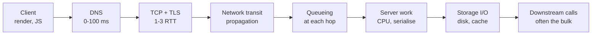

# 1.3.6 — Latency

> **Part 1 · Introduction · Non-functional Requirements · Chapter 6 of 7**
> Where time actually goes, why the tail is what matters, and how to cut it.

---

## 🧒 ELI5 — Explain Like I'm 5

**Latency is how long you wait.** You press the button, and *this* long later, something happens.

Three things make you wait:

1. **Distance.** If your friend is in the next room, shouting takes no time. If they're in Australia, even a phone call has a tiny delay — light itself takes time to travel. You cannot make light faster. You can only **move your friend closer.**
2. **Queues.** If ten people are ahead of you at the ice cream van, you wait for all ten first. The busier the van, the worse it gets — and it gets worse *much faster than you'd expect* near the end. At "almost full", one extra person adds a huge wait.
3. **Actual work.** Making the ice cream takes however long it takes.

And here's the sneaky bit that everyone gets wrong:

**Averages lie.** If nine people wait 1 second and one person waits 100 seconds, the "average" is about 11 seconds — a number *nobody actually experienced*. The one person who waited 100 seconds is the one who complains, writes a bad review, and never comes back.

So we don't measure the average. We measure **"how bad is it for the unluckiest 1 in 100?"** That's called **p99**.

---

## Percentiles, and why averages are banned

| Metric | Meaning |
|---|---|
| **p50 (median)** | Half of requests are faster than this. The typical experience. |
| **p95** | 1 in 20 requests is slower than this. |
| **p99** | 1 in 100 is slower. The standard SLO target. |
| **p99.9** | 1 in 1,000. Matters when a page makes many calls. |
| **max** | Your worst case. Usually a timeout, a GC pause, or a cold start. |

Two systems with identical means:

| | System A | System B |
|---|---|---|
| Mean | 100 ms | 100 ms |
| p50 | 95 ms | 20 ms |
| p99 | 120 ms | 2,400 ms |
| Experience | Consistently fine | Feels broken 1% of the time |

☠️ **Never report an average latency.** Averages hide multimodality (cache hit vs miss are two different populations), are dominated by outliers, and cannot be averaged across services meaningfully.

⚠️ **Percentiles do not average or add.** You cannot compute a fleet p99 by averaging per-server p99s — you need the underlying distribution (histograms, then merge buckets). Prometheus histograms and HDR histograms exist for exactly this reason.

### Tail amplification — the reason p99 matters more than you think

If one page makes **N parallel** backend calls and each independently has p99 = 1 s:

$$P(\text{at least one slow call}) = 1 - 0.99^N$$

| N calls | Probability the page is slow |
|---|---|
| 1 | 1% |
| 10 | 9.6% |
| 50 | 39.5% |
| 100 | **63.4%** |
| 200 | 86.6% |

🎯 **With 100 dependencies, your service's p99 becomes your page's p50.** This is why fan-out must be bounded and why the tail is a first-class design concern. Say this in an interview and it lands.

---

## Where the time goes

### The four components of any network hop

| Component | What it is | How to reduce |
|---|---|---|
| **Propagation delay** | Distance ÷ speed of light in fibre (~200,000 km/s) | Only by moving closer — CDN, regional deployment |
| **Transmission delay** | Bytes ÷ bandwidth | Smaller payloads, compression |
| **Queueing delay** | Waiting behind other work | Lower utilisation, priority, more capacity |
| **Processing delay** | Actual computation | Better algorithms, caching, precomputation |

**Propagation is a floor you cannot optimise.** London ↔ New York is ~5,600 km, so one-way is ~28 ms in fibre and a round trip is ~56 ms *minimum*, before any routing inefficiency (real-world is ~70–90 ms).

🔢 **Round-trip reference:**

| Path | Typical RTT |
|---|---|
| Same host (loopback) | < 0.1 ms |
| Same rack | 0.1–0.3 ms |
| Same datacenter / AZ | 0.5 ms |
| Cross-AZ, same region | 1–2 ms |
| Cross-region, same continent | 10–40 ms |
| Transatlantic | 70–90 ms |
| Trans-Pacific | 120–180 ms |
| Mobile 4G first byte | 50–100 ms |
| Mobile 5G | 10–30 ms |
| Satellite (geostationary) | 500+ ms |

**Connection setup costs round trips**, which is why they matter so much:

| Protocol | Round trips before first byte |
|---|---|
| TCP + TLS 1.2 | 3 RTT (1 TCP + 2 TLS) |
| TCP + TLS 1.3 | 2 RTT |
| TLS 1.3 with session resumption (0-RTT) | 1 RTT |
| QUIC (HTTP/3), new connection | 1 RTT |
| QUIC, resumed | **0 RTT** |

On a 90 ms transatlantic link, TLS 1.2 costs 270 ms before your server does anything. **Connection reuse (keep-alive, connection pooling, HTTP/2 multiplexing) is often the single largest latency win available**, and costs nothing.

---

## Queueing theory, minimally

For an M/M/1 queue with utilisation ρ:

$$W = \frac{S}{1-\rho}$$

where S is service time and W is total time in system.

| Utilisation ρ | Wait multiplier |
|---|---|
| 50% | 2× |
| 70% | 3.3× |
| 80% | 5× |
| 90% | 10× |
| 95% | 20× |
| 99% | **100×** |

🎯 **This is why you never run servers at 90%+ CPU.** The last 10% of capacity costs 10× your latency. Target 50–70% utilisation for latency-sensitive services and let autoscaling maintain it. "I'd keep utilisation around 60% because queueing delay explodes as 1/(1−ρ)" is a sentence that instantly reads as informed.

**Little's Law** — the other formula worth knowing:

$$L = \lambda W$$

Concurrency = arrival rate × latency. At 1,000 QPS with 200 ms latency you have 200 concurrent requests in flight — which tells you your thread pool, connection pool, and memory sizing. It also tells you that **if latency doubles, concurrency doubles**, which is how a slow dependency exhausts a pool.

---

## Sources of tail latency

| Source | Typical impact | Mitigation |
|---|---|---|
| **GC pause** | 10–500 ms | Tune heap, use low-pause collectors (ZGC, Shenandoah), or a non-GC language for tail-critical paths |
| **Cold cache / cold start** | 100 ms – 10 s | Pre-warm, keep instances warm, provisioned concurrency |
| **Connection setup** | 1–3 RTT | Keep-alive, pooling, HTTP/2 or QUIC |
| **Head-of-line blocking** | Variable | HTTP/2 multiplexing (per-connection), QUIC (per-stream) |
| **Noisy neighbour** | 2–10× | Dedicated instances, CPU pinning, isolation |
| **Retries and timeouts** | Adds a full timeout | Tight timeouts, hedged requests |
| **Lock contention** | Unbounded | Sharded locks, lock-free structures, shorter critical sections |
| **Compaction / vacuum / checkpoint** | Seconds | Schedule off-peak, throttle, tune |
| **Slow disk / cold page** | 10 ms per seek | SSD, larger buffer pool, warm the page cache |
| **DNS lookup** | 0–100 ms | Cache resolution; long-lived connections |
| **Log flushing / synchronous I/O on the hot path** | Variable | Async, buffered logging |

---

## The techniques to reduce latency

### 1. Do less work
- **Cache.** The fastest request is one that never reaches the origin. (Part 3)
- **Precompute.** Materialise the answer before it's asked. ([Pre-Computing](../../07-patterns-and-templates/01-patterns/03-pre-computing-pattern.md))
- **Return less data.** Sparse field selection, pagination, compression.
- **Avoid N+1 queries.** One query returning 100 rows beats 100 queries.

### 2. Move work closer
- **CDN / edge** for content and increasingly for compute.
- **Regional deployments** so users hit a nearby stack.
- **Read replicas near readers.**
- **Colocate chatty services** in the same AZ. Cross-AZ hops add ~1 ms each and they add up across a call chain.

### 3. Do work in parallel
- **Scatter-gather** instead of sequential calls: 5 calls at 20 ms each = 100 ms serial, 20 ms parallel.
- ⚠️ But parallelism increases tail amplification — bound the fan-out and set per-call timeouts with an overall deadline.

### 4. Move work off the critical path
- Return `202 Accepted` and process asynchronously.
- **Write-behind** caching: acknowledge, then persist.
- Fire-and-forget for analytics, audit, and notifications.

### 5. Fight the tail specifically
- **Hedged requests** — after p95 elapses, send a duplicate to another replica and take the first response. Costs ~5% extra load; can cut p99 by 2–10×. Google's "The Tail at Scale" is the reference.
- **Tied requests** — send to two replicas with a mutual cancellation, so the loser stops work early.
- **Timeouts as SLO enforcement** — a request that exceeds budget is failed and retried elsewhere rather than dragging the tail.
- **Micro-partitioning + load-aware routing** — many small shards let you move heat away from a slow node.
- **Priority queues** — interactive requests jump ahead of batch work.

### 6. Reduce protocol overhead
- HTTP/2 or HTTP/3, keep-alive, connection pools sized via Little's Law.
- Binary encodings (Protobuf, Avro) instead of verbose JSON on internal hops.
- Compression — but note it *adds* CPU time; for small payloads it can be a net loss.
- Batch small requests, but only up to the point where batching delay exceeds the saving.

---

## A latency budget — how to design to a target

Given "p99 < 200 ms end to end", allocate:

| Segment | Budget | Notes |
|---|---|---|
| Client network (mobile) | 60 ms | Not controllable; assume the worst |
| TLS/connection (amortised) | 5 ms | With keep-alive |
| CDN / LB / gateway | 10 ms | Auth, routing, rate limit |
| Service compute | 30 ms | Your code |
| Cache lookup | 2 ms | Redis round trip |
| Database (on 10% miss path) | 40 ms | Weighted: 0.1 × 400 ms budget |
| Downstream service call | 40 ms | One hop, with its own budget |
| Serialisation + response | 13 ms | |
| **Total** | **200 ms** | |

Then **enforce each budget as a timeout**, and propagate the remaining deadline to each downstream call. If 150 ms is already spent, the next call gets 50 ms, not a fresh 200 ms.

🎯 Drawing a latency budget table in an interview is unusual and memorable. It proves you can turn an SLO into engineering constraints.

---

## Measuring it honestly

| Where | What it tells you | Bias |
|---|---|---|
| **Real user monitoring (RUM)** | The truth | Includes client-side variance you can't control |
| **Load balancer logs** | Server-side truth including queueing | Excludes client network |
| **Application timers** | Your code only | Excludes the queue in front of your code — flattering and misleading |
| **Synthetic probes** | Consistent trend line | Not real users, not real cache states |

⚠️ **The most common measurement error:** timing only inside your handler. If requests queue for 300 ms before your handler starts, your metric shows 5 ms and everything looks fine while users suffer. Measure at the edge, or explicitly instrument queue wait time.

---

## 📋 Chapter checklist

| Skill | Ready? |
|---|---|
| Explain why averages are banned; define p50/p95/p99 | ☐ |
| Explain why percentiles can't be averaged | ☐ |
| Compute tail amplification for 100 calls at p99 = 1% | ☐ |
| Name the four components of network delay | ☐ |
| Recite RTT magnitudes including transatlantic | ☐ |
| State the queueing multiplier at 90% and 99% utilisation | ☐ |
| Apply Little's Law to size a connection pool | ☐ |
| Explain hedged requests and their cost | ☐ |
| Build a latency budget for a 200 ms SLO | ☐ |

---

**← Previous** [1.3.5 Tech Stacks for HA](05-tech-stacks-for-high-availability.md)
**Next →** [1.3.7 Throughput](07-throughput.md)
