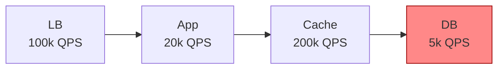

# 1.3.7 — Throughput

> **Part 1 · Introduction · Non-functional Requirements · Chapter 7 of 7**
> How much work per unit time — and why it trades against latency.

---

## 🧒 ELI5 — Explain Like I'm 5

**Latency** is how long *one* customer waits.
**Throughput** is how many customers you serve *per hour*.

They sound like the same thing. They are not — and you can improve one by making the other worse.

Imagine a bus and a motorbike going between two towns:

- The **motorbike** arrives fastest. Great **latency**, terrible **throughput** (one person per trip).
- The **bus** is slower for any single person — you wait for it to fill up, it stops everywhere. Worse **latency**. But it moves **60 people per trip**. Fantastic **throughput**.

Now the important part: **waiting for the bus to fill is exactly what "batching" means in computers.** You deliberately make one person wait a bit so that everyone travels together, and far more people get moved overall.

And the second important part: **a pipe is only as wide as its narrowest bit.** If the road out of town has four lanes but the bridge has one, the bridge decides how many cars get through. Widening the road does nothing. **Find the bridge.** That's the bottleneck.

---

## Definitions

| Term | Unit | Meaning |
|---|---|---|
| **Throughput** | QPS, RPS, TPS, records/s, MB/s | Completed work per unit time |
| **Bandwidth** | bits/s | Theoretical maximum data rate |
| **Goodput** | bits/s | Useful payload rate, excluding headers, retransmits, overhead |
| **Capacity** | QPS | Maximum sustainable throughput before SLO violation |
| **Utilisation** | % | Current load ÷ capacity |
| **Saturation** | queue depth | Work waiting because the resource is full |

**Capacity is defined by the SLO, not by the point of collapse.** A system that can technically push 50k QPS at p99 = 4 s has a *capacity* of maybe 20k QPS if the SLO is p99 < 200 ms. Always state capacity as "X QPS **at** p99 < Y ms."

---

## The relationship with latency

**Little's Law** ties them together:

$$L = \lambda W \quad\Longrightarrow\quad \text{Throughput } \lambda = \frac{\text{Concurrency } L}{\text{Latency } W}$$

Three readings of the same equation:

1. **To raise throughput, raise concurrency or lower latency.** With 200 ms latency and 100 concurrent slots you get 500 QPS. Halve latency → 1,000 QPS. Double slots → 1,000 QPS.
2. **Concurrency is not free.** Each in-flight request holds a thread/goroutine, a connection, and memory. 10,000 concurrent requests × 1 MB = 10 GB.
3. **When latency rises, concurrency rises with it** at constant arrival rate — which is exactly how a slow dependency exhausts your pool and turns a slowdown into an outage.

### The throughput–latency curve

```
latency
  ▲
  │                                        ╱ collapse
  │                                    ╱
  │                            ╱───────
  │              ╱─────────────
  │──────────────
  └──────────────────────────────────────► throughput
   low util     knee (~70%)   saturation
```

Three regimes:
- **Linear region** — latency roughly flat as load grows. Operate here.
- **The knee** (~70–80% utilisation) — latency starts climbing steeply.
- **Saturation** — queues grow without bound, latency explodes, timeouts cascade, **effective throughput often *decreases*** because work is done and then thrown away by timeouts.

🎯 **Congestive collapse:** past saturation, more offered load produces *less* completed work. This is why **load shedding raises throughput** — rejecting excess quickly keeps the system in the linear region.

---

## Finding the bottleneck

The system's throughput equals its **slowest stage**. Everything else is idle capacity.



System throughput = **5k QPS**. Adding app servers changes nothing.

### The USE method — check every resource

| Resource | **U**tilisation | **S**aturation | **E**rrors |
|---|---|---|---|
| CPU | `%util` per core | run-queue length, `load avg` | throttling |
| Memory | used/total | swap activity, page faults, OOM kills | allocation failures |
| Disk | `%util` (iostat) | `avgqu-sz`, await | I/O errors |
| Network | bits/s vs NIC capacity | drops, retransmits | errors |
| Connection pool | in-use/total | waiters | timeouts acquiring |
| Thread pool | active/max | queue depth | rejections |
| Database | active connections, buffer hit ratio | lock waits, replication lag | deadlocks |

☠️ **The most commonly missed bottlenecks:** connection pool exhaustion (the database is at 5% CPU, but your pool has 20 connections and 500 waiters), a single-threaded hot path, a lock, and **the network egress cap on a small instance type**.

---

## Raising throughput

### 1. Remove the bottleneck
Measure first. Optimising a non-bottleneck is pure waste, and it is the most common wasted engineering effort in the industry.

### 2. Batch
The highest-leverage technique available.

| Operation | Individually | Batched (100) | Speedup |
|---|---|---|---|
| Database insert | 100 round trips × 1 ms | 1 round trip, one transaction | ~50–100× |
| Kafka produce | 100 network calls | 1 compressed batch | ~10–50× |
| Redis GET | 100 RTT | 1 `MGET` / pipeline | ~50× |
| HTTP API call | 100 requests | 1 bulk endpoint | ~20× |

⚖️ **Batching trades latency for throughput.** A 10 ms batch window adds up to 10 ms latency and can multiply throughput 10–50×. Tune with **max batch size OR max wait time, whichever comes first** — that bounds the latency cost.

### 3. Increase parallelism
- More instances (horizontal), more threads/cores (vertical).
- **Partition** so parallel workers don't contend. ⚠️ Adding parallelism to a contended resource makes it *slower* (Universal Scalability Law: coherency cost eventually dominates).

### 4. Reduce per-unit work
Cheaper serialisation (Protobuf vs JSON: 3–10× less CPU and bytes), fewer allocations, better algorithms, compression to raise effective network throughput, and — biggest of all — **caching** so the expensive path runs less often.

### 5. Asynchronous processing
Decouple the accept rate from the process rate. The queue absorbs spikes; workers drain at a sustainable pace. This converts "we drop requests during a spike" into "the queue gets deeper for a while," which is almost always the better failure mode.

### 6. Streaming instead of buffering
Process records as they arrive rather than loading everything into memory. Constant memory, and results start flowing immediately. Applies to HTTP responses, file processing, and database cursors.

### 7. Zero-copy and kernel-bypass techniques
`sendfile`, `splice`, io_uring, DPDK. Relevant for proxies, CDNs, and storage systems moving millions of packets per second. Worth naming, rarely worth designing around in an interview unless the prompt is a proxy or a database.

---

## Capacity planning

### Peak, not average

```
Daily requests            500,000,000
Average QPS               500M / 86,400 ≈ 5,800
Peak factor               3× (evening peak)      → 17,400 QPS
Headroom for failover     ÷ 0.66 (survive losing 1 of 3 AZs)  → 26,400 QPS
Headroom for growth       × 2 (12-month plan)    → 52,800 QPS
Target capacity           ~53,000 QPS
```

**Typical peak factors:** consumer social ~2–3×, e-commerce ~3–5× normal (but 10–50× on Black Friday), B2B SaaS ~4–6× (business-hours concentrated), ticketing/flash sales **100×+** for minutes.

⚠️ **Flash-sale traffic cannot be autoscaled into.** Scaling takes 60–300 seconds; a ticket drop peaks in 5 seconds. You must pre-scale, queue (virtual waiting room), or shed.

### Per-node capacity reference

🔢 Order-of-magnitude figures for a modern 8-core node:

| Workload | QPS per node |
|---|---|
| Static file serving (NGINX) | 50k–200k |
| Simple JSON API, no I/O | 20k–50k |
| API with one cache read | 10k–30k |
| API with one indexed database query | 2k–10k |
| API with several database queries + business logic | 500–3k |
| Heavy computation / image processing | 10–200 |
| Redis single node | 100k+ ops/s |
| Postgres, simple indexed reads | 10k–30k |
| Postgres, writes with fsync | 1k–10k |
| Kafka broker | 100k+ msg/s (batched) |

These are for sanity-checking, not precision. Saying "an API server doing one database query handles maybe 5k QPS, so 26k QPS needs about 6 nodes plus headroom — call it 10" is exactly the right level of rigour for an interview.

---

## Load testing properly

| Test type | Purpose |
|---|---|
| **Load test** | Verify SLO at expected peak |
| **Stress test** | Find the breaking point and observe *how* it breaks |
| **Soak test** | Run for hours — finds leaks, disk fill, connection churn |
| **Spike test** | Instant 10× — tests autoscaling and shedding |
| **Capacity test** | Ramp until p99 crosses the SLO; that number is your capacity |

☠️ **Load-testing mistakes that produce meaningless numbers:**
- **Closed-loop load generators** (fixed virtual users waiting for responses) hide queueing — the system slows down and the generator politely sends less. Use **open-loop** (fixed arrival rate) to see real behaviour under overload. This is the "coordinated omission" problem.
- Testing with a hot cache and a tiny dataset (100% hit rate is not reality).
- Testing one endpoint instead of a realistic traffic mix.
- Ignoring the client as a bottleneck — your load generator saturates before the system does.

---

## Throughput vs latency: the design decision table

| Choice | Throughput | Latency | When to choose |
|---|---|---|---|
| Batch writes | ▲▲▲ | ▼ | Analytics, logs, bulk ingest |
| Write individually | ▼ | ▲ | Interactive, user-visible writes |
| Async processing | ▲▲ | ▲ (perceived) / ▼ (end-to-end) | Anything not needed in the response |
| Sync processing | ▼ | ▲ | The user must see the result now |
| Compression | ▲ (network) | ▼ (CPU) | Large payloads, constrained links |
| High utilisation | ▲ (cost-efficient) | ▼▼ | Batch jobs |
| Low utilisation | ▼ (costly) | ▲▲ | Interactive services |
| Bigger connection pool | ▲ to a point | ▼ past the bottleneck | Only if the pool is the bottleneck |

⚖️ **The general rule:** interactive user-facing paths optimise **latency**; background and analytics paths optimise **throughput**. Designing both into one system, with different settings per path, is the correct answer to almost every "how do we handle both?" follow-up.

---

## 📋 Chapter checklist

| Skill | Ready? |
|---|---|
| Define throughput, goodput, capacity, saturation | ☐ |
| State capacity as "X QPS at p99 < Y" | ☐ |
| Use Little's Law in both directions | ☐ |
| Draw the throughput–latency curve and name the three regimes | ☐ |
| Explain congestive collapse and why shedding helps | ☐ |
| Apply the USE method to five resources | ☐ |
| Quantify the batching trade-off | ☐ |
| Do a full capacity plan with peak, failover, and growth headroom | ☐ |
| Explain coordinated omission in load testing | ☐ |

---

**← Previous** [1.3.6 Latency](06-latency.md)
**Next →** [1.4.1 Back-of-the-envelope Resource Estimation](../04-resource-estimation/01-back-of-envelope-estimation.md)
