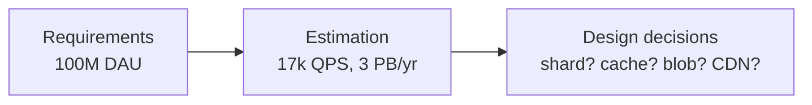

# 1.4.1 — Back-of-the-envelope Resource Estimation

> **Part 1 · Introduction · Resource Estimation · Chapter 1 of 3**
> Three minutes of arithmetic that decides your entire architecture.

---

## 🧒 ELI5 — Explain Like I'm 5

You're organising a birthday party. Before you buy anything, you do quick sums in your head:

> *"About 20 kids. Each eats maybe 3 slices. That's 60 slices. A pizza has 8 slices, so... 8 pizzas. And drinks — 2 cups each, 40 cups, so 5 big bottles."*

You didn't measure anything. You didn't use a calculator. You **guessed sensibly and rounded**. And that rough answer tells you something real: *"8 pizzas won't fit in my oven — I need to order in."*

That last bit is the point. **The number changes the plan.**

If your sum had said "1 pizza," you'd cook at home. It said 8, so you order delivery. **A number you don't act on was a waste of time.**

Same in system design. You estimate, you round hard, and then you say: *"that's 3 petabytes a year, so this can't live in a normal database — it needs object storage."*

---

## Why it comes before the design

The estimate is the bridge between requirements and architecture. It converts *"100 million users"* into *"you cannot put this on one machine, and you need object storage, not Postgres."*



🎯 **Interview angle** — Every estimate must end with a **"so what."** Numbers with no conclusion score nothing. Numbers that force a decision score highly.

---

## The method: six steps, three minutes

```
1. STATE ASSUMPTIONS   users, actions per user, sizes  (ask or assume out loud)
2. QPS                 daily count ÷ 86,400 → average; × peak factor
3. STORAGE             bytes per item × items per day × retention × replication
4. BANDWIDTH           bytes per request × QPS, in and out separately
5. MEMORY              hot set size → cache tier size
6. SO WHAT             the decision each number forces
```

### Rounding rules (use these; precision is a trap)

| Real value | Use |
|---|---|
| 86,400 s/day | **100,000** (10⁵) |
| 1 KB | 1,000 bytes |
| 1 MB | 10⁶ bytes |
| 1 GB | 10⁹ bytes |
| 1 TB | 10¹² bytes |
| 1 PB | 10¹⁵ bytes |
| 365 days | 400, or 3×10⁷ s/year |
| 2¹⁰ = 1024 | 1000 |

**The single most useful shortcut:**

$$\text{QPS} \approx \frac{\text{events per day}}{100{,}000}$$

| Events/day | QPS |
|---|---|
| 100,000 | 1 |
| 1 million | 12 (≈10) |
| 10 million | 120 (≈100) |
| 100 million | 1,200 |
| 1 billion | 12,000 |
| 10 billion | 120,000 |

Memorise the middle column. It converts any "N million per day" into QPS instantly.

---

## Step 1 — Assumptions

State them out loud, and make them round.

```
DAU                         100,000,000
Actions per user per day    posts: 0.1   reads: 50
Peak / average factor       3x
Avg post size               text 300 B + metadata 200 B = 500 B
                            10% have an image, avg 500 KB
Retention                   5 years
Replication factor          3
```

⚠️ If you don't know a number, **pick one and say you're picking it**: *"I'll assume the average user follows 200 people — tell me if that's wildly off."* This is normal and expected. Silence, or paralysis waiting for the interviewer to supply numbers, is not.

---

## Step 2 — QPS

```
Reads/day  = 100M × 50   = 5,000,000,000  = 5 × 10⁹
Read QPS   = 5 × 10⁹ / 10⁵ = 50,000
Peak read  = 50,000 × 3  = 150,000 QPS

Writes/day = 100M × 0.1  = 10,000,000
Write QPS  = 10⁷ / 10⁵   = 100
Peak write = 300 QPS
```

**Read:write = 500:1.** That single ratio drives half your design: heavy caching, read replicas, precomputed views, and a write path that can afford to be more expensive per operation.

### Peak factors

| System type | Peak / average |
|---|---|
| Global consumer service (traffic spread across time zones) | 1.5–2× |
| Regional consumer app (evening peak) | 2–3× |
| B2B SaaS (business hours only) | 4–6× |
| E-commerce, normal days | 3–5× |
| Black Friday / sale events | 10–50× |
| Ticket drops, flash sales | 100×+ for minutes |
| Live sports / broadcast events | 10–100× for the event window |

---

## Step 3 — Storage

```
Text per day    10M posts × 500 B          = 5 GB/day
Images per day  10M × 10% × 500 KB         = 500 GB/day
Total raw       ≈ 505 GB/day               ≈ 0.5 TB/day

Per year        0.5 TB × 365               ≈ 185 TB/year
With RF=3       185 × 3                    ≈ 555 TB/year
5-year total    ≈ 2.8 PB
```

**Do not forget these multipliers** — this is where candidates are wrong by an order of magnitude:

| Multiplier | Typical factor |
|---|---|
| Replication | ×3 |
| Indexes | ×1.2–2 of table size |
| Derived copies (search index, OLAP, cache) | ×1.5–3 |
| Backups / snapshots | ×1.5–2 |
| Thumbnails / transcodes / renditions | ×1.3–2 |
| Free-space headroom (never run a disk full) | ÷0.7 |
| Write amplification (LSM compaction) | ×2–10 on disk writes |

🎯 **The "so what":** 2.8 PB does not fit in a relational database. Split it: **metadata (5 GB/day text) in Postgres or Cassandra; blobs (500 GB/day) in object storage with lifecycle tiering.** That sentence is the payoff of the whole calculation.

---

## Step 4 — Bandwidth

```
Read bandwidth  (egress)
  150,000 QPS × avg 50 KB response  = 7.5 GB/s  = 60 Gbps

Write bandwidth (ingress)
  300 QPS × avg 500 KB              = 150 MB/s  = 1.2 Gbps
```

**Egress dominates and egress is what you pay for.**

🔢 **Cost check:** 7.5 GB/s × 86,400 s = 648 TB/day. At ~$0.05/GB cloud egress that's **~$32k/day — $12M/year**. That number alone justifies a CDN, and quantifying it is a genuinely senior move. Offloading 95% to a CDN at ~$0.01/GB cuts it to well under $1M.

---

## Step 5 — Memory / cache sizing

Use the **80/20 (or 90/10) rule**: a small fraction of items serves most reads.

```
Daily reads             5 × 10⁹
Distinct items read/day ≈ 10⁸ (assume 20% of reads hit distinct items,
                              heavy repetition on the rest)
Hot set (20% of those)  2 × 10⁷ items
Avg cached size         2 KB
Cache needed            2 × 10⁷ × 2 KB = 40 GB
With overhead (×1.3)    ≈ 52 GB
```

**So what:** ~52 GB fits comfortably in a small Redis cluster (e.g. 3 × 32 GB nodes with replicas). If it had come out at 5 TB, you'd need a different strategy — a smaller hot window, a CDN, or accepting a lower hit rate.

---

## Step 6 — Compute

```
Peak read QPS               150,000
Per-node capacity           ~5,000 QPS (API + one cache read)
Nodes needed                30
+ N-1 headroom across 3 AZs ÷ 0.66  → 45
+ growth headroom ×1.5              → ~68 nodes
```

Per-node reference figures are in [Throughput](../03-non-functional-requirements/07-throughput.md#per-node-capacity-reference).

---

## The reference card

### Magnitudes
| | |
|---|---|
| Seconds/day | 86,400 ≈ 10⁵ |
| Seconds/month | 2.6 × 10⁶ |
| Seconds/year | 3.15 × 10⁷ ≈ 3 × 10⁷ |
| 1 million/day | ≈ 12 QPS |
| 1 billion/day | ≈ 12,000 QPS |

### Data sizes
| Item | Size |
|---|---|
| `char` / ASCII byte | 1 B |
| UUID | 16 B binary, 36 B string |
| Timestamp | 8 B |
| Integer / long | 4 / 8 B |
| Tweet (text only) | ~300 B |
| Typical JSON API response | 1–10 KB |
| Web page HTML | 50–100 KB |
| Full web page with assets | 2–3 MB |
| Thumbnail | 10–50 KB |
| Photo (compressed) | 200 KB – 2 MB |
| Raw phone photo | 3–8 MB |
| 1 min of 1080p video | ~50 MB |
| 1 min of 4K video | ~200 MB |
| 1 hour of MP3 audio | ~60 MB |
| Log line (structured) | 200 B – 1 KB |

### Latency (for sanity checks)
| Operation | Time |
|---|---|
| L1 cache | 1 ns |
| Main memory | 100 ns |
| SSD random read | 100 μs |
| Same-DC round trip | 500 μs |
| Disk seek | 10 ms |
| Cross-continent RTT | 150 ms |

### Costs (order of magnitude, cloud, 2026)
| Resource | Cost |
|---|---|
| Object storage | ~$0.02/GB-month |
| SSD block storage | ~$0.08–0.10/GB-month |
| Managed cache RAM | ~$2–5/GB-month |
| Egress to internet | ~$0.05–0.09/GB |
| CDN egress | ~$0.01–0.03/GB |
| Cross-AZ transfer | ~$0.01/GB |
| Mid-size VM (8 vCPU) | ~$150–250/month |

---

## Worked example — a full estimate in 3 minutes

> **"Design Instagram."**

```
ASSUMPTIONS
  DAU 500M · 2 photos uploaded per user per month · 50 feed views/day
  Photo 1.5 MB original, + 3 renditions ≈ 0.5 MB → 2 MB stored
  Metadata per photo ≈ 1 KB

WRITES
  Uploads/day = 500M × 2/30 ≈ 33M/day → 330 QPS avg, ~1,000 peak

READS
  Feed views/day = 500M × 50 = 25 × 10⁹ → 250,000 QPS avg, 500k peak
  Each view shows ~10 photos → 2.5M photo fetches/sec (CDN-served)

STORAGE
  Photos:   33M × 2 MB = 66 TB/day → 24 PB/year
  Metadata: 33M × 1 KB = 33 GB/day → 12 TB/year (×3 RF = 36 TB)

BANDWIDTH
  Photo egress: 2.5M/s × 200 KB (feed-size rendition) = 500 GB/s
  → must be ~99% CDN-served; origin sees ~5 GB/s

SO WHAT
  1. 24 PB/year of photos → object storage with lifecycle tiering. Never a DB.
  2. 500 GB/s egress → CDN is mandatory, not optional. Origin shielding too.
  3. Metadata is tiny (36 TB) but 250k QPS → cache-first, sharded KV or Cassandra.
  4. Read:write = 750:1 → precompute feeds (fan-out on write) for normal users;
     pull for celebrities. See push-vs-pull.
  5. Uploads at 1k QPS with 2 MB each → direct-to-blob presigned uploads,
     never through the API tier.
```

That is roughly 90 seconds spoken, and it has already determined five architectural decisions.

---

## ☠️ Common mistakes

| Mistake | Fix |
|---|---|
| Being precise (86,400 not 100,000) | Round. You are checking magnitudes, not filing accounts. |
| Forgetting the peak factor | Always multiply average QPS by 2–5×. |
| Forgetting replication and indexes | ×3 for RF, ×1.5 for indexes and derived copies. |
| Estimating and then not using it | End with "so what." |
| Estimating things that don't matter | Skip storage for a stateless rate limiter; skip bandwidth for a batch job. |
| Confusing bits and bytes | Network is bits/s, storage is bytes. 8× errors are common and obvious. |
| Confusing MB (10⁶) and MiB (2²⁰) | For estimation, ignore the difference; just be consistent. |
| Taking > 5 minutes | Timebox it. Practise until it's 3. |

---

## 📋 Chapter checklist

| Skill | Ready? |
|---|---|
| Recite the six steps | ☐ |
| Convert any daily count to QPS instantly | ☐ |
| List the seven storage multipliers | ☐ |
| Compute egress cost and use it to justify a CDN | ☐ |
| Size a cache from a hot-set assumption | ☐ |
| Do a complete Instagram-scale estimate in 3 minutes | ☐ |
| Always finish with "so what" | ☐ |

---

**← Previous** [1.3.7 Throughput](../03-non-functional-requirements/07-throughput.md)
**Next →** [1.4.2 QPS and System Design](02-qps-and-system-design.md)
