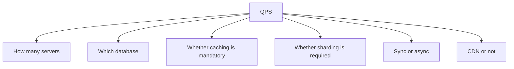

# 1.4.2 — QPS and System Design

> **Part 1 · Introduction · Resource Estimation · Chapter 2 of 3**
> QPS is the number that decides which architecture you're allowed to propose.

---

## 🧒 ELI5 — Explain Like I'm 5

**QPS = "how many people ask per second."**

Imagine a helpdesk.

- **1 person per second** asks a question. One helper handles it easily.
- **100 people per second.** One helper is drowning. You need maybe 10 helpers and a queue.
- **10,000 people per second.** Now you need a whole building, someone directing people to the right desk, and a big board with the most common answers already written on it so helpers don't look them up every time.
- **1,000,000 people per second.** Now you need buildings in every city, and most questions have to be answered by the sign outside the building before anyone even walks in.

Notice something: **it's not the same building, just bigger.** At each step the *shape* changes. Different number → different plan.

That's why we work out QPS first: it tells us **which world we're in**.

---

## What QPS actually decides



| QPS | What is forced |
|---|---|
| **< 100** | One server + one database. Anything more is over-engineering. |
| **100 – 1,000** | A few app servers, load balancer, managed database, basic caching. |
| **1k – 10k** | Cache is mandatory. Read replicas. Async for anything slow. CDN for assets. |
| **10k – 100k** | Sharding likely. Heavy caching (>90% hit rate). Precomputation. Careful connection management. |
| **100k – 1M** | Multi-region, aggressive edge caching, custom data paths, cell architecture. |
| **> 1M** | Purpose-built systems; most requests must never reach origin. |

🎯 **Interview angle** — When you compute QPS, immediately say which row you're in and what it forces. *"That's 40k QPS, so caching isn't an optimisation here, it's structural — the database can't serve that directly."*

---

## Computing QPS properly

### The base formula

$$\text{QPS}_{\text{avg}} = \frac{\text{Total daily requests}}{86{,}400} \approx \frac{\text{Total daily requests}}{10^5}$$

### But average QPS is not what you provision for

```
Average QPS
  × peak factor (2-5x)                 ← daily/weekly peak
  × event factor (if applicable)       ← launches, sales, live events
  ÷ (1 - failure headroom)             ← survive losing a zone
  × growth factor                      ← 12-18 month horizon
= Provisioned capacity
```

Worked:
```
1B requests/day          → 12,000 QPS average
× 3 (evening peak)       → 36,000 QPS
÷ 0.66 (lose 1 of 3 AZs) → 55,000 QPS
× 1.5 (growth)           → ~82,000 QPS provisioned
```

### Traffic shape matters as much as the total

```
Global consumer service — flat-ish, 1.5-2x peak
  ▁▂▃▄▅▆▆▅▄▃▂▁▂▃▄▅▆▆▅▄▃▂▁

Regional consumer app — strong evening peak, 3x
  ▁▁▁▂▃▄▅▇█▇▅▃▂▁▁

B2B SaaS — business hours only, 5x, near-zero at night
  ▁▁▁▁▁▁▁▇███████▇▁▁▁▁▁▁

Flash sale — 100x for 60 seconds
  ▁▁▁▁▁█▁▁▁▁▁
```

⚠️ **Autoscaling cannot solve the flash-sale shape.** Instance start-up is 60–300 s; the spike is over in 60 s. Options: pre-scale on a schedule, use a virtual waiting room (queue users and admit at a controlled rate), serve a static page from the CDN, or shed aggressively. Naming this constraint is a strong signal.

---

## Read QPS vs write QPS — the ratio that shapes everything

Always compute them separately. They stress completely different parts of the system.

| System | Read:Write | Consequence |
|---|---|---|
| Twitter / social feed | 1000:1 | Precompute timelines; cache everything; writes can be expensive |
| YouTube | 1000:1+ | CDN carries essentially all read traffic |
| E-commerce browse | 100:1 | Cache the catalogue; the order path is the careful part |
| Chat / messaging | ~1:1 | Write path is as hot as the read path; needs write-optimised storage |
| Analytics ingestion | 1:1000 | Write-optimised (LSM, append-only, columnar); reads are batch |
| IoT telemetry | 1:10000 | Time-series store; downsample aggressively |

**Why the ratio matters:**

- **Read-heavy** → cache, replicas, CDN, precomputation, materialised views. Reads scale almost arbitrarily.
- **Write-heavy** → replicas don't help at all. You need write-optimised storage (LSM trees, Cassandra), batching, sharding, and possibly async ingestion through a log.

🎯 The single most common architectural error in interviews: **adding read replicas to solve a write bottleneck.** Replicas add read capacity. Every write still goes through the primary — and in fact replication makes the primary do slightly *more* work.

---

## From QPS to server count

```
Servers = Peak QPS ÷ Per-server capacity, then add headroom
```

Per-server capacity depends entirely on what the request does:

| Request profile | QPS per 8-core node |
|---|---|
| Static file | 50,000–200,000 |
| Simple JSON, no I/O | 20,000–50,000 |
| One cache read | 10,000–30,000 |
| One indexed database read | 2,000–10,000 |
| 3–5 database queries + logic | 500–3,000 |
| External API call (I/O bound) | 1,000–5,000 (concurrency-limited, not CPU) |
| Image resize | 10–100 |
| ML inference (CPU) | 5–50 |

⚠️ **I/O-bound services are limited by concurrency, not CPU.** Use Little's Law: at 200 ms per call and 500 concurrent slots, capacity is 2,500 QPS regardless of how many cores you have. The fix is more concurrency (async I/O, more connections) or lower latency — not more CPU.

---

## Database QPS: the usual real bottleneck

| Database operation | Realistic QPS per node |
|---|---|
| Redis GET/SET | 100,000+ |
| Redis pipelined | 500,000+ |
| Postgres, indexed point read | 10,000–30,000 |
| Postgres, simple write (fsync) | 1,000–10,000 |
| Postgres, complex join | 100–1,000 |
| MySQL, similar profile | comparable |
| Cassandra write per node | 10,000–50,000 |
| Cassandra read per node | 5,000–20,000 |
| DynamoDB | Effectively unlimited (you pay per capacity unit) |
| Elasticsearch query | 100–5,000 depending on complexity |

**Cache the difference.** If you need 50,000 read QPS and Postgres gives 10,000:

```
Required          50,000 QPS
Cache hit rate    95%
Cache serves      47,500 QPS   ← Redis handles this trivially
Database serves    2,500 QPS   ← comfortably within one node
```

That calculation — deriving the required hit rate from the QPS gap — is exactly the kind of quantitative reasoning that separates strong answers.

$$\text{Required hit rate} = 1 - \frac{\text{DB capacity}}{\text{Total QPS}}$$

⚠️ **And then check the miss path.** At 50k QPS with a 95% hit rate, a cache *outage* sends 50k QPS at a database that handles 10k. It dies immediately. This is why "the app must survive total cache loss" is a real requirement, not a platitude. Mitigations: request coalescing, a second cache tier, load shedding, and staged warm-up.

---

## Connection maths — the bottleneck people forget

```
100 app servers × 100-connection pool each = 10,000 connections to Postgres
```

☠️ Postgres allocates a process per connection (~10 MB each); a few hundred connections is the practical ceiling, and 10,000 will simply fail. The database is at 5% CPU while everything times out.

**Fix:** a connection pooler (PgBouncer in transaction mode, RDS Proxy, ProxySQL) that multiplexes thousands of client connections onto tens of database connections. Size the real pool at roughly `cores × 2 + effective_spindles` — usually **tens, not thousands**.

This is a favourite interview follow-up because it's counter-intuitive: *more* connections make throughput *worse* past the bottleneck, due to context switching and lock contention.

---

## Per-user and per-key QPS — the hot-key problem

Aggregate QPS hides skew.

```
Total    100,000 QPS across 10,000,000 users → 0.01 QPS per user (trivial)
But      one celebrity's profile             → 20,000 QPS on ONE key
```

A single key is served by a single shard, so **that one key exceeds a whole node's capacity.** Aggregate maths says you're fine; reality says one shard is on fire.

Mitigations:
- **Replicate the hot key** across N cache nodes (`key:hot:0..9`, read a random one).
- **Local (in-process) cache** in front of the distributed cache for the top keys — even a 1-second TTL removes almost all of it.
- **Serve from CDN/edge** for public content.
- **Split the key** — for a counter, keep 100 sub-counters and sum on read.
- **Detect dynamically** — track top-K keys and promote them to a local cache automatically.

🎯 Always ask *"is traffic uniform across keys?"* The answer is essentially always no, and saying so is a strong signal.

---

## Sanity-check reference points

Useful for calibrating whether your estimate is plausible:

| System | Approximate scale |
|---|---|
| Google Search | ~100k QPS |
| Facebook | ~10M+ requests/sec across all services |
| Twitter/X reads | ~300k QPS timeline reads |
| Twitter/X writes | ~6k tweets/sec average |
| WhatsApp | ~100B messages/day ≈ 1.2M msg/sec |
| Amazon (peak sale day) | ~100k orders/min ≈ 1,700/sec |
| Netflix | ~15% of global downstream internet traffic at peak |
| Visa | ~65,000 transactions/sec capacity |
| A typical successful startup | 100–1,000 QPS |
| A typical internal enterprise tool | 1–50 QPS |

⚠️ Most systems you will be asked to design are in the **1,000–100,000 QPS** range. If your estimate says 10 million QPS, recheck your assumptions — you have probably multiplied something twice.

---

## 📋 Chapter checklist

| Skill | Ready? |
|---|---|
| Compute average and provisioned QPS with all four multipliers | ☐ |
| State which architecture tier a QPS number forces | ☐ |
| Always separate read QPS from write QPS | ☐ |
| Explain why replicas don't fix write load | ☐ |
| Derive required cache hit rate from the QPS gap | ☐ |
| Explain the connection-pool ceiling and its fix | ☐ |
| Identify hot keys and name four mitigations | ☐ |
| Explain why autoscaling can't handle flash sales | ☐ |

---

**← Previous** [1.4.1 Back-of-the-envelope Estimation](01-back-of-envelope-estimation.md)
**Next →** [1.4.3 Real World Examples](03-real-world-examples.md)
