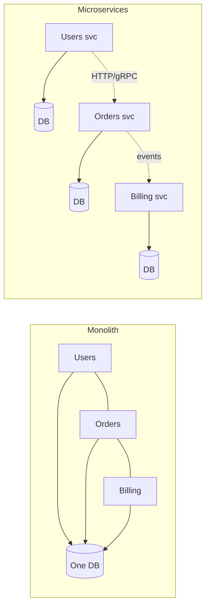
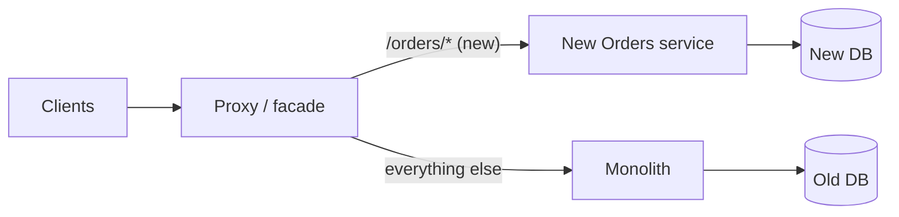

# 1.5.1 — Microservices and Monolithic Architecture

> **Part 1 · Introduction · Microservices · Chapter 1 of 1**
> The most over-applied decision in software. Know when *not* to split.

---

## 🧒 ELI5 — Explain Like I'm 5

**A monolith is one big kitchen.** Everyone cooks in the same room. Talking to each other is instant — just turn around. But if one person drops a pan of oil and starts a fire, the *whole kitchen* shuts. And if twenty cooks are in there, they bump into each other constantly.

**Microservices are twenty small kitchens**, each making one dish. The pasta kitchen catching fire doesn't stop the dessert kitchen. Each kitchen can be made bigger on its own — you only need three pizza kitchens if pizza is popular.

But now the cooks are in different buildings. To ask a question they have to **phone each other**. Phones drop calls. Sometimes nobody picks up. Sometimes you phone someone who is phoning someone who is phoning you. And when a customer complains their meal was wrong, you have to phone **nine kitchens** to find out what happened.

So which is better?

**Start with one kitchen.** Split off a second kitchen when there is a *specific reason* — the bakery needs a different oven, or the pizza team keeps blocking the dessert team.

Splitting because "twenty kitchens sounds modern" is how you end up with twenty kitchens, no food, and a very large phone bill.

---

## The definitions

**Monolith** — one deployable unit containing all functionality, usually one codebase and one database. Modules call each other through function calls.

**Modular monolith** — a monolith with *enforced internal boundaries*: modules with explicit interfaces, no reaching into another module's tables, often separate schemas. **This is the underrated middle ground and usually the right starting point.**

**Microservices** — independently deployable services, each owning its own data, communicating over the network.

**Distributed monolith** — the failure state: services that are deployed separately but must be released together, share a database, and break each other constantly. **All the costs of both, benefits of neither.**



---

## The honest comparison

| Dimension | Monolith | Microservices |
|---|---|---|
| **Initial development speed** | ✅ Fast — one repo, one deploy, no network | ❌ Slow — infrastructure before features |
| **Inter-module calls** | ✅ Function call, ~ns, cannot fail | ❌ Network call, ~ms, fails, times out, retries |
| **Transactions** | ✅ One ACID transaction across everything | ❌ Sagas, eventual consistency, compensations |
| **Refactoring across boundaries** | ✅ Compiler finds every caller | ❌ Coordinated multi-service releases |
| **Deploy independence** | ❌ One change redeploys everything | ✅ Deploy one service alone |
| **Fault isolation** | ❌ One memory leak kills everything | ✅ One service dies, others degrade |
| **Independent scaling** | ❌ Scale the whole thing to scale one part | ✅ Scale only what's hot |
| **Technology diversity** | ❌ One stack | ✅ Right tool per service (also a curse) |
| **Team autonomy** | ❌ Merge conflicts, coupled release trains | ✅ Team owns service end-to-end |
| **Availability arithmetic** | ✅ One 99.9% component | ❌ 10 serial hops at 99.9% → 99.0% |
| **Debugging** | ✅ One stack trace | ❌ Distributed tracing required |
| **Testing** | ✅ In-process integration tests | ❌ Contract tests, test environments, mocks |
| **Operational cost** | ✅ One thing to run | ❌ N pipelines, N dashboards, N on-calls |
| **Onboarding** | ✅ Clone one repo | ❌ "Which of the 40 services do I need?" |

⚖️ **The trade in one sentence:** microservices exchange **development-time simplicity** for **runtime and organisational flexibility** — and you pay the cost immediately while the benefit only arrives at a certain scale of team and traffic.

---

## When to split (real reasons)

| Reason | Example |
|---|---|
| **Independent scaling need** | Image processing needs 200 GPU nodes; the rest needs 5 CPU nodes. Scaling the monolith to 200 is absurd. |
| **Team ownership and deploy independence** | 8 teams, 40 deploys/day, blocking each other on one release train. Conway's law says the architecture will mirror the org anyway. |
| **Different technology requirements** | ML inference in Python, real-time gateway in Go, core in Java. |
| **Different availability or compliance requirements** | The payment path needs PCI isolation and 99.99%; the blog does not. |
| **Blast-radius isolation** | A memory leak in report generation must not take checkout down. |
| **Different data store needs** | Search needs Elasticsearch; the ledger needs Postgres. |
| **Genuinely independent lifecycles** | An acquired product with its own roadmap. |

### When *not* to split

| Bad reason | Why it fails |
|---|---|
| "Microservices are modern" | Not an engineering argument |
| "The codebase is big" | Use modules, packages, and enforced boundaries first |
| "We might need to scale someday" | Split when the pressure is real; premature splitting is expensive and hard to undo |
| "Each team wants their own repo" | Solve with code ownership, not network hops |
| "It'll be easier to test" | It is dramatically harder to test |

🎯 **Interview angle** — *"I'd start with a modular monolith and one Postgres. I'd split out the transcoding pipeline first, because it needs GPUs and 50× the instance count; everything else stays together until team or scaling pressure justifies a split."* That is a **senior** answer. Drawing 12 services for a greenfield problem is a junior signal.

---

## The three hard problems microservices create

### 1. Data — no more joins, no more transactions

The rule: **each service owns its data; no other service touches its database.** The moment two services share a table, you have a distributed monolith.

Consequences:

| Lost | Replacement |
|---|---|
| `JOIN` across domains | API composition, or a read model built from events (CQRS) |
| ACID transaction across domains | **Saga** with compensating actions ([Saga Pattern](../../07-patterns-and-templates/01-patterns/10-saga-pattern.md)) |
| Foreign key constraints | Application-level validation, eventual reconciliation |
| One consistent backup | Per-service backups; cross-service consistency is not guaranteed |
| Simple reporting query | A data warehouse fed by CDC/events |

**The dual-write trap:** a service updates its database and publishes an event. If it crashes between the two, the database and the event stream disagree — permanently and silently. **Fix: the transactional outbox** — write the event into an `outbox` table *in the same transaction*, and have a relay (or CDC) publish it. See [Change Data Capture](../../05-scaling-data-storage/01-data-replication/05-change-data-capture.md).

### 2. Communication — every call can fail

Every in-process call you replace with a network call inherits: latency, timeouts, partial failure, retries, duplicates, and reordering.

Each call now needs a timeout, a retry policy with backoff and jitter, a circuit breaker, a fallback, and idempotency on the receiving side. That is Part 2 of this book, and it exists *because* of this decision.

☠️ **Chatty decomposition:** if rendering one page requires 15 sequential service calls at 20 ms each, you added 300 ms of pure latency and dropped availability to 0.999¹⁵ ≈ 98.5%. **Design service boundaries so that common operations need few hops** — ideally one.

### 3. Operations — N of everything

N pipelines, N dashboards, N sets of alerts, N on-call rotations, N dependency-upgrade backlogs, N security patch cycles.

Minimum viable platform before you split:
- Centralised logging with a correlation ID propagated through every call
- Distributed tracing (OpenTelemetry)
- Per-service metrics with consistent RED dashboards
- Automated CI/CD per service
- Service discovery and health checking
- A standard resilience library or a service mesh
- Contract testing between services

**If you don't have these, splitting will hurt more than it helps.** Say this in an interview; it's a maturity signal.

---

## How to split, when you do

### Find the boundaries — domain-driven design, briefly

A **bounded context** is a part of the business with its own vocabulary and its own model. "Customer" means something different to Sales, Billing, and Support — those are three contexts, and the boundary is where the meaning changes.

Heuristics for a good boundary:
- **High cohesion inside, low coupling across** — most operations complete inside one service.
- **Owned by one team.**
- **Owns its data**, with no other writer.
- **Its API is stable** and expressed in business terms, not database terms.
- Data that changes together, stays together.

### The strangler fig pattern

Never rewrite. **Strangle.**



1. Put a facade in front of the monolith.
2. Build the new service for **one** capability.
3. Route that capability's traffic to the new service (dark launch → canary → full).
4. Migrate its data; keep both in sync during transition (CDC or dual-write via outbox).
5. Delete that code from the monolith.
6. Repeat.

Each step is small, reversible, and delivers value. **Big-bang rewrites of working systems have a famously poor track record** — say this if asked how you'd migrate.

### Order of extraction

Extract, in this order:
1. **Leaf capabilities with few dependencies** (notifications, PDF generation, image processing) — easy wins, prove the platform.
2. **Capabilities with distinct scaling needs.**
3. **Capabilities owned by a distinct team.**
4. **The core domain — last, and maybe never.** The core is the most coupled and the most valuable; it is often correct to leave it as a well-structured monolith forever.

---

## The middle ground: modular monolith

Most systems should live here.

```
src/
  modules/
    orders/      ← public interface: orders/api.py; nothing outside imports orders/internal/*
    billing/
    catalogue/
  shared/        ← genuinely shared primitives only
```

Enforce with: module-level public APIs, dependency lint rules (no cross-module internal imports), separate database **schemas** with no cross-schema foreign keys, and per-module ownership in `CODEOWNERS`.

You get: clear boundaries, easy refactoring, in-process calls, ACID transactions, one deploy — **and** the option to extract any module into a service later, cheaply, because the seam is already there.

⚖️ **Cost:** discipline. Without lint enforcement, boundaries erode within months. That's the whole reason people jump to microservices — the network *forces* the boundary. Recognising that microservices are often "boundary enforcement via infrastructure" is an insightful thing to say.

---

## ☠️ Anti-patterns

| Anti-pattern | Symptom |
|---|---|
| **Distributed monolith** | Services must be deployed together; a shared database |
| **Nano-services** | 200 services, each 50 lines; the network cost exceeds the work |
| **Shared database** | Two services writing the same table — the boundary is fiction |
| **Chatty services** | 15 hops per request |
| **Synchronous chains** | A → B → C → D; any failure fails everything, latency adds up |
| **Distributed transactions (2PC)** | Blocking, fragile; use sagas |
| **No versioning of contracts** | Deploying B breaks A |
| **Shared "common" library everyone depends on** | Changing it requires redeploying all services — a monolith with extra steps |
| **Splitting before the platform exists** | No tracing, no CI/CD; debugging becomes archaeology |

---

## The decision script

> "How many engineers will work on this, and are they blocking each other today?"
> → Fewer than ~20 and not blocking → **modular monolith**.
>
> "Does any component need radically different scaling, hardware, or compliance?"
> → Yes → **extract that one component**.
>
> "Do we have tracing, CI/CD, and service discovery?"
> → No → **fix that before splitting anything**.
>
> "Are we splitting for a named engineering pressure, or because it sounds right?"
> → Named pressure only.

---

## 📋 Chapter checklist

| Skill | Ready? |
|---|---|
| Define modular monolith and distributed monolith | ☐ |
| Give five valid reasons to split and three invalid ones | ☐ |
| Explain the availability arithmetic cost of 10 serial services | ☐ |
| Explain the dual-write problem and the outbox fix | ☐ |
| Describe the strangler fig migration | ☐ |
| Name the platform prerequisites for microservices | ☐ |
| Argue for starting with a monolith without sounding unambitious | ☐ |

---

**← Previous** [1.4.3 Real World Examples](../04-resource-estimation/03-real-world-examples.md)
**Next →** [2.1.1 Microservice Communication](../../02-microservices-and-dataflow/01-synchronous-communication/01-microservice-communication.md)
