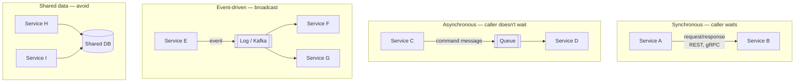
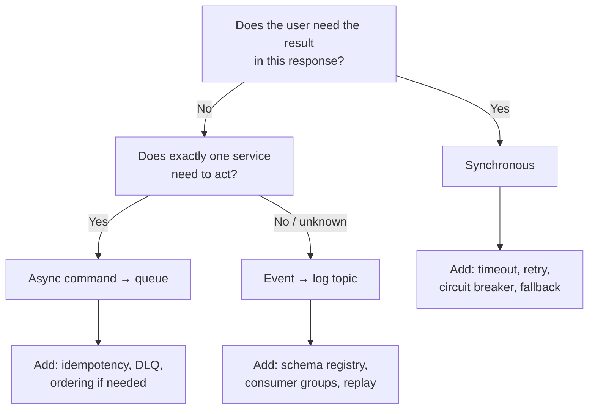

# 2.1.1 — Microservice Communication

> **Part 2 · Microservices & Data Flow · Synchronous Communication · Chapter 1 of 9**
> The map of all the ways services can talk, and how to choose.

---

## 🧒 ELI5 — Explain Like I'm 5

You split your kitchen into many small kitchens. Now the cooks need to talk. There are basically **two ways**:

**1. Phone call.** You ring the dessert kitchen and **wait on the line** until they answer. Fast when it works. But if nobody picks up, **you're stuck standing there holding the phone**, and your own customers are waiting. *(Synchronous.)*

**2. Sticky note in a postbox.** You write "make 20 desserts" and drop it in the box. You walk away immediately and get on with your work. Someone picks it up later. You don't know exactly when it's done. *(Asynchronous.)*

There's also a third thing that isn't really "talking":

**3. Shouting an announcement.** *"Order 55 is ready!"* You don't care who hears it. The dessert kitchen, the delivery driver, and the person tracking money all hear it and each does their own thing. *(Events.)*

The rule of thumb:

- **Do I need the answer to reply to my customer right now?** → phone call.
- **Can it happen later?** → sticky note.
- **Do lots of people care that this happened?** → announcement.

And the most important design instinct: **use fewer phone calls.** Every phone call is another way your dinner service can freeze.

---

## The four communication patterns



| Pattern | Coupling | Caller waits? | Failure behaviour | Use when |
|---|---|---|---|---|
| **Synchronous request/response** | Temporal + interface | Yes | Immediate error; caller must handle | The answer is needed to respond to the user |
| **Asynchronous command** | Interface only | No | Retried by the broker | Work must happen, but not now |
| **Event publish/subscribe** | Neither (publisher doesn't know consumers) | No | Consumers retry independently | Something happened, others may care |
| **Shared database** | Total | N/A | Everything breaks together | ❌ Almost never |

---

## Two axes that define everything

### Axis 1 — Synchronous vs asynchronous (time coupling)

**Synchronous:** the caller blocks until the callee responds. Both must be available *at the same moment*. This is **temporal coupling** and it is the source of most cascading failures.

**Asynchronous:** the caller hands the message to a broker and continues. The callee can be down for an hour; the message waits.

### Axis 2 — One-to-one vs one-to-many (knowledge coupling)

**One-to-one (command):** "Service A tells Service B to do X." A knows B exists.

**One-to-many (event):** "Service A announces that X happened." A does not know who listens. New consumers can be added with no change to A.

|  | One-to-one | One-to-many |
|---|---|---|
| **Synchronous** | REST / gRPC call | (rare — scatter-gather queries) |
| **Asynchronous** | Command on a queue | Event on a topic |

🎯 **The senior instinct:** move **down and right** on this table wherever the product allows. Down (async) removes temporal coupling. Right (events) removes knowledge coupling. Both make the system more resilient and more extensible — at the cost of eventual consistency and harder debugging.

---

## Choosing: the decision tree



### Worked examples

| Operation | Choice | Why |
|---|---|---|
| Check inventory before showing "in stock" | **Sync** | The user sees the answer now |
| Validate a password | **Sync** | Blocking by definition |
| Charge a card at checkout | **Sync** (with idempotency) | The user must know if it succeeded |
| Send the order-confirmation email | **Async event** | The user shouldn't wait for SMTP |
| Update the search index after a product edit | **Async event** | Seconds of staleness is fine |
| Generate a monthly invoice PDF | **Async command** | Slow; the result is fetched later |
| Notify warehouse, analytics, and loyalty of an order | **Event** | Three unrelated consumers, more will be added |
| Fetch a user's profile for rendering | **Sync** (cached) | Needed now, but cache it |

☠️ **The classic mistake:** doing all of the above synchronously in the checkout request. The request now depends on inventory + payment + email + search + analytics + loyalty. Availability = 0.999⁶ ≈ 99.4%, and p99 is the sum of six tails. **Only payment and inventory belong in the request.**

---

## Protocol choices for synchronous calls

| Protocol | Encoding | Strengths | Weaknesses |
|---|---|---|---|
| **REST/JSON over HTTP/1.1** | Text | Universal, debuggable, cacheable | Verbose; one request per connection (without pipelining) |
| **REST/JSON over HTTP/2** | Text + binary framing | Multiplexing, header compression | Still verbose payloads |
| **gRPC (HTTP/2 + Protobuf)** | Binary | 3–10× smaller/faster, typed contracts, streaming, deadlines built in | Not browser-native without a proxy; harder to debug by hand |
| **GraphQL** | Text | Client picks fields; one round trip for nested data | Caching is hard; server-side N+1; cost control needed |
| **Thrift / Avro RPC** | Binary | Similar to gRPC | Smaller ecosystems |

**Default recommendation:** REST/JSON at the edge (public API), **gRPC internally**. Say it in one sentence and justify with: typed contracts prevent whole classes of integration bugs, binary encoding cuts CPU and bytes, and deadline propagation is built into the protocol.

---

## Protocol choices for asynchronous messaging

| Technology | Model | Ordering | Retention | Best for |
|---|---|---|---|---|
| **SQS / RabbitMQ (queue)** | Work queue; message removed on ack | Weak (FIFO queues available, lower throughput) | Until consumed | Background jobs |
| **Kafka / Pulsar (log)** | Append-only log; consumers track offsets | Strict per partition | Days to forever | Events, replay, multi-consumer, stream processing |
| **SNS / Google Pub/Sub** | Fan-out pub/sub | None | Short | Notifications, cache invalidation |
| **Redis Streams** | Lightweight log | Per stream | Configurable | Small-scale event flows |
| **Redis Pub/Sub** | Fire-and-forget broadcast | None | **None** — offline subscribers miss messages | Non-critical signals only |

Detailed treatment in [Asynchronous Communication](../02-asynchronous-communication/).

---

## Data exchange between services: the four options

When Service A needs data owned by Service B:

| Option | How | Pros | Cons |
|---|---|---|---|
| **1. Synchronous query** | A calls B's API on demand | Always fresh; simple | Coupling; latency; B's outage becomes A's outage |
| **2. Cache B's responses** | A caches with a TTL | Cuts latency and load | Staleness; invalidation |
| **3. Replicate via events** | B publishes changes; A keeps a local read model | A survives B's outage; fast local reads | Eventual consistency; A stores duplicated data; needs backfill |
| **4. API composition at the edge** | A gateway/BFF calls both and merges | Neither service knows the other | Gateway complexity; fan-out latency |

⚖️ **Option 3 (event-carried state transfer) is the most powerful and the most misused.** It gives genuine independence — A can serve requests while B is down — at the price of storing a stale copy of someone else's data and needing a backfill/reconciliation story. Use it for data that is read often and changes rarely (e.g. product names, user display names). Don't use it for data that must be exact at read time (account balance).

🎯 **Interview angle** — "The Order service needs customer names for display. Rather than calling the Customer service on every read, I'll have Customer publish `CustomerUpdated` events and keep a local projection of `(customer_id, display_name)`. Orders then renders with zero cross-service calls and survives a Customer-service outage. The cost is up to a few seconds of staleness on a name change, which is acceptable, plus a periodic reconciliation job."

---

## Service topology anti-patterns

| Anti-pattern | Why it hurts |
|---|---|
| **Long synchronous chains** A→B→C→D | Latency adds; availability multiplies down; one slow service stalls the chain |
| **Cyclic dependencies** A→B→A | Deadlock risk, impossible to deploy independently, impossible to reason about |
| **Chatty calls in a loop** (N+1 over the network) | 100 calls where one batch call would do |
| **Shared database** | Not communication — it's coupling with extra steps |
| **Distributed transaction (2PC)** across services | Blocking, fragile; use a saga |
| **A "god" orchestrator** that calls everything | A monolith wearing a service costume |

**Prefer choreography for simple flows** (each service reacts to events) and **orchestration for complex flows** (an explicit workflow service drives the steps and handles compensation). Both appear in the [Saga Pattern](../../07-patterns-and-templates/01-patterns/10-saga-pattern.md); orchestration is easier to debug, choreography is more decoupled.

---

## What every synchronous call needs

The rest of this section is a chapter each, but here is the complete list up front:

```
□ Timeout          — always, and shorter than the caller's remaining deadline
□ Deadline propagation — pass the remaining budget downstream
□ Retry policy     — exponential backoff + jitter, only for idempotent ops, with a budget
□ Circuit breaker  — stop calling a failing dependency
□ Fallback         — cached value, default, or degraded response
□ Bulkhead         — a separate connection/thread pool per dependency
□ Idempotency      — so retries are safe on the receiving side
□ Observability    — trace ID propagated, per-dependency metrics
```

Miss any one and a dependency's bad day becomes your outage.

---

## 📋 Chapter checklist

| Skill | Ready? |
|---|---|
| Draw the two-axis table (sync/async × 1:1/1:many) | ☐ |
| Classify eight operations as sync, command, or event | ☐ |
| Explain temporal vs knowledge coupling | ☐ |
| Justify gRPC internally, REST at the edge | ☐ |
| Explain event-carried state transfer and its cost | ☐ |
| Name six topology anti-patterns | ☐ |
| Recite the eight-item synchronous-call checklist | ☐ |

---

**← Previous** [1.5.1 Microservices vs Monolithic](../../01-introduction/05-microservices/01-microservices-vs-monolithic.md)
**Next →** [2.1.2 Synchronous Communication](02-synchronous-communication.md)
