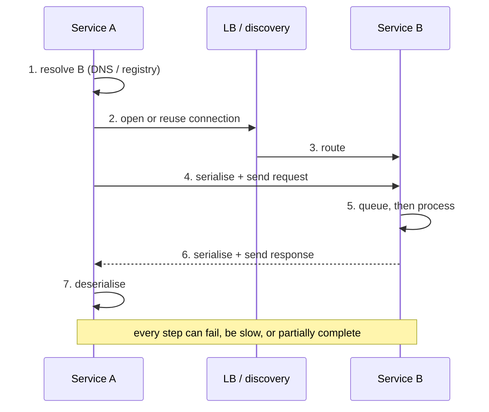
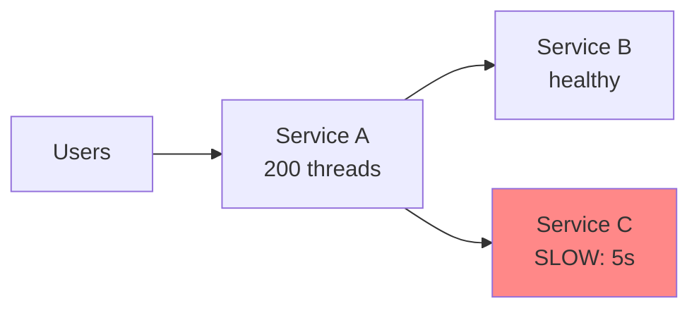

# 2.1.2 — Synchronous Communication

> **Part 2 · Microservices & Data Flow · Synchronous Communication · Chapter 2 of 9**
> The caller waits. Everything good and everything bad follows from that one fact.

---

## 🧒 ELI5 — Explain Like I'm 5

Synchronous means: **I ask, and I stand here until you answer.**

Like asking your mum a question and waiting in the doorway for the reply. You can't do anything else. You're just... waiting.

That's fine when she answers in a second. It's a disaster when:

- **She's busy** and takes ten minutes → you're stuck in the doorway for ten minutes.
- **She's asleep** and never answers → you wait forever, unless you decide to give up. *(That's a timeout — deciding in advance how long you'll wait.)*
- **Your little brother is also waiting for YOU** to answer his question → now he's stuck too. And his friend is waiting for him. **One sleepy mum has frozen four people.** *(That's a cascading failure.)*

So the golden rules of standing in doorways:

1. **Always decide in advance how long you'll wait.** (Timeout.)
2. **If she's been asleep the last ten times you asked, stop asking for a while.** (Circuit breaker.)
3. **Have a "good enough" answer ready** for when you give up. (Fallback.)

---

## Why synchronous at all?

Because sometimes you genuinely cannot proceed without the answer.

| Legitimate reason | Example |
|---|---|
| The user needs the result in this response | "Is this username available?" |
| A decision depends on it | "Does this user have enough balance?" |
| Ordering/consistency requires it | "Reserve this seat before confirming" |
| Simplicity is worth the coupling | Internal admin tool, low traffic |

⚖️ Synchronous calls are **simpler to write, simpler to reason about, and easier to debug** — you get a stack trace and an immediate error. That's real value. The cost is temporal coupling, which you must then manage deliberately.

---

## The anatomy of a synchronous call



Latency budget for a typical internal call in the same region:

| Step | Cost |
|---|---|
| Service discovery (cached) | ~0 |
| Connection (reused, keep-alive) | ~0 |
| Connection (new, TLS 1.3) | 2 RTT ≈ 1–2 ms same-DC |
| Serialise/deserialise JSON (5 KB) | 50–200 μs |
| Serialise/deserialise Protobuf (5 KB) | 10–50 μs |
| Network transit same-AZ | ~0.5 ms RTT |
| Network transit cross-AZ | ~1–2 ms RTT |
| Server queueing | 0 → ∞ depending on utilisation |
| Server processing | The actual work |

🎯 **Connection reuse is the biggest free win.** A new TLS connection per call can dominate the entire budget. Always use connection pools with keep-alive, or HTTP/2 multiplexing.

---

## The failure modes (this is the real content)

A synchronous call has **far more outcomes than "success" and "error."**

| Outcome | What the caller sees | Danger |
|---|---|---|
| **Success** | 200 + body | — |
| **Fast failure** | Connection refused, 503 | Best kind of failure — cheap and clear |
| **Slow success** | 200 after 8 s | Occupies a thread/connection; blows the caller's SLO |
| **Timeout** | Nothing | **Did the work happen or not? You cannot know.** |
| **Partial failure** | 500 after B already wrote to its database | Inconsistent state |
| **Network partition** | Hangs until TCP timeout (can be minutes without an application timeout) | Resource exhaustion |
| **Wrong response** | 200 with garbage | Silent corruption |

☠️ **The timeout ambiguity is the fundamental problem of distributed systems.** When your call to the payment service times out, you do not know whether the charge happened. Retrying might double-charge; not retrying might lose a legitimate payment. **The only escape is idempotency**: send an idempotency key, so a retry is provably safe.

---

## Cascading failure — the mechanism

This is the single most important failure story in microservices. Learn to narrate it.



1. Service C slows from 50 ms to 5 s (a bad query, a GC storm, a cold cache).
2. Service A's calls to C now hold threads for 5 s instead of 50 ms — **100× longer**.
3. By Little's Law, concurrency to C rises 100×. A's shared thread pool of 200 fills up.
4. **Requests to B now fail too** — no threads left — even though B is perfectly healthy.
5. A becomes unresponsive. Its callers time out, retry, and **triple the load**.
6. The retry storm reaches C, which is now even slower.
7. Everything is down. **Root cause: one dependency got slow.** Not down — *slow*.

### The five defences

| Defence | Stops step |
|---|---|
| **Timeout** (500 ms, not 30 s) | 2 — threads are released quickly |
| **Bulkhead** (separate pool per dependency) | 4 — B's calls have their own threads |
| **Circuit breaker** | 6 — stop calling C entirely while it's sick |
| **Retry budget + backoff + jitter** | 5 — retries can't triple the load |
| **Load shedding / backpressure** | 5 — reject early rather than queue forever |

🎯 **Slow is worse than down.** A dependency that returns "connection refused" instantly is far easier to survive than one that answers in 30 seconds. This is a genuinely counter-intuitive insight and interviewers love hearing it.

---

## Deadline propagation

Every call should carry **how much time is left**, not a fresh timeout.

```
Client request arrives with a 1,000 ms budget
  Gateway spends 20 ms          → 980 ms remaining, passed to A
  A spends 100 ms, calls B      → 880 ms remaining, passed to B
  B spends 300 ms, calls C      → 580 ms remaining, passed to C
  C must answer within 580 ms or the whole chain is already doomed
```

Without propagation, C might be configured with a 2 s timeout — so it happily works for 2 seconds on a request whose client gave up 1.4 seconds ago. That is **pure waste**: capacity spent producing an answer nobody will read, during exactly the overload you're trying to escape.

gRPC has this built in (`context.WithTimeout` propagates a deadline across hops). With HTTP, pass a header:

```http
X-Request-Deadline: 2026-08-31T10:04:11.580Z
```
or the simpler relative form:
```http
X-Timeout-Ms: 580
```

**Servers should check the deadline before starting expensive work** and return immediately if it has passed.

---

## Reducing the number of synchronous calls

The cheapest resilience improvement is **not making the call**.

| Technique | Effect |
|---|---|
| **Cache the response** | Removes most calls entirely; a stale answer beats no answer |
| **Batch** | 100 calls → 1 (`POST /users/batch-get`) |
| **Parallelise independent calls** | 5 × 20 ms serial (100 ms) → 20 ms; but watch tail amplification |
| **Replicate the data locally via events** | Zero calls; survives the dependency's outage |
| **Move it off the request path** | If the answer isn't needed now, make it async |
| **Merge services** | If two services are always called together and change together, they may be one service |

☠️ **The N+1 over the network:** fetching a list of 50 orders, then calling the user service once per order. 51 calls, 51 chances to fail, ~1 second of latency. Always batch.

---

## Streaming variants

Synchronous doesn't have to mean one request, one response.

| Mode | Description | Use |
|---|---|---|
| **Unary** | 1 request → 1 response | Normal RPC |
| **Server streaming** | 1 request → N responses | Large result sets, progress updates, live feeds |
| **Client streaming** | N requests → 1 response | Bulk upload, telemetry batching |
| **Bidirectional streaming** | N ↔ N | Chat, collaborative editing, real-time control |

gRPC supports all four natively. Server streaming is underused: returning 100,000 rows as a stream keeps memory constant on both sides and lets the client start work immediately, instead of buffering a 200 MB response.

---

## When synchronous is the wrong answer — the smell test

| Smell | Better approach |
|---|---|
| The call is only for a side effect (email, audit, analytics) | Async event |
| The caller ignores the response | Fire-and-forget message |
| The operation takes > 1 s | `202 Accepted` + status polling or push |
| The chain is more than 3 hops deep | Restructure; consider events or composition at the edge |
| The callee is frequently down and the caller can tolerate staleness | Local replica via events |
| The call happens inside a loop | Batch it |
| The call must succeed "eventually" but not now | Queue with retries |

---

## 📋 Chapter checklist

| Skill | Ready? |
|---|---|
| List seven outcomes of a synchronous call, not two | ☐ |
| Explain why timeout ambiguity requires idempotency | ☐ |
| Narrate the cascading-failure story end to end | ☐ |
| Name the five defences and which step each stops | ☐ |
| Explain why "slow is worse than down" | ☐ |
| Explain deadline propagation and the waste it prevents | ☐ |
| Give six ways to avoid making the call at all | ☐ |
| Name the four gRPC streaming modes | ☐ |

---

**← Previous** [2.1.1 Microservice Communication](01-microservice-communication.md)
**Next →** [2.1.3 Implementing Synchronous Communication](03-implementation.md)
