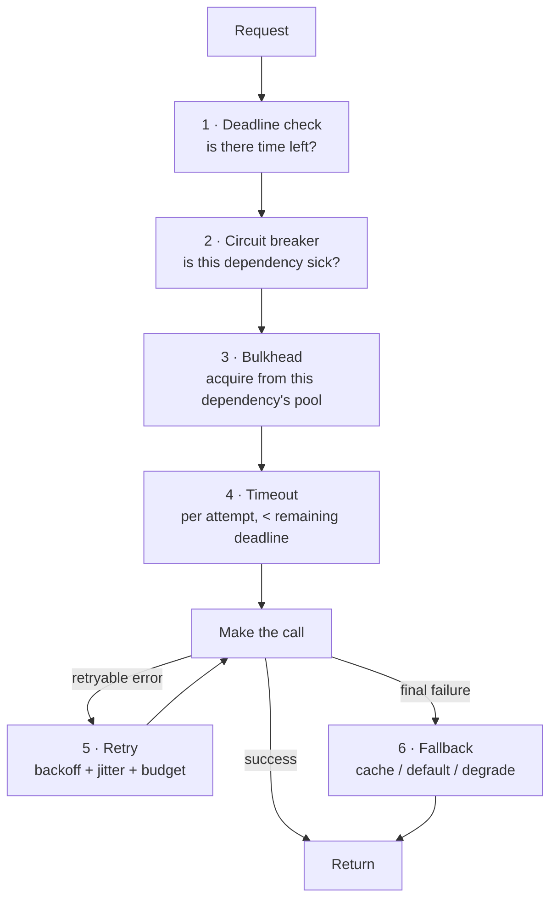

# 2.1.4 — Failure Handling in Synchronous Communication

> **Part 2 · Microservices & Data Flow · Synchronous Communication · Chapter 4 of 9**
> The overview chapter. The next four chapters are each one of these techniques in depth.

---

## 🧒 ELI5 — Explain Like I'm 5

You phone the dessert kitchen. Things that can go wrong, and what a sensible person does:

| What goes wrong | Sensible response | Real name |
|---|---|---|
| Nobody picks up | Decide in advance: "I'll wait 5 rings, then hang up" | **Timeout** |
| The line was just noisy | Try once more, wait a bit longer each time | **Retry with backoff** |
| Everyone rings at exactly the same second and jams the line | Each person waits a *slightly different* random amount | **Jitter** |
| They've failed the last 10 calls | Stop calling for 30 seconds — save your breath | **Circuit breaker** |
| You've given up on dessert | Serve ice cream from the freezer instead | **Fallback** |
| You have only 3 phones and all are tied up calling the broken kitchen | Reserve one phone *per kitchen* so a broken one can't hog them all | **Bulkhead** |
| You're getting more orders than you can cook | Politely turn some away at the door, fast | **Load shedding** |
| You did call them but never heard back — did they make the dessert? | Give every order a number so a repeat order isn't made twice | **Idempotency** |

Eight tools. Every one is needed. Missing any one turns someone else's bad day into *your* outage.

---

## The layered defence



Order matters. Check the deadline before doing anything; check the breaker before consuming a pool slot; take a bulkhead slot before opening a connection; time out each attempt individually.

---

## The eight techniques at a glance

| # | Technique | Protects against | Cost |
|---|---|---|---|
| 1 | **Timeout** | Unbounded waits, thread exhaustion | May abandon work that would have succeeded |
| 2 | **Retry** | Transient blips | Amplifies load; duplicates without idempotency |
| 3 | **Backoff + jitter** | Retry storms, thundering herds | Slower recovery for the individual request |
| 4 | **Circuit breaker** | Wasting resources on a dead dependency; giving it room to recover | Fails requests that might have worked |
| 5 | **Bulkhead** | One dependency exhausting shared resources | Lower utilisation; more configuration |
| 6 | **Fallback** | Total feature failure | Degraded or stale results |
| 7 | **Load shedding** | Congestive collapse | Some users are rejected |
| 8 | **Idempotency** | Duplicate side effects from retries | Storage and complexity on the server |

---

## Choosing what to do on failure — the decision table

| Situation | Response |
|---|---|
| Transient network error, idempotent operation | Retry with backoff |
| Transient network error, **non**-idempotent operation | Retry **only** with an idempotency key; otherwise fail |
| Timeout on a write | Do **not** blind-retry — reconcile, or retry with an idempotency key |
| 4xx client error | Never retry. Fix the request. |
| 429 rate limited | Retry after `Retry-After`, with backoff |
| Circuit open | Fail fast to the fallback; do not queue |
| Dependency is optional (recommendations, badges) | Fallback immediately; never let it fail the request |
| Dependency is critical (payment, auth) | Fail the request with a clear error; do not fake success |
| Partial results acceptable (search across 10 shards, 1 down) | Return partial with a `degraded: true` flag |

🎯 **Classify every dependency as critical or optional, explicitly, in the design.** Optional dependencies get aggressive timeouts and mandatory fallbacks. Critical ones get retries, redundancy, and honest errors. Candidates who do this sound like they've run production systems.

---

## Failing fast vs failing slow

**Fail fast** is almost always right.

A request that will ultimately fail should fail **as early and as cheaply as possible**:
- It releases the thread, connection, and memory immediately.
- It lets the client retry elsewhere while it still has deadline budget.
- It stops you doing work that will be thrown away.

☠️ The opposite — a 30 s default timeout — means a dead dependency holds your resources for 30 seconds per request. At 100 QPS that's 3,000 concurrent stuck requests. You are down.

---

## Partial failure and the consistency problem

Synchronous calls that mutate state create the hardest failure mode: **A succeeded, B failed.**

```
Order service:  create order       ✅
Payment service: charge card       ✅
Inventory service: reserve stock   ❌  (out of stock)
→ The customer has been charged for something they can't have.
```

Options, in order of preference:

| Approach | How | When |
|---|---|---|
| **Reorder to make the risky step last** | Reserve inventory *before* charging | Always try this first — free |
| **Saga with compensations** | Explicit "refund payment" step on failure | Multi-step business transactions ([Saga](../../07-patterns-and-templates/01-patterns/10-saga-pattern.md)) |
| **Reservation / two-phase business flow** | Reserve → confirm, with reservation expiry | Booking, ticketing, inventory |
| **Outbox + async** | Commit locally, publish an event, let downstream retry forever | When downstream must eventually happen |
| **Reconciliation job** | Periodically find and fix mismatches | Always have one as a backstop |
| ~~2PC / XA~~ | Distributed transaction coordinator | Rarely — blocking, fragile, poorly supported |

⚠️ **Always have a reconciliation job.** No matter how careful the design, distributed systems drift. A nightly job that finds orders with payments but no inventory reservation (and alerts or fixes) is the difference between a system you can trust and one you hope about.

---

## The failure-handling configuration, worked

For a checkout flow with a 3 s total budget:

| Dependency | Critical? | Timeout | Retries | Breaker | Fallback |
|---|---|---|---|---|---|
| Auth | Yes | 200 ms | 1 | Yes | None — fail 401 |
| Inventory | Yes | 300 ms | 2 (idempotent read) | Yes | Cached count + optimistic reserve |
| Pricing | Yes | 200 ms | 2 | Yes | Last known price (with a max age) |
| Payment | Yes | 2,000 ms | 1, **with idempotency key** | Yes | None — fail honestly |
| Fraud check | No | 150 ms | 0 | Yes | Allow, flag for async review |
| Recommendations | No | 100 ms | 0 | Yes | Static popular list |
| Loyalty points | No | — | — | — | **Async event** — not in the request at all |
| Confirmation email | No | — | — | — | **Async event** |

Sum of critical timeouts: 200 + 300 + 200 + 2,000 = 2,700 ms, inside the 3 s budget. Optional calls run in parallel and can't extend it.

🎯 Producing a table like this in a deep dive is one of the strongest things you can do in an interview. It shows you think in budgets, criticality, and degradation — not just boxes and arrows.

---

## Testing failure handling

You have not implemented failure handling until you have tested it.

| Test | Method |
|---|---|
| Timeout fires correctly | Inject a delay longer than the timeout (toxiproxy, mesh fault injection) |
| Retries don't duplicate | Force a timeout after the server commits; assert one effect |
| Circuit opens and recovers | Return 100 consecutive 503s, then heal; assert state transitions |
| Fallback works | Kill the dependency; assert the degraded response |
| Bulkhead isolates | Make C slow; assert calls to B still succeed |
| Retry storms are bounded | Force 100% failure; assert total outbound rate stays within budget |
| Deadline propagates | Assert the downstream receives a shrinking budget |

Fault injection at the mesh layer (Istio/Envoy `fault` filters) makes most of these one YAML change, which is why meshes are worth their complexity in larger systems.

---

## 📋 Chapter checklist

| Skill | Ready? |
|---|---|
| Name all eight techniques and what each protects against | ☐ |
| Order the defences correctly in the request path | ☐ |
| Decide retry-or-not from an error class | ☐ |
| Classify dependencies as critical or optional | ☐ |
| Explain why fail-fast beats fail-slow | ☐ |
| Give four approaches to partial failure, in preference order | ☐ |
| Produce a per-dependency failure-handling table for a flow | ☐ |
| Name six failure-handling tests | ☐ |

---

**← Previous** [2.1.3 Implementation](03-implementation.md)
**Next →** [2.1.5 Timeout](05-timeout.md)
