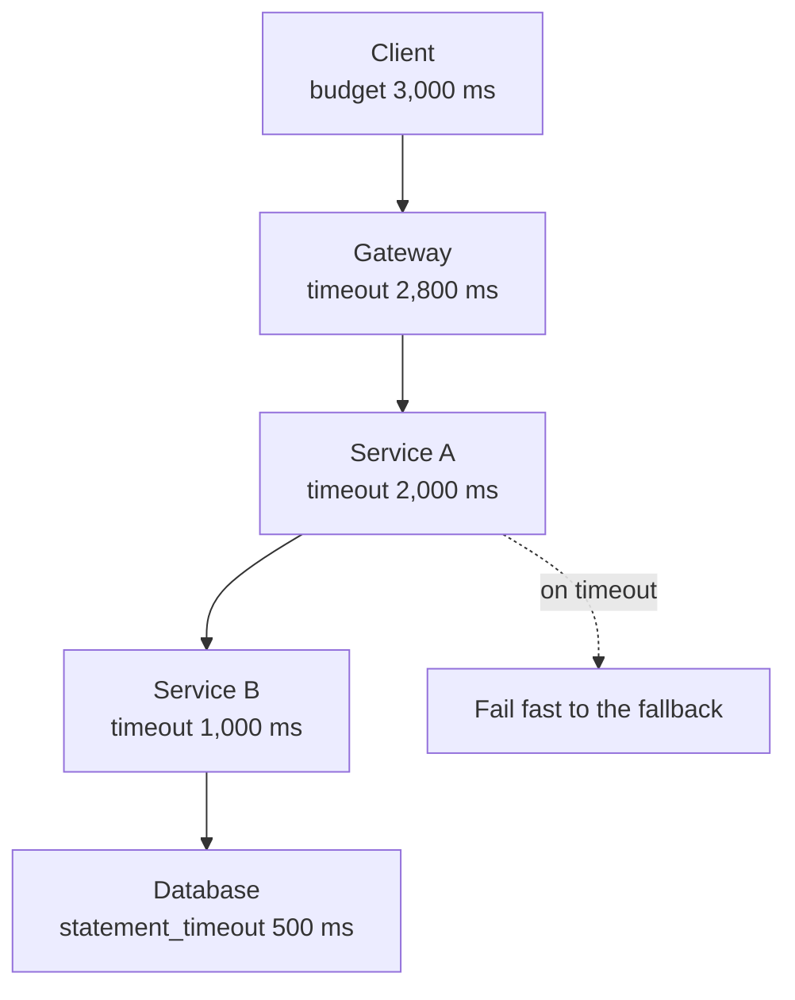

# 2.1.5 — Timeout

> **Part 2 · Microservices & Data Flow · Synchronous Communication · Chapter 5 of 9**
> The cheapest, most important, and most frequently misconfigured resilience control.

---

## 🧒 ELI5 — Explain Like I'm 5

A timeout is **deciding, before you knock, how long you'll wait at the door.**

"I'll knock, count to five, and if nobody comes I'm leaving."

Why this matters so much: **without a limit, you might stand there forever.** And while you stand there, you can't do anything else — and the person waiting behind *you* can't do anything either.

Two ways to get it wrong:

- **Too long** (wait an hour): you're stuck, and so is everyone behind you. This is how one sleepy neighbour freezes the whole street.
- **Too short** (count to one): you leave just as they were reaching for the handle. Now you knock again, and again, and you've made everything *worse* by knocking constantly.

So: **long enough that a healthy neighbour always makes it, short enough that a sleeping one doesn't cost you your whole day.** The right number is "a bit more than how long they normally take."

---

## Why timeouts are non-negotiable



**Timeouts must shrink down the chain.** If an inner layer's timeout exceeds its caller's remaining budget, the caller gives up first and the inner work is wasted — capacity spent producing an answer nobody will read.


| Without a timeout | With a timeout |
|---|---|
| A hung dependency holds your thread forever | The thread is released after N ms |
| TCP alone may take **minutes** to notice a dead peer (or never, if the peer is silently partitioned) | You control the bound |
| At 100 QPS a 5-minute hang means 30,000 stuck requests | Bounded concurrency |
| Memory and connections leak until OOM | Steady state |

☠️ **Default timeouts are usually catastrophic.** Many HTTP clients default to **no timeout at all** (Go's `http.Client`, Python `requests`, Java's old `HttpURLConnection` connect-only). Many database drivers default to 30 s or infinity. **Every network client in your codebase needs an explicit timeout.** This is the single highest-value line of code in a resilience review.

---

## The kinds of timeout (they are not the same)

| Timeout | Covers | Typical value |
|---|---|---|
| **Connect timeout** | TCP handshake | 100–500 ms (same region) |
| **TLS handshake timeout** | TLS negotiation | 100–500 ms |
| **Write/send timeout** | Sending the request body | Size-dependent |
| **Read/response timeout** | Waiting for the first byte, or between bytes | The main one |
| **Overall request timeout** | The whole call, all attempts | The one that matters most |
| **Idle connection timeout** | How long an unused pooled connection lives | < the LB's idle timeout |
| **Socket/TCP keepalive** | Detects dead peers on idle connections | 30–60 s |
| **Server-side request timeout** | Server abandons work after N ms | Prevents wasted work |
| **Database query timeout** (`statement_timeout`) | One query | Shorter than the request timeout |
| **Transaction/lock timeout** | Waiting for a lock | Short — a lock wait is a queue |

⚠️ **A "read timeout" is often per-read, not total.** A malicious or broken server can trickle one byte every 4 seconds forever and never trip a 5 s read timeout. **You need an overall deadline as well** — this is the "slowloris" class of problem.

---

## Choosing the value

**Start from the dependency's latency distribution, not from a round number.**

$$\text{timeout} \approx p99.9 \text{ of the healthy dependency} \times 1.5$$

| If the dependency's p99 is | Set the timeout around |
|---|---|
| 10 ms | 50 ms |
| 50 ms | 150–200 ms |
| 200 ms | 500 ms |
| 1 s | 2 s |

Reasoning: you want essentially all *healthy* responses to complete, and everything slower to be abandoned. Setting a timeout at p50 fails half your traffic; setting it at 30 s is the same as having none.

### The constraint from above

$$\text{timeout}_{\text{callee}} < \text{remaining deadline}_{\text{caller}}$$

Timeouts must **shrink down the call chain**. If they don't, the outer caller gives up first and the inner work is wasted.

```
❌ WRONG                          ✅ RIGHT
Client   30 s                     Client   3,000 ms
  API    30 s                       API    2,800 ms
    B    30 s                         B    2,000 ms
      C  30 s                           C  1,000 ms
                                          DB  500 ms
Everything hangs together.        Each layer fails fast, inside its parent's budget.
```

### Timeout × retries interact

**The total budget must include retries.**

```
Per-attempt timeout   500 ms
Max attempts          3
Backoff               100 ms, 200 ms
Worst case            500 + 100 + 500 + 200 + 500 = 1,800 ms
→ The caller's overall deadline must be ≥ 1,800 ms, or configure fewer attempts.
```

☠️ Configuring "3 retries with a 2 s timeout" behind a caller with a 3 s deadline means retries 2 and 3 can never run — they are pure configuration theatre. Worse, in some clients the attempts still start and burn downstream capacity for nothing.

---

## Deadline propagation (the professional approach)

Instead of static per-hop timeouts, pass the **absolute deadline** and let each hop compute its own budget.

```go
// gRPC / Go — the deadline travels with the context automatically
ctx, cancel := context.WithTimeout(ctx, 3*time.Second)
defer cancel()
resp, err := client.GetOrder(ctx, req)   // downstream sees the remaining time
```

With HTTP, send a header and honour it:

```http
X-Timeout-Ms: 580
# or absolute, if clocks are trustworthy:
X-Request-Deadline: 2026-08-31T10:04:11.580Z
```

**Servers must check it before starting expensive work:**

```python
remaining = deadline - now()
if remaining <= 0:
    return 504  # don't start; the client has already given up
if remaining < estimated_cost:
    return 504  # we can't finish in time — fail now, cheaply
```

🎯 This "**don't start what you can't finish**" check is a genuinely advanced detail. During overload it is the difference between a system that recovers and one that spends all its capacity producing answers nobody reads.

⚖️ Relative (`X-Timeout-Ms`) avoids clock-skew problems but loses accuracy across hops. Absolute is precise but requires reasonably synchronised clocks (NTP is fine for millisecond-scale budgets). gRPC uses relative-on-the-wire, absolute-internally, which is the best of both.

---

## Cancellation — the other half of timeouts

A timeout on the client only helps the client. **The server keeps working** unless it is told to stop.

| Mechanism | Effect |
|---|---|
| HTTP/1.1 | Client closes the connection; the server *may* notice — many frameworks don't check |
| HTTP/2 | `RST_STREAM` explicitly cancels that stream |
| gRPC | Context cancellation propagates through the whole downstream chain |
| Database | Requires `statement_timeout` / query cancellation — a closed client connection does **not** stop a running query in many engines |

☠️ **The uncancelled-query trap:** the client times out at 500 ms, but a 60-second query keeps running in Postgres, holding locks and CPU. The client retries; now there are two. Then four. The database dies from work whose results will all be discarded. **Always set a server-side `statement_timeout` as well as a client-side one.**

---

## Where timeouts must exist — the audit list

```
□ HTTP client (connect, TLS, response, overall)
□ gRPC client (deadline on every call)
□ Database driver (connect, query/statement, transaction/lock wait)
□ Connection pool acquisition (waiting for a free connection)
□ Cache client (Redis/Memcached — often defaults to blocking forever)
□ Message broker publish and consume
□ DNS resolution
□ Object storage / S3 SDK
□ Third-party API SDKs (often default to no timeout)
□ Server-side request handler (abandon after N ms)
□ Graceful shutdown drain period
□ Health check probe
□ Lock acquisition (distributed lock lease)
```

**Every single one.** A missing timeout in an obscure SDK is a latent outage waiting for that dependency's bad day.

---

## Observability

Metrics that make timeout misconfiguration visible:

```
rpc_client_duration_seconds{target}       histogram — compare to the configured timeout
rpc_client_timeouts_total{target}         should be near zero in steady state
rpc_client_deadline_remaining_seconds     shows whether budget is being consumed sanely
server_requests_abandoned_total           requests dropped because the deadline had passed
```

**Rule of thumb:** if timeouts are firing in normal operation, the timeout is too tight or the dependency has regressed. If timeouts *never* fire even during incidents, they are too loose to protect you.

Plot the configured timeout as a line on the latency histogram dashboard. The gap between p99.9 and the timeout is your safety margin, and you can see it shrink as a dependency degrades — **before** it becomes an incident.

---

## ☠️ Failure modes

| Mistake | Consequence |
|---|---|
| No timeout | Threads and connections leak; cascading failure |
| Default 30–60 s timeout | Effectively no timeout at production QPS |
| Timeout longer than the caller's deadline | Wasted work; the caller already gave up |
| Timeouts identical at every layer | The innermost never fails first; no fast failure |
| Ignoring retries in the budget | Retries never execute, or the total blows the deadline |
| Client timeout without server-side cancellation | The server keeps burning CPU on abandoned work |
| Per-read timeout without an overall deadline | Slow-trickle responses hang indefinitely |
| Timeout tuned to p50 | Half of healthy requests fail |
| Same timeout for a cache read and a report generation | One of them is wrong |

---

## 📋 Chapter checklist

| Skill | Ready? |
|---|---|
| Name six distinct kinds of timeout | ☐ |
| Derive a timeout from a latency distribution | ☐ |
| Explain why timeouts must shrink down the chain | ☐ |
| Compute a total budget including retries and backoff | ☐ |
| Explain deadline propagation and the "don't start" check | ☐ |
| Explain the uncancelled-query trap | ☐ |
| Recite the timeout audit list | ☐ |
| Say what a timeout metric near zero, or high, means | ☐ |

---

**← Previous** [2.1.4 Failure Handling](04-failure-handling.md)
**Next →** [2.1.6 Retries](06-retries.md)
