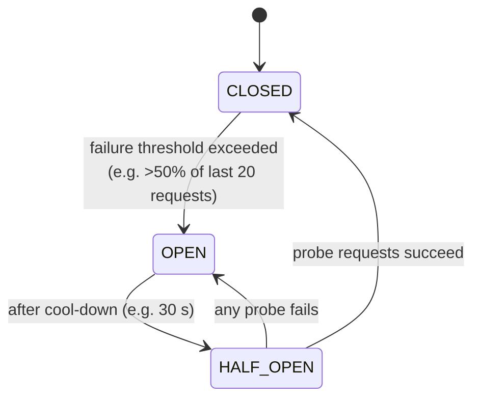

# 2.1.7 — Circuit Breaker

> **Part 2 · Microservices & Data Flow · Synchronous Communication · Chapter 7 of 9**
> Stop calling something that is clearly broken. Give it room to recover.

---

## 🧒 ELI5 — Explain Like I'm 5

You've phoned the dessert kitchen **twenty times in a row** and every single call failed.

What does a sensible person do on call twenty-one?

**Not call.** Obviously. You already know the answer.

So you flip a little switch in your head: *"Dessert kitchen is broken. Don't phone them for the next 30 seconds. Serve ice cream instead."*

Then after 30 seconds you **try exactly one call** — just one, to check. If it works, great, flip the switch back and resume normal calling. If it fails, wait another 30 seconds.

Why this matters, and it's not obvious:

**You're not just saving your own time — you're helping them recover.** If a kitchen is overwhelmed and 50 cooks keep phoning, it can never catch up. Stopping the calls gives it the quiet it needs to get back on its feet.

That switch in your head is a **circuit breaker**. It's named after the thing in your house that cuts the power when something's wrong, so the wire doesn't catch fire.

---

## The three states



| State | Behaviour | Purpose |
|---|---|---|
| **Closed** | All calls pass through; failures are counted | Normal operation |
| **Open** | **All calls fail immediately** without a network attempt; the fallback runs | Stop wasting resources; let the dependency recover |
| **Half-open** | A small number of trial calls are allowed | Test recovery without a stampede |

The half-open state is the clever part. Going straight from open to closed would send full traffic at a service that may still be fragile, immediately re-breaking it. Half-open admits one or a few requests, and only fully reopens if they succeed.

---

## What a circuit breaker actually buys you

| Benefit | Mechanism |
|---|---|
| **Fail fast** | Requests fail in microseconds instead of waiting for a timeout — resources released instantly |
| **Resource protection** | No threads, connections, or memory held by doomed calls |
| **Dependency recovery** | Removing load is often what a struggling service needs |
| **Stops cascading failure** | The failure is contained at this boundary |
| **Clear signal** | Breaker state is an excellent alert and dashboard metric |

☠️ **Without a breaker:** a dependency times out at 2 s. At 500 QPS that's 1,000 concurrent stuck requests, each holding a thread and a connection. The pool exhausts, and calls to *healthy* dependencies start failing too. **With a breaker:** after ~20 failures, subsequent calls fail in ~1 μs and go straight to the fallback. Nothing is held.

---

## Configuration

```yaml
circuit_breaker:
  # When to open
  failure_rate_threshold: 50%          # of calls in the window
  slow_call_rate_threshold: 100%       # slow counts as failure...
  slow_call_duration: 1s               # ...if slower than this
  minimum_calls: 20                    # don't judge on 2 samples
  sliding_window: 100                  # count-based, or:
  # sliding_window_duration: 60s       # time-based

  # How long to stay open
  wait_duration_in_open: 30s

  # Half-open behaviour
  permitted_calls_in_half_open: 5
  # closes only if all/most succeed
```

| Parameter | Too low | Too high |
|---|---|---|
| `failure_rate_threshold` | Opens on normal noise; unnecessary degradation | Opens too late; damage already done |
| `minimum_calls` | Opens on a statistical fluke | Slow to react on low-traffic services |
| `wait_duration_in_open` | Retries too eagerly, re-breaks the dependency | Stays degraded after recovery |
| `slow_call_duration` | Everything counts as slow | Never catches slow-but-not-failing dependencies |

🎯 **Counting slow calls as failures is the underrated setting.** As established in [Chapter 2.1.2](02-synchronous-communication.md#cascading-failure--the-mechanism), *slow is worse than down*. A dependency returning 200 OK after 5 s will exhaust your pool just as surely as one returning errors — and a naive error-rate breaker never fires. Configure `slow_call_rate_threshold`.

---

## Granularity — what should the breaker wrap?

| Granularity | Example | Trade-off |
|---|---|---|
| **Per service** | All calls to `payments` | Simple; but one broken endpoint disables healthy ones |
| **Per endpoint** | `payments.Charge` vs `payments.GetStatus` | ✅ **Usually right** — failures are often endpoint-specific |
| **Per instance** | One replica of payments | This is really *outlier ejection*; the LB should do it |
| **Per tenant/partition** | One customer's shard | Prevents one noisy tenant tripping everyone's breaker |

**Default: per (service, endpoint).** A slow `Charge` should not break `GetStatus`.

⚠️ **Breakers are per-process by default.** Each instance keeps its own counters, so with 50 instances you get 50 independent breakers. That is usually *good* (fast, no coordination, no shared failure point) but means the breaker opens gradually across the fleet rather than instantly. Shared/distributed breaker state adds a dependency and a new failure mode — generally not worth it.

---

## Circuit breaker vs adjacent techniques

| Technique | What it does | Difference |
|---|---|---|
| **Circuit breaker** | Client stops calling a failing dependency | Protects the **caller** (and indirectly the callee) |
| **Rate limiter** | Caps request rate regardless of health | Protects the **callee**; always on |
| **Bulkhead** | Caps concurrent calls per dependency | Limits *resource share*, not error rate |
| **Outlier ejection** | LB removes a bad *instance* from the pool | Instance-level; the breaker is dependency-level |
| **Load shedding** | Server rejects excess work | Server-side; the breaker is client-side |
| **Retry** | Try again on failure | The breaker's opposite; they must be configured together |

⚠️ **Retries and breakers interact.** Do not count each retry attempt as a separate failure, or a 3-retry policy trips the breaker three times faster than intended. Most libraries count one *logical call* (all attempts) as one sample. Check yours.

---

## Implementation sketch

```python
class CircuitBreaker:
    def __init__(self, threshold=0.5, min_calls=20, cool_down=30, half_open_max=5):
        self.state = "CLOSED"
        self.window = deque(maxlen=100)      # recent outcomes: True=ok, False=fail
        self.opened_at = None
        self.half_open_inflight = 0
        self.threshold, self.min_calls = threshold, min_calls
        self.cool_down, self.half_open_max = cool_down, half_open_max

    def call(self, fn, fallback):
        if self.state == "OPEN":
            if monotonic() - self.opened_at >= self.cool_down:
                self.state, self.half_open_inflight = "HALF_OPEN", 0
            else:
                return fallback()                        # fail fast

        if self.state == "HALF_OPEN" and self.half_open_inflight >= self.half_open_max:
            return fallback()                            # limit probes

        if self.state == "HALF_OPEN":
            self.half_open_inflight += 1

        try:
            result = fn()
            self._record(True)
            return result
        except TransientError:
            self._record(False)
            return fallback()

    def _record(self, ok):
        self.window.append(ok)
        if self.state == "HALF_OPEN":
            if not ok:
                self.state, self.opened_at = "OPEN", monotonic()
            elif self.half_open_inflight >= self.half_open_max:
                self.state, self.window = "CLOSED", deque(maxlen=100)
        elif self.state == "CLOSED" and len(self.window) >= self.min_calls:
            failure_rate = 1 - (sum(self.window) / len(self.window))
            if failure_rate >= self.threshold:
                self.state, self.opened_at = "OPEN", monotonic()
```

Notes on details that matter: use a **monotonic clock** (wall-clock jumps break cool-downs); only count **transient** errors (a 400 is not a dependency failure); and reset the window on close so old failures don't immediately re-open it.

**In practice, don't write this.** Use Resilience4j (Java), Polly (.NET), `gobreaker`/`sony/gobreaker` (Go), `pybreaker` (Python), or — better — let Envoy/Istio do it with zero application code.

---

## Observability

```
circuit_breaker_state{target="payments.Charge"}          0=closed 1=half_open 2=open
circuit_breaker_transitions_total{target, from, to}
circuit_breaker_calls_total{target, outcome}             ok | failed | rejected | slow
circuit_breaker_failure_rate{target}
```

**Alert on `state == OPEN` for longer than N minutes.** A breaker opening briefly is the system working. A breaker stuck open means a dependency is genuinely down and users are degraded — that is an incident.

Dashboards should show breaker state next to the dependency's latency, so an on-call engineer sees *"payments p99 went to 4 s, breaker opened, fallback rate 100%"* in one glance. That is MTTR, which is availability.

---

## ☠️ Failure modes

| Mistake | Consequence |
|---|---|
| No breaker at all | Cascading failure via resource exhaustion |
| Breaker on a **critical** dependency with no fallback | You've converted slow failures into fast failures — better, but users still fail. Make sure that's intended. |
| Threshold too sensitive | Opens on normal noise; self-inflicted outage |
| Not counting slow calls | The most dangerous failure mode goes undetected |
| Counting non-transient errors (400s) | User input errors open the breaker |
| Retries counted as separate failures | Trips 3× too fast |
| No half-open state | Full traffic slams a fragile service on recovery |
| Wall-clock instead of monotonic time | NTP adjustments cause bizarre behaviour |
| Breaker per service instead of per endpoint | One broken endpoint disables healthy ones |
| No alert on stuck-open | Silent long-term degradation |

---

## 📋 Chapter checklist

| Skill | Ready? |
|---|---|
| Draw the three states and every transition | ☐ |
| Explain why half-open exists | ☐ |
| Explain how a breaker helps the *callee* recover | ☐ |
| List the six configuration parameters and their failure modes | ☐ |
| Explain why slow calls must count as failures | ☐ |
| Distinguish breaker, bulkhead, rate limiter, outlier ejection | ☐ |
| Explain why per-process breakers are usually fine | ☐ |
| Name the metrics and the alert condition | ☐ |

---

**← Previous** [2.1.6 Retries](06-retries.md)
**Next →** [2.1.8 Fallbacks](08-fallbacks.md)
