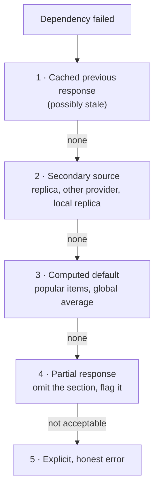

# 2.1.8 — Fallbacks

> **Part 2 · Microservices & Data Flow · Synchronous Communication · Chapter 8 of 9**
> What you return when the real answer isn't available. The difference between degraded and down.

---

## 🧒 ELI5 — Explain Like I'm 5

The dessert kitchen isn't answering. You've given up calling. **Now what do you actually put on the plate?**

You have choices, from best to worst:

1. **Yesterday's dessert from the fridge.** Slightly stale, but real dessert. *(Serve from cache.)*
2. **The standard house dessert** that you always have ready. Not personalised, but fine. *(A sensible default.)*
3. **Ask a different kitchen** to make something simple. *(Secondary source.)*
4. **No dessert, but the rest of the meal comes out normally**, with a small note: "sorry, no desserts today." *(Partial response / degrade.)*
5. **Refuse to serve the entire meal** because dessert is unavailable. *(No fallback — the whole request fails.)*

Option 5 is what happens by default if you don't plan. It is almost always the wrong answer, because **the dessert was never the point of the meal.**

But — and this matters — sometimes the missing thing *is* the point. If the **payment** machine is down, you must not hand over the food and pretend it was paid for. **Some things you fake. Some things you must never fake.** Knowing which is which is the whole skill.

---

## The fallback ladder

Try these in order. Take the highest one that is honest.



| Level | Example | When it's right |
|---|---|---|
| **1. Stale cache** | Serve the product page cached 10 min ago | Data changes slowly; staleness is visible but harmless |
| **2. Secondary source** | Read from a replica; use a second SMS provider | You have real redundancy |
| **3. Default value** | "Popular near you" instead of personalised recommendations | Personalisation is a bonus, not the product |
| **4. Partial response** | Render the page without the reviews section | The section is separable |
| **5. Honest error** | "Payments are temporarily unavailable, you have not been charged" | Faking it would be wrong or dangerous |

🎯 **The wording of level 5 matters.** "Something went wrong" is bad. *"Payments are temporarily unavailable. You have **not** been charged. Please try again in a few minutes."* is good — it tells the user the state of the world and what to do. Error copy is part of system design.

---

## Critical vs optional — decide this at design time

| | Critical dependency | Optional dependency |
|---|---|---|
| Definition | The request is meaningless without it | Enhances but doesn't define the response |
| Examples | Auth, payment, inventory-at-checkout, the primary datastore | Recommendations, badges, "people also viewed", fraud scoring, analytics |
| Timeout | Generous (it must succeed) | **Aggressive** (100–200 ms) |
| Retries | Yes | Zero or one |
| Fallback | Usually none — fail honestly | **Mandatory** |
| Failure effect | Request fails with a clear error | Feature silently degrades |

☠️ **The most common production failure of this kind:** an optional service (recommendations, a badge counter, an A/B config lookup) is called synchronously with no timeout and no fallback. It goes down. The whole page 500s. **A cosmetic feature took down the product.** Classifying every dependency, in writing, prevents this.

---

## Fallback techniques in detail

### 1. Serve stale from cache

```
Normal:  cache hit (fresh)      → return
         cache miss             → origin → populate → return
Failure: origin fails, cache has a stale entry → return stale + mark it
```

Implement with a **two-tier TTL**:

```
soft_ttl = 60 s     → after this, refresh in the background but still serve
hard_ttl = 24 h     → after this, the entry is genuinely gone
```

HTTP has this built in:
```http
Cache-Control: max-age=60, stale-while-revalidate=300, stale-if-error=86400
```
`stale-if-error` alone converts a large class of origin outages into invisible events at the CDN. It is one line of configuration and one of the highest-value availability wins available.

⚠️ **Always tell the user (or at least the client) that data is stale** where it matters — a "last updated 10 minutes ago" line. Silently serving stale prices or balances is how you get complaints you cannot reproduce.

### 2. Secondary source

| Primary | Secondary |
|---|---|
| Database primary | Read replica (for reads only) |
| Cache tier | Local in-process cache |
| SMS provider A | SMS provider B |
| Geo service | Coarse IP-based geolocation |
| Live inventory | Last known count + optimistic reservation |

⚖️ True provider redundancy is genuinely valuable for critical third parties (payments, SMS, email) and genuinely expensive — two integrations to build, test, and keep working. Reserve it for dependencies whose outage would be existential.

### 3. Computed default

| Missing | Default |
|---|---|
| Personalised feed | Globally popular / editorially curated |
| Search ranking model | Simple relevance sort (BM25) |
| Dynamic price | Base list price |
| User's language preference | Accept-Language header, then site default |
| Feature flag service | The value baked into the last deploy |

**The feature-flag case is worth stating explicitly:** a flag service must **fail to the last-known-good value cached on disk**, never to "flag off" or an exception. A flag service outage flipping every feature off is a self-inflicted global outage — and it has happened to real companies.

### 4. Partial response

```json
{
  "product": { "id": "p1", "name": "Kettle", "price_minor": 2499 },
  "reviews": null,
  "recommendations": null,
  "degraded": ["reviews", "recommendations"]
}
```

Tell the client what's missing so it can render sensibly (skeleton, hide the section, retry later) instead of guessing. Also emit it as a metric: `response_degraded_total{section="reviews"}`.

---

## When NOT to fall back

| Situation | Why faking it is wrong |
|---|---|
| Payment authorisation | Shipping unpaid goods |
| Authentication | Letting anyone in |
| Authorization | Data breach |
| Inventory at the point of sale | Overselling; angry customers, refunds |
| Balance / limit checks | Overdrafts, fraud |
| Anything legally or financially binding | Obvious |

🎯 **The rule:** fall back on **reads that are approximate**, never on **decisions that must be correct**. If the fallback could produce a wrong *decision* rather than a stale *display*, don't have one — fail honestly.

There is a middle path for some of these: **fail into a safe mode**. Fraud service down → allow the transaction *below a value threshold* and queue it for manual review. Inventory service down → accept the order as "pending stock confirmation" rather than confirming it. This is often better than either faking or failing.

---

## Fallbacks have failure modes too

☠️ **The fallback stampede.** The primary datastore fails, so every request falls back to the secondary. The secondary was sized for 5% of traffic and now gets 100%. It dies. **Your fallback must be able to handle the load it will actually receive**, or be paired with load shedding.

☠️ **The untested fallback.** Fallback code runs approximately never, so it rots: a stale schema, an expired credential, a bug introduced two years ago. **Exercise fallbacks regularly** — force them in staging on every release, or run a small percentage of production traffic through them deliberately.

☠️ **The silent fallback.** Everything looks fine on dashboards because requests return 200 — but every response is a default value. **Always emit a metric when a fallback fires**, and alert if the rate exceeds a threshold. A 100% fallback rate is an outage that returns 200s.

☠️ **The recursive fallback.** The fallback calls something that also fails, which falls back to something else. Keep fallbacks **simple and local** — ideally a value in memory, not another network call.

---

## Observability

```
fallback_used_total{dependency, level}       level = stale_cache | default | partial
response_degraded_total{section}
dependency_failure_total{dependency, reason}
cache_stale_served_total{key_prefix}
```

Alerts:
- `fallback_used_total` rate > 5% for 5 min → warn (a dependency is unhealthy)
- `fallback_used_total` rate > 50% for 2 min → page (the feature is effectively down)
- `fallback_used_total` == 0 for a month → the fallback has never been exercised; test it

---

## Design script for an interview

> "I'd classify dependencies as critical or optional. Auth, inventory, and payment are critical: generous timeouts, retries with idempotency keys, and no fallback — if payment fails we fail the checkout honestly and tell the user they haven't been charged.
>
> Recommendations and reviews are optional: 100 ms timeout, no retries, and a mandatory fallback — stale cache first, then a globally popular list, then omit the section with a `degraded` flag so the client renders without it.
>
> Every fallback emits a metric so a 100% fallback rate pages someone; otherwise we'd serve 200s that are all defaults and never notice. And I'd size the fallback path for full traffic, because when it fires it fires for everyone."

---

## 📋 Chapter checklist

| Skill | Ready? |
|---|---|
| Recite the five-level fallback ladder | ☐ |
| Classify dependencies as critical vs optional with different configs | ☐ |
| Explain `stale-if-error` and why it's high-value | ☐ |
| Explain why a feature-flag service must fail to last-known-good | ☐ |
| State the rule about approximate reads vs correct decisions | ☐ |
| Describe "safe mode" as a middle path | ☐ |
| Name the four fallback failure modes | ☐ |
| Explain why fallbacks must emit metrics | ☐ |

---

**← Previous** [2.1.7 Circuit Breaker](07-circuit-breaker.md)
**Next →** [2.1.9 Service Discovery](09-service-discovery.md)
