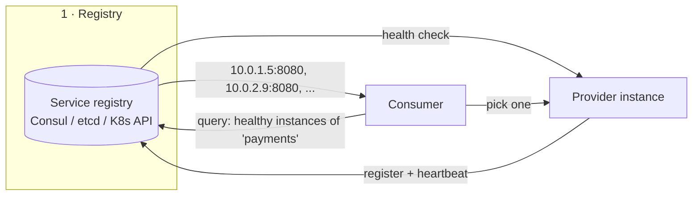
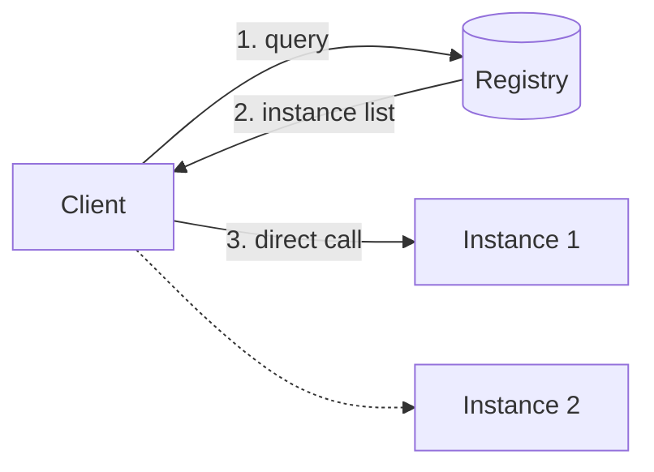
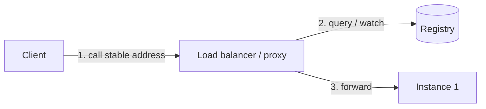

# 2.1.9 — Service Discovery

> **Part 2 · Microservices & Data Flow · Synchronous Communication · Chapter 9 of 9**
> How a service finds a healthy instance of another service, in a world where instances appear and vanish constantly.

---

## 🧒 ELI5 — Explain Like I'm 5

You want to phone the dessert kitchen. **What's their number?**

In the old days you'd write it on the wall. Simple — until they move. Then everyone's wall has the wrong number and nobody can order dessert.

In a modern kitchen, kitchens open and close **all day long**. New ones appear when it gets busy. Old ones vanish when it's quiet. Writing numbers on walls is hopeless.

So instead there's a **phone book that updates itself**:

- Every kitchen, when it opens, **phones the phone book** and says *"Hi, I'm a dessert kitchen, here's my number, I'm ready."*
- Every 10 seconds it phones again to say **"still alive."**
- If it stops phoning, the phone book **crosses it out**.
- When you want dessert, you ask the phone book for *"any dessert kitchen"* and it gives you a live number.

Two ways to use the book:

- **You look it up yourself**, then dial. Fast, but every cook needs to know how to read the book. *(Client-side discovery.)*
- **You dial one central number** — an operator — and *they* look it up and connect you. Simpler for you; the operator is now very important. *(Server-side discovery.)*

That's it. A self-updating phone book, plus someone crossing out the dead entries.

---

## Why it's needed

Static configuration (`payments.internal:8080` in a config file) works until any of these are true:

| Reality | Why static config fails |
|---|---|
| Instances autoscale | The set of IPs changes every few minutes |
| Containers are rescheduled | IPs change on every deploy |
| Instances fail | You'd route traffic to a dead box |
| Blue-green / canary deploys | Two versions must coexist and shift traffic |
| Multi-AZ / multi-region | You want the *nearest healthy* instance |

Service discovery answers: **"give me the current set of healthy instances of service X, ideally sorted by how good they are for me right now."**

---

## The three components



1. **Registration** — instances announce themselves (self-registration) or a platform registers them (third-party registration, e.g. Kubernetes registering pods).
2. **Health checking** — the registry removes instances that stop responding. This is the part that makes it *useful* rather than just a directory.
3. **Resolution** — consumers look up the current set and choose one.

---

## Client-side vs server-side discovery

### Client-side



| ✅ | ❌ |
|---|---|
| One fewer network hop | Discovery logic in every client, in every language |
| Client can do smart load balancing (least-request, locality-aware, outlier ejection) | Clients must handle registry outages and caching |
| No load balancer to scale or fail | Tighter coupling to the registry's API |

Examples: gRPC with a resolver plugin, Netflix Ribbon + Eureka, Finagle.

### Server-side



| ✅ | ❌ |
|---|---|
| Clients are dumb — just call one name | An extra hop (~0.5–1 ms) |
| One place for policy: retries, TLS, routing | The proxy must be highly available |
| Language-agnostic | Less client-local information (e.g. per-client least-request) |

Examples: AWS ALB/NLB with target groups, Kubernetes Services, NGINX/HAProxy with dynamic upstreams.

### The modern answer: a sidecar

A **service mesh** gives you both: an Envoy sidecar in every pod does *client-side* discovery and load balancing, but the application just calls `localhost`. Clients stay dumb; load balancing stays smart. The cost is a sidecar per pod (memory, ~0.5–1 ms, operational complexity).

---

## Discovery mechanisms in practice

| Mechanism | How it works | Notes |
|---|---|---|
| **DNS (A/SRV records)** | Resolve a name to a set of IPs | Universal, but TTL caching makes it slow to reflect change; many clients cache forever |
| **Kubernetes Service + kube-proxy** | A stable ClusterIP; iptables/IPVS rules DNAT to a random healthy pod | The default in K8s; L4 only |
| **Kubernetes headless Service** | DNS returns all pod IPs directly | Enables client-side load balancing (needed for gRPC) |
| **Consul** | Agents register services; DNS or HTTP API; built-in health checks | Very mature; multi-datacenter |
| **etcd** | Raw KV with leases; you build the conventions | The substrate under Kubernetes |
| **ZooKeeper** | Ephemeral znodes vanish when the session dies | Older, heavier, still common in Kafka/Hadoop ecosystems |
| **Eureka** | AP-oriented registry from Netflix | Prefers availability over consistency — deliberately |
| **Service mesh (Istio/Linkerd)** | Control plane pushes endpoints to sidecars | No app changes; richest feature set |
| **Cloud load balancers** | Target groups auto-registered by the ASG/scheduler | Simplest; managed |

⚠️ **The DNS caching trap.** JVM applications historically cached DNS resolutions **forever** (`networkaddress.cache.ttl=-1` with a security manager). Many HTTP clients resolve once when the connection pool is created and never again. Result: after a scale-out or failover, clients keep hammering old IPs. Fixes: short TTLs *and* client configuration, `maxConnAge` to force re-resolution, or use a mechanism that pushes changes (mesh/xDS) rather than one that's polled.

---

## Health checking

| Type | How | Trade-off |
|---|---|---|
| **Active (registry → instance)** | Registry periodically calls `/healthz` | Detects hangs; costs N×M checks |
| **Passive / outlier detection** | The proxy observes real traffic and ejects instances with consecutive 5xx or high latency | Free; catches failures active checks miss |
| **Heartbeat / TTL (instance → registry)** | Instance renews a lease every N s | Scales well; a network partition looks like death |
| **Process supervision** | The orchestrator knows the container died | Fast for crashes; blind to "alive but broken" |

**Use active + passive together.** Active checks catch a hung process; passive detection catches an instance that answers `/healthz` fine but fails every real request (a broken dependency binding, a corrupt cache, a bad shard assignment).

As in [Chapter 1.3.4](../../01-introduction/03-non-functional-requirements/04-how-to-achieve-high-availability.md): **readiness ≠ liveness**, and health checks should not test shared dependencies, or a database blip marks every instance unhealthy and takes down the whole service.

⚠️ **Fail open when everything is unhealthy.** If zero targets pass health checks, most good load balancers send traffic to *all* of them rather than none. Serving degraded beats serving nothing, and this rule has saved many incidents caused by a bad health-check deploy.

---

## Load balancing once you have the list

| Algorithm | Behaviour | Best for |
|---|---|---|
| **Round robin** | Even distribution by count | Uniform request costs |
| **Weighted round robin** | Respects instance capacity | Heterogeneous instance sizes |
| **Least connections / least requests** | Sends to the least busy | ✅ Variable request costs — usually the best default |
| **Power of two choices (P2C)** | Pick 2 at random, choose the less loaded | ✅ Near-optimal with almost no coordination; the modern default |
| **Consistent hashing** | Same key → same instance | Cache locality, sticky sessions ([Consistent Hashing](../../05-scaling-data-storage/02-data-partitioning/03-consistent-hashing.md)) |
| **Latency-aware / EWMA** | Prefers historically faster instances | Heterogeneous or cross-AZ fleets |
| **Zone-aware / locality** | Prefer same-AZ, spill over when unhealthy | Cuts cross-AZ latency and transfer cost |

🎯 **Power of two choices is worth naming.** Pure random is uneven; "least loaded" globally requires coordination and can herd everyone onto the same instance. Sampling two at random and picking the better one gets you most of the benefit of least-loaded with none of the coordination. It is what most modern proxies do.

---

## Failure modes

| Failure | Effect | Mitigation |
|---|---|---|
| **Registry is down** | Nobody can discover anything — a total outage | Clients cache the last known good list and keep using it; the registry is for *updates*, not for every call |
| **Stale registry entries** | Traffic to dead instances | Short TTLs, active health checks, client-side retry to a different instance |
| **Registration race on startup** | Traffic arrives before the instance is ready | Register only after readiness passes; use readiness gates |
| **No deregistration on shutdown** | Traffic to a terminating instance | Deregister first, then **drain** for a grace period, then exit (`preStop` hook) |
| **Thundering herd on registry** | Every client polls every second | Watch/streaming APIs (xDS, K8s watch) instead of polling; jittered polling as a fallback |
| **Split brain in the registry** | Two views of the world | Use a CP registry (etcd/Consul) for correctness-critical use, or accept AP (Eureka) with stale reads |

☠️ **Graceful shutdown is the most commonly botched part.** The correct sequence:

```
1. Receive SIGTERM
2. Deregister from the registry / fail the readiness probe
3. Wait (LB propagation delay — typically 5-30 s)  ← the step everyone skips
4. Stop accepting new connections
5. Finish in-flight requests (with a bound)
6. Close connections and exit
```

Skipping step 3 causes a burst of connection-reset errors on every single deploy, which teams often misdiagnose for months.

---

## What to say in an interview

> "On Kubernetes I'd get discovery for free — a Service gives a stable name, and the endpoints controller keeps the healthy pod list current. For gRPC I'd use a **headless** Service so the client sees individual pod IPs and can do its own load balancing, otherwise HTTP/2 connection reuse pins each client to one pod.
>
> I'd use readiness probes for traffic gating and liveness for restarts, keep them independent of downstream dependencies, and configure the load balancer to fail open if all targets go unhealthy.
>
> Load balancing would be power-of-two-choices with zone-aware routing to keep traffic in-AZ, and outlier ejection so a bad pod is removed automatically. On shutdown, deregister, wait for propagation, then drain — otherwise every deploy sprays connection resets."

---

## 📋 Chapter checklist

| Skill | Ready? |
|---|---|
| Name the three components of discovery | ☐ |
| Compare client-side and server-side discovery | ☐ |
| Explain why a sidecar mesh gets both benefits | ☐ |
| Explain the DNS caching trap and three fixes | ☐ |
| Explain why gRPC needs a headless Service | ☐ |
| Combine active and passive health checking, and say why | ☐ |
| Explain fail-open when all targets are unhealthy | ☐ |
| Describe power-of-two-choices | ☐ |
| Recite the correct graceful-shutdown sequence | ☐ |

---

**← Previous** [2.1.8 Fallbacks](08-fallbacks.md)
**Next →** [2.2.1 Asynchronous Communications Through Messaging](../02-asynchronous-communication/01-async-communication.md)
