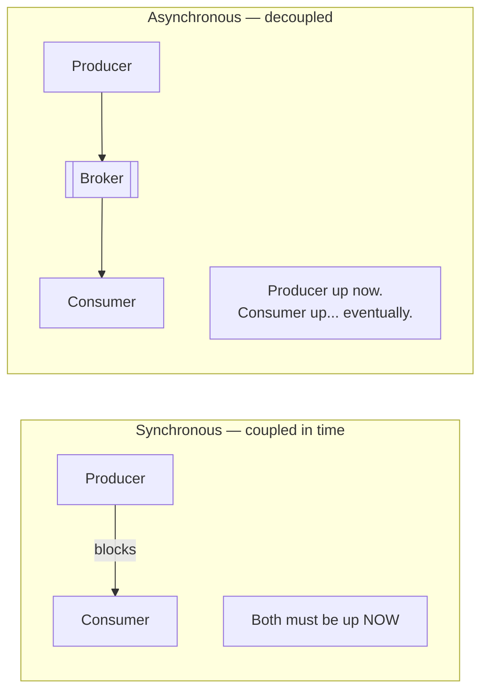

# 2.2.1 — Asynchronous Communication Through Messaging

> **Part 2 · Microservices & Data Flow · Asynchronous Communication · Chapter 1 of 7**
> Break temporal coupling. The single biggest resilience upgrade available to a distributed system.

---

## 🧒 ELI5 — Explain Like I'm 5

Instead of phoning the dessert kitchen and standing there waiting, you **write the order on a sticky note and put it in their postbox.**

Then you walk away and carry on cooking.

Look at everything that just got better:

- **You're not stuck waiting.** Your customers get served.
- **The dessert kitchen can be closed right now.** The note waits in the box. When they open, they read it.
- **If there are 500 notes and they can only do 50 an hour**, that's fine — the notes just pile up. Nobody is shouting; nothing breaks. The pile shrinks later. *(That's buffering a spike.)*
- **If they drop a note**, the postbox still has a copy until they say "done." *(That's acknowledgement.)*
- **You can hire three dessert cooks** to empty the box faster, without telling anyone. *(That's scaling consumers.)*

And what got worse:

- **You don't know when it's done.** You have to check, or they have to tell you later.
- **Sometimes a note gets read twice** (they got distracted and re-read it), so the dessert gets made twice — **unless each note has a number** and they check it off. *(Idempotency again.)*
- **When something goes wrong, it's harder to find out where**, because there's no single conversation to trace.

That's the whole trade: **you give up "I know right now" and you gain "nothing breaks when someone is busy."**

---

## What asynchronous actually buys you



| Benefit | Mechanism |
|---|---|
| **Temporal decoupling** | The consumer can be down, deploying, or slow; the broker holds the message |
| **Load levelling** | A 10× spike becomes queue depth, not errors. The consumer drains at its own pace |
| **Independent scaling** | Add consumers to drain faster without touching the producer |
| **Lower request latency** | The user's request returns as soon as the message is enqueued |
| **Built-in retries** | The broker redelivers unacknowledged messages |
| **Fan-out** | One event, many independent consumers, added without changing the producer |
| **Replay** (log-based only) | Reprocess history to fix a bug or backfill a new consumer |
| **Backpressure signalling** | Queue depth is an honest, measurable indicator of overload |

⚖️ **The costs, stated honestly:**

| Cost | Consequence |
|---|---|
| **Eventual consistency** | The user sees "processing…" instead of a result |
| **Duplicate delivery** | Almost all brokers are at-least-once; consumers must be idempotent |
| **Ordering is limited** | Global ordering is expensive; per-key ordering is the usual compromise |
| **Harder debugging** | No single stack trace; you need correlation IDs and tracing |
| **Another system to operate** | The broker itself must be highly available |
| **Poison messages** | One bad message can block a partition forever without a DLQ |
| **Error reporting is indirect** | The user has already left; failures need a notification path |

---

## Queue vs log vs pub-sub

This distinction is asked constantly. Learn it precisely.

|  | **Work queue** | **Log** | **Pub/Sub** |
|---|---|---|---|
| Examples | SQS, RabbitMQ, Celery | Kafka, Pulsar, Kinesis, Redis Streams | SNS, Redis Pub/Sub, Google Pub/Sub |
| Message lifetime | Deleted after ack | Retained for a configured period (or forever) | Delivered then forgotten |
| Consumers per message | Exactly one (competing consumers) | Every consumer group reads everything | Every subscriber |
| Position tracking | Broker tracks per-message state | **Consumer tracks an offset** | None |
| Replay | ❌ Gone once acked | ✅ Reset the offset | ❌ |
| Ordering | Weak (FIFO variants exist, lower throughput) | Strict **per partition** | None |
| Parallelism | Any number of consumers, per message | Bounded by partition count | N/A |
| Throughput | High | Very high (sequential disk writes, batching) | High |
| Best for | Background jobs, task distribution | Event streams, sourcing, stream processing, multi-consumer | Notifications, cache invalidation |

**One-sentence version:** *a queue distributes work and forgets; a log records history and lets many independent readers replay it; pub/sub broadcasts and forgets.*

☠️ **Redis Pub/Sub has no durability.** A subscriber that is disconnected for one second misses every message sent in that second, permanently. It is fine for cache-invalidation hints (where a miss is harmless) and wrong for anything that must happen.

---

## Commands vs events — get the semantics right

| | **Command** | **Event** |
|---|---|---|
| Meaning | "Do this" | "This happened" |
| Naming | Imperative: `SendEmail`, `ChargeCard` | Past tense: `OrderPlaced`, `PaymentCaptured` |
| Recipients | Exactly one, known by the sender | Any number, unknown to the sender |
| Coupling | Sender knows the receiver | Publisher knows nobody |
| Can be rejected? | Yes — the receiver may refuse | No — it already happened |
| Adding a consumer | Requires a decision | Free, no producer change |

🎯 **Prefer events for integration between services; use commands within a bounded context.** Events keep services ignorant of each other, which is what makes them independently deployable. If Service A publishes `OrderPlaced` and three teams each add a consumer next quarter, A never changes.

### Event granularity — three styles

| Style | Payload | Pros | Cons |
|---|---|---|---|
| **Notification** | `{order_id}` only | Tiny; no data duplication | Every consumer calls back — you reintroduced synchronous coupling |
| **Event-carried state transfer** | The full order object | Consumers are fully independent | Large payloads; duplicated data; schema coupling |
| **Event sourcing** | The event *is* the source of truth; state is derived by replay | Perfect audit trail, time travel | Big commitment; complex queries need projections |

**Default to event-carried state transfer** with a payload containing what consumers actually need. Pure notification events look clean but push you straight back into synchronous fan-in.

---

## Delivery guarantees

| Guarantee | Meaning | How | Cost |
|---|---|---|---|
| **At-most-once** | 0 or 1 delivery; may lose | Ack before processing (or fire-and-forget) | Data loss |
| **At-least-once** | ≥ 1 delivery; may duplicate | Ack **after** processing; redeliver on timeout | Duplicates — the consumer must be idempotent |
| **Exactly-once** | Precisely 1 effect | Transactions + deduplication, within one system | Complexity and throughput cost |

**The honest statement:** exactly-once *delivery* over a network is impossible (the two-generals problem). What is achievable is **effectively-once processing** — at-least-once delivery combined with idempotent consumers or transactional offset commits. Kafka's "exactly-once semantics" means exactly this, and only within Kafka's own boundaries (read → process → write, all inside Kafka).

**Default design:** at-least-once delivery + idempotent consumers. Say that; it is the correct, practical answer.

Consumer idempotency techniques:
1. **Natural idempotency** — `SET status = 'shipped'` rather than `INSERT` a new row.
2. **Deduplication table** — store processed `message_id`s with a TTL; skip repeats.
3. **Upsert with a unique key** — `INSERT ... ON CONFLICT DO NOTHING`.
4. **Version/sequence check** — apply only if `event.version > stored.version`.

---

## Ordering

Global ordering across a distributed system is expensive and usually unnecessary. **Per-key ordering** is nearly always what you actually need.

```
Partition by user_id → all events for user 44 land in one partition
                     → one consumer processes them in order
                     → ordering within a user is guaranteed
                     → ordering across users is not (and doesn't matter)
```

⚠️ **Ordering breaks when you:** add partitions (the key→partition mapping changes), process a partition with multiple threads, or retry a failed message while later ones proceed. If order matters, retries must **block the partition** or route failures to a per-key holding area — which is exactly why a poison message can stall a partition.

**Design tip:** make consumers order-*insensitive* where you can — with version numbers, timestamps, or CRDT-like merge semantics — and you sidestep the whole problem.

---

## The async patterns

| Pattern | Shape | Use |
|---|---|---|
| **Fire and forget** | Publish, don't care | Analytics, metrics |
| **Work queue** | Producer → queue → competing consumers | Background jobs |
| **Publish/subscribe** | One event → N consumers | Integration between services |
| **Request/reply over messaging** | Send with a `reply_to` and `correlation_id` | Async RPC; rarely worth it over gRPC |
| **Scatter/gather** | Fan out N tasks, collect N results | Parallel processing ([Fan-Out/Fan-In](../../07-patterns-and-templates/01-patterns/09-fan-out-fan-in.md)) |
| **Saga / process manager** | A chain of events with compensations | Distributed business transactions |
| **Transactional outbox** | Write the event to the DB in the same transaction; relay publishes | Guarantees DB and stream agree |
| **Claim check** | Put a large payload in blob storage, send the key | Messages > broker limits (SQS 256 KB, Kafka default 1 MB) |
| **Dead-letter queue** | After N failures, move aside and alert | Isolate poison messages |

Details: [Message Queue Use Cases and Patterns](03-message-queue-patterns.md).

---

## The dual-write problem (and the only good fix)

```
❌ BROKEN
    db.save(order)          # succeeds
    broker.publish(event)   # process crashes here
    → The order exists; nobody downstream ever hears about it. Silently. Forever.
```

Reversing the order is no better — you'd publish an event for an order that was never saved.

```
✅ TRANSACTIONAL OUTBOX
    BEGIN
      INSERT INTO orders  (...)
      INSERT INTO outbox (id, topic, payload, created_at)   -- same transaction
    COMMIT
    -- a separate relay (or CDC via Debezium) reads outbox and publishes,
    -- marking rows as sent; at-least-once, never lost
```

🎯 **This is one of the highest-value things to know.** Any design where a service both writes to its database and publishes an event has this bug unless the outbox (or CDC) is used. Naming it unprompted is a strong senior signal. See [Change Data Capture](../../05-scaling-data-storage/01-data-replication/05-change-data-capture.md).

---

## When *not* to go async

| Situation | Why sync is right |
|---|---|
| The user needs the answer in this response | Async adds a polling or push mechanism for no benefit |
| The operation is fast and reliable (a cache read) | A broker adds latency and a failure mode |
| Strong read-after-write consistency is required | Eventual consistency is visible and unacceptable |
| The system is small and simple | Operating a broker is real work |
| A query, not a command | Queries want answers, not eventual side effects |

☠️ **Async is not free.** Adding Kafka to a 100 QPS system with two services is over-engineering, and interviewers notice. Use it when temporal decoupling, fan-out, buffering, or replay solve a *stated* problem.

---

## 📋 Chapter checklist

| Skill | Ready? |
|---|---|
| List seven benefits and seven costs of async | ☐ |
| State the queue vs log vs pub/sub differences precisely | ☐ |
| Distinguish commands and events, including naming | ☐ |
| Name the three event-granularity styles and the default | ☐ |
| Explain why exactly-once delivery is impossible, and what is achievable | ☐ |
| Give four consumer idempotency techniques | ☐ |
| Explain per-key ordering and three ways it breaks | ☐ |
| Explain the dual-write problem and the outbox fix | ☐ |
| Name five situations where sync is correct | ☐ |

---

**← Previous** [2.1.9 Service Discovery](../01-synchronous-communication/09-service-discovery.md)
**Next →** [2.2.2 Message Queues in System Design](02-message-queues.md)
