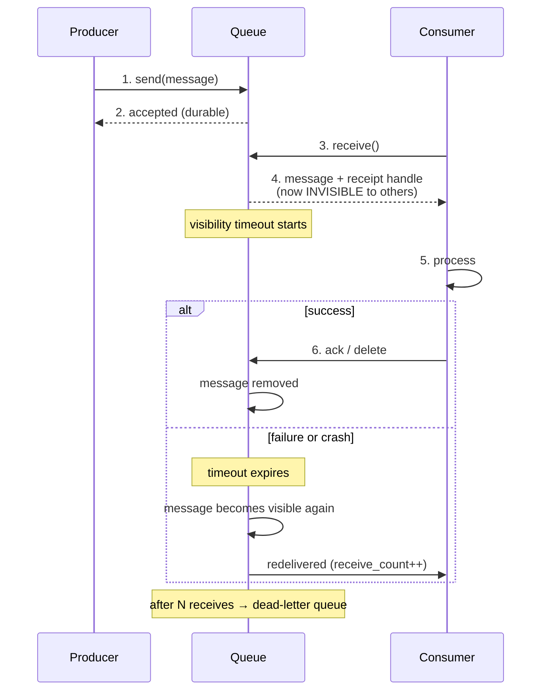

# 2.2.2 — Message Queues in System Design

> **Part 2 · Microservices & Data Flow · Asynchronous Communication · Chapter 2 of 7**
> The mechanics: acknowledgement, visibility, retries, dead letters, and how to size a queue.

---

## 🧒 ELI5 — Explain Like I'm 5

A message queue is a **postbox with rules**.

The rules are what make it useful:

1. **A note stays in the box until someone says "I finished it."** Not "I picked it up" — *finished*. So if a cook grabs a note and then trips over and forgets, the note comes back after a while and someone else does it.
2. **While a cook is holding a note, nobody else can grab it.** Otherwise two cooks make the same dessert. There's a timer: *"you have 5 minutes to finish, or I put it back."* *(That's the visibility timeout.)*
3. **If a note comes back five times and nobody can do it** — maybe it says "make a purple dessert" and that's impossible — it gets moved to a special "weird notes" box so it stops clogging the system, and someone gets told. *(That's the dead-letter queue.)*
4. **You can look in the box and count the notes.** If the pile keeps growing, you need more cooks. If it's empty, you have too many. *(That's queue depth — the single most useful number.)*

Those four rules are basically the entire subject.

---

## The lifecycle of a message



---

## Acknowledgement modes

| Mode | When the ack is sent | Guarantee | Risk |
|---|---|---|---|
| **Auto-ack on receive** | Immediately on delivery | At-most-once | **Message lost** if the consumer crashes mid-processing |
| **Manual ack after processing** | After the work is committed | At-least-once | Duplicates on crash-after-work-before-ack |
| **Transactional** | Ack and side effect in one atomic unit | Effectively-once, within one system | Limited to systems that support it |

**Always use manual ack after processing**, and make the consumer idempotent. Auto-ack is a data-loss bug waiting for its first crash.

☠️ **The classic ordering bug:**
```python
# WRONG
msg = queue.receive()
queue.ack(msg)          # acked first
process(msg)            # crash here → the message is gone forever
```
```python
# RIGHT
msg = queue.receive()
process(msg)            # idempotent
queue.ack(msg)          # crash before this → redelivered, and that's fine
```

---

## Visibility timeout (the parameter people get wrong)

The window during which a received message is hidden from other consumers.

| Too short | Too long |
|---|---|
| A slow-but-healthy consumer's message is redelivered while still being processed → **duplicate work**, and possibly two writers racing | A crashed consumer's message is stuck for the whole timeout → **latency spike** for that item |

**Set it to roughly `p99 processing time × 2`.** For genuinely long jobs, **extend the timeout while working** (`ChangeMessageVisibility` / heartbeating) rather than setting a huge static value:

```python
msg = queue.receive()                  # visibility 60s
with heartbeat(msg, every=30, extend_to=60):   # keep extending while alive
    long_running_work(msg)             # if the process dies, heartbeats stop,
queue.ack(msg)                         # and the message returns in ~60s
```

This gives you a **short recovery time for crashes** *and* support for jobs that take hours. It is the correct pattern for video transcoding, report generation, and large imports.

---

## Retries and the dead-letter queue

```
receive_count 1 → fail → back to queue (after visibility timeout)
receive_count 2 → fail → back, with backoff
receive_count 3 → fail → back
receive_count 4 → fail → move to DLQ, alert
```

**Why a DLQ is mandatory:** without it, a **poison message** — one that will never succeed (malformed payload, a referenced row that was deleted, a bug) — retries forever. It consumes capacity permanently and, in an ordered log, **blocks everything behind it**.

| DLQ practice | Why |
|---|---|
| Alert on any DLQ arrival | A DLQ nobody looks at is a silent data-loss bucket |
| Store the failure reason and stack trace with the message | You will need it to diagnose |
| Provide a **replay** tool (DLQ → main queue) | Most DLQ messages are due to a transient downstream bug; after fixing it you want them back |
| Keep DLQ retention long (14 days) | Time to notice and fix |
| Monitor DLQ **age**, not just count | An old message means nobody is looking |

⚠️ **Distinguish transient from permanent failures in the consumer.** A downstream timeout should retry. A `ValidationError` should go straight to the DLQ on the first attempt — retrying a malformed message 5 times just wastes capacity and delays the alert.

---

## Queue depth: the most important metric

| Signal | Meaning | Action |
|---|---|---|
| Depth ≈ 0, stable | Consumers keep up | Fine — maybe over-provisioned |
| Depth growing linearly | Arrival rate > processing rate | **Scale consumers now** |
| Depth spiky but returns to 0 | Normal burst absorption | This is the queue doing its job |
| Depth growing and consumers idle | Consumers are stuck, crashed, or not polling | Investigate consumers, not capacity |
| **Oldest message age** rising | The real user-facing symptom | Alert on this, not on count |

🎯 **Alert on message *age*, not queue *depth*.** A depth of 1,000,000 is fine if you drain it in 30 seconds; a depth of 10 is a problem if the oldest message is 2 hours old. Age directly expresses the user-visible delay.

**Autoscaling on queue depth** is the canonical use of a custom metric (KEDA on Kubernetes, or target-tracking on `ApproximateNumberOfMessages` in AWS):

```
desired_consumers = ceil(queue_depth / messages_each_consumer_handles_per_scaling_interval)
```

---

## Sizing and capacity

```
Arrival rate      λ = 1,000 msg/s
Processing time   S = 200 ms per message
Throughput per consumer = 1 / 0.2 = 5 msg/s
Consumers needed  = 1,000 / 5 = 200
+ headroom (×1.5) = 300 consumers

Burst handling: a 10x spike for 60 s adds 540,000 messages.
At 1,000 msg/s drain surplus... with 300 consumers (1,500 msg/s capacity)
surplus drain rate = 500/s → ~18 minutes to clear.
Is an 18-minute delay acceptable? If not, scale faster or shed.
```

That last question — *is the recovery time acceptable?* — is the one that turns a queue from a magic box into an engineered component.

---

## Producer-side concerns

| Concern | Handling |
|---|---|
| **Broker unavailable** | Buffer locally with a bound, then fail the request or write to the outbox. Never buffer unboundedly |
| **Message too large** | Claim check: store the payload in S3, send the key. (SQS 256 KB, Kafka default 1 MB) |
| **Publish latency on the request path** | Batch and publish async; or write to the outbox and let a relay publish |
| **Duplicate publishes** | Include a deterministic `message_id` so consumers can dedupe |
| **Ordering requirements** | Use a FIFO queue or a partition key — and accept the throughput cost |

---

## Message structure — a good envelope

```json
{
  "message_id": "01HX2K...",
  "correlation_id": "req_9f2a",
  "causation_id": "01HX2J...",
  "type": "order.placed",
  "version": 2,
  "occurred_at": "2026-08-31T10:04:11.123Z",
  "producer": "orders-service@v1.4.2",
  "payload": { "order_id": "ord_88", "total_minor": 2499, "currency": "GBP" }
}
```

| Field | Why |
|---|---|
| `message_id` | Deduplication key |
| `correlation_id` | Ties the whole user request together across services — essential for tracing |
| `causation_id` | Which message caused this one; lets you rebuild the chain |
| `type` + `version` | Routing and schema evolution |
| `occurred_at` | Event time, distinct from processing time — critical for stream processing |
| `producer` | Which build emitted it; invaluable during incidents |

---

## Choosing a queue technology

| Need | Choice |
|---|---|
| Simple background jobs, AWS, minimal ops | **SQS** (+ SNS for fan-out) |
| Rich routing (topic/header exchanges), per-message TTL, priority | **RabbitMQ** (quorum queues) |
| Very high throughput, replay, multiple consumer groups, stream processing | **Kafka / Pulsar** |
| Already running Redis, modest scale, simple needs | **Redis Streams** ([tutorial](04-redis-queue-tutorial.md)) |
| Language-native job framework | Celery, Sidekiq, BullMQ — all backed by one of the above |
| Serverless, event-driven | SQS/EventBridge + Lambda, Cloud Tasks, Pub/Sub |

⚖️ **SQS vs Kafka in one line:** SQS if each message is a task done once and then forgotten; Kafka if the message is an event that several independent systems care about, or you'll want to replay it. Choosing Kafka for simple background jobs means running a stateful distributed system for no benefit.

---

## Priority, delay, and scheduling

| Feature | Support |
|---|---|
| **Priority** | RabbitMQ has priority queues. Kafka does not — **use separate topics per priority** and consume high first |
| **Delayed delivery** | SQS `DelaySeconds` (max 15 min); RabbitMQ delayed-exchange plugin; otherwise a scheduler table |
| **Scheduled far in the future** | Not a queue's job — use a database table plus a periodic scanner, or a scheduler service |
| **Rate limiting consumption** | Consumer-side token bucket; or a smaller consumer pool |

☠️ **Priority queues starve low-priority work.** If high-priority messages arrive continuously, low-priority ones may never run. Use weighted consumption (e.g. process 9 high : 1 low) or an age-based promotion rule.

---

## ☠️ Failure modes

| Failure | Symptom | Fix |
|---|---|---|
| Ack before processing | Silent message loss | Ack after |
| No DLQ | A poison message loops forever, consuming capacity | Add a DLQ + alert |
| Visibility timeout < processing time | Duplicate processing, racing writers | Raise it, or heartbeat-extend |
| No idempotency | Duplicate side effects | Dedupe table or natural idempotency |
| Unbounded producer buffering | OOM when the broker is down | Bound it and shed |
| Consumers scaled on CPU, not queue depth | They idle while the queue grows | Autoscale on depth/age |
| Alerting on depth only | Miss slow-drain incidents | Alert on oldest-message age |
| One queue for everything | A bulk backfill starves interactive work | Separate queues per workload class |
| No consumer-side timeout | One stuck message halts a worker forever | Bound processing time |

---

## 📋 Chapter checklist

| Skill | Ready? |
|---|---|
| Draw the message lifecycle including redelivery | ☐ |
| Explain ack-after-processing and why order matters | ☐ |
| Size a visibility timeout and describe heartbeat extension | ☐ |
| Explain poison messages and DLQ practices | ☐ |
| Say why message *age* beats *depth* as an alert | ☐ |
| Size a consumer fleet and compute burst recovery time | ☐ |
| Design a message envelope with six fields and justify each | ☐ |
| Choose SQS vs RabbitMQ vs Kafka with a reason | ☐ |
| Explain priority starvation and its fix | ☐ |

---

**← Previous** [2.2.1 Asynchronous Communication](01-async-communication.md)
**Next →** [2.2.3 Message Queue Use Cases and Patterns](03-message-queue-patterns.md)
