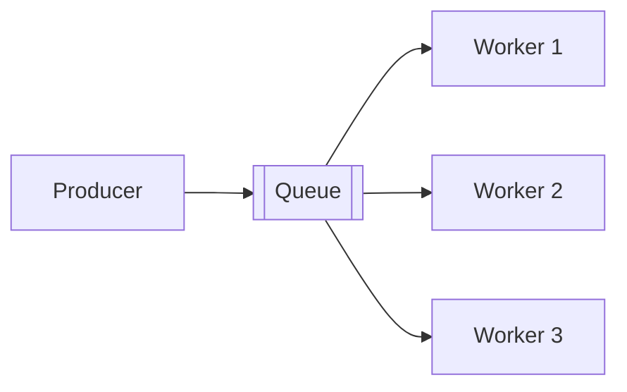
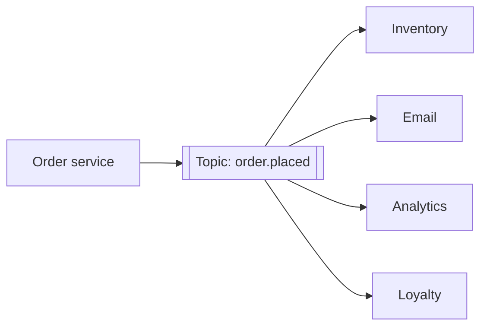
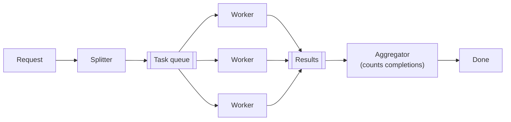

# 2.2.3 — Message Queue Use Cases and Patterns

> **Part 2 · Microservices & Data Flow · Asynchronous Communication · Chapter 3 of 7**
> The named shapes. Recognising them lets you answer "how would you do X?" in one sentence.

---

## 🧒 ELI5 — Explain Like I'm 5

There are only about ten **shapes** of postbox arrangement, and every system uses some combination of them.

- **One box, many cooks grabbing notes.** Work gets shared out. *(Work queue.)*
- **One announcement, everyone hears it, everyone does their own thing.** *(Pub/sub.)*
- **Cut a big job into 100 small notes, then count them back in.** *(Fan-out/fan-in.)*
- **Say "please do this" and leave your address so they can post the answer back.** *(Request/reply.)*
- **The note is too big for the box, so you write "the recipe is in drawer 7."** *(Claim check.)*
- **Notes that nobody can ever do go in the weird box.** *(Dead letter.)*
- **Write the note into your own diary at the same moment you write the order, so the two can't disagree.** *(Outbox.)*
- **Don't post it yet — post it at 6pm.** *(Delayed message.)*
- **The kitchen is drowning, so stop posting notes for a bit.** *(Backpressure.)*
- **A note causes another note, which causes another** — a chain, and if step 3 fails you undo steps 1 and 2. *(Saga.)*

Learn the shapes. Then most design questions become *"which shape is this?"*

---

## 1. Work queue (competing consumers)



Each message is processed by **exactly one** worker. Scale by adding workers.

**Use for:** image resizing, email sending, PDF generation, data imports, webhook delivery.

**Key decisions:** prefetch/batch size (too high and one slow worker hogs messages; too low and you pay per-message overhead), visibility timeout, and whether ordering matters (usually it doesn't — say so).

---

## 2. Publish/subscribe (fan-out)



Every subscriber receives every message. The producer knows none of them.

**Use for:** integration between services, cache invalidation, audit trails, search index updates.

**The critical property:** adding a fifth consumer next quarter requires **zero changes to the producer**. That is the whole reason to prefer events over commands for cross-service integration.

⚠️ In Kafka this is a **consumer group per subscriber**. Each group has its own offsets, so all four teams read the same partitions independently. Putting two unrelated services in the same consumer group is a common and confusing bug — they'd split the messages instead of each seeing all of them.

---

## 3. Fan-out / fan-in (scatter-gather)



Split one job into N parallel tasks, then detect completion.

**Use for:** video transcoding (per-segment), MapReduce-style jobs, multi-vendor price checks, batch document processing.

**The hard part is the fan-in.** How do you know all N finished?

| Approach | How |
|---|---|
| **Atomic counter** | Redis `DECR job:{id}:remaining`; the worker that hits 0 triggers completion |
| **Database rows** | Insert N task rows; the aggregator polls for `COUNT(*) WHERE done` = N |
| **Windowed stream aggregation** | Flink/Kafka Streams with a session or count window |
| **Workflow engine** | Temporal, Step Functions — they handle it natively |

⚠️ Handle **partial failure**: if 99 of 100 segments succeed and one dies permanently, the job hangs forever unless you set a job-level deadline and a partial-completion policy. Always define what "done with failures" means.

Full chapter: [Fan-Out/Fan-In Pattern](../../07-patterns-and-templates/01-patterns/09-fan-out-fan-in.md).

---

## 4. Request/reply over messaging

```
Producer sends:  { correlation_id: "abc", reply_to: "queue:responses-svc-a", ... }
Consumer replies to `reply_to` with the same `correlation_id`
Producer matches the reply to the pending request
```

**Use sparingly.** You have rebuilt RPC with more moving parts and worse latency. Legitimate cases: the responder is behind a firewall, the work takes minutes, or you need the request to survive a responder restart.

For long jobs, the **HTTP equivalent is far better**: return `202 Accepted` with a status URL, and let the client poll or subscribe to a push channel.

---

## 5. Claim check

Message brokers have size limits (SQS 256 KB, Kafka 1 MB by default, RabbitMQ practical limits well below that).

```
1. Producer writes the 200 MB payload to S3 → key "uploads/9f2a"
2. Producer sends { type: "video.uploaded", blob_key: "uploads/9f2a", size: 209715200 }
3. Consumer reads the key from the message and fetches from S3
```

**Also good for:** payloads containing sensitive data (the message carries only a reference; access control lives on the store), and avoiding broker storage costs.

⚠️ Now you have two lifecycles: don't delete the blob before all consumers have read it, and clean up blobs whose messages were dead-lettered.

---

## 6. Dead-letter queue

Covered in [Chapter 2.2.2](02-message-queues.md#retries-and-the-dead-letter-queue). The pattern-level point: a DLQ turns an **unbounded failure** (retry forever, block everything) into a **bounded, observable** one.

Add a **DLQ replay tool** from day one. Most DLQ contents are the result of a downstream bug; once fixed, you want to reprocess them, and hand-writing a replay script during an incident is not fun.

---

## 7. Transactional outbox

The fix for the dual-write problem.

```sql
BEGIN;
  INSERT INTO orders (id, customer_id, total) VALUES (...);
  INSERT INTO outbox (id, aggregate_id, topic, payload, created_at)
    VALUES (gen_id(), :order_id, 'order.placed', :json, now());
COMMIT;
```

Then either:
- **Polling relay** — a background process reads unsent outbox rows, publishes, marks them sent. Simple; adds latency (poll interval) and load.
- **CDC** — Debezium tails the write-ahead log and publishes automatically. Lower latency, no polling load, another component to run.

**Guarantees:** the event is published **at least once**, and never published for a transaction that rolled back. Consumers must still be idempotent.

Inverse pattern — the **inbox**: the consumer records processed `message_id`s in a table, in the same transaction as its side effect, giving effectively-once processing.

---

## 8. Delayed and scheduled messages

| Delay | Mechanism |
|---|---|
| Seconds to 15 min | SQS `DelaySeconds`; RabbitMQ delayed-message plugin |
| Minutes to hours | A retry queue with a TTL that dead-letters back into the main queue |
| Days or an exact wall-clock time | A `scheduled_jobs` table plus a periodic scanner, or a scheduler service (Temporal, Quartz, Cloud Scheduler) |

**Use for:** retry backoff, "abandoned cart" reminders after 24 h, subscription renewals, delayed cancellation windows.

⚠️ A database-backed scheduler needs a **claim** step (`UPDATE ... SET locked_by, locked_until WHERE due <= now() AND locked_until < now() LIMIT 100 RETURNING *`) so multiple scanner instances don't double-fire. And it needs an index on `(due_at)`, or the scan becomes a table scan as the table grows.

---

## 9. Backpressure and flow control

The queue's depth *is* the backpressure signal. What you do with it:

| Level | Action |
|---|---|
| Depth rising | Autoscale consumers |
| Depth rising and consumers maxed | Shed low-priority producers first |
| Depth beyond a hard threshold | Reject new work at the API with `429` / `503 Retry-After` |
| Consumer overwhelmed by downstream | Consumer-side rate limiting; don't drain faster than the downstream can absorb |

☠️ **The unbounded queue trap.** A queue that grows forever converts an overload into: exploding storage cost, growing latency (the oldest message is hours old), and a recovery time measured in hours after the incident ends. **Bounded queues that reject are more honest than unbounded queues that delay.** Set a max depth or max age policy and decide, in advance, what happens at the limit.

---

## 10. Saga / process manager

A sequence of local transactions, each publishing an event that triggers the next, with **compensating actions** on failure.

```
OrderPlaced → reserve inventory → InventoryReserved
            → charge payment    → PaymentFailed ✗
            → compensate: ReleaseInventory, CancelOrder, notify user
```

**Choreography** (each service reacts to events) is decoupled but hard to follow — no single place describes the flow. **Orchestration** (a workflow service issues commands and handles failures) is easier to debug and monitor, at the cost of a central component.

Full chapter: [Saga Pattern](../../07-patterns-and-templates/01-patterns/10-saga-pattern.md).

---

## Two more worth knowing

### Priority lanes
Kafka has no priority. Use **separate topics** (`jobs.high`, `jobs.normal`, `jobs.low`) and have consumers poll high first with a weighted ratio (e.g. 9:1) so low-priority work is never fully starved.

### Competing consumers with ordering
You want parallelism *and* per-entity ordering. Partition by entity key: all events for `user_44` go to one partition, processed by one consumer, in order — while other users are processed in parallel. **This is the single most common ordering design and you should be able to state it instantly.**

---

## Use-case → pattern quick reference

| "How would you..." | Answer |
|---|---|
| ...send a welcome email without slowing signup? | Work queue |
| ...update the search index when a product changes? | Pub/sub event + idempotent consumer |
| ...transcode a 2-hour video? | Fan-out per segment + fan-in with a counter |
| ...handle a Black Friday spike? | Queue absorbs it; autoscale consumers; shed at the API if depth exceeds the threshold |
| ...guarantee the DB and Kafka never disagree? | Transactional outbox (+ CDC) |
| ...retry failed webhook deliveries for 24 hours? | Delayed retry queue with exponential backoff + DLQ |
| ...process orders per customer in order but customers in parallel? | Partition by `customer_id` |
| ...send a 100 MB file through a queue? | Claim check |
| ...roll back a multi-service booking? | Saga with compensations |
| ...stop a bulk import starving interactive jobs? | Separate queues, weighted consumption |
| ...reprocess a month of events after fixing a bug? | Log (Kafka) + offset reset — impossible with a plain queue |

---

## 📋 Chapter checklist

| Skill | Ready? |
|---|---|
| Name all ten patterns | ☐ |
| Explain consumer groups and the "same group" bug | ☐ |
| Give four fan-in completion mechanisms | ☐ |
| Explain the claim-check lifecycle problem | ☐ |
| Write the outbox SQL from memory | ☐ |
| Design a database-backed scheduler with safe claiming | ☐ |
| Argue bounded vs unbounded queues | ☐ |
| Explain how to get parallelism plus per-entity ordering | ☐ |
| Answer all eleven "how would you" questions in one sentence each | ☐ |

---

**← Previous** [2.2.2 Message Queues](02-message-queues.md)
**Next →** [2.2.4 Redis Queue Tutorial](04-redis-queue-tutorial.md)
