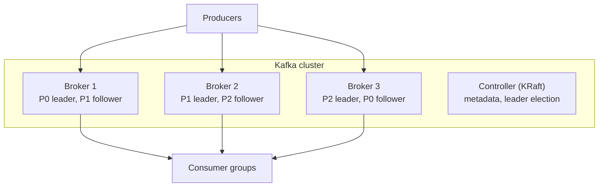

# 2.2.6 — Introduction to Kafka

> **Part 2 · Microservices & Data Flow · Asynchronous Communication · Chapter 6 of 7**
> The concrete system: architecture, durability settings, and the configuration that actually matters.

---

## 🧒 ELI5 — Explain Like I'm 5

Kafka is the logbook from the last chapter, built to be **very fast and very hard to lose**.

Three ideas make it work:

1. **Many books, not one.** A topic ("orders") is split into several books called partitions, so several people can write and read at once. Which book a note goes in is decided by its **name tag** — all notes about *user 44* go in the same book, so they stay in order.

2. **Every book is copied three times, on three different desks.** One copy is "the boss" (leader) and the others follow along. If the boss's desk catches fire, one of the followers becomes the new boss and nothing is lost. *(Replication.)*

3. **You choose how careful you want to be.** You can say *"tell me it's saved as soon as you've heard me"* (fast, might lose it), or *"tell me only when two desks have it written down"* (slower, safe). **This is one setting and it decides whether you lose data.** *(`acks`.)*

Everything else in this chapter is details around those three ideas.

---

## Architecture



| Component | Role |
|---|---|
| **Broker** | Stores partitions, serves produce/fetch requests |
| **Controller** | Manages cluster metadata and leader election. Modern Kafka uses **KRaft** (Raft-based, self-managed); older versions used ZooKeeper |
| **Producer** | Writes records; handles partitioning, batching, compression, retries |
| **Consumer** | Reads records; part of a consumer group; tracks offsets |
| **Topic → partitions → segments** | The storage hierarchy |
| **Replica / ISR** | Copies of a partition; the **In-Sync Replica set** are those caught up with the leader |

### Writes and reads

- **All writes go to the partition leader.** Followers fetch from the leader.
- **Reads normally go to the leader** too (follower fetching exists for rack-locality but is not the default).
- A record is **committed** once all in-sync replicas have it. Consumers can only read committed records.

---

## Durability: the settings that decide whether you lose data

```properties
# ─── Topic / broker ───────────────────────────────
replication.factor = 3          # 3 copies across 3 brokers
min.insync.replicas = 2         # a write needs 2 in-sync replicas to succeed
unclean.leader.election.enable = false   # NEVER elect an out-of-sync replica

# ─── Producer ─────────────────────────────────────
acks = all                      # wait for all in-sync replicas
enable.idempotence = true       # dedupe on broker-side retries
retries = Integer.MAX_VALUE
max.in.flight.requests.per.connection = 5   # ≤5 keeps ordering when idempotence is on
```

🎯 **The durability triple — quote it exactly:** `replication.factor=3`, `min.insync.replicas=2`, `acks=all`. This tolerates the loss of one broker with **zero acknowledged-message loss**, and still accepts writes.

Why each matters:

| Setting | If you get it wrong |
|---|---|
| `acks=1` | The leader acks, then dies before followers replicate → **silent loss** |
| `acks=0` | Fire and forget → loss on any hiccup |
| `min.insync.replicas=1` with RF=3 | `acks=all` is satisfied by the leader alone → back to `acks=1` semantics. **This is the most common misconfiguration.** |
| `min.insync.replicas=3` with RF=3 | Any single broker outage **stops all writes** — too strict |
| `unclean.leader.election=true` | An out-of-date replica can become leader → committed data disappears |

⚖️ **The availability trade-off:** with RF=3/min.insync=2 you survive one broker loss for writes. Lose two and producers get `NotEnoughReplicas` and writes **fail**. That is the correct behaviour — Kafka chooses consistency over availability here, and you should say so explicitly when asked about CAP.

---

## Idempotent and transactional producers

**Idempotent producer** (`enable.idempotence=true`): the producer attaches a producer ID and per-partition sequence number, so a broker-side retry after a network failure does not create a duplicate. Essentially free — **turn it on always** (it's the default in modern Kafka).

**Transactions** (`transactional.id` set): atomically write to multiple partitions/topics *and* commit consumer offsets.

```java
producer.initTransactions();
producer.beginTransaction();
producer.send(new ProducerRecord<>("orders-enriched", key, value));
producer.sendOffsetsToTransaction(offsets, consumerGroupMetadata);
producer.commitTransaction();
```

Downstream consumers set `isolation.level=read_committed` to skip aborted records.

⚠️ **This gives exactly-once *within Kafka only*.** A transaction cannot include "sent an email" or "charged a card." For external effects you still need idempotency keys.

---

## Key producer settings

```properties
# Throughput
batch.size = 65536              # bytes per partition batch (default 16 KB is small)
linger.ms = 10                  # wait up to 10ms to fill a batch
compression.type = zstd         # or lz4/snappy; 5-10x on JSON
buffer.memory = 67108864        # producer-side buffer

# Latency vs throughput
# linger.ms = 0   → lowest latency, smallest batches, most requests
# linger.ms = 50  → higher throughput, +50ms latency
```

⚖️ `linger.ms` is the batching/latency dial from [Throughput](../../01-introduction/03-non-functional-requirements/07-throughput.md), made concrete. 10 ms of added latency for a 5–10× throughput gain is usually an easy trade.

☠️ **`buffer.memory` exhaustion:** if the broker is unreachable, the producer buffers until full, then `send()` **blocks** (or throws, per `max.block.ms`). If that call is on your HTTP request path, your API now hangs. **Never publish synchronously on the request path without a bounded `max.block.ms` and a fallback** — this is exactly what the transactional outbox avoids.

---

## Key consumer settings

```properties
group.id = billing
enable.auto.commit = false          # commit manually, after processing
auto.offset.reset = earliest        # or latest — for a NEW group only
max.poll.records = 500
max.poll.interval.ms = 300000       # must exceed worst-case batch processing time
session.timeout.ms = 45000
heartbeat.interval.ms = 3000
fetch.min.bytes = 1                 # raise to batch more per fetch
isolation.level = read_committed    # if producers use transactions
group.instance.id = billing-7       # static membership: no rebalance on restart
partition.assignment.strategy = CooperativeStickyAssignor
```

⚠️ `auto.offset.reset` applies **only when there is no committed offset** for the group (a new group, or offsets expired). It is not a general "start from the beginning" switch — a common misunderstanding.

---

## Schema management

Kafka records are bytes. Without a schema contract, one producer change breaks every consumer.

**Schema Registry** (Confluent, Apicurio, AWS Glue) stores versioned schemas and enforces compatibility:

| Compatibility mode | Allows | Meaning |
|---|---|---|
| `BACKWARD` | New schema reads old data | Upgrade **consumers** first — the common default |
| `FORWARD` | Old schema reads new data | Upgrade **producers** first |
| `FULL` | Both | Safest, most restrictive |
| `NONE` | Anything | You will have an incident |

Avro is the traditional choice (compact, schema travels as a registry ID, strong evolution rules); Protobuf and JSON Schema are also supported.

**Safe evolution:** add optional fields with defaults; never remove or rename a required field; never change a type. Same rule as [Chapter 2.1.3](../01-synchronous-communication/03-implementation.md#protobuf-contract-example) — **additive only**.

---

## The Kafka ecosystem

| Component | Purpose |
|---|---|
| **Kafka Connect** | Declarative source/sink connectors (JDBC, S3, Elasticsearch, Debezium CDC) — no code |
| **Kafka Streams** | A Java library for stream processing with local state and exactly-once |
| **ksqlDB** | SQL over streams |
| **MirrorMaker 2** | Cross-cluster / cross-region replication |
| **Debezium** | CDC from databases into Kafka ([CDC chapter](../../05-scaling-data-storage/01-data-replication/05-change-data-capture.md)) |
| **Cruise Control** | Automated partition rebalancing and broker capacity management |
| **Tiered storage** | Offload old segments to object storage — cheap long retention |

**Tiered storage is a significant recent change:** historically Kafka retention was bounded by broker disk. With tiered storage, old segments live in S3 and are fetched on demand, so retaining months of history becomes economical. It changes the answer to "how long can we keep this?" from days to effectively forever.

---

## Operating concerns

| Concern | Detail |
|---|---|
| **Consumer lag** | The headline metric. `records-lag-max` per partition; alert on lag *time*, not just count |
| **Under-replicated partitions** | Should be 0. Non-zero means a broker is struggling or down |
| **Offline partitions** | Should be 0. Non-zero means data is unavailable |
| **Disk usage** | Retention × throughput × RF. Plan it; brokers dying on full disks is common |
| **Partition count per broker** | Thousands is fine; tens of thousands slows leader election |
| **Rack awareness** | `broker.rack` spreads replicas across AZs so one AZ loss doesn't lose a partition |
| **Rolling restarts** | One broker at a time, wait for ISR to fully recover between each |

🔢 **Sizing:** storage per topic = `throughput_MB/s × retention_seconds × replication_factor × (1 + headroom)`. At 10 MB/s, 7 days, RF=3: `10 × 604800 × 3 = 18 TB`, plus ~30% headroom → **~24 TB**. Divide by broker count for per-broker disk.

---

## Kafka in an interview: what to actually say

> "I'd use Kafka because three consumer groups need the same order events independently, and because being able to replay after a consumer bug is worth the operational cost — with SQS that data would be gone.
>
> I'd partition by `customer_id` so events for one customer stay ordered while customers process in parallel, and I'd start with 24 partitions rather than 3, because adding partitions later changes the key mapping and silently breaks ordering.
>
> Durability: replication factor 3, `min.insync.replicas=2`, `acks=all`, and `unclean.leader.election` off — that survives one broker loss with no acknowledged-message loss. `min.insync.replicas=1` would quietly undo `acks=all`, which is the classic mistake.
>
> Consumers commit offsets after processing and are idempotent, so at-least-once delivery is safe. And the producer publishes from a transactional outbox rather than directly in the request path, so the database and the stream can never disagree."

That paragraph covers partitioning, ordering, durability, delivery semantics, and the dual-write problem — the five things a Kafka follow-up will probe.

---

## ☠️ Common mistakes

| Mistake | Consequence |
|---|---|
| `acks=all` with `min.insync.replicas=1` | No better than `acks=1`; silent data loss |
| Too few partitions | Consumer parallelism is capped; can't scale out |
| Adding partitions to a keyed topic later | Ordering silently breaks |
| Hot partition from a skewed key | One broker and one consumer saturated |
| Auto-commit enabled | Offsets committed before processing → message loss |
| Long processing with default `max.poll.interval.ms` | Endless rebalance loop |
| No schema registry | One producer change breaks all consumers |
| Publishing synchronously on the request path | The API hangs when Kafka is slow |
| Using Kafka as a database (querying by key) | It's a log, not a KV store — use compaction + a materialised view |
| No lag alerting | Consumers fall days behind, unnoticed |

---

## 📋 Chapter checklist

| Skill | Ready? |
|---|---|
| Draw the broker/partition/replica architecture | ☐ |
| Quote the durability triple and explain each part | ☐ |
| Explain why `min.insync.replicas=1` breaks `acks=all` | ☐ |
| Explain idempotent vs transactional producers and their limits | ☐ |
| Tune `linger.ms`/`batch.size` and state the trade-off | ☐ |
| Explain the `buffer.memory` blocking hazard | ☐ |
| Explain `auto.offset.reset`'s actual scope | ☐ |
| Name four schema compatibility modes | ☐ |
| Size broker storage from throughput and retention | ☐ |
| Deliver the interview paragraph | ☐ |

---

**← Previous** [2.2.5 Log-based Message Queues](05-log-based-message-queues.md)
**Next →** [2.2.7 Kafka Exercise](07-kafka-exercise.md)
