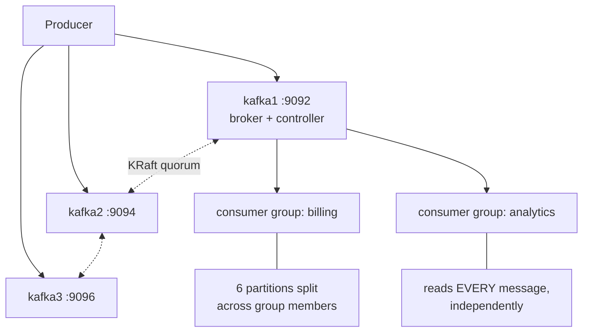

# 2.2.7 — Kafka Exercise

> **Part 2 · Microservices & Data Flow · Asynchronous Communication · Chapter 7 of 7**
> 🧪 **Hands-on lab.** Run a cluster, produce, consume, break it, replay it. Every drill has an expected result — check it.

---

## 🧒 ELI5 — Explain Like I'm 5

Reading about the logbook isn't enough. **Go and use one.**

In this lab you will:

- Start three "desks" (brokers) on your laptop.
- Write notes and watch them go into different books.
- Have two teams read the same book with their own bookmarks — and see they don't interfere.
- **Kill a desk on purpose** and watch a follower become the new boss, with nothing lost.
- **Rewind a bookmark** and read yesterday again.
- **Deliberately misconfigure it** so a message gets lost, so you know exactly what that setting does.

That last one is the point of the whole lab. You will never forget `acks=1` after you've watched it eat your data.

---

## Setup



Three brokers, so `replication.factor=3` with `min.insync.replicas=2` is real: kill one and writes continue, kill two and you watch writes correctly refuse.


```yaml
# docker-compose.yml — 3-broker KRaft cluster, no ZooKeeper
services:
  kafka1: &kafka
    image: apache/kafka:3.8.0
    ports: ["9092:9092"]
    environment: &env
      KAFKA_NODE_ID: 1
      KAFKA_PROCESS_ROLES: broker,controller
      KAFKA_CONTROLLER_QUORUM_VOTERS: 1@kafka1:9093,2@kafka2:9093,3@kafka3:9093
      KAFKA_LISTENERS: PLAINTEXT://:19092,CONTROLLER://:9093,EXTERNAL://:9092
      KAFKA_ADVERTISED_LISTENERS: PLAINTEXT://kafka1:19092,EXTERNAL://localhost:9092
      KAFKA_LISTENER_SECURITY_PROTOCOL_MAP: PLAINTEXT:PLAINTEXT,CONTROLLER:PLAINTEXT,EXTERNAL:PLAINTEXT
      KAFKA_INTER_BROKER_LISTENER_NAME: PLAINTEXT
      KAFKA_CONTROLLER_LISTENER_NAMES: CONTROLLER
      KAFKA_OFFSETS_TOPIC_REPLICATION_FACTOR: 3
      KAFKA_TRANSACTION_STATE_LOG_REPLICATION_FACTOR: 3
      KAFKA_TRANSACTION_STATE_LOG_MIN_ISR: 2
      CLUSTER_ID: MkU3OEVBNTcwNTJENDM2Qk
  kafka2:
    <<: *kafka
    ports: ["9094:9092"]
    environment:
      <<: *env
      KAFKA_NODE_ID: 2
      KAFKA_ADVERTISED_LISTENERS: PLAINTEXT://kafka2:19092,EXTERNAL://localhost:9094
  kafka3:
    <<: *kafka
    ports: ["9096:9092"]
    environment:
      <<: *env
      KAFKA_NODE_ID: 3
      KAFKA_ADVERTISED_LISTENERS: PLAINTEXT://kafka3:19092,EXTERNAL://localhost:9096
```

```bash
docker compose up -d
alias kcli='docker compose exec kafka1 /opt/kafka/bin'
```

---

## Drill 1 — Create a topic and inspect it

```bash
kcli/kafka-topics.sh --bootstrap-server kafka1:19092 \
  --create --topic orders --partitions 6 --replication-factor 3 \
  --config min.insync.replicas=2

kcli/kafka-topics.sh --bootstrap-server kafka1:19092 --describe --topic orders
```

**Expected:**
```
Topic: orders  PartitionCount: 6  ReplicationFactor: 3  Configs: min.insync.replicas=2
  Partition: 0  Leader: 2  Replicas: 2,3,1  Isr: 2,3,1
  Partition: 1  Leader: 3  Replicas: 3,1,2  Isr: 3,1,2
  ...
```

✅ **Check:** leaders are spread across all three brokers, and `Isr` lists all three replicas.

---

## Drill 2 — Produce and consume

```bash
# Producer with keys (key:value separated by ':')
kcli/kafka-console-producer.sh --bootstrap-server kafka1:19092 --topic orders \
  --property parse.key=true --property key.separator=:
> user1:{"order":"a","amt":100}
> user2:{"order":"b","amt":250}
> user1:{"order":"c","amt":75}
```

```bash
# Consumer, showing which partition each record landed in
kcli/kafka-console-consumer.sh --bootstrap-server kafka1:19092 --topic orders \
  --from-beginning --property print.key=true --property print.partition=true
```

✅ **Check:** both `user1` records are in the **same partition**. That is key-based partitioning giving you per-user ordering.

---

## Drill 3 — Consumer groups and parallelism

```bash
# Terminal A
kcli/kafka-console-consumer.sh --bootstrap-server kafka1:19092 \
  --topic orders --group billing --property print.partition=true
# Terminal B — same group
kcli/kafka-console-consumer.sh --bootstrap-server kafka1:19092 \
  --topic orders --group billing --property print.partition=true
```

✅ **Check:** the 6 partitions split 3/3 between the two consumers. Each message goes to **exactly one** of them.

```bash
# Terminal C — a DIFFERENT group
kcli/kafka-console-consumer.sh --bootstrap-server kafka1:19092 \
  --topic orders --group analytics --from-beginning
```

✅ **Check:** `analytics` receives **every** message, including history — independently of `billing`. This is the log property that a queue cannot provide.

```bash
kcli/kafka-consumer-groups.sh --bootstrap-server kafka1:19092 --describe --group billing
```
Shows `CURRENT-OFFSET`, `LOG-END-OFFSET`, and **`LAG`** per partition — the metric you alert on in production.

### 🧪 Sub-drill: too many consumers
Start a **seventh** consumer in `billing`. ✅ **Check:** it is assigned zero partitions and sits idle. **Partition count is the parallelism ceiling.**

---

## Drill 4 — Kill a broker, watch failover

```bash
kcli/kafka-topics.sh --bootstrap-server kafka1:19092 --describe --topic orders | head -3
# note which broker leads partition 0

docker compose stop kafka2
sleep 10
kcli/kafka-topics.sh --bootstrap-server kafka1:19092 --describe --topic orders
```

**Expected:**
```
  Partition: 0  Leader: 3  Replicas: 2,3,1  Isr: 3,1     ← leader moved, ISR shrank to 2
```

✅ **Check:** leadership moved automatically. `Isr` is now 2, which still satisfies `min.insync.replicas=2`, so **writes continue**. Produce a message to confirm.

```bash
docker compose stop kafka3        # now only ONE in-sync replica
# try producing again
```
✅ **Check:** the producer now fails with `NOT_ENOUGH_REPLICAS`. **This is correct** — Kafka refuses to accept a write it cannot make durable. That is consistency chosen over availability, and it's exactly what `min.insync.replicas=2` means.

```bash
docker compose start kafka2 kafka3
```

---

## Drill 5 — Prove that `acks=1` loses data

This is the most valuable drill in the chapter.

```bash
# Produce with acks=1 (leader only)
kcli/kafka-console-producer.sh --bootstrap-server kafka1:19092 --topic orders \
  --producer-property acks=1 --producer-property linger.ms=0
> risky:message-that-will-vanish
```

Now, in a real cluster, immediately kill the leader broker for that partition **before** followers replicate, then force an unclean recovery. The record is acknowledged to the producer but never existed on any surviving replica.

Reproducing the exact race locally is fiddly; the reliable version is to reason it through with the ISR mechanics:

| Step | `acks=1` | `acks=all` + `min.insync=2` |
|---|---|---|
| Producer sends | Leader writes to its log | Leader writes to its log |
| Leader responds | **Immediately — "success"** | Waits for ≥1 follower to replicate |
| Leader dies now | Followers never got it. New leader has no record. **Lost, silently.** | The record was on ≥2 replicas. New leader has it. **Safe.** |

✅ **Takeaway to memorise:** `acks=1` means "I trust the leader not to die in the next few milliseconds." At scale, brokers die every day.

```bash
# The safe configuration
kcli/kafka-console-producer.sh --bootstrap-server kafka1:19092 --topic orders \
  --producer-property acks=all \
  --producer-property enable.idempotence=true
```

---

## Drill 6 — Replay

```bash
# Move the billing group back to the beginning (consumers must be stopped)
kcli/kafka-consumer-groups.sh --bootstrap-server kafka1:19092 \
  --group billing --topic orders --reset-offsets --to-earliest --execute

# Or to a point in time
kcli/kafka-consumer-groups.sh --bootstrap-server kafka1:19092 \
  --group billing --topic orders --reset-offsets \
  --to-datetime 2026-08-31T00:00:00.000 --execute

# Or shift back 100 records per partition
kcli/kafka-consumer-groups.sh --bootstrap-server kafka1:19092 \
  --group billing --topic orders --reset-offsets --shift-by -100 --execute
```

✅ **Check:** restart the consumer and it reprocesses history. **This is the capability that justifies choosing Kafka over SQS.**

⚠️ The group must have **no active members** or the reset is rejected. In production this means a brief consumer downtime — plan it.

---

## Drill 7 — Log compaction

```bash
kcli/kafka-topics.sh --bootstrap-server kafka1:19092 --create --topic user-profiles \
  --partitions 3 --replication-factor 3 \
  --config cleanup.policy=compact \
  --config min.cleanable.dirty.ratio=0.01 \
  --config segment.ms=1000 --config delete.retention.ms=1000

kcli/kafka-console-producer.sh --bootstrap-server kafka1:19092 --topic user-profiles \
  --property parse.key=true --property key.separator=:
> u1:{"name":"Ann","v":1}
> u1:{"name":"Ann","v":2}
> u1:{"name":"Anna","v":3}
> u2:{"name":"Bob","v":1}
> u2:                              # ← tombstone (empty value) = delete
```

Wait ~30 seconds for the log cleaner, then:

```bash
kcli/kafka-console-consumer.sh --bootstrap-server kafka1:19092 --topic user-profiles \
  --from-beginning --property print.key=true
```

✅ **Check:** only `u1 → {"name":"Anna","v":3}` survives. Versions 1 and 2 are compacted away; `u2` is deleted by its tombstone.

**Why this matters:** a compacted topic is a **durable, replayable snapshot of current state per key**. A new service replays it from offset 0 and materialises the entire current dataset — the foundation of CDC pipelines and cache warming.

---

## Drill 8 — Create a hot partition on purpose

```bash
# Send 10,000 records all with the SAME key
for i in $(seq 1 10000); do echo "hotkey:msg-$i"; done | \
kcli/kafka-console-producer.sh --bootstrap-server kafka1:19092 --topic orders \
  --property parse.key=true --property key.separator=:

kcli/kafka-run-class.sh kafka.tools.GetOffsetShell \
  --bootstrap-server kafka1:19092 --topic orders
```

✅ **Check:** one partition holds ~10,000 records; the others are near-empty. **One consumer is doing all the work while five idle.** Aggregate capacity looks fine; throughput is capped by one partition.

**Fixes to reason about:** salt the key (`hotkey:0` … `hotkey:9`) and re-aggregate downstream; or choose a higher-cardinality key.

---

## Drill 9 — Rebalance pain

```bash
# Start a consumer with a short poll interval and slow processing
kcli/kafka-console-consumer.sh --bootstrap-server kafka1:19092 --topic orders \
  --group slow --consumer-property max.poll.interval.ms=10000 \
  --consumer-property max.poll.records=500
# then suspend the container to simulate a 30s GC pause / slow batch
docker compose pause kafka1   # or SIGSTOP the consumer process
```

✅ **Check:** the group rebalances because the consumer missed its poll deadline; when it resumes, its offset commit is rejected and the work is redone by another member.

**Fixes:** lower `max.poll.records`, raise `max.poll.interval.ms`, use `CooperativeStickyAssignor`, and set `group.instance.id` for static membership so rolling restarts don't rebalance at all.

---

## Drill 10 — Producer/consumer in code

```python
# pip install confluent-kafka
from confluent_kafka import Producer, Consumer

p = Producer({
    "bootstrap.servers": "localhost:9092,localhost:9094,localhost:9096",
    "acks": "all",
    "enable.idempotence": True,
    "compression.type": "zstd",
    "linger.ms": 10,
    "batch.size": 65536,
})

def on_delivery(err, msg):
    if err:
        print("FAILED", err)          # log + outbox retry; never swallow
    else:
        print(f"ok p{msg.partition()}@{msg.offset()}")

p.produce("orders", key=b"user1", value=b'{"amt":100}', on_delivery=on_delivery)
p.flush()                              # MUST flush before exit or you lose buffered records
```

```python
c = Consumer({
    "bootstrap.servers": "localhost:9092",
    "group.id": "billing",
    "enable.auto.commit": False,        # commit AFTER processing
    "auto.offset.reset": "earliest",
    "partition.assignment.strategy": "cooperative-sticky",
})
c.subscribe(["orders"])

try:
    while True:
        msg = c.poll(1.0)
        if msg is None: continue
        if msg.error(): print(msg.error()); continue
        process(msg)                    # idempotent!
        c.commit(msg)                   # commit after
finally:
    c.close()                           # triggers a clean rebalance
```

☠️ Two lines that cause real incidents if omitted: `p.flush()` before exit (buffered records are lost otherwise) and `c.close()` on shutdown (otherwise the group waits `session.timeout.ms` before rebalancing, stalling those partitions).

---

## 📋 Lab checklist

| Drill | Done? | Key takeaway |
|---|---|---|
| 1 Topic creation | ☐ | Leaders spread; ISR = all replicas |
| 2 Keyed produce | ☐ | Same key → same partition → ordering |
| 3 Consumer groups | ☐ | Groups are independent; partitions cap parallelism |
| 4 Broker failure | ☐ | Automatic failover; writes stop when ISR < min |
| 5 acks semantics | ☐ | `acks=1` loses acknowledged data |
| 6 Replay | ☐ | Offset reset = reprocess history |
| 7 Compaction | ☐ | Latest-per-key snapshot; tombstones delete |
| 8 Hot partition | ☐ | Skewed keys cap throughput |
| 9 Rebalance | ☐ | `max.poll.interval.ms` traps slow consumers |
| 10 Client code | ☐ | Commit after processing; flush and close |

---

**← Previous** [2.2.6 Introduction to Kafka](06-introduction-to-kafka.md)
**Next →** [3.1.1 Evolution of Computing Environments](../../03-scaling-services/01-horizontal-scaling/01-evolution-of-computing-environments.md)
