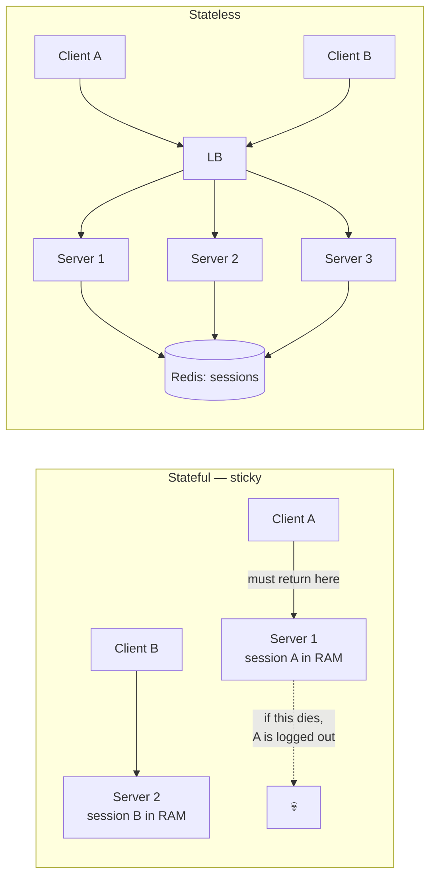
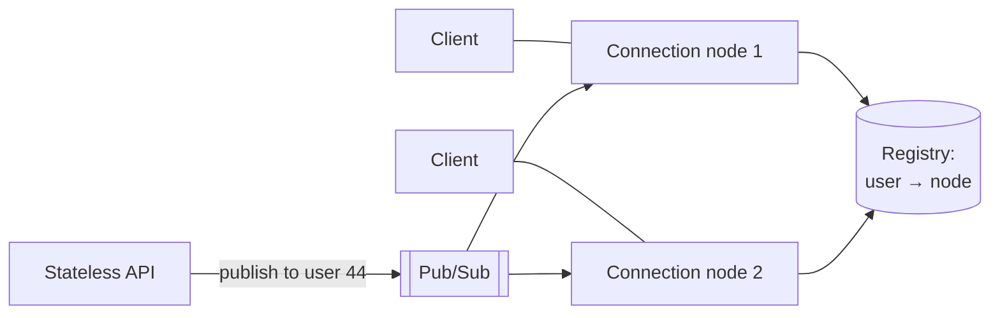

# 3.1.2 — Evolution of a Web App: Stateless vs Stateful

> **Part 3 · Scaling Services · Horizontal Scaling · Chapter 2 of 6**
> The pivotal step of the scaling staircase. Everything after depends on getting this right.

---

## 🧒 ELI5 — Explain Like I'm 5

Imagine a shop with helpers behind the counter.

**Stateful helper:** she keeps your shopping list **in her head**. Great — until she goes on lunch break. Now nobody knows what you wanted, and you have to start over. And you can only ever be served by *her*, so if she's busy you queue, even when the other three helpers are free.

**Stateless helper:** the shopping list is written on a **card that you carry**, or kept in a **shared box on the wall** that all helpers can reach. Now *any* helper can serve you. One goes on break? No problem. Shop gets busy? Hire five more helpers instantly — they can all help anyone.

That's the whole idea: **don't keep important things in one person's head.**

The tricky part is spotting all the places where something quietly ended up in someone's head — a note in a pocket, a half-finished job on their desk, a delivery they were expecting. Every one of those has to move to the shared box before you can hire and fire helpers freely.

---

## The definition

**Stateless** does not mean "has no state." Every useful application has state. It means:

> **No state that matters is stored in the instance's memory or local disk between requests.**

Any request can be served by any instance, and killing an instance loses nothing.



---

## Why it's the pivotal step

| Capability | Requires statelessness? |
|---|---|
| Add or remove instances freely | ✅ Yes |
| Autoscaling | ✅ Yes |
| Rolling / blue-green deploys with no user impact | ✅ Yes |
| Instance replacement on health-check failure | ✅ Yes |
| Even load distribution | ✅ Yes |
| Spot / preemptible instances (60–90% cheaper) | ✅ Yes |
| Multi-AZ failover | ✅ Yes |

☠️ **Without it, every one of those breaks.** A stateful fleet cannot be autoscaled safely (scaling in logs users out), cannot be deployed without disruption, and cannot use cheap interruptible capacity.

---

## The audit: where state hides

Go through this list for any service. Each item is a real thing that has kept real teams from scaling.

| Hidden state | Symptom | Fix |
|---|---|---|
| **Session in memory** | Users logged out on deploy; sticky sessions required | Redis session store, or a signed token (JWT) |
| **Uploaded files on local disk** | File exists on one instance only; 404 from the others | Object storage (S3/GCS), presigned direct upload |
| **In-process cache treated as authoritative** | Inconsistent answers depending on which instance served you | Shared cache; treat local cache as an optimisation only, never as truth |
| **Local rate-limit counters** | Effective limit = configured limit × instance count | Redis counters, or a token-bucket with a shared store |
| **Background timers / `setInterval` / cron in the app** | The job runs N times, once per instance | A dedicated scheduler, a queue, or leader election |
| **In-memory job queue** | Queued work vanishes when the instance dies | A real broker |
| **WebSocket connections** | Inherently pinned to one instance | Connection registry + pub/sub routing (see below) |
| **Sequence generators / counters in memory** | Duplicate IDs across instances | A shared generator ([Unique ID Generators](../../07-patterns-and-templates/01-patterns/06-unique-id-generators.md)) |
| **Local feature-flag or config cache with no refresh** | Instances behave differently after a flag change | Push-based config, or short TTL with a last-known-good fallback |
| **Local temp files across requests** | Multi-step flows break when routed elsewhere | Object storage keyed by an operation ID |
| **Local logs only** | You can't find anything during an incident | Ship logs centrally |
| **Sticky in-memory locks** | Two instances both think they hold the lock | A distributed lock with fencing tokens |

🎯 **Interview angle** — "I'd make the app tier stateless. Concretely: sessions to Redis, uploads direct to object storage with presigned URLs, rate-limit counters in Redis, scheduled jobs moved to a queue-driven worker, and WebSockets terminated on a separate connection tier." Naming the *specific* items beats saying "make it stateless."

---

## Session management: the three options

| Approach | Where state lives | Pros | Cons |
|---|---|---|---|
| **Sticky sessions** | Server memory + LB affinity | No refactor | Uneven load; deploys log users out; blocks autoscaling; a dead node loses its users |
| **Shared session store** | Redis / Memcached / DynamoDB | Instant revocation; small cookie; any instance serves | A network hop (~0.5 ms) and a dependency |
| **Client-side token (JWT)** | Signed token held by the client | Zero server state; scales infinitely; cross-domain | Revocation is hard; token size on every request; payload is readable |

**The pragmatic answer used by most large systems: both.** A signed token carries identity (so most requests need no lookup), plus a small server-side store for revocation and for anything mutable (cart contents, feature assignments). Details and the revocation strategies: [API Authentication](../../01-introduction/02-api-design/04-api-authentication.md).

⚠️ **Sticky sessions are not always wrong** — they're a legitimate optimisation for cache locality (routing the same user to the same instance improves its local cache hit rate). The rule is: **sticky for performance, never for correctness.** If losing the affinity breaks the user's experience, you have a stateful app pretending otherwise.

---

## The genuinely stateful cases

Some things cannot be made stateless. Handle them explicitly rather than pretending.

### 1. WebSocket / long-lived connections

A connection *is* state, pinned to one process. You can't avoid that — but you can contain it.



**Pattern:** a thin, dedicated **connection tier** that holds sockets and does nothing else, plus a registry mapping `user_id → node`, plus pub/sub to route messages to the right node. Business logic stays in a stateless tier. Now the stateful part is small, simple, and independently scalable — and a connection-node restart only costs a reconnect.

### 2. Databases and stateful stores
Obviously stateful. Handled with replication, partitioning, and failover — Parts 4 and 5. In Kubernetes these are `StatefulSet`s with stable identities and persistent volumes.

### 3. Stream processors with local state
Flink/Kafka Streams keep local state stores for aggregations. Made recoverable via **checkpointing to durable storage** and a changelog topic, so a restarted instance rebuilds its state. See [Modern Stream: Flink & Kafka Streams](../../06-big-data/03-stream-processing/05-modern-stream-flink.md).

### 4. Multi-step wizards and long-running workflows
Don't keep them in memory. Persist the workflow state (a row, or a workflow engine like Temporal), keyed by an operation ID the client carries.

---

## Graceful shutdown — the stateless-app obligation

Being disposable means you *will* be disposed of. Handle it properly:

```
1. SIGTERM received
2. Fail the readiness probe / deregister    ← stop receiving NEW work
3. Sleep for LB propagation (5-30 s)        ← the step everyone omits
4. Stop accepting new connections
5. Finish in-flight requests (bounded, e.g. 30 s)
6. Flush buffers: metrics, logs, producer batches
7. Close database and broker connections
8. Exit 0
```

☠️ Skipping step 3 produces a burst of connection resets on **every deploy**. Teams often misattribute these to network flakiness for months. In Kubernetes, use a `preStop` hook with a sleep, and set `terminationGracePeriodSeconds` above your worst-case in-flight request duration.

---

## Twelve-factor, the relevant bits

The parts that matter for statelessness:

| Factor | Meaning |
|---|---|
| **III Config** | Configuration in the environment, not baked into the image |
| **IV Backing services** | Databases, caches, brokers are attached resources, swappable by URL |
| **VI Processes** | **Execute as stateless processes; share nothing** |
| **VIII Concurrency** | Scale by running more processes, not bigger ones |
| **IX Disposability** | Fast startup, graceful shutdown, robust against sudden death |
| **XI Logs** | Write to stdout as an event stream; don't manage log files |

**Fast startup** deserves emphasis: if an instance takes 3 minutes to become ready, autoscaling can't respond to a spike and rolling deploys take an hour. Aim for seconds — lazy-load what you can, and don't warm huge caches synchronously at boot.

---

## Statelessness ≠ no local caching

A frequent misunderstanding. **Local in-process caches are fine and often excellent** — they're the fastest tier available (~100 ns) and they absorb hot keys.

The rules that keep them legitimate:
1. **The cache is derivable** — losing it costs latency, never correctness.
2. **Entries are short-lived** (seconds), so divergence between instances is bounded.
3. **It's never the source of truth** for anything a user sees as authoritative.
4. **You accept N copies** — with 50 instances, an invalidation must reach 50 caches, or you rely on TTL expiry.

See [The Multi-Layer Defense](../03-caching/02-caching-tiers.md).

---

## 📋 Chapter checklist

| Skill | Ready? |
|---|---|
| Define statelessness precisely (not "has no state") | ☐ |
| List seven capabilities that require it | ☐ |
| Run the twelve-item hidden-state audit | ☐ |
| Compare sticky sessions, shared store, and JWT | ☐ |
| State the "sticky for performance, never for correctness" rule | ☐ |
| Design a WebSocket connection tier with a registry and pub/sub | ☐ |
| Recite the graceful-shutdown sequence and why step 3 matters | ☐ |
| Explain why local caches don't violate statelessness | ☐ |

---

**← Previous** [3.1.1 Evolution of Computing Environments](01-evolution-of-computing-environments.md)
**Next →** [3.1.3 Evolution of a Web App: Single to Scaling](03-single-to-scaling.md)
