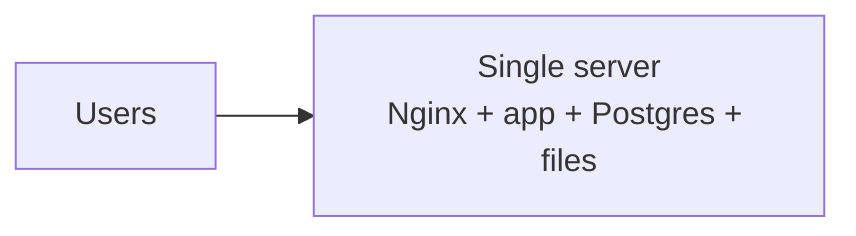
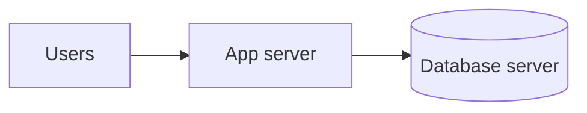
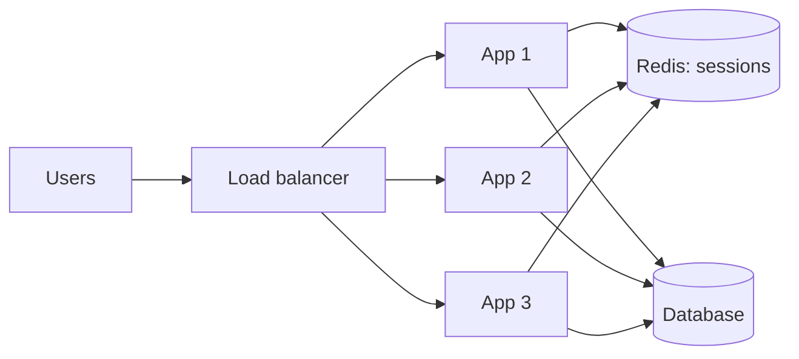
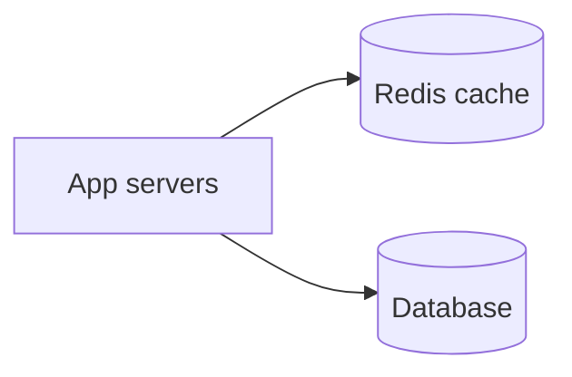
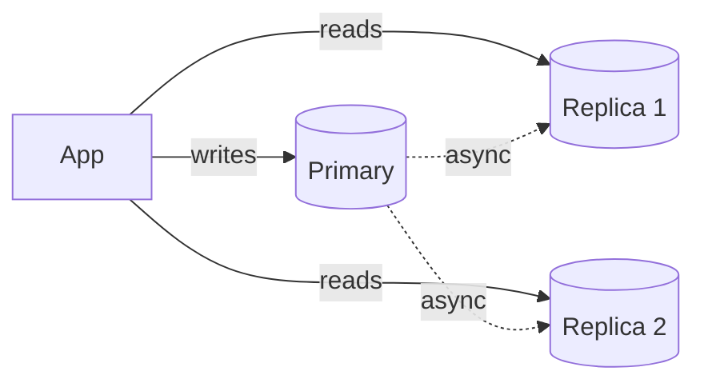
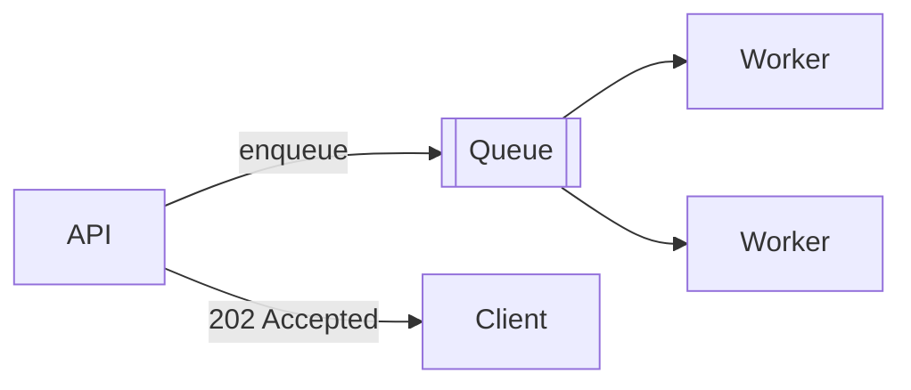
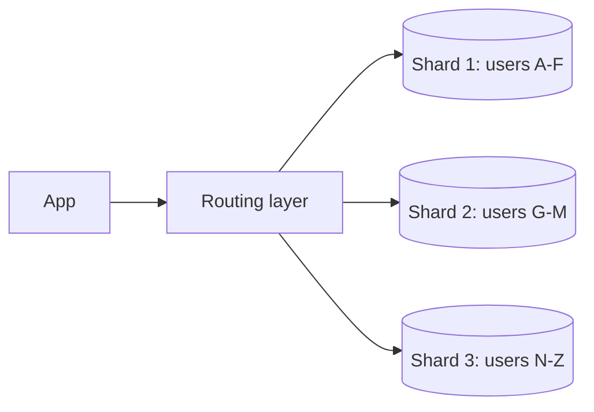
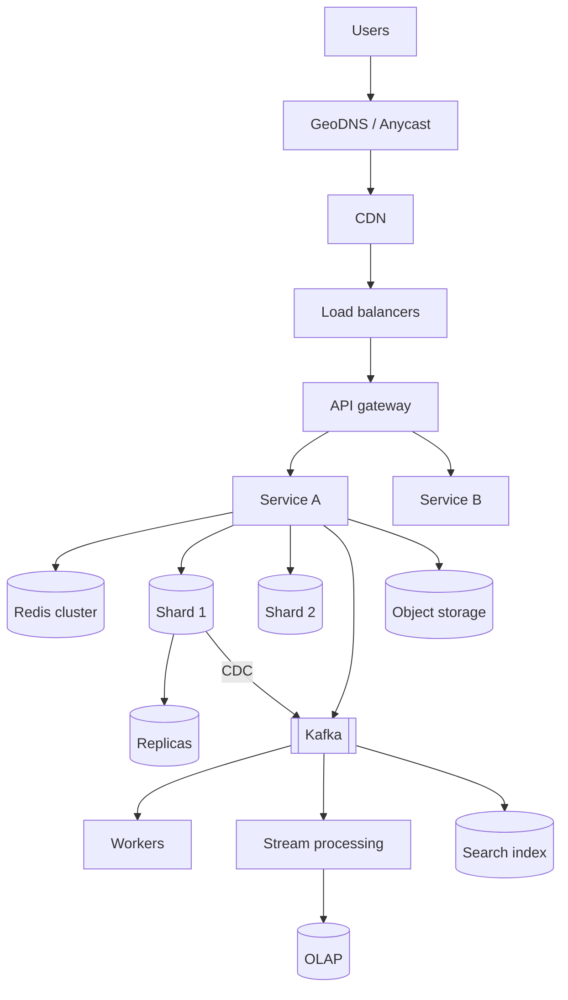

# 3.1.3 — Evolution of a Web App: Single Server to Scaled System

> **Part 3 · Scaling Services · Horizontal Scaling · Chapter 3 of 6**
> One application, followed from 100 users to 100 million. Every step has a trigger, a fix, and a new problem.

---

## 🧒 ELI5 — Explain Like I'm 5

We're going to follow **one shop** as it grows, and watch what breaks at each size.

- **10 customers a day:** one person does everything. Fine.
- **1,000 a day:** the one person is exhausted. Buy them a better chair and a faster till. *(Bigger machine.)*
- **10,000:** the till and the stockroom are fighting for the same table. Put the stockroom in a different room. *(Split app and database.)*
- **50,000:** one person can't serve everyone. Hire more, and put someone at the door directing customers. *(Load balancer + more servers.)*
- **200,000:** everyone asks the same three questions. Write the answers on a board by the door. *(Cache.)*
- **1 million:** customers in other cities are waiting ages for delivery. Open depots near them. *(CDN.)*
- **5 million:** the stockroom clerk is overwhelmed by people *asking* what's in stock. Make photocopies of the stock list for people to read. *(Read replicas.)*
- **20 million:** wrapping presents is slowing down the till. Put presents in a bin; a wrapping team handles them later. *(Queues.)*
- **50 million:** the stockroom itself is too full. Split it into two rooms, A–M and N–Z. *(Sharding.)*
- **100 million+:** the shop is now a chain, with different teams running different departments in different countries.

Each fix creates the next problem. **That chain of problems is the job.**

---

## Stage 0 — One server



- **Capacity:** a few hundred QPS; up to ~10k users
- **Cost:** ~$20–50/month
- **Everything works.** Genuinely.

**Trigger to move:** CPU or memory saturated; the database competes with the app; a deploy causes downtime you can no longer accept.

🎯 Start here in an interview. *"For 1,000 users this is one VM, and that's the correct answer. Now let me assume 100 million users."*

---

## Stage 1 — Vertical scaling

Bigger box: more cores, more RAM, NVMe.

- **Capacity:** thousands of QPS
- **Change required:** none
- **Cost:** grows superlinearly

⚖️ **Massively underrated.** Stack Overflow served billions of monthly requests from a handful of large servers. Vertical scaling introduces **zero** distributed-systems bugs. Exhaust it before distributing.

**Trigger to move:** price per unit of capacity becomes absurd; still a single point of failure; you've hit the largest instance available.

---

## Stage 2 — Split application and database



Different resource profiles (app = CPU/concurrency; database = RAM/IO), so they should scale independently. Also the prerequisite for stage 3.

**New problem:** a network hop (~0.5 ms), and two machines to operate. **N+1 query patterns now hurt** — 50 queries per page just became 25 ms of pure network.

---

## Stage 3 — Load balancer + N stateless app servers

**The pivotal step.** Everything from [Stateless vs Stateful](02-stateless-vs-stateful.md) applies here: sessions to Redis, uploads to object storage, no local scheduled jobs.



**Wins:** horizontal scale, zero-downtime rolling deploys, instance failure tolerated.

**New problems:**
- The load balancer is now a SPOF → make it redundant (managed LB, or two with a floating VIP).
- **Database connections multiply:** 10 app servers × 100-connection pools = 1,000 connections. Postgres will not tolerate this → add PgBouncer. This surprises people; it is a real ceiling.
- Session store is a new dependency.

---

## Stage 4 — Cache

The database is now the bottleneck because N app servers hammer it.



**Cache-aside** is the default pattern:
```
read:  value = cache.get(k)
       if miss: value = db.get(k); cache.set(k, value, ttl)
write: db.write(k, v); cache.delete(k)      ← delete, don't update
```

🔢 A 90% hit rate cuts database reads 10×. 90% → 95% halves them again.

**New problems:** staleness, invalidation correctness, cache stampedes on expiry, and — critically — **what happens if the cache dies?** At this stage a total cache loss sends 10× traffic at a database sized for 1×. This must be designed for, not hoped about. (Part 3 Caching, 18 chapters.)

---

## Stage 5 — CDN

Static assets, images, video, and cacheable API responses served from edge PoPs.

**Wins:** 50 ms instead of 300 ms for distant users; the origin never sees most requests; egress cost drops 5×.

**New problems:** invalidation across PoPs (use versioned/content-hashed URLs and you never invalidate at all), and personalised content can't be edge-cached without care (`Vary` headers, or split personalised fragments out).

---

## Stage 6 — Read replicas



**Wins:** read capacity scales with replica count; replicas also serve as failover targets and analytics targets.

**New problem — replication lag.** A user updates their profile, is routed to a replica, and sees the old value. Standard fixes:
- Route reads to the primary for N seconds after a write by that user (a flag in the session or a cookie).
- Sticky-read to one replica for a session (monotonic reads).
- Read the user's own writes from cache, written through on the write path.

⚠️ **Replicas do nothing for write load.** If writes are the bottleneck, this stage is wasted effort — go to stage 8.

---

## Stage 7 — Asynchronous processing

Move everything off the request path that doesn't need to be in it: emails, thumbnails, search indexing, webhooks, analytics, exports.



**Wins:** p99 drops sharply; traffic spikes become queue depth instead of errors; workers scale independently; retries are free.

**New problems:** eventual consistency is now user-visible ("processing…"), consumers must be idempotent, and you must not dual-write — use the outbox. (Part 2.)

---

## Stage 8 — Shard the database

The primary can no longer absorb the write volume or hold the dataset.



**Wins:** writes and storage scale linearly with shard count.

**New problems — this is the biggest complexity jump on the staircase:**
- No cross-shard joins or transactions.
- Global `ORDER BY`/aggregates become scatter-gather in the application.
- Auto-increment IDs break → need a distributed ID generator.
- Resharding is a major operation → use consistent hashing or logical shards from day one.
- One hot shard can be saturated while others idle.

**Delay this as long as honestly possible.** Exhaust vertical scaling, caching, read replicas, and archiving old data first. (Part 5.)

---

## Stage 9 — Service decomposition

Split by team ownership and differential scaling need — not by code size. (See [Microservices vs Monolithic](../../01-introduction/05-microservices/01-microservices-vs-monolithic.md).)

**New problems:** network calls replace function calls, distributed transactions, availability multiplies down, and you need tracing before you split, not after.

---

## Stage 10 — Multi-region

Users served from the nearest region; survive losing an entire region.

**New problems:** cross-region replication lag (~100 ms+), conflict resolution for active-active writes, data-residency law, and doubled infrastructure cost. Practise the failover or it doesn't work.

---

## The whole picture



---

## Capacity at each stage

| Stage | Users | QPS | Monthly cost (rough) |
|---|---|---|---|
| 0 Single server | < 10k | < 100 | $20–50 |
| 1 Vertical | < 50k | < 1,000 | $200–500 |
| 2 Split tiers | < 100k | ~1,000 | $500–1k |
| 3 LB + N servers | < 500k | ~5,000 | $2–5k |
| 4 Cache | ~1M | ~10,000 | $5–10k |
| 5 CDN | ~5M | ~50,000 | $10–30k |
| 6 Read replicas | ~10M | ~100,000 | $30–80k |
| 7 Async | ~20M | ~200,000 | $50–150k |
| 8 Sharding | ~50M | ~500,000 | $150–500k |
| 9–10 Services + multi-region | 100M+ | 1M+ | $1M+ |

Rough by design. The **ordering and triggers** are the content, not the thresholds.

---

## The two rules

**Rule 1 — Don't skip stages.** Each stage's complexity is justified by the previous stage's bottleneck. Sharding a system that hasn't got a cache yet means you built the hardest thing to solve a problem caching would have solved.

**Rule 2 — Measure, then move.** Every stage should be triggered by a *measured* bottleneck, not by anticipation. "Our database CPU is at 85% and 70% of queries are repeated reads" justifies a cache. "We might get big someday" justifies nothing.

🎯 **In an interview, narrate the staircase and then jump to the stage the stated scale requires.** *"At 100M DAU we're at stage 8 — sharded, cached, CDN, async. Let me draw that, and I'll explain what forced each piece."* This is far stronger than drawing the final architecture with no justification.

---

## 📋 Chapter checklist

| Skill | Ready? |
|---|---|
| Recite the eleven stages with triggers | ☐ |
| Explain why statelessness is the pivotal stage | ☐ |
| Explain the connection-multiplication problem at stage 3 | ☐ |
| Explain replication lag and three fixes | ☐ |
| Say why replicas don't help writes | ☐ |
| List the five losses that come with sharding | ☐ |
| State the two rules and defend them | ☐ |

---

**← Previous** [3.1.2 Stateless vs Stateful](02-stateless-vs-stateful.md)
**Next →** [3.1.4 Load Balancer](04-load-balancer.md)
