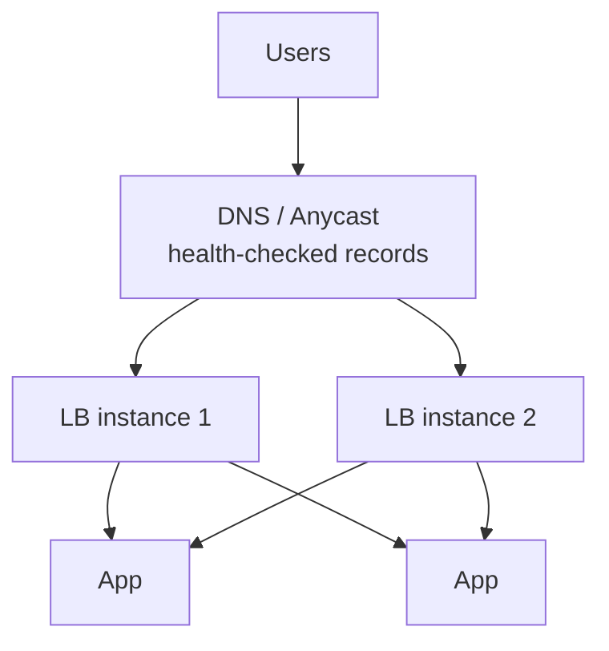

# 3.1.4 — Load Balancer

> **Part 3 · Scaling Services · Horizontal Scaling · Chapter 4 of 6**
> The traffic director. Layers, algorithms, health checks, and the ways it goes wrong.

---

## 🧒 ELI5 — Explain Like I'm 5

A load balancer is **the person at the door of a busy shop who says "till 3 is free, go there."**

Without them, everyone queues at till 1 because it's nearest, and tills 2–5 stand idle.

A good door person does four things:

1. **Sends you to a free till** — not always the same one, and ideally the *least busy* one.
2. **Knows which tills are broken.** They keep checking: *"till 4, you alright?"* No answer twice in a row → stop sending people there. *(Health checks.)*
3. **Remembers you, if it matters.** If you left your half-packed bag at till 2, they send you back to till 2. *(Sticky sessions — useful, but see the warning.)*
4. **Doesn't become the new queue.** If there's only one door person and 5,000 customers, *they* are the jam. So you need more than one door — and something outside deciding which door. *(Redundant load balancers behind DNS/anycast.)*

Point 4 is the one people forget. **The thing that fixes the bottleneck must not become the bottleneck.**

---

## Layer 4 vs Layer 7

| | **L4 (transport)** | **L7 (application)** |
|---|---|---|
| Sees | IP, port, TCP/UDP | HTTP method, path, headers, cookies, body |
| Decision unit | Connection | Request |
| Throughput | Millions of connections/s | Hundreds of thousands of req/s |
| Latency added | ~microseconds | ~0.1–1 ms |
| TLS | Passes through (or terminates) | Usually terminates |
| Can do | NAT, DSR, connection balancing | Path routing, header rewriting, retries, canary splits, compression, WAF, caching |
| Examples | AWS NLB, IPVS, HAProxy (tcp mode), Maglev | AWS ALB, Envoy, NGINX, HAProxy (http mode), Traefik |

⚠️ **The critical difference for HTTP/2 and gRPC:** an L4 balancer balances *connections*. gRPC multiplexes thousands of requests over one long-lived connection, so an L4 balancer pins a client to one backend **forever**. You get badly skewed load. **gRPC needs L7 balancing** (Envoy) or client-side balancing with a headless service.

**Common production topology:** L4 at the very edge for raw scale and DDoS absorption → L7 behind it for routing and policy.

---

## Algorithms

| Algorithm | How | Best for | Watch out |
|---|---|---|---|
| **Round robin** | Rotate through backends | Uniform request cost, uniform instances | One slow backend still gets its share |
| **Weighted round robin** | Proportional to capacity weights | Mixed instance sizes; canary traffic splits | Weights must be maintained |
| **Least connections** | Fewest active connections | ✅ Variable request cost | Long-lived connections skew it |
| **Least request / least outstanding** | Fewest in-flight requests | ✅ Good default for HTTP | Needs per-backend counters |
| **Power of two choices (P2C)** | Pick 2 at random, send to the less loaded | ✅ **The modern default** — near-optimal, no coordination | — |
| **Latency-weighted (EWMA)** | Prefer historically faster backends | Heterogeneous or cross-AZ fleets | Can herd onto one fast node; add randomness |
| **IP hash** | `hash(client_ip)` → backend | Crude stickiness without cookies | NAT/mobile carriers put thousands of users behind one IP |
| **Consistent hashing** | `hash(key)` → ring position | ✅ Cache locality; shard routing | Needs virtual nodes for balance ([Consistent Hashing](../../05-scaling-data-storage/02-data-partitioning/03-consistent-hashing.md)) |
| **Random** | Uniform random | Simple, surprisingly decent at scale | Uneven at low request counts |

🎯 **Why power-of-two-choices wins.** Pure random gives an expected max load of `O(log n / log log n)` times the average; sampling **two** and picking the better drops it to `O(log log n)` — an exponential improvement, for one extra random number and no coordination. "Least loaded" globally requires shared state and can herd every balancer onto the same "best" node simultaneously. P2C avoids both problems. Naming this is a strong signal.

---

## Health checks

| Type | Mechanism | Catches |
|---|---|---|
| **TCP** | Can we open a connection? | Process dead |
| **HTTP** | `GET /healthz` → 200? | Process wedged, app-level failure |
| **Custom/deep** | Checks internal state | Broken shard assignment, bad config |
| **Passive / outlier detection** | Observe real traffic; eject on consecutive 5xx or high latency | Failures active checks miss entirely |

**Typical tuning:**
```
interval:            5 s
timeout:             2 s
unhealthy_threshold: 2   → detected in ~10 s
healthy_threshold:   2   → returns after ~10 s of health
```

⚠️ **Do not check downstream dependencies in the health endpoint.** If `/healthz` queries the database, a database blip marks **every** instance unhealthy at once, the LB has zero targets, and a partial degradation becomes a total outage. Keep readiness about *this instance's ability to serve*; report dependency health separately as a degraded signal.

✅ **Fail open.** When *all* backends are unhealthy, a good load balancer sends traffic to all of them rather than none. Serving degraded beats serving nothing, and it protects you from a bad health-check deploy. Verify your LB does this (most managed ones do).

**Separate liveness and readiness** ([Chapter 1.3.4](../../01-introduction/03-non-functional-requirements/04-how-to-achieve-high-availability.md)): readiness gates traffic, liveness triggers restarts. Conflating them means a temporarily-busy instance gets killed instead of briefly bypassed.

---

## Session persistence (stickiness)

| Method | How | Problem |
|---|---|---|
| **Source IP hash** | `hash(client_ip)` | Corporate NAT and mobile carriers collapse thousands of users onto one backend |
| **Cookie (LB-inserted)** | The LB sets a cookie naming the backend | Requires cookie support; leaks topology |
| **Application cookie** | The LB reads an existing app cookie | Cleaner |
| **TLS session ID** | Stick by TLS session | Breaks on resumption changes |

⚠️ **Stickiness costs you:**
- Uneven distribution (long-lived sessions accumulate on old instances).
- Scale-in logs users out.
- Deploys disrupt sessions.
- A dead backend loses its users' state.

**Rule: use stickiness for performance (cache locality), never for correctness.** If your app *requires* stickiness, it is stateful — fix that instead ([Stateless vs Stateful](02-stateless-vs-stateful.md)).

---

## What an L7 balancer does beyond balancing

| Feature | Why it belongs here |
|---|---|
| **TLS termination** | One place for certificates; backends speak plain HTTP internally |
| **HTTP/2 and HTTP/3 termination** | Modern protocols at the edge, HTTP/1.1 behind |
| **Path/host routing** | `/api/*` → API service, `/static/*` → CDN origin |
| **Canary / traffic splitting** | 1% to v2, weighted by header or percentage |
| **Retries and timeouts** | Uniform policy without app changes |
| **Outlier ejection** | Automatic removal of misbehaving instances |
| **Rate limiting** | First line of defence |
| **Request/response rewriting** | Version shims, header injection, stripping client-supplied identity headers |
| **Compression** | gzip/brotli once, at the edge |
| **Connection pooling to backends** | Many client connections → few backend connections |
| **Access logging + tracing** | The authoritative view of latency and errors |

🎯 **Connection multiplexing is an underrated benefit.** 50,000 client connections can be served over a few hundred backend connections, which is often what saves your database's connection limits and your application's memory.

---

## Making the load balancer itself highly available



| Approach | Failover time | Notes |
|---|---|---|
| **Managed cloud LB** (ALB/NLB, Cloud LB) | Transparent | Multi-AZ, autoscaling, the default choice |
| **Two LBs + floating VIP** (keepalived/VRRP) | 1–3 s | Classic on-prem pattern |
| **DNS with health checks** | 30 s – 5 min (TTL-bound) | Fine for regional failover, too slow for instance failover |
| **Anycast** | Sub-second (BGP reconvergence) | What CDNs and large providers use |

⚠️ **Scaling a managed LB is not instant.** AWS ALBs scale by adding capacity over minutes; a 100× instantaneous spike can get you 503s from the LB itself. For known events (ticket drops, launches) request pre-warming or pre-scale. This is a good detail to mention when a design involves flash traffic.

---

## Global load balancing

| Method | Granularity | Failover | Notes |
|---|---|---|---|
| **GeoDNS** | Per resolver (approximate) | TTL-bound (minutes) | Cheap; resolver location ≠ user location |
| **Anycast** | Per BGP route | Seconds | Same IP announced from many PoPs; used by CDNs |
| **Client-side selection** | Per client | Instant | App measures latency and picks; needs client support |
| **Global HTTP LB** (GCP/Cloudflare) | Per request | Seconds | Single anycast IP, routed to the healthiest nearest region |

Routing policies worth naming: **latency-based** (nearest by measured RTT), **geolocation** (compliance/data residency), **weighted** (gradual regional migration), and **failover** (active-passive).

---

## ☠️ Failure modes

| Failure | Symptom | Fix |
|---|---|---|
| Single LB instance | Total outage when it dies | Redundant LBs + DNS/anycast |
| Health check hits the database | One database blip → all instances unhealthy | Check the instance only |
| No fail-open | Zero healthy targets → 100% errors | Configure fail-open |
| L4 balancing gRPC/HTTP-2 | One backend gets everything | Use L7 or client-side LB |
| Sticky sessions with scale-in | Users logged out on every scale event | Externalise session state |
| Idle timeout shorter than the client's | Random connection resets | Align: client idle < LB idle < server idle |
| LB timeout shorter than backend processing | 504s on legitimate slow requests | Align timeouts across the chain |
| No slow start on new instances | A cold instance gets full traffic and falls over | Enable slow start / gradual ramp |
| Cross-AZ balancing without zone awareness | Extra latency and transfer cost | Prefer same-AZ with spillover |
| No connection draining on deregistration | Connection resets on every deploy | Enable draining; deregister then wait |

🎯 **The three timeouts must be ordered:** `client idle > LB idle > backend idle` for connections, and `client request timeout > LB request timeout > backend timeout` for requests. Misordering produces confusing intermittent errors that are hard to attribute.

---

## 📋 Chapter checklist

| Skill | Ready? |
|---|---|
| Compare L4 and L7 across six dimensions | ☐ |
| Explain why gRPC breaks under L4 balancing | ☐ |
| Name six algorithms and pick one with a reason | ☐ |
| Explain power-of-two-choices and why it beats both random and least-loaded | ☐ |
| Explain why health checks must not test dependencies | ☐ |
| Explain fail-open | ☐ |
| State the stickiness rule | ☐ |
| Describe four ways to make the LB itself HA | ☐ |
| Order the three timeouts correctly | ☐ |
| Name five load-balancer failure modes | ☐ |

---

**← Previous** [3.1.3 Single to Scaling](03-single-to-scaling.md)
**Next →** [3.1.5 Load Balancing Codelab](05-load-balancing-codelab.md)
