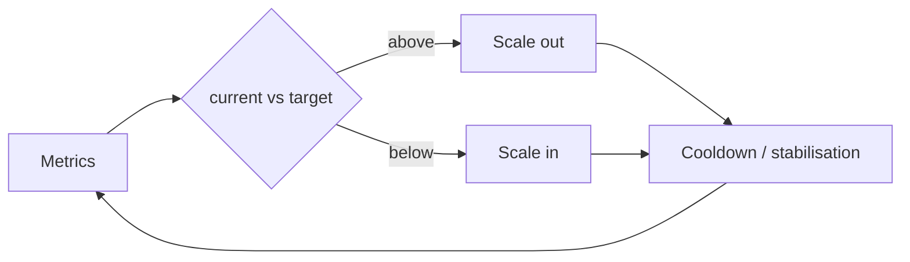
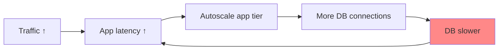

# 3.1.6 — Auto Scaling

> **Part 3 · Scaling Services · Horizontal Scaling · Chapter 6 of 6**
> Matching capacity to demand automatically — and knowing when it cannot save you.

---

## 🧒 ELI5 — Explain Like I'm 5

Autoscaling is **hiring and sending home shop staff automatically.**

Too many customers? Ring more staff. Quiet afternoon? Send some home. Nobody has to sit and watch.

Three things make it hard:

1. **Staff take time to arrive.** You ring them when the queue gets long, but they take 3 minutes to get there. By then the queue is out the door. So you have to ring them **before** you need them — either by watching the queue *start* to grow, or by knowing that Saturday is always busy.
2. **Don't flap.** If you send someone home the moment it's quiet, then ring them back 30 seconds later, then send them home again, everyone's exhausted and nothing works. So: **hire quickly, fire slowly.**
3. **More staff doesn't help if the problem is elsewhere.** If the queue is long because the *card machine* is broken, hiring ten more staff just means ten people standing around — and if they all try the card machine at once, they break it *harder*. **You have to scale the actual bottleneck.**

That third one is the mistake people actually make. Adding servers when the *database* is the problem doesn't help; it makes it worse.

---

## What to scale on

| Metric | Good for | Watch out |
|---|---|---|
| **CPU utilisation** | CPU-bound services | Useless for I/O-bound work — CPU stays at 10% while everything times out |
| **Memory** | Memory-bound services | Memory rarely drops back, so scale-in doesn't trigger |
| **Request rate (RPS per instance)** | ✅ Most web services | Requires knowing per-instance capacity |
| **Concurrent requests / in-flight** | ✅ I/O-bound services | The most direct measure of saturation |
| **p95/p99 latency** | User experience directly | Lagging indicator — you're already degraded |
| **Queue depth or age** | ✅ **Worker fleets — the best signal** | Needs a custom metric adapter (KEDA, CloudWatch) |
| **Custom business metric** | Active game sessions, connected sockets | Requires plumbing |

🎯 **Recommendation:** for request-serving fleets, scale on **request rate or concurrency per instance**, not CPU. For workers, scale on **queue depth or oldest-message age**. CPU is the default everywhere and is right surprisingly rarely.

---

## The control loop



**Target tracking** is the standard formula:

$$\text{desired} = \left\lceil \text{current} \times \frac{\text{current metric}}{\text{target metric}} \right\rceil$$

```
10 instances, 800 RPS each, target 500 RPS
desired = ceil(10 × 800/500) = 16 instances
```

| Policy type | Behaviour | Use |
|---|---|---|
| **Target tracking** | Maintain a metric at a set point | ✅ Default choice |
| **Step scaling** | Different responses at different thresholds | Aggressive response to large breaches |
| **Simple scaling** | Add/remove N on a threshold | Legacy; prone to flapping |
| **Scheduled** | Time-based | Known patterns (business hours, batch windows) |
| **Predictive** | ML forecast from history | Weekly patterns; pre-scales ahead of the curve |

---

## The timing problem

```
t=0    Traffic spikes
t=60   Metric is published (CloudWatch 1-min granularity)
t=90   Alarm crosses its evaluation period
t=95   Scaling action triggered
t=125  Instance launched
t=185  Boot + app start
t=215  Health checks pass, added to LB
t=245  Warm (JIT, caches, connection pools)
────────────────────────────────────────────
≈ 4 minutes of degradation before help arrives
```

☠️ **Autoscaling cannot handle instant spikes.** A flash sale peaks in 10 seconds. Autoscaling responds in 2–5 minutes. You will be down for the spike.

### Cutting the delay

| Optimisation | Saving |
|---|---|
| High-resolution metrics (10 s instead of 60 s) | ~60 s |
| Shorter evaluation periods (1 datapoint, not 3) | ~60 s |
| Pre-baked AMIs / small container images | 30–90 s |
| Fast application startup (lazy-load, no synchronous cache warm) | 10–60 s |
| Warm pools / pre-provisioned capacity | Most of the launch time |
| **Scale on a leading indicator** (queue depth, connection count) rather than a lagging one (latency) | 60–120 s |

### For spikes autoscaling can't catch

| Technique | Effect |
|---|---|
| **Scheduled pre-scaling** | Known event at 10:00 → scale at 09:30 |
| **Over-provision headroom** | Run at 50% utilisation so you can absorb 2× instantly |
| **Virtual waiting room** | Queue users at the edge, admit at a controlled rate |
| **Load shedding** | Reject low-priority traffic fast; keep the rest healthy |
| **Static CDN fallback** | Serve a cached page during the peak |

---

## Flapping and stabilisation

Oscillation wastes money, thrashes caches, and disrupts users.

**The rule: scale out fast, scale in slow.**

| Direction | Typical settings | Reason |
|---|---|---|
| **Out** | Trigger on 1–2 datapoints; no cooldown or a very short one | Under-capacity hurts users now |
| **In** | Trigger on 5–15 minutes below target; long cooldown (5–10 min); remove ≤ 10% at a time | Over-capacity only costs money |

Kubernetes HPA equivalents:
```yaml
behavior:
  scaleUp:
    stabilizationWindowSeconds: 0
    policies: [{ type: Percent, value: 100, periodSeconds: 30 }]  # can double every 30s
  scaleDown:
    stabilizationWindowSeconds: 300      # must be low for 5 min
    policies: [{ type: Percent, value: 10, periodSeconds: 60 }]   # shrink ≤10%/min
```

⚠️ **Scale-in must be graceful.** Terminating an instance mid-request produces errors on every scale-in event. Required: deregister → wait for LB propagation → drain in-flight → terminate. (Kubernetes: `preStop` hook + `terminationGracePeriodSeconds`; AWS: lifecycle hooks + connection draining.)

---

## Scaling the right thing

☠️ **The most common autoscaling failure:** the app tier autoscales because latency is high, but the bottleneck is the **database**. Now 50 app servers each open connection pools against a database that was already saturated. **You have DDoSed yourself, automatically.**



**Safeguards:**
1. **Cap `maxReplicas`** at what the downstream can actually support.
2. **Connection pooling at a proxy** (PgBouncer/RDS Proxy) so instance count doesn't multiply database connections.
3. **Scale on a metric that reflects *your* saturation** (concurrency), not one contaminated by downstream slowness (latency).
4. **Circuit breakers** so app instances stop hammering a struggling dependency.
5. **Alert when scaling hits the ceiling** — that's the signal to fix the real bottleneck.

---

## Vertical and other autoscaling dimensions

| Type | What it changes | Notes |
|---|---|---|
| **Horizontal (HPA)** | Instance count | The default; requires statelessness |
| **Vertical (VPA)** | CPU/memory per instance | Usually requires a restart; good for right-sizing over time, not for spikes |
| **Cluster autoscaler** | Number of *nodes* | Adds another 1–3 minutes; pods pend until nodes arrive |
| **Karpenter / just-in-time nodes** | Provisions right-sized nodes directly | Much faster than node-group scaling |
| **Serverless** | Per-request concurrency | Fastest scaling; cold starts and cost crossover |
| **Database autoscaling** | Read replicas, Aurora Serverless capacity units | Slow (minutes) for replicas; storage scaling is usually automatic |

⚠️ **Two-level latency:** with Kubernetes, a pod can only start if a node has room. HPA (seconds) + cluster autoscaler (minutes) means real capacity arrives on the *cluster autoscaler's* timescale. Keep spare node capacity ("pause pods" of low priority that get evicted) if you need fast pod scheduling.

---

## Cost dimensions

| Lever | Saving | Trade-off |
|---|---|---|
| Autoscaling itself | 30–70% vs peak-provisioned | Scaling lag |
| **Spot / preemptible instances** | 60–90% | 2-minute termination notice; needs statelessness and diversification across instance types |
| Reserved / committed use for the baseline | 30–70% | 1–3 year commitment |
| Scale to zero off-hours (dev, batch) | ~70% of non-prod cost | Cold start on first request |
| Right-sizing (VPA recommendations) | 20–50% | Ongoing analysis |

**The standard mix:** reserved instances for the steady baseline, on-demand for the predictable daily peak, spot for burst and for batch workers. Say this if asked about cost.

---

## Autoscaling workers on queue depth

The cleanest autoscaling case, because the signal is honest and leading.

```yaml
# KEDA
triggers:
  - type: aws-sqs-queue
    metadata:
      queueURL: https://sqs.../jobs
      queueLength: "20"        # target ~20 messages per consumer
```

```
desired_consumers = ceil(queue_depth / 20)
```

**Also scale to zero** when the queue is empty — for spiky batch workloads this is a large saving and safe, because the queue holds work while consumers start.

⚠️ Set `maxReplicas` from the **downstream** capacity, not the queue depth. 10,000 messages does not mean you should start 500 workers if the database handles 50 concurrent writers.

---

## What to monitor

```
autoscaling_desired_capacity / current_capacity
autoscaling_events_total{direction}            # flapping shows up here
time_at_max_capacity_seconds                   # ← the most important one
instance_startup_duration_seconds
scale_in_terminations_with_errors_total
```

🎯 **Alert on "at max capacity for > 5 minutes."** That means autoscaling has stopped protecting you and something needs a human. Conversely, an instance count that never changes means your policy isn't doing anything — verify it works before you need it.

---

## ☠️ Failure modes

| Mistake | Consequence |
|---|---|
| Scaling on CPU for an I/O-bound service | Never scales; times out at 10% CPU |
| No `maxReplicas` cap | Runaway scaling destroys the database, and the bill |
| Scaling the app when the database is the bottleneck | Makes the incident worse |
| Aggressive scale-in | Flapping, cold caches, disrupted requests |
| No graceful termination | Errors on every scale-in |
| Expecting autoscaling to handle flash sales | Down for the whole spike |
| Slow instance startup (5-minute boot) | Autoscaling is decorative |
| Scaling on latency (a lagging indicator) | Always reacting after users are hurt |
| Ignoring the cluster autoscaler's extra delay | Pods pend; capacity never arrives in time |
| Stateful instances | Scale-in loses data |

---

## 📋 Chapter checklist

| Skill | Ready? |
|---|---|
| Choose a scaling metric for a web fleet and for a worker fleet | ☐ |
| Apply the target-tracking formula | ☐ |
| Break down the ~4-minute scaling delay | ☐ |
| Give five techniques for spikes autoscaling can't catch | ☐ |
| State "out fast, in slow" with concrete settings | ☐ |
| Narrate the self-DDoS cascade and five safeguards | ☐ |
| Explain the HPA + cluster-autoscaler two-level delay | ☐ |
| Describe the reserved/on-demand/spot cost mix | ☐ |
| Say why "time at max capacity" is the key alert | ☐ |

---

**← Previous** [3.1.5 Load Balancing Codelab](05-load-balancing-codelab.md)
**Next →** [3.2.1 Read-Write Separation](../02-read-write-separation/01-read-write-separation.md)
