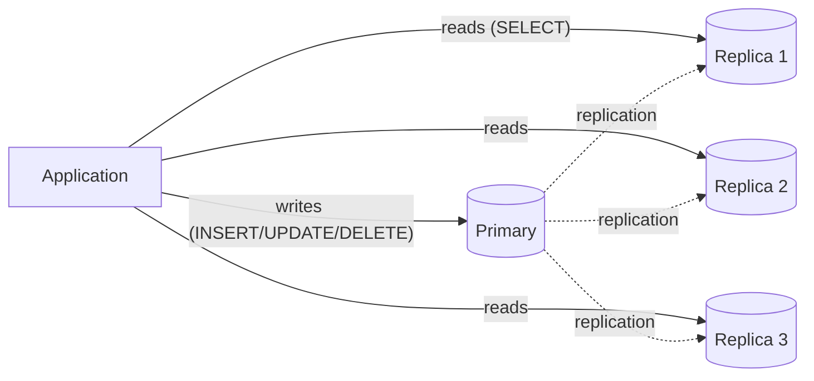

# 3.2.1 — Read-Write Separation

> **Part 3 · Scaling Services · Read-Write Separation · Chapter 1 of 2**
> Reads outnumber writes by 10× to 1000×. Serve them from different places.

---

## 🧒 ELI5 — Explain Like I'm 5

There's **one master notebook** with all the shop's information in it. Everyone who wants to know something has to come and read it, and it's getting crowded around the desk.

Here's the trick: **most people only want to *read* it. Very few want to *write* in it.**

So you make **photocopies**. Now:

- Want to **read**? Grab any photocopy. There are five of them; no queue.
- Want to **write**? You must use the master notebook. Only one person writes at a time, but that's fine — hardly anyone writes.

Photocopies get made a moment after each change, so...

**...here's the catch:** if you write "Ann's phone number is 555" in the master, and then *immediately* run to a photocopy to check it, the photocopy might still say the old number. The copier hasn't caught up yet.

Usually that's fine — a second later it's correct. But it feels **very** broken when it's *your own* change that seems to have vanished.

So there's a rule: **if you just wrote something, read it from the master.** Everyone else can use the photocopies.

---

## The pattern



| | Primary | Replicas |
|---|---|---|
| Accepts | All writes, and reads that need freshness | Reads only |
| Count | One (per shard) | Many |
| Scales | Vertically only | **Horizontally** |
| Consistency | Authoritative | Lagging by ms to seconds |

**Why it works:** most workloads are read-dominated. Twitter ~1000:1. E-commerce browse ~100:1. Adding replicas multiplies read capacity almost linearly and costs nothing on the write path except a small replication overhead.

⚠️ **It does nothing for writes.** If write QPS is your bottleneck, replicas are wasted money — you need sharding ([Part 5](../../05-scaling-data-storage/02-data-partitioning/)). This is the single most common misapplication of the pattern.

---

## Replication lag: the whole problem

| Lag source | Typical magnitude |
|---|---|
| Network transfer (same AZ) | < 1 ms |
| Network transfer (cross-region) | 50–200 ms |
| Replica apply time (single-threaded replay) | ms to **minutes** under load |
| Large transaction replay | Proportional to transaction size |
| Long-running read blocking apply (Postgres conflict) | Seconds |
| Replica under-provisioned vs primary | Unbounded and growing |

☠️ **Lag is not constant — it spikes exactly when you least want it to.** A bulk update, a schema migration, or a traffic surge can push a normally-2 ms lag to 30 seconds. Any design that assumes "lag is tiny" will break during precisely those events.

**Always monitor lag**, in both seconds and bytes:
```sql
-- Postgres, on the replica
SELECT now() - pg_last_xact_replay_timestamp() AS lag;
-- MySQL
SHOW REPLICA STATUS\G   -- Seconds_Behind_Source
```

---

## The read-your-writes problem

```
t0  User updates their display name to "Anna"     → primary
t1  Page reloads, reads from a replica            → still shows "Ann"
t2  User: "it didn't save!" and clicks save again
```

This is the #1 user-visible symptom, and interviewers ask about it. Five solutions, in order of preference:

### 1. Read from the primary after a write (time-bounded)
```python
def get_user(uid, session):
    if session.get("wrote_at", 0) > time.time() - 5:      # 5s window
        return primary.query(uid)
    return replica.query(uid)
```
Simple, effective, cheap. Choose the window from your **p99 lag**, not your average.

### 2. Read from the primary for that entity only
Track which entities the session has written (`session.dirty = {user:44, order:88}`) and route only those to the primary. Much less primary load than a blanket 5-second rule.

### 3. Write-through cache
On write, update both the primary and the cache. Subsequent reads hit the cache and see the new value regardless of replica lag. Elegant — the cache becomes the consistency mechanism, not just an optimisation.

### 4. Wait for the replica to catch up (LSN/GTID tracking)
```python
lsn = primary.execute("... RETURNING pg_current_wal_lsn()")
session["lsn"] = lsn
# on read:
replica.execute("SELECT pg_wal_replay_wait(%s)", session["lsn"])   # PG 18+
# or: pick a replica whose replayed LSN >= session lsn
```
The most precise approach: exact consistency where needed, replicas everywhere else. MySQL's equivalent is GTID-based waiting. Requires plumbing but is the "correct" answer if pressed.

### 5. Sticky reads to one replica
Pin a session to one replica so they never see time go backwards (**monotonic reads**). Doesn't solve read-your-writes on its own, but prevents the worse bug below.

⚠️ **The worse bug — non-monotonic reads.** Without stickiness, consecutive requests hit different replicas with different lag, so the user sees a comment appear, then disappear, then reappear. This confuses users far more than simple staleness.

---

## Routing: how requests choose a target

| Approach | How | Pros | Cons |
|---|---|---|---|
| **Application-level** | Two connection pools; the code picks | Full control, per-query decisions | Every developer must get it right |
| **ORM support** | Django `using()`, Rails `connected_to(role:)` | Idiomatic | Framework-specific; easy to bypass |
| **Proxy** (ProxySQL, PgPool, RDS Proxy, Vitess) | Parses SQL and routes automatically | No app changes; central policy | Another hop; SQL-parsing edge cases |
| **DNS / endpoint split** | `db-writer.x` vs `db-reader.x` | Trivial | No per-query intelligence |

⚠️ **Automatic routing is not fully safe.** A proxy routing all `SELECT`s to replicas will break:
- `SELECT ... FOR UPDATE` (needs the primary — it takes locks)
- `SELECT` inside a write transaction (must see uncommitted changes)
- Functions with side effects
- Read-your-writes flows

Good proxies handle transactions correctly (route the whole transaction to the primary once a write occurs). Verify this; don't assume it.

**Recommended:** a proxy for the default, plus an explicit application-level escape hatch (`with primary_connection():`) for the cases that need it.

---

## Classifying reads by freshness requirement

The most useful design exercise here — do this in an interview:

| Read | Tolerance | Route to |
|---|---|---|
| Product catalogue browse | Minutes | Replica (or cache) |
| Search results | Minutes | Search index |
| Another user's profile | Seconds | Replica |
| Feed / timeline | Seconds | Replica or cache |
| **Your own profile after editing** | **Zero** | **Primary** (or cache) |
| Cart contents | Zero | Primary or session store |
| Inventory count on the product page | Seconds | Replica |
| **Inventory check at checkout** | **Zero** | **Primary, with a lock** |
| Account balance display | Seconds | Replica |
| **Balance check before a transfer** | **Zero** | **Primary** |
| Analytics dashboard | Hours | OLAP replica |
| Admin/audit views | Any | Replica |

🎯 **Notice the pattern: displays tolerate lag; decisions do not.** The same data (inventory, balance) has different routing depending on whether it's being *shown* or being *acted on*. Saying this explicitly is a strong senior signal.

---

## Replica specialisation

Not all replicas need to be identical:

| Replica | Purpose | Configuration |
|---|---|---|
| Standard read replicas | User-facing reads | Same hardware; low lag prioritised |
| **Analytics replica** | Heavy reporting queries | Bigger machine; long `statement_timeout`; extra indexes; higher lag tolerated |
| **Backup replica** | Snapshots without touching the primary | May run delayed |
| **Delayed replica** | Deliberately lagged by 1 hour | ✅ **Human-error insurance** — recover from an accidental `DELETE` before it replicates |
| **Cross-region replica** | Local reads for distant users; DR | Higher lag; failover target |

**The delayed replica is genuinely valuable and rarely mentioned.** A `DELETE FROM users` with a bad `WHERE` clause replicates to every normal replica within milliseconds. A 1-hour delayed replica gives you a live copy of the data as it was before the mistake. Mentioning it in a "how do you protect against human error?" follow-up is memorable.

⚠️ **Isolate analytics.** A single heavy report on a user-facing replica can push lag from 2 ms to 5 minutes (and in Postgres can cause replay conflicts that cancel queries or block apply). Give analytics its own replica.

---

## Failure modes and operations

| Failure | Symptom | Handling |
|---|---|---|
| **Replica lag spike** | Stale reads, confused users | Alert on lag; route reads back to the primary above a threshold |
| **Replica down** | Uneven load or errors | Health-check replicas; remove them from the read pool |
| **All replicas down** | Primary gets 100% of reads | Primary must be able to survive it, or shed read load |
| **Primary down** | No writes | Promote a replica; **fence the old primary** to prevent split brain |
| **Replica promoted with lag** | Data loss equal to the lag | Choose the most-caught-up replica; accept the RPO or use synchronous replication |
| **Read pool overload** | Growing lag on all replicas | Add replicas; but the primary must ship WAL to all of them — there's a limit |

**Failover checklist:**
```
□ Pick the replica with the highest replayed LSN/GTID
□ Fence the old primary (STONITH, or revoke its storage/network access)
□ Promote
□ Repoint the proxy (NOT DNS — too slow)
□ Re-point the other replicas at the new primary
□ Verify no split-brain writes occurred
```

---

## When read-write separation is the wrong tool

| Situation | Better answer |
|---|---|
| Writes are the bottleneck | Sharding |
| Strong consistency needed everywhere | Keep reads on the primary; scale vertically; or use a consensus database (Spanner, CockroachDB) |
| The workload is small | A cache is simpler and cheaper |
| Reads are highly repetitive | A cache gives a 100× better ratio than a replica |
| You need complex analytical queries | An OLAP store, not a replica |

⚖️ **Cache before replicas, usually.** A Redis cache in front of the primary often removes 90–95% of read load for a fraction of the cost and complexity of a replica fleet — and with no lag semantics to reason about (you control the TTL). Replicas are the right answer when reads are *diverse* (low cache hit rate) or when you also want failover targets.

---

## 📋 Chapter checklist

| Skill | Ready? |
|---|---|
| Explain why replicas don't help write load | ☐ |
| Name six sources of replication lag | ☐ |
| Give five solutions to read-your-writes, in order | ☐ |
| Explain non-monotonic reads and sticky-replica routing | ☐ |
| Name four routing approaches and the proxy's edge cases | ☐ |
| Classify ten reads by freshness requirement | ☐ |
| State "displays tolerate lag; decisions don't" | ☐ |
| Explain the delayed replica and what it protects against | ☐ |
| Recite the failover checklist including fencing | ☐ |
| Argue cache-before-replicas | ☐ |

---

**← Previous** [3.1.6 Auto Scaling](../01-horizontal-scaling/06-auto-scaling.md)
**Next →** [3.2.2 CQRS](02-cqrs.md)
