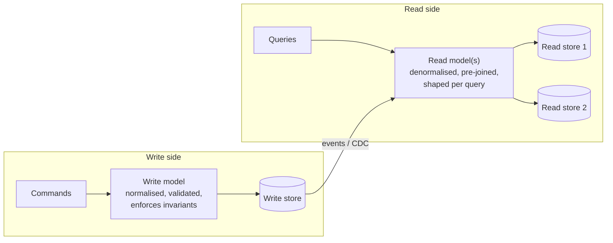

# 3.2.2 — CQRS (Command Query Responsibility Segregation)

> **Part 3 · Scaling Services · Read-Write Separation · Chapter 2 of 2**
> Read-write separation taken to its conclusion: different *models*, not just different *replicas*.

---

## 🧒 ELI5 — Explain Like I'm 5

Read replicas were photocopies of the same notebook. **CQRS is different: you keep a completely different kind of book for reading.**

Imagine a shop that records every sale in a big ledger:

```
Mon 09:12  Ann  bought 2 apples  £1.20
Mon 09:14  Bob  bought 1 melon   £2.00
Mon 09:15  Ann  bought 1 bread   £1.10
```

That's brilliant for **writing** — you just add a line, and it's a perfect record.

But now someone asks: *"how much has Ann spent this month?"* You'd have to read **every line in the whole ledger** and add Ann's up. Every time someone asks. That's slow and it gets slower every day.

So you keep a **second book**, and it looks totally different:

```
Ann  £2.30
Bob  £2.00
```

Every time you write a line in the ledger, you also update the second book. Now the question takes **one second** instead of an hour.

Two books. One shaped for writing, one shaped for reading. **That's CQRS.**

The cost: for a moment after a sale, the second book is slightly behind. And now you have two books to keep in step — if the updating breaks, they disagree and you have to rebuild.

---

## The definition

**Command Query Responsibility Segregation:** use **separate models** for writing (commands) and reading (queries).

Not separate *databases* necessarily — separate **models**. The distinction matters:



| | Write model | Read model |
|---|---|---|
| Optimised for | Correctness, invariants, transactions | Query speed |
| Shape | Normalised (3NF) | Denormalised, pre-joined, per-view |
| Store | Relational, strongly consistent | Anything: KV, document, search, columnar, cache |
| Validation | Full business rules | None — it's derived |
| Consistency | Strong | Eventual |
| Count | One | **As many as you have query shapes** |

---

## The levels of CQRS (it's a spectrum, not a switch)

| Level | Description | Complexity |
|---|---|---|
| **0 — Same model** | One set of classes for reads and writes | None |
| **1 — Separate query methods** | Different code paths, one database, reads bypass the domain model (raw SQL/DTOs) | ✅ Very low — do this by default |
| **2 — Separate read schema** | Materialised views / denormalised tables in the same database, refreshed on write | Low |
| **3 — Separate read store** | Elasticsearch, Redis, or a document store fed asynchronously | Medium |
| **4 — CQRS + event sourcing** | Events are the source of truth; all read models are projections | High |

🎯 **Level 1 is not really "CQRS", and it is where almost every system should live.** Interviewers are impressed by knowing the spectrum and picking the lowest level that solves the stated problem — not by proposing level 4 unprompted.

---

## Why bother — the real motivations

| Motivation | Explanation |
|---|---|
| **Read and write loads differ by orders of magnitude** | Scale them independently, on different hardware, with different technologies |
| **Query shapes fight the write schema** | A normalised schema needs 6 joins to render one screen; a denormalised read model needs one lookup |
| **Different stores suit different queries** | Full-text search needs an inverted index; analytics needs columnar; neither is a relational primary |
| **Complex domain logic on writes only** | The write model can be rich and heavily validated while reads stay dumb and fast |
| **Multiple client shapes** | Mobile, web, and partner APIs each get a read model shaped for them |

☠️ **Bad motivations:** "it's a pattern I read about", "microservices need it", "it sounds scalable". CQRS costs eventual consistency, duplicated data, and synchronisation machinery. **Pay that only for a stated problem.**

---

## Keeping the read model in sync

This is where CQRS is won or lost.

| Method | Latency | Complexity | Notes |
|---|---|---|---|
| **Synchronous, same transaction** | 0 | Low | Only works within one database; write latency increases |
| **Transactional outbox + relay** | 100 ms – 1 s | Medium | ✅ Safe default: no dual write |
| **CDC (Debezium)** | 10–500 ms | Medium | No application changes; reads the WAL |
| **Domain events published by the app** | ms | Medium | ⚠️ Dual-write hazard unless combined with the outbox |
| **Periodic batch rebuild** | Minutes to hours | Low | Fine for analytics-style read models |
| **Materialised view refresh** | Seconds to minutes | Low | Database-native; `REFRESH MATERIALIZED VIEW CONCURRENTLY` |

☠️ **The dual-write trap, again.** This is fatal:
```python
db.save(order)                 # committed
event_bus.publish(OrderPlaced) # process dies here
# → the write store has the order; the read model never will. Silently. Forever.
```
Use the **transactional outbox** or **CDC**. There is no third correct option. (See [Async Communication](../../02-microservices-and-dataflow/02-asynchronous-communication/01-async-communication.md#the-dual-write-problem-and-the-only-good-fix).)

---

## Handling eventual consistency in the UI

The user writes, then immediately reads, and the read model hasn't caught up. Same problem as replication lag, plus a few CQRS-specific answers:

| Technique | How |
|---|---|
| **Optimistic UI** | Render the expected result immediately from the command's response; reconcile when the read model catches up |
| **Return the result from the command** | `POST /orders` returns the full created order, so the client doesn't need to query |
| **Version token** | The command returns a version; the query waits for (or reports) a read model at ≥ that version |
| **Read from the write model for your own data** | Route "my recent orders" to the write store |
| **Poll or subscribe** | Return `202`; push an update when the projection lands |
| **Just tell the user** | "Your changes are being applied" — honest, and sometimes the right answer |

🎯 **Returning the created entity from the command is the cheapest fix and is very often forgotten.** It removes the round trip entirely for the most common case.

---

## Projections: building read models

A **projection** consumes events and maintains one read model.

```python
class OrderSummaryProjection:
    """Read model: one row per customer with lifetime totals."""

    def on_order_placed(self, e):
        read_db.execute("""
          INSERT INTO customer_summary (customer_id, order_count, total_minor, last_order_at)
          VALUES (%s, 1, %s, %s)
          ON CONFLICT (customer_id) DO UPDATE SET
            order_count  = customer_summary.order_count + 1,
            total_minor  = customer_summary.total_minor + EXCLUDED.total_minor,
            last_order_at = EXCLUDED.last_order_at
        """, (e.customer_id, e.total_minor, e.occurred_at))

    def on_order_cancelled(self, e):
        read_db.execute("""
          UPDATE customer_summary
             SET order_count = order_count - 1,
                 total_minor = total_minor - %s
           WHERE customer_id = %s
        """, (e.total_minor, e.customer_id))
```

**Properties every projection needs:**

| Property | Why | How |
|---|---|---|
| **Idempotent** | Events are delivered at-least-once | Upserts, or track processed `event_id`s |
| **Order-tolerant or order-guaranteed** | Events may arrive out of order across partitions | Partition by aggregate ID, or use version checks |
| **Rebuildable** | You will change the shape, or find a bug | Keep events long enough to replay from scratch |
| **Position-tracked** | So it can resume after a restart | Store the last processed offset/LSN atomically with the write |

⚠️ The increment/decrement style above is **not** idempotent — a redelivered `OrderPlaced` double-counts. Either track processed event IDs, or recompute from a stored set rather than incrementing. Getting this wrong produces slowly-drifting numbers that nobody notices for months.

### Rebuilding a projection

```
1. Create the new read model table (v2) alongside the old one
2. Replay all events from the beginning into v2
3. Catch up to live
4. Switch reads to v2 (feature flag)
5. Verify, then drop v1
```

**This capability is the main payoff of event sourcing** — you can invent a new read model next year and populate it from history. Without retained events you can only build read models going forward.

---

## CQRS + event sourcing (level 4)

**Event sourcing:** store the sequence of events as the source of truth; current state is derived by replaying them.

```
Events (the truth)              Derived state
─────────────────              ─────────────
AccountOpened(id, £0)          balance: £0
Deposited(£100)                balance: £100
Withdrawn(£30)                 balance: £70
Deposited(£50)          →      balance: £120
```

| ✅ Gains | ❌ Costs |
|---|---|
| Complete audit trail, for free | Every query needs a projection |
| Time travel: state at any past moment | Event schema evolution is genuinely hard |
| New read models from full history | Steep learning curve; few developers have done it |
| Natural fit for event-driven integration | Snapshots needed for long streams |
| Debugging: replay the exact sequence | Deleting data (GDPR) conflicts with immutable events |
| Business insight from the event log | Much harder operationally |

⚖️ **Event sourcing is a big commitment.** It is genuinely right for: financial ledgers, audit-heavy domains, systems where "how did we get here?" is a first-class question, and collaborative/undo-heavy applications. It is wrong as a default.

**GDPR note:** "immutable events" and "delete this person's data" conflict. The standard resolution is **crypto-shredding** — store personal data encrypted with a per-subject key, and delete the key. The events remain; their personal content becomes unreadable. Naming this shows real depth.

---

## Worked example — an e-commerce order system

**Write side** (normalised, transactional, in Postgres):
```sql
orders(id, customer_id, status, created_at)
order_items(order_id, sku, qty, unit_price_minor)
payments(id, order_id, amount_minor, status)
```
Invariants enforced here: an order must have ≥ 1 item; total = sum of items; status transitions are legal.

**Read models**, each fed from the same event stream:

| Read model | Store | Serves |
|---|---|---|
| `order_details` (one document per order, items embedded) | Document store / Redis | The order detail page — one lookup, no joins |
| `customer_orders` (list by customer, newest first) | Postgres denormalised table | "My orders" page |
| `order_search` (indexed by sku, status, date, customer name) | Elasticsearch | Admin search |
| `daily_revenue` (aggregated by day, product, region) | ClickHouse | Analytics dashboard |
| `inventory_view` (available = stock − reserved) | Redis | Fast availability checks |

**One write, five read models, each shaped exactly for its query.** No joins at read time anywhere. That is the payoff, and it's why the pattern exists.

---

## When NOT to use CQRS

| Situation | Why |
|---|---|
| Simple CRUD | You've doubled the code for nothing |
| Read and write loads are similar | No scaling motivation |
| Strong read-after-write required everywhere | Eventual consistency is the core trade; you're fighting the pattern |
| A small team without event-driven experience | The failure modes are subtle and expensive |
| A single query shape that the write schema serves fine | Add an index instead |
| You just need speed | Try a cache and a materialised view first |

🎯 **In an interview:** *"I'd start at CQRS level 1 — separate read queries that bypass the domain model. If the product page needs six joins at 50k QPS, I'd go to level 3 and maintain a denormalised document read model fed by CDC from the outbox. I wouldn't reach for event sourcing unless we needed a full audit trail as a product requirement."* That answer shows you know the spectrum and the cost of each step.

---

## 📋 Chapter checklist

| Skill | Ready? |
|---|---|
| Define CQRS as separate *models*, not separate databases | ☐ |
| Name the five levels and pick the right one | ☐ |
| Give five valid motivations and three invalid ones | ☐ |
| Choose a sync mechanism and avoid the dual write | ☐ |
| Give six techniques for handling eventual consistency in the UI | ☐ |
| List the four properties every projection needs | ☐ |
| Explain why increment-style projections aren't idempotent | ☐ |
| Describe the projection rebuild procedure | ☐ |
| State event sourcing's gains, costs, and the GDPR resolution | ☐ |
| Design five read models for one write model | ☐ |

---

**← Previous** [3.2.1 Read-Write Separation](01-read-write-separation.md)
**Next →** [3.3.1 Caching: The Mental Model](../03-caching/01-caching-mental-model.md)
