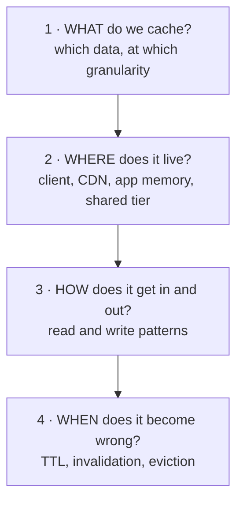
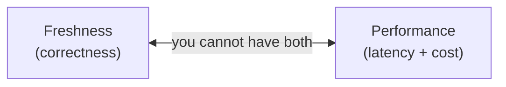

# 3.3.1 — Caching: The Mental Model

> **Part 3 · Scaling Services · Caching · Chapter 1 of 18**
> The highest-yield section in this book. Caching appears in every system design interview. Start here.

---

## 🧒 ELI5 — Explain Like I'm 5

A cache is **keeping the thing you use a lot close to you, instead of walking to fetch it every time.**

Your milk lives at the shop. But you don't walk to the shop every time you want milk — you keep some **in the fridge**. The fridge is a cache.

Everything about caching comes from that one picture:

- **Why bother?** The shop is far. The fridge is right there. *(Latency.)*
- **Why not put the whole shop in your fridge?** It doesn't fit, and fridges are expensive per litre. *(Caches are small; you must choose what goes in.)*
- **What if the milk in your fridge is old?** The shop has fresh milk. Yours might have gone off. *(Staleness.)*
- **How do you know it's off?** You check the date. *(TTL.)* Or someone tells you *"that milk's gone bad, throw it out."* *(Invalidation.)*
- **Fridge is full?** Throw out whatever you use least. *(Eviction.)*
- **What if you get home and the fridge is empty?** You walk to the shop. Slower, but it works. *(Cache miss.)*
- **What if the power cuts and everything in the fridge is ruined at once?** Now the *whole street* goes to the shop at the same moment and the shop can't cope. *(Cold start / thundering herd — this is how caches cause outages.)*

That last one is the important one. **A cache doesn't just make things faster — it changes what happens when things go wrong.**

---

## Why caching is the single highest-leverage technique

| Layer | Typical latency | Relative |
|---|---|---|
| In-process memory | 100 ns | 1× |
| Redis, same AZ | 500 μs | 5,000× |
| SSD | 1 ms | 10,000× |
| Database query (indexed) | 5 ms | 50,000× |
| Database query (complex join) | 100 ms | 1,000,000× |
| Cross-region call | 150 ms | 1,500,000× |

🔢 **A cache hit is typically 10–1,000× faster and ~100× cheaper than the origin computation.** No other single technique offers that.

### The hit-rate maths

$$\text{avg latency} = h \times t_{\text{cache}} + (1-h) \times t_{\text{origin}}$$

With `t_cache = 1 ms`, `t_origin = 50 ms`:

| Hit rate | Avg latency | Origin load |
|---|---|---|
| 0% | 50 ms | 100% |
| 50% | 25.5 ms | 50% |
| 80% | 10.8 ms | 20% |
| 90% | 5.9 ms | 10% |
| 95% | 3.5 ms | **5%** |
| 99% | 1.5 ms | **1%** |

🎯 **Two insights worth stating:**
1. **The last few percent matter most for load.** 90% → 95% halves origin load. 95% → 99% cuts it by another 5×. The marginal value of hit rate *increases* as you approach 100%.
2. **But the tail is unchanged.** At a 95% hit rate, 5% of requests still take 50 ms — so your **p99 is the miss path**, always. Optimising the miss path is not optional.

---

## Why caching works: the skew

Caching only works because access is **not uniform**. Real workloads follow a Zipf-like distribution: the *k*-th most popular item gets roughly `1/k` of the traffic.

```
Popularity
  █
  █
  ██
  ███
  ██████
  ████████████
  ███████████████████████████
  ──────────────────────────────────────► items
  ↑ 1% of items ≈ 30-50% of requests
```

🔢 Practical consequence: caching the **top 1%** of items typically captures 30–50% of requests; the **top 20%** captures 80–95%. This is why a 50 GB cache can front a 50 TB dataset and still hit 95%.

☠️ **If access is uniform, caching is nearly useless.** A cache holding 1% of a uniformly-accessed dataset gives a 1% hit rate. Recognising when a workload has *no* skew — random-access analytics scans, unique-per-request computations, one-shot ETL reads — and saying "a cache won't help here" is a strong signal.

---

## The four questions to answer for any cache

Every cache design reduces to these. Use them as a checklist in interviews.



### 1. What?
Read-heavy, repeatedly-accessed, expensive-to-produce, and tolerant of some staleness. Candidates: user profiles, product details, rendered fragments, computed feeds, session data, configuration, permission checks, aggregate counts, search results.

**Granularity is a real decision:** caching a whole rendered page has a high hit-rate ceiling but invalidates on any change; caching individual entities has a lower hit rate per request but far better invalidation. Most systems cache entities and compose.

### 2. Where?
Multiple layers, each with different reach and different invalidation difficulty. See [The Multi-Layer Defense](02-caching-tiers.md).

### 3. How?
Read patterns: cache-aside, read-through, refresh-ahead. Write patterns: write-through, write-behind, write-around. Chapters [5](05-read-patterns.md) and [7](07-write-patterns.md).

### 4. When does it go wrong?
TTL, event-driven invalidation, versioned keys, eviction policy. Chapters [10](10-invalidation.md) and [11](11-eviction-and-sizing.md).

---

## The fundamental trade-off

> **Every cache trades correctness for speed.** The only question is how much, and whether you have chosen it deliberately.



| Dial | Fresher | Faster |
|---|---|---|
| TTL | Short | Long |
| Invalidation | Eager, synchronous | Lazy, TTL-only |
| Layers | Fewer | More |
| Write pattern | Write-through | Write-behind |
| Consistency | Read-through with locks | Serve stale on error |

🎯 **The professional habit: state the staleness bound.** Not *"we'll cache the product page"* but *"we'll cache the product page for 60 seconds, so a price change can be up to a minute stale — acceptable for display, but the checkout path reads the price from the primary."* That one sentence covers the design, the cost, and the mitigation.

---

## Caching is not just for databases

| What's cached | Where | Example |
|---|---|---|
| Database query results | Redis | `user:44` |
| Rendered HTML fragments | CDN / Varnish | A product card |
| API responses | CDN / gateway | `GET /v1/products/9` |
| Computed aggregates | Redis | Follower counts, feed rankings |
| Authorization decisions | In-process, short TTL | "can user X read doc Y" |
| DNS resolutions | Resolver | Automatic |
| TLS sessions | Server | Session resumption |
| Compiled artifacts | Build cache | Docker layers, CI dependencies |
| ML feature vectors | Feature store | Online inference |
| Static assets | Browser + CDN | JS, CSS, images |

---

## The three costs people forget

**1. Memory is expensive.** Managed cache RAM costs roughly **100× per GB** what object storage does. A 1 TB cache is a serious budget line, which is why hot-set sizing ([Chapter 11](11-eviction-and-sizing.md)) matters.

**2. Complexity is permanent.** Every cache adds: an invalidation code path, a new failure mode, a new dashboard, and a new class of "works on my machine but not in production" bug caused by stale entries.

**3. The cache becomes load-bearing.** Once you depend on a 95% hit rate, your origin is provisioned for 5% of traffic. **The cache is now a critical dependency, not an optimisation** — and losing it means 20× load on a system sized for 1×. This is the single most important second-order effect of caching, and it's covered in [Failure Modes](15-failure-modes.md) and [Cold Start](14-cold-start.md).

☠️ **Say this in an interview:** *"Once we're relying on a 95% hit rate, the cache isn't an optimisation any more — it's part of the critical path. So I need a plan for total cache loss: request coalescing, a second cache tier, and load shedding, because the database can't take 20× traffic."*

---

## When NOT to cache

| Situation | Why |
|---|---|
| Data changes on every read | Nothing to reuse |
| Every request is unique (no skew) | Hit rate ≈ 0 |
| Strong consistency required | Staleness is unacceptable — or the invalidation cost exceeds the benefit |
| The origin is already fast enough | Complexity with no payoff |
| Write-heavy workload | You'd invalidate more than you'd serve |
| The data is enormous and uniformly accessed | The cache can't hold enough to matter |
| Security-sensitive per-user data in a shared cache | Key-scoping bugs leak data across users ([Cache Key Design](04-cache-key-design.md)) |

⚖️ **Try these before adding a cache:** add an index, fix the N+1 query, denormalise the schema, add a read replica, or precompute into a materialised view. Several of these are simpler and have no staleness semantics at all.

---

## The chapter map for this section

| # | Chapter | What it answers |
|---|---|---|
| 1 | Mental Model (this one) | Why and when |
| 2 | [The Multi-Layer Defense](02-caching-tiers.md) | Where |
| 3 | [CDN vs Application Cache](03-cdn-vs-app-cache.md) | Edge vs origin |
| 4 | [Cache Key Design](04-cache-key-design.md) | Naming and scoping |
| 5 | [Read Patterns](05-read-patterns.md) | Cache-aside, read-through, refresh-ahead |
| 6 | [🧪 Lab: The Read Drill](06-lab-read-drill.md) | Hands-on |
| 7 | [Write Patterns](07-write-patterns.md) | Through, behind, around |
| 8 | [The Consistency Problem](08-consistency.md) | Races and how to lose data |
| 9 | [🧪 Lab: The Write Drill](09-lab-write-drill.md) | Hands-on |
| 10 | [Invalidation & Freshness](10-invalidation.md) | Making it wrong less often |
| 11 | [Eviction & Sizing](11-eviction-and-sizing.md) | LRU, LFU, how big |
| 12 | [Distributed Caching](12-distributed-caching.md) | Sharding the cache |
| 13 | [Cache High Availability](13-cache-high-availability.md) | Surviving node loss |
| 14 | [Cold Start](14-cold-start.md) | The empty-cache disaster |
| 15 | [Failure Modes](15-failure-modes.md) | Stampede, penetration, avalanche |
| 16 | [🧪 Lab: The Disaster Drill](16-lab-disaster-drill.md) | Hands-on |
| 17 | [Security & Observability](17-security-and-observability.md) | Poisoning, leaks, metrics |
| 18 | [Interview Walkthrough](18-interview-walkthrough.md) | Putting it together |

---

## 📋 Chapter checklist

| Skill | Ready? |
|---|---|
| Compute average latency and origin load from a hit rate | ☐ |
| Explain why the last few percent of hit rate matter most | ☐ |
| Explain why p99 is always the miss path | ☐ |
| Explain why caching depends on skew, and when it doesn't help | ☐ |
| Recite the four design questions | ☐ |
| State a staleness bound out loud for any cached item | ☐ |
| Name the three forgotten costs | ☐ |
| Explain why a cache becomes load-bearing | ☐ |
| Name seven situations where you shouldn't cache | ☐ |

---

**← Previous** [3.2.2 CQRS](../02-read-write-separation/02-cqrs.md)
**Next →** [3.3.2 The Multi-Layer Defense](02-caching-tiers.md)
