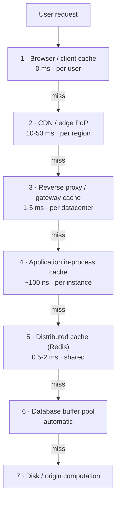

# 3.3.2 — The Multi-Layer Defense

> **Part 3 · Scaling Services · Caching · Chapter 2 of 18**
> Caching is not one box. It's a series of nets, each catching what got past the last.

---

## 🧒 ELI5 — Explain Like I'm 5

Think about getting a glass of milk, and how far you have to go:

1. **The glass already in your hand.** Zero effort. *(Browser/client cache.)*
2. **The fridge in your kitchen.** Ten steps. *(CDN — close to you.)*
3. **The big fridge in the garage.** A walk, but still your house. *(Reverse proxy at your edge.)*
4. **Your neighbour's fridge**, which you share. Bit further, but there's lots in it. *(Shared cache like Redis.)*
5. **The corner shop.** *(Database.)*
6. **The dairy farm.** *(Computing it from scratch.)*

You always try the nearest one first, and only walk further when it's empty.

**Two things follow from this picture:**

- **The nearer the milk, the harder it is to tell you it's gone off.** You can throw out the garage milk yourself. You cannot reach into a hundred neighbours' fridges. So the closest caches are the fastest *and* the hardest to correct.
- **Each net catches some of what got past the last one.** If the fridge catches 80% of trips and the garage catches 80% of *what's left*, only 4% of trips reach the shop. Layers **multiply**.

---

## The layers



| # | Layer | Latency | Scope | Size | Invalidation |
|---|---|---|---|---|---|
| 1 | Browser / app | 0 | One user | MBs | ❌ Nearly impossible — you can't reach it |
| 2 | CDN | 10–50 ms | Region | TBs | ⚠️ Hard — purge APIs, propagation delay |
| 3 | Reverse proxy | 1–5 ms | Datacenter | GBs | 🙂 Medium — one system you control |
| 4 | In-process | ~100 ns | One instance | 100s of MB | ⚠️ Medium — N instances to reach |
| 5 | Distributed | 0.5–2 ms | Global (shared) | 100s of GB | ✅ Easy — one authoritative place |
| 6 | DB buffer pool | μs | The database | GBs | ✅ Automatic |

🎯 **The inverse relationship is the key insight: the closer the cache is to the user, the faster it is and the harder it is to invalidate.** Every architectural decision in this section falls out of that.

---

## Layers multiply

If each layer has hit rate `h_i`, the fraction reaching the origin is:

$$\prod_i (1 - h_i)$$

| Configuration | Reaching the origin |
|---|---|
| One layer at 80% | 20% |
| Two layers at 80% each | 4% |
| Three layers at 80% each | 0.8% |
| Browser 40% + CDN 85% + app 50% + Redis 90% | `0.6 × 0.15 × 0.5 × 0.1` = **0.45%** |

🔢 That last row means the origin sees **1 request in 222**. At 100,000 QPS of user traffic, the database sees ~450 QPS. That is the difference between "we need 50 sharded database nodes" and "one primary with a replica is fine."

---

## Layer 1 — Browser / client

Controlled entirely by HTTP headers.

```http
Cache-Control: public, max-age=31536000, immutable    # content-hashed assets
Cache-Control: private, max-age=0, must-revalidate    # personalised HTML
Cache-Control: no-store                               # never cache (banking)
ETag: "a7f3c1"
Last-Modified: Sun, 31 Aug 2026 10:00:00 GMT
```

| Directive | Meaning |
|---|---|
| `public` | Any cache (including shared/CDN) may store it |
| `private` | Only the user's browser — **never** a shared cache |
| `no-cache` | May store, but **must revalidate** before use (a confusing name) |
| `no-store` | Never write it down anywhere |
| `max-age=N` | Fresh for N seconds |
| `s-maxage=N` | Overrides `max-age` for **shared** caches only |
| `immutable` | Never revalidate — the content will never change at this URL |
| `stale-while-revalidate=N` | Serve stale for N s while refreshing in the background |
| `stale-if-error=N` | Serve stale for N s if the origin errors — **free availability** |

☠️ **You cannot invalidate a browser cache.** If you send `max-age=31536000` for `/app.js` and then ship a bug fix, users keep the broken file for a year.

✅ **The solution is content-hashed URLs:** `/app.a7f3c1.js`. The URL changes when the content changes, so the old entry is simply never requested again. **Cache the asset forever; cache the HTML that references it for seconds.** This is the standard pattern and you should state it.

⚠️ `private` vs `public` is a **security** control, not a performance one. Marking a personalised page `public` lets a CDN serve one user's data to another. This has happened at large companies. Always default to `private` for anything authenticated.

---

## Layer 2 — CDN

Full treatment in [CDN vs Application Cache](03-cdn-vs-app-cache.md). The essentials:

- Hundreds of PoPs; users hit the nearest.
- **Origin shielding**: PoPs fetch through one designated "shield" PoP, so a miss storm hits your origin once, not 300 times. Turn this on.
- Caches by URL + configured `Vary` headers. **Keep the cache key minimal** — including `User-Agent` in the key can shatter your hit rate into thousands of variants.
- Invalidation is by purge API (seconds to minutes to propagate) or, better, by versioned URLs.

---

## Layer 3 — Reverse proxy cache

NGINX, Varnish, Envoy, or the API gateway, sitting in your own datacenter.

**Why it earns its place even with a CDN:**
- Caches things you don't want at the public edge (internal APIs, authenticated fragments).
- **Request coalescing** — the single most valuable feature: many concurrent misses for the same key become **one** origin request.
- Serves stale on origin error, in a system you fully control.

```nginx
proxy_cache_path /var/cache keys_zone=api:100m max_size=10g inactive=60m;
proxy_cache api;
proxy_cache_key "$scheme$request_method$host$request_uri";
proxy_cache_valid 200 60s;
proxy_cache_use_stale error timeout updating http_500 http_502 http_503;
proxy_cache_lock on;              # ← request coalescing: one miss goes upstream
proxy_cache_background_update on; # ← serve stale while refreshing
```

🎯 `proxy_cache_lock on` is a one-line defence against cache stampedes. Know it.

---

## Layer 4 — In-process (local) cache

The fastest tier available: ~100 ns, no serialisation, no network.

| ✅ | ❌ |
|---|---|
| 1000× faster than Redis | **N copies** — 50 instances means 50 caches to invalidate |
| No network, no serialisation | Uses your service's heap (GC pressure) |
| Survives a Redis outage | Cold on every deploy and every scale-out |
| Absorbs hot keys perfectly | Inconsistent between instances during the TTL window |

**The right use:** a very short TTL (1–10 s) on a small number of very hot keys.

🔢 Even a **1-second** TTL on a key receiving 10,000 QPS reduces downstream requests from 10,000/s to 1/s **per instance** — a 10,000× reduction, with at most 1 second of staleness. This is the standard answer to the hot-key problem and is far more effective than people expect.

Libraries: Caffeine (Java), `lru-cache` (Node), `cachetools` (Python), Ristretto / `golang-lru` (Go).

☠️ **Never make the local cache authoritative.** If instance A and instance B disagree, users get different answers on refresh depending on routing — one of the hardest bug classes to reproduce. Local caches must be *derivable* and *short-lived*.

---

## Layer 5 — Distributed cache (Redis / Memcached)

The workhorse. One shared, authoritative cache tier.

| ✅ | ❌ |
|---|---|
| One place to invalidate — correctness is tractable | A network hop (0.5–2 ms) |
| Consistent across all instances | Serialisation cost |
| Survives deploys and scale events | Another system to operate and make HA |
| Large capacity, independently scalable | Memory is expensive |
| Rich data structures (Redis) for counters, sets, sorted sets | A shared failure domain |

Chapters [12](12-distributed-caching.md) and [13](13-cache-high-availability.md) cover sharding and HA.

---

## Layer 6 — Database buffer pool

Free, automatic, and worth remembering because it explains a lot of behaviour.

```sql
-- Postgres: is the working set in memory?
SELECT sum(heap_blks_hit)*100.0 / nullif(sum(heap_blks_hit + heap_blks_read),0) AS hit_pct
FROM pg_statio_user_tables;
-- Want > 99%
```

`shared_buffers` (Postgres) or `innodb_buffer_pool_size` (MySQL) is typically 25–70% of RAM. **Sometimes the cheapest "cache" is just more RAM on the database** — no invalidation logic, no consistency semantics, no new failure mode. Consider it before building an application cache.

---

## Designing the stack for a request type

| Request | L1 browser | L2 CDN | L3 proxy | L4 local | L5 Redis |
|---|---|---|---|---|---|
| `/static/app.a7f3.js` | 1 year, immutable | ✅ forever | — | — | — |
| `/images/product/9.jpg` | 1 day | ✅ 30 days | — | — | — |
| `GET /api/products/9` (public) | 60 s | ✅ 60 s + SWR | ✅ 60 s | 5 s | ✅ 5 min |
| `GET /api/me` (personalised) | ❌ private, 0 | ❌ | ❌ | ❌ | ✅ 60 s, keyed by user |
| `GET /api/feed` (personalised) | ❌ | ❌ | ❌ | ❌ | ✅ 30 s, keyed by user |
| Feature flags | ❌ | ❌ | — | ✅ 10 s | ✅ 60 s |
| Auth token validation (JWKS) | — | — | — | ✅ 1 h | ✅ |
| Permission check | ❌ | ❌ | — | ✅ 5 s | ✅ 60 s |

🎯 **The pattern:** public and immutable content is cached everywhere, aggressively. Personalised content is cached **only** in the shared tier, keyed by user. Anything security-sensitive is never cached in a shared or edge layer without explicit per-user key scoping.

---

## The layered invalidation problem

You update a product price. Which layers now hold the old value?

| Layer | How to clear | Realistic delay |
|---|---|---|
| Redis | `DEL product:9` | Immediate |
| In-process (×50 instances) | Pub/sub broadcast, or wait for TTL | ms (pub/sub) or up to the TTL |
| Reverse proxy | Purge API or `PURGE` request | Seconds |
| CDN | Purge API | Seconds to minutes across PoPs |
| Browser | **Impossible** | Up to `max-age` |

☠️ **You will never invalidate everything atomically.** There is always a window in which different layers disagree.

**The practical rules:**
1. **Keep TTLs short in the layers you can't purge** (browser: seconds for HTML, forever only for content-hashed URLs).
2. **Version the key instead of purging** — `product:9:v12`. The old entry is orphaned and evicted naturally; nothing needs to be purged anywhere.
3. **Accept and bound the window**, and say what it is: *"a price change is visible everywhere within 60 seconds; checkout always reads the primary."*

**Key versioning is the strongest technique** because it works uniformly at every layer, including the browser, and requires no purge infrastructure. See [Invalidation & Freshness](10-invalidation.md).

---

## How many layers should you actually have?

⚖️ Each layer adds a hit-rate multiplier **and** a staleness window **and** an operational surface.

| System | Sensible stack |
|---|---|
| Small app, < 1k QPS | Redis only (layer 5) |
| Web app with static assets | Browser + CDN + Redis |
| High-traffic API | Browser + CDN + local (short TTL) + Redis |
| Media/video platform | CDN is the architecture; Redis for metadata |
| Internal service, no public users | Local + Redis |

**Start with layer 5, add layer 2 for anything public and static, and add layer 4 only when you have a measured hot-key problem.** Proposing all six layers for a modest system is over-engineering.

---

## 📋 Chapter checklist

| Skill | Ready? |
|---|---|
| Name six layers with latency, scope, and invalidation difficulty | ☐ |
| State the closer-is-faster-and-harder-to-invalidate rule | ☐ |
| Compute end-to-end origin load through four layers | ☐ |
| Explain content-hashed URLs and why they solve browser caching | ☐ |
| Explain `private` vs `public` as a security control | ☐ |
| Explain `proxy_cache_lock` / request coalescing | ☐ |
| Justify a 1-second local TTL on a hot key with the numbers | ☐ |
| Explain why local caches must never be authoritative | ☐ |
| Design the caching stack for eight request types | ☐ |
| Explain key versioning as the uniform invalidation technique | ☐ |

---

**← Previous** [3.3.1 Caching: The Mental Model](01-caching-mental-model.md)
**Next →** [3.3.3 The Edge: CDN vs Application Cache](03-cdn-vs-app-cache.md)
