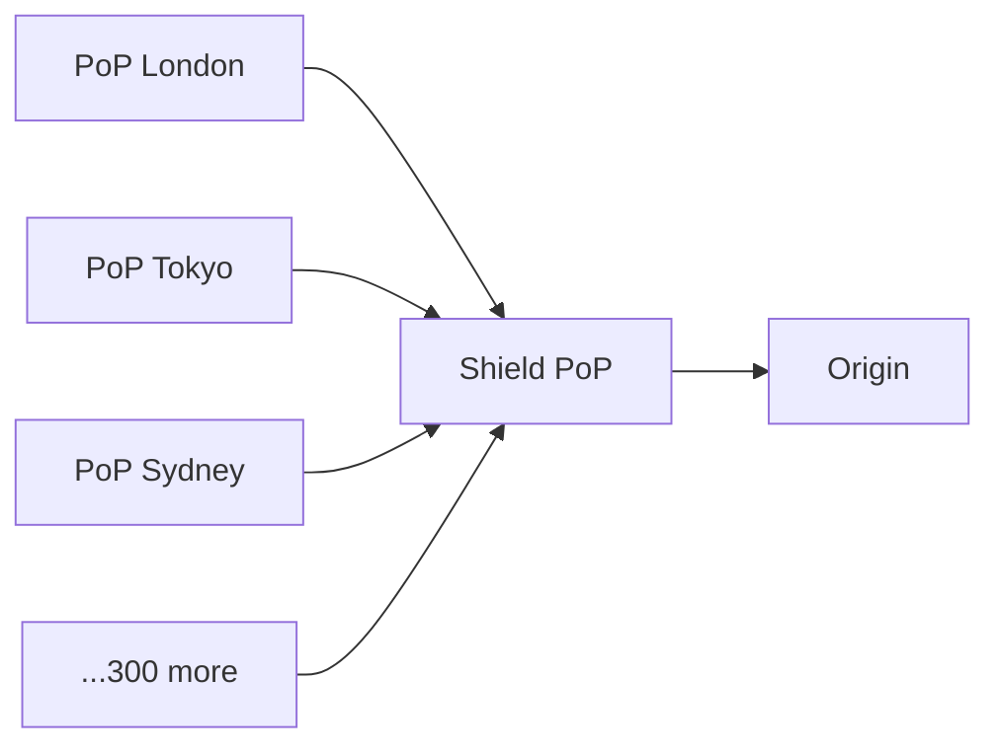
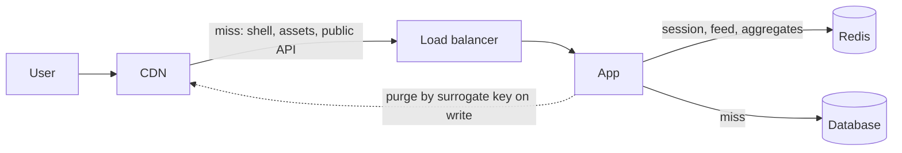

# 3.3.3 — The Edge: CDN vs Application Cache

> **Part 3 · Scaling Services · Caching · Chapter 3 of 18**
> Two very different tools that both "cache." Knowing which does what is a common interview discriminator.

---

## 🧒 ELI5 — Explain Like I'm 5

Both of these are "keeping things handy," but they solve **different problems**:

**A CDN is a chain of local corner shops.** The company bakes bread in one bakery, then ships copies to a thousand corner shops all over the world. When you want bread, you walk two minutes to your local shop instead of flying to the bakery. **The bread is the same for everyone** — that's why it can be copied everywhere.

**An application cache is a notepad by the bakery's oven.** The baker writes down "today's flour price: £2" so they don't have to phone the supplier for every loaf. It's not near *you*; it's near the *work*. And it can hold things that are **different for each customer** — "Ann is allergic to nuts" — because it's private and inside the bakery.

So:

- **CDN** = *closer to the user*, for things that are **the same for everyone**.
- **App cache** = *closer to the work*, for things that may be **different per person** or that took effort to compute.

You almost always want both, and they don't overlap.

---

## Side by side

| | **CDN / edge cache** | **Application cache (Redis)** |
|---|---|---|
| Located | Hundreds of PoPs worldwide | Your datacenter/region |
| Distance to user | 10–50 ms | 50–300 ms (plus your app's own latency) |
| Distance to origin | Far | Adjacent (0.5 ms) |
| Caches | HTTP responses, keyed by URL | Arbitrary objects, keyed by anything |
| Personalised content | ⚠️ Hard and risky | ✅ Natural — key by user |
| Data structures | None — bytes | Counters, sets, sorted sets, hashes, streams |
| Invalidation | Purge API, seconds–minutes | `DEL`, immediate |
| Capacity | Effectively unlimited (TBs per PoP) | What you pay for |
| Cost model | Per GB egress (~$0.01–0.03) | Per GB RAM-month (~$2–5) |
| Primary benefit | **Latency + bandwidth offload** | **Compute offload + shared state** |
| Fails to | Origin fetch | Origin computation |

🎯 **The one-line distinction to say in an interview:** *"A CDN saves bandwidth and distance; an application cache saves computation. They're complementary, not alternatives."*

---

## What belongs at the CDN

| Content | TTL | Notes |
|---|---|---|
| Content-hashed JS/CSS (`app.a7f3.js`) | 1 year, `immutable` | Never invalidated — the URL changes instead |
| Images, fonts, icons | Days to a year | Version the path on change |
| Video segments (HLS/DASH) | Long | The whole point of a CDN for streaming |
| Downloads, installers | Long | |
| Public API responses | 10 s – 5 min | With `stale-while-revalidate` |
| Marketing/landing HTML | 60 s – 1 h | With purge on publish |
| Rendered public pages | Seconds to minutes | Careful with personalisation |
| **Never:** authenticated user data | — | Unless per-user keyed *and* `private` semantics are certain |

---

## CDN mechanics worth knowing

### Cache key

By default: scheme + host + path (+ query, configurably). **Everything you add to the key divides your hit rate.**

☠️ **The `Vary: User-Agent` disaster:** there are thousands of distinct user-agent strings. Varying on it creates thousands of copies of the same object, each with its own cold start. Hit rate collapses. If you need device-class variation, normalise to a small set (`mobile` / `desktop`) at the edge and vary on *that*.

Similarly: strip marketing query parameters (`utm_source`, `fbclid`, `gclid`) from the cache key, or every share link creates a fresh cache entry.

```
Good key:  https://site.com/api/products/9
Bad key:   https://site.com/api/products/9?utm_source=twitter&fbclid=IwAR...
```

### Origin shielding



Without shielding, a cold object requested worldwide produces **one origin request per PoP** — potentially 300 simultaneous misses. With shielding, PoPs fetch through one designated shield PoP, which coalesces them into **one** origin request.

🎯 Origin shielding is a one-checkbox change that can reduce origin load by 10–100× on cold or frequently-purged content. Mention it.

### Tiered caching and cache hierarchies
Same idea, generalised: edge PoP → regional cache → shield → origin. Each tier absorbs the misses of the tier below.

### Purge
| Method | Speed | Use |
|---|---|---|
| Purge by URL | Seconds | Single object |
| Purge by **surrogate key / tag** | Seconds | ✅ "Everything tagged `product:9`" — the best mechanism |
| Purge everything | Minutes, and **dangerous** | Causes a global cold start and a stampede on your origin |

**Surrogate keys** (Fastly `Surrogate-Key`, Cloudflare cache tags) let the origin tag responses:
```http
Surrogate-Key: product-9 category-kitchen homepage
```
Then one purge of `product-9` clears every page that embedded that product. This is far better than trying to enumerate URLs, and it is the correct answer to "how do you invalidate a product across all the pages it appears on?"

### Serving stale — free availability

```http
Cache-Control: public, max-age=60, stale-while-revalidate=600, stale-if-error=86400
```

- `stale-while-revalidate=600`: after 60 s, keep serving instantly while refreshing in the background. **Users never wait for a revalidation.**
- `stale-if-error=86400`: if the origin returns 5xx or is unreachable, serve the stale copy for up to a day.

🎯 **`stale-if-error` converts a large class of origin outages into invisible events.** It is one line of configuration and one of the highest availability-per-effort wins in this entire book.

---

## Personalisation at the edge

The hard case: pages that are mostly public with a little user-specific content (a username, a cart count).

| Technique | How | Trade-off |
|---|---|---|
| **Split the response** | Cache the shell publicly; fetch personal bits with a separate uncached API call | ✅ Simple, safe. Extra request |
| **Edge Side Includes (ESI)** | The edge assembles cached fragments with different TTLs | Powerful; limited support |
| **Edge compute** (Workers, Lambda@Edge) | Run code at the PoP to personalise a cached base | Flexible; new runtime to manage |
| **Vary on a normalised cookie** | Vary on `country` or `plan_tier`, not on session ID | Only if cardinality is small |
| **Client-side hydration** | Ship a cached static shell; the browser fetches personal data | ✅ Very common in SPAs |

☠️ **The catastrophic failure mode: caching a personalised response publicly.** One user's page — with their name, address, or order history — gets served to everyone who hits that PoP. This is a real, repeated industry incident.

**Defences:**
1. Default to `Cache-Control: private, no-store` for anything behind auth; make public caching an explicit opt-in.
2. Never let `Set-Cookie` responses be cached publicly (most CDNs refuse by default — verify yours does).
3. Add a synthetic test that requests an authenticated page as user A, then as user B, and asserts the responses differ.

---

## What belongs in the application cache

| Data | Why not the CDN |
|---|---|
| Per-user sessions | Personalised, security-sensitive |
| Rendered per-user feeds | Personalised |
| Expensive aggregates (counts, rankings) | Not an HTTP response; needs data structures |
| Database query results | Not URL-addressable |
| Rate-limit counters | Needs atomic increments |
| Distributed locks / leases | Needs atomicity |
| Permission decisions | Security-sensitive, short TTL |
| Feature flags | Needs fast, consistent, revocable reads |
| Deduplication sets | Needs set operations |
| Leaderboards | Needs sorted sets |

**The tell:** if it isn't a whole HTTP response keyed by URL, it belongs in the application cache.

---

## Using both together



**Worked example — a product page at 100k QPS:**

| Layer | Handles | Remaining |
|---|---|---|
| CDN: images, JS, CSS, public product JSON (60 s TTL + SWR) | ~92% | 8,000 QPS |
| Local in-process cache (5 s TTL, hot products) | ~50% of the rest | 4,000 QPS |
| Redis: product entities, inventory counts (5 min TTL) | ~90% of the rest | 400 QPS |
| Database | 400 QPS | ✅ One primary handles this comfortably |

🎯 That table is exactly what to draw when an interviewer asks "how do you handle 100k QPS?" It turns an intimidating number into an obviously-tractable one, and shows each layer's contribution.

---

## Cost comparison

| | CDN | Redis |
|---|---|---|
| Serving 1 TB | ~$10–30 (egress) | Not the same job — but 1 TB of RAM ≈ $2,000–5,000/month |
| Serving 1 M requests | ~$0.50–1.00 | Effectively free once provisioned |
| Origin egress saved | The main saving | Indirect |

🔢 **The CDN cost argument, concretely:** 500 TB/month of user-facing egress costs ~$35,000 at direct cloud egress rates ($0.07/GB) versus ~$10,000 at CDN rates ($0.02/GB) — and that assumes your origin could even serve 500 TB, which it can't. Being able to run this calculation is a strong estimation signal ([Resource Estimation](../../01-introduction/04-resource-estimation/01-back-of-envelope-estimation.md)).

---

## ☠️ Failure modes

| Failure | Consequence | Fix |
|---|---|---|
| Caching authenticated content publicly | **Data leak between users** | Default `private`; test for it |
| `Vary` on high-cardinality headers | Hit rate collapses | Normalise to a small set |
| Marketing params in the cache key | Every share link is a cache miss | Strip them |
| No origin shielding | 300 simultaneous origin misses | Enable shielding |
| Purge-everything as a habit | Global cold start, origin stampede | Use surrogate keys |
| Long browser `max-age` on mutable URLs | Users stuck on old code for months | Content-hashed URLs |
| No `stale-if-error` | Origin blip becomes a user-visible outage | Add it |
| Treating the CDN as a database | Purge storms, unpredictable consistency | Use it for what it is |
| Caching error responses with a long TTL | A transient 500 is served for an hour | Set short TTLs (or zero) for 4xx/5xx |

---

## 📋 Chapter checklist

| Skill | Ready? |
|---|---|
| State the one-line CDN vs app-cache distinction | ☐ |
| List what belongs at each | ☐ |
| Explain the `Vary: User-Agent` disaster | ☐ |
| Explain origin shielding and its magnitude | ☐ |
| Explain surrogate keys and why they beat URL purging | ☐ |
| Write the full `Cache-Control` line with SWR and SIE | ☐ |
| Give five techniques for edge personalisation | ☐ |
| Name three defences against public caching of private data | ☐ |
| Build the 100k QPS layer table | ☐ |
| Compute the CDN cost saving for a given egress volume | ☐ |

---

**← Previous** [3.3.2 The Multi-Layer Defense](02-caching-tiers.md)
**Next →** [3.3.4 Cache Key Design](04-cache-key-design.md)
