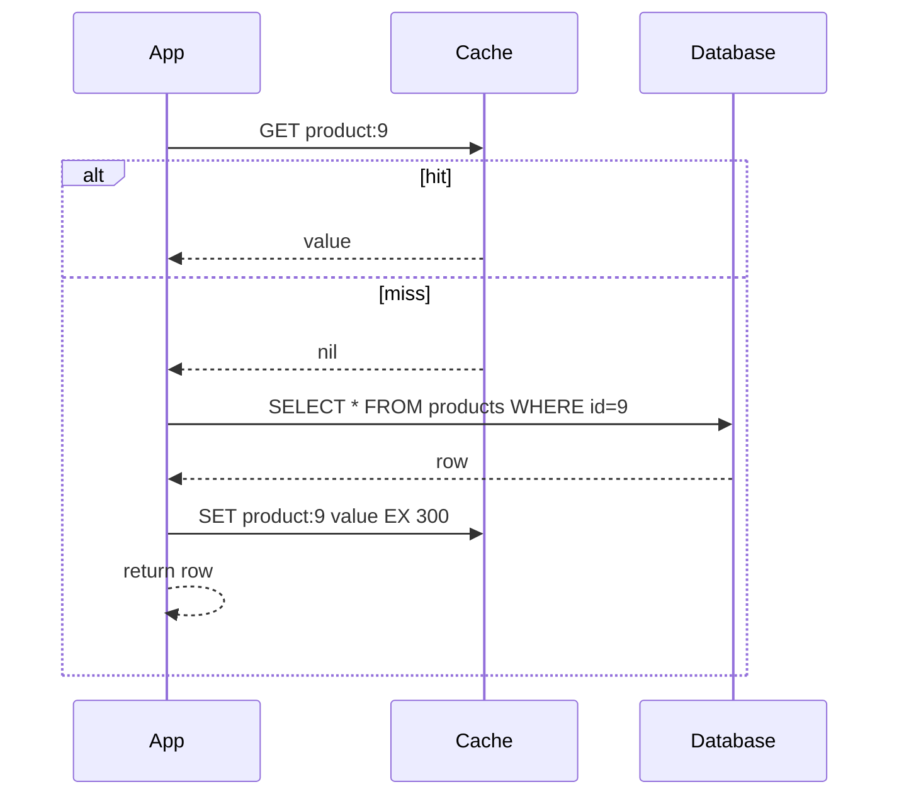

# 3.3.5 — Read Patterns: Fetching Data

> **Part 3 · Scaling Services · Caching · Chapter 5 of 18**
> Cache-aside, read-through, refresh-ahead — and the coalescing that stops them killing your database.

---

## 🧒 ELI5 — Explain Like I'm 5

You want milk. There are three ways to organise the fetching:

**1. You check the fridge yourself.** Empty? *You* walk to the shop, buy milk, put it in the fridge, and pour a glass. You are in charge of the whole routine. *(Cache-aside — you write the fetch-and-store code.)*

**2. You ask your housemate for milk and never think about it.** They check the fridge, go to the shop if needed, restock, and hand you the glass. You just say "milk please." *(Read-through — the cache library does the fetching.)*

**3. Your housemate notices the milk is nearly out of date and replaces it *before* you ask.** You never once find an empty fridge. *(Refresh-ahead.)*

And then the important one, which isn't about *you* at all:

**4. Five people walk in at the same moment and all find the fridge empty.** All five run to the shop. Four of those trips were pointless — and if a hundred people did it, the shop would be overwhelmed. So: **the first person to notice puts up a note saying "gone for milk, back in 2 minutes,"** and everyone else waits for them. *(Request coalescing — and it is the difference between a cache and an outage.)*

---

## Pattern 1 — Cache-aside (lazy loading)

The most common pattern by far. The application manages the cache explicitly.



```python
def get_product(pid):
    key = product_key(pid)
    if (v := cache.get(key)) is not None:
        return deserialize(v)
    row = db.query("SELECT * FROM products WHERE id=%s", pid)
    if row:
        cache.set(key, serialize(row), ex=300)
    return row
```

| ✅ | ❌ |
|---|---|
| Only requested data is cached — memory efficient | Every miss pays the full latency |
| Cache failure is survivable (the app just reads the database) | Cache and database logic are entangled in the app |
| Works with any datastore; no special library | Easy to get inconsistent between call sites |
| The cache holds exactly the shape the app wants | The stampede problem is yours to solve |

**Where it goes wrong:** every call site must build the key identically, choose the same TTL, and handle misses the same way. Centralise it ([Cache Key Design](04-cache-key-design.md)).

---

## Pattern 2 — Read-through

The cache sits *in front* of the datastore and loads on miss itself. The application only talks to the cache.

```python
# Caffeine (Java) / cachetools / a repository wrapper
cache = LoadingCache(loader=lambda pid: db.get_product(pid), ttl=300)
product = cache.get(pid)          # the loader runs automatically on miss
```

| ✅ | ❌ |
|---|---|
| Application code is trivially simple | Requires library or provider support |
| Loading logic lives in one place — no divergence | The cache is now on the critical path for *all* reads |
| Coalescing is usually built in | Less control over per-call behaviour |
| Consistent TTLs and key format by construction | Harder to bypass deliberately |

⚖️ **Cache-aside vs read-through** is mostly about *who owns the loading logic*. Read-through is cleaner when you have a good library (Caffeine's `LoadingCache`, DAX for DynamoDB, Ehcache). Cache-aside is more flexible and more common because it needs nothing special.

🎯 In an interview, either is a fine answer — but say **why**: *"cache-aside, because a Redis outage then degrades us to database-only rather than taking us down."* That's the real discriminator.

---

## Pattern 3 — Refresh-ahead (proactive refresh)

Refresh entries *before* they expire, so users never hit a cold miss on hot keys.

```python
def get_with_refresh_ahead(key, loader, ttl=300, refresh_at=0.8):
    entry = cache.get_with_metadata(key)
    if entry is None:
        return load_and_store(key, loader, ttl)
    age_fraction = entry.age / ttl
    if age_fraction > refresh_at:
        # serve the current value NOW; refresh in the background
        background.submit(load_and_store, key, loader, ttl)
    return entry.value
```

| ✅ | ❌ |
|---|---|
| Hot keys are never cold — the tail latency disappears | Wasted refreshes for keys that stop being requested |
| Load on the origin is smooth, not spiky | More complexity; needs a background executor |
| Naturally prevents stampedes on popular keys | Serves slightly staler data than a strict TTL |

**When it's worth it:** a small number of very hot, expensive-to-compute keys (a homepage feed, a global leaderboard, an exchange-rate table). Not worth it for a long tail of rarely-read keys.

**The HTTP equivalent** is `stale-while-revalidate`, which does exactly this at the CDN layer. Same idea, no code.

---

## Request coalescing — the pattern that actually matters

☠️ **The problem.** A hot key expires. In the next 50 ms, 500 concurrent requests all miss, and **all 500 query the database** for the same row. The database, sized for ~10 QPS on that query, gets 500 at once. It slows, so more requests pile up, so more miss. This is a **cache stampede** (also called dogpile or thundering herd), and it is the most common way a cache *causes* an outage.

**The fix: only one request loads; the rest wait for it.**

```python
import threading
_inflight: dict[str, threading.Event] = {}
_lock = threading.Lock()

def get_coalesced(key, loader, ttl=300):
    if (v := cache.get(key)) is not None:
        return v

    with _lock:
        event = _inflight.get(key)
        leader = event is None
        if leader:
            event = _inflight[key] = threading.Event()

    if not leader:
        event.wait(timeout=5)                 # follower: wait for the leader
        return cache.get(key) or loader()     # fall back if the leader failed

    try:                                       # leader: do the work once
        value = loader()
        cache.set(key, value, ex=ttl)
        return value
    finally:
        with _lock:
            _inflight.pop(key, None)
        event.set()
```

This is single-process. For **cross-process** coalescing across a fleet, use a distributed lock:

```python
def get_with_distributed_lock(key, loader, ttl=300):
    if (v := cache.get(key)) is not None:
        return v
    lock_key = f"lock:{key}"
    if cache.set(lock_key, "1", nx=True, ex=10):        # I am the leader
        try:
            value = loader()
            cache.set(key, value, ex=ttl)
            return value
        finally:
            cache.delete(lock_key)
    else:                                               # someone else is loading
        for _ in range(50):
            time.sleep(0.02)
            if (v := cache.get(key)) is not None:
                return v
        return loader()          # give up waiting; avoid deadlock on leader failure
```

⚠️ **The lock must have a TTL** (10 s above). If the leader crashes without releasing it, every other request blocks forever. Always bound the wait and always fall through to a direct load.

**Off-the-shelf implementations:** Go's `singleflight`, NGINX `proxy_cache_lock`, Varnish request coalescing (default), Caffeine's per-key loading, and `stale-while-revalidate` at the CDN.

🎯 **Say "request coalescing" or "singleflight" in an interview** when discussing hot keys or cache expiry. It's the specific term, and it signals real experience.

---

## The alternative: probabilistic early expiration

Instead of locks, have each reader *decide independently* whether to refresh early, with a probability that rises as expiry approaches. Statistically, one request refreshes before the rest miss.

```python
import random, math

def xfetch(key, loader, ttl=300, beta=1.0):
    entry = cache.get_with_metadata(key)     # value, delta (last compute time), expiry
    now = time.time()
    if entry is None:
        return load_and_store(key, loader, ttl)
    # Vattani et al., "Optimal Probabilistic Cache Stampede Prevention"
    if now - entry.delta * beta * math.log(random.random()) >= entry.expiry:
        return load_and_store(key, loader, ttl)
    return entry.value
```

| ✅ | ❌ |
|---|---|
| No locks, no coordination, no deadlock risk | Probabilistic — not a hard guarantee |
| Naturally spreads refreshes over time | Needs the compute time stored with the entry |
| Expensive-to-compute keys refresh earlier (via `delta`) | Less intuitive to explain |

Simpler variant used widely: **TTL jitter.** Set the TTL to `base ± random(0, 10%)` so keys written together do not expire together. This alone prevents *synchronised* expiry, which is the most common stampede trigger.

---

## Negative caching

The miss path is also a load path. If a key doesn't exist, cache that fact.

```python
SENTINEL = b"\x00__NULL__"

def get_user(uid):
    v = cache.get(f"user:{uid}")
    if v == SENTINEL:
        return None                       # known-absent, cached
    if v is not None:
        return deserialize(v)
    row = db.get_user(uid)
    cache.set(f"user:{uid}",
              serialize(row) if row else SENTINEL,
              ex=300 if row else 30)      # ← shorter TTL for negatives
    return row
```

**Why it matters:** without it, requests for non-existent keys **always** reach the database. An attacker (or a broken crawler) requesting random IDs bypasses your cache entirely — this is **cache penetration**, covered in [Failure Modes](15-failure-modes.md).

⚠️ Use a **shorter TTL for negatives** (30 s vs 300 s), because "doesn't exist" often becomes "exists" — a newly created record shouldn't be invisible for five minutes.

For very large key spaces, a **Bloom filter** in front is more memory-efficient: it answers "definitely absent" or "possibly present" in a few bits per key.

---

## Batch reads

☠️ **The N+1 cache problem.** Fetching 100 products with 100 separate `GET`s costs 100 round trips ≈ 50 ms, versus one `MGET` at ~1 ms.

```python
def get_products(ids):
    keys = [product_key(i) for i in ids]
    values = cache.mget(keys)                       # ONE round trip
    result, missing = {}, []
    for pid, raw in zip(ids, values):
        if raw is not None:
            result[pid] = deserialize(raw)
        else:
            missing.append(pid)
    if missing:
        rows = db.query("SELECT * FROM products WHERE id = ANY(%s)", missing)  # ONE query
        pipe = cache.pipeline()
        for row in rows:
            result[row.id] = row
            pipe.set(product_key(row.id), serialize(row), ex=300)
        pipe.execute()                              # ONE round trip
    return [result.get(i) for i in ids]
```

Three round trips total, regardless of how many IDs. **Always batch.**

⚠️ In **Redis Cluster**, `MGET` requires all keys to be in the same hash slot. Either group keys by slot client-side (most clients do this automatically) or use **hash tags** — `{product}:9` and `{product}:10` share a slot. Cluster-aware clients handle this; know that it's happening.

---

## Choosing a TTL

| Data | TTL | Reason |
|---|---|---|
| Static reference data (countries, currencies) | Hours to days | Rarely changes |
| Product catalogue | 5–60 min | Changes occasionally; staleness is visible but harmless |
| Prices | 30–60 s | Business-sensitive; checkout reads the primary anyway |
| User profile | 5–10 min | Invalidate on write |
| Feed / timeline | 30–60 s | Freshness matters, recompute is expensive |
| Counts (likes, views) | 10–60 s | Approximate is fine |
| **Permission decisions** | 5–30 s | Revocation must take effect quickly |
| Session | Sliding, 30 min | Refresh on activity |
| Negative entries | 30 s | May become positive |
| Feature flags | 5–10 s | Must be revocable quickly |

**Two rules:**
1. **Add jitter.** `ttl = base * random.uniform(0.9, 1.1)` prevents synchronised expiry.
2. **TTL is your safety net, not your invalidation strategy.** Explicit invalidation on write bounds staleness to milliseconds; the TTL bounds the damage when invalidation fails or is missed. You want both.

---

## 📋 Chapter checklist

| Skill | Ready? |
|---|---|
| Write cache-aside from memory | ☐ |
| Compare cache-aside and read-through, with the failure-mode argument | ☐ |
| Explain refresh-ahead and its HTTP equivalent | ☐ |
| Explain the stampede and implement coalescing | ☐ |
| Explain why the distributed lock needs a TTL and a fallback | ☐ |
| Name `singleflight` / `proxy_cache_lock` | ☐ |
| Explain probabilistic early expiration and TTL jitter | ☐ |
| Implement negative caching with a shorter TTL, and say what it prevents | ☐ |
| Write a batched read with `MGET` + one database query | ☐ |
| Explain Redis Cluster hash tags | ☐ |
| Justify a TTL for ten data types | ☐ |

---

**← Previous** [3.3.4 Cache Key Design](04-cache-key-design.md)
**Next →** [3.3.6 🧪 Lab: The Read Drill](06-lab-read-drill.md)
