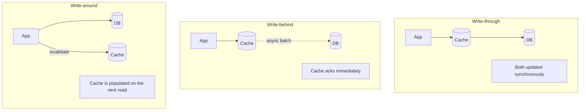

# 3.3.7 — Write Patterns: Mutating Data

> **Part 3 · Scaling Services · Caching · Chapter 7 of 18**
> Reads are easy. Writes are where caches go wrong.

---

## 🧒 ELI5 — Explain Like I'm 5

You keep milk in the fridge (cache) and the shop has the real supply (database).

Now **you change something** — say the milk brand changes. What do you do with the fridge?

**Option A — update both at once.** Buy the new milk, put it in the fridge, done. The fridge is always right. But you had to wait at the shop. *(Write-through.)*

**Option B — put it in the fridge now, take it to the shop later.** Very fast for you. But if your fridge breaks before you get to the shop, **the change is gone forever** and the shop never knew. *(Write-behind — fast, risky.)*

**Option C — take it straight to the shop and throw the fridge milk away.** Don't put anything new in the fridge. Next time someone wants milk they'll fetch fresh. *(Write-around with invalidation.)*

**Option D — the one that seems fine and isn't.** Take it to the shop, then *update* the fridge with what you think the new value is. Sounds tidy. But if two people do this at slightly different speeds, **the slower person's older milk can end up in the fridge after the faster person's newer milk.** Now the fridge is wrong, and it stays wrong until it expires. *(Update-the-cache-on-write — the classic bug.)*

**The rule that avoids almost all pain: on a write, DELETE from the cache. Don't update it.** An empty fridge is always safe; a wrong fridge is not.

---

## The three patterns



| | Write-through | Write-behind | Write-around |
|---|---|---|---|
| Write latency | Cache + DB | **Cache only (fast)** | DB only |
| Data loss risk | None | **Yes** — unflushed writes die with the cache | None |
| Read after write | Hit | Hit | Miss (then populated) |
| Cache pollution | Writes fill the cache even if never read | Same | ✅ None |
| Consistency | Good | Cache is ahead of DB | Good, if invalidation is correct |
| Complexity | Low | High (batching, ordering, recovery) | Low |
| Best for | Read-after-write-heavy data | Very high write rates, loss-tolerant | ✅ **The general default** |

---

## Write-around + invalidation (the default)

```python
def update_product(pid, fields):
    db.update("UPDATE products SET ... WHERE id=%s", pid)   # 1. write the source of truth
    cache.delete(product_key(pid))                          # 2. DELETE, do not update
```

**Why delete rather than update:**

| Reason | Explanation |
|---|---|
| **Race safety** | Two concurrent writers cannot leave a stale value behind (see below) |
| **Correctness** | The next read reloads the *canonical* value, including database defaults, triggers, and computed columns |
| **No wasted work** | Written-but-never-read data doesn't occupy cache memory |
| **Simplicity** | You don't have to reproduce the database's exact post-write state in application code |

⚖️ **The cost:** the next read is a miss. For a very hot key, that miss is a stampede risk — combine with coalescing ([Chapter 5](05-read-patterns.md#request-coalescing--the-pattern-that-actually-matters)).

☠️ **The classic race that "update the cache" creates:**

```
Thread A: writes X=1 to DB
Thread B: writes X=2 to DB          (B is newer — DB now correctly holds 2)
Thread B: sets cache X=2
Thread A: sets cache X=1            ← A was slow; now the cache says 1
Result:   DB=2, cache=1, wrong until the TTL expires. Silently.
```

With delete-on-write both threads delete, and the next read reloads 2. **Delete is idempotent and order-independent; set is neither.**

---

## Write-through

```python
def update_product(pid, fields):
    row = db.update_returning(pid, fields)      # write DB first
    cache.set(product_key(pid), serialize(row), ex=300)   # then cache
```

**Use when** the written data is very likely to be read immediately (user profile edits, cart updates, draft documents) and you want read-your-writes without touching the primary.

⚠️ **Order matters and neither order is perfect:**

| Order | Failure between steps | Result |
|---|---|---|
| DB then cache | Cache write fails | Cache holds the **old** value → stale until TTL. ✅ Recoverable |
| Cache then DB | DB write fails | Cache holds a value the database never accepted → **phantom data**. ❌ Much worse |

**Always write the database first.** And treat the cache write as best-effort — never fail the user's request because a cache `SET` failed.

Even so, write-through is still subject to the concurrent-writer race above. If you use it, either accept a short window of staleness or use **versioned writes**:

```python
# Only overwrite if our version is newer
lua = """
local cur = redis.call('HGET', KEYS[1], 'ver')
if cur == false or tonumber(cur) < tonumber(ARGV[1]) then
  redis.call('HSET', KEYS[1], 'ver', ARGV[1], 'val', ARGV[2])
  redis.call('EXPIRE', KEYS[1], ARGV[3])
  return 1
end
return 0
"""
```

This makes cache writes **monotonic** — an older write can never overwrite a newer one. It is the correct fix if you genuinely need write-through under concurrency.

---

## Write-behind (write-back)

The cache acknowledges immediately and persists asynchronously.

```python
def increment_view_count(pid):
    cache.hincrby("views:pending", pid, 1)      # ~0.2 ms, returns immediately
    # a background flusher every 10s:
    #   HGETALL views:pending → batched UPDATE ... → DEL the flushed fields
```

| ✅ | ❌ |
|---|---|
| Write latency ≈ cache latency | **Data loss** if the cache dies before flushing |
| **Massive write coalescing** — 10,000 increments become one `UPDATE` | Complex: batching, ordering, retry, recovery |
| Absorbs write spikes | The database is behind; other readers see stale data |
| Enormous reduction in database write load | Hard to reason about during incidents |

🔢 **When it's genuinely right:** view counters, like counts, analytics events, last-seen timestamps, telemetry. A page viewed 10,000 times per minute produces 10,000 database writes with write-through, and **one** with a 60-second write-behind flush. That's a 10,000× reduction on a value nobody needs to be exact.

☠️ **When it's wrong:** anything where losing the write matters. Payments, orders, inventory decrements, audit logs. Redis persistence is `appendfsync everysec` by default — **up to one second of acknowledged writes can be lost on a crash**, and replication is asynchronous so a failover can lose more.

**Safer variant:** write-behind to a **durable log** (Kafka) rather than to volatile cache memory. You get the same write-absorption with real durability, at the cost of another system. This is the standard pattern for high-volume counters at scale.

---

## The delete-vs-update decision, summarised

```
Is the value cheap to recompute on the next read?     → DELETE
Is the key extremely hot (a miss = stampede)?         → DELETE + coalescing
                                                         or versioned SET
Is it read immediately after write, always?           → versioned SET (write-through)
Is it a high-frequency counter nobody needs exact?    → write-behind (to a log, ideally)
Is it money, inventory, or an audit record?           → write-through to DB, DELETE cache
```

---

## Multi-key and multi-layer writes

One write often invalidates several cached things.

```python
def update_product(pid, fields):
    db.update(pid, fields)
    pipe = cache.pipeline()
    pipe.delete(f"prod:v3:{pid}")                    # the entity
    pipe.delete(f"prod:detail:{pid}")                # a rendered fragment
    pipe.incr(f"ver:category:{fields['category']}")  # everything in the category
    pipe.incr("ver:catalog")                         # any catalogue-wide listing
    pipe.execute()
    cdn.purge_by_tag(f"product-{pid}")               # the edge
```

⚠️ **This is not atomic across systems.** A crash between the database commit and the invalidation leaves a stale cache entry until its TTL. Mitigations, in order of robustness:

1. **A safety-net TTL on everything** — bounds the damage to the TTL, always. Non-negotiable.
2. **Invalidate via the outbox/CDC**, so invalidation is driven by the committed database change rather than by application code that might crash. This is the only approach that is actually correct.
3. **Retry invalidation** on failure, with a dead-letter queue for permanent failures.

🎯 **CDC-driven invalidation is the strong answer.** Debezium tails the WAL, publishes change events, and a consumer invalidates the affected keys. It cannot miss a committed write, works across services, and removes invalidation logic from application code entirely.

---

## Writes and the multi-layer cache

Invalidating layer 5 (Redis) doesn't touch layers 1–4.

| Layer | How to invalidate on write |
|---|---|
| Redis | `DEL` — immediate |
| In-process (N instances) | Pub/sub broadcast, or accept a short TTL |
| Reverse proxy | Purge request |
| CDN | Purge by surrogate key |
| Browser | ❌ Impossible — rely on short TTL or versioned URLs |

```python
# Broadcasting local-cache invalidation to every instance
cache.publish("invalidate", json.dumps({"key": f"prod:v3:{pid}"}))
# each instance subscribes and evicts its local copy
```

⚠️ Pub/sub delivery is best-effort (Redis pub/sub has no durability). A disconnected instance misses the message and keeps a stale entry until its TTL expires. **This is why local-cache TTLs must be short** — the TTL is your correctness backstop, not the pub/sub.

---

## Cache warming after a write

Occasionally the miss after a delete is unacceptable (a very hot key, or a critical read path). Instead of deleting and hoping:

```python
def update_and_warm(pid, fields):
    row = db.update_returning(pid, fields)
    cache.delete(product_key(pid))                     # correctness first
    background.submit(lambda: get_product(pid))        # then repopulate
```

Delete first (so a concurrent read never sees a stale value), then repopulate asynchronously. The window where the key is absent is milliseconds, and coalescing handles any reads that land in it.

---

## ☠️ Failure modes

| Mistake | Consequence |
|---|---|
| Update the cache instead of deleting | Concurrent-writer race leaves a permanently stale value |
| Write cache before database | Phantom data the database never accepted |
| No TTL as a backstop | A single missed invalidation is stale **forever** |
| Invalidating only one of several derived keys | Inconsistent views of the same data |
| Failing the user's request when a cache `SET` fails | A cache outage becomes a full outage |
| Write-behind for durable data | Silent data loss on cache failure |
| Forgetting the CDN and local caches | Users see stale data even though Redis is correct |
| Invalidation inside the database transaction | If the transaction rolls back, you've evicted for nothing (harmless) — but if you *set*, you've cached uncommitted data (harmful) |
| No retry on invalidation failure | Silent staleness |

⚠️ **Never `SET` the cache from inside an uncommitted transaction.** If the transaction rolls back, the cache now holds data that never existed in the database. Invalidate *after* commit, or drive invalidation from CDC.

---

## 📋 Chapter checklist

| Skill | Ready? |
|---|---|
| Compare write-through, write-behind, write-around | ☐ |
| State the delete-don't-update rule and draw the race it prevents | ☐ |
| Explain why the database must be written first | ☐ |
| Write a versioned cache set and say why it's monotonic | ☐ |
| Justify write-behind with the 10,000× counter example, and its risk | ☐ |
| Name the safer write-behind variant (durable log) | ☐ |
| Handle multi-key invalidation and its non-atomicity | ☐ |
| Explain CDC-driven invalidation and why it's correct | ☐ |
| Explain why local-cache TTLs must be short | ☐ |
| Explain why you must never cache from inside a transaction | ☐ |

---

**← Previous** [3.3.6 🧪 Lab: The Read Drill](06-lab-read-drill.md)
**Next →** [3.3.8 The Consistency Problem](08-consistency.md)
