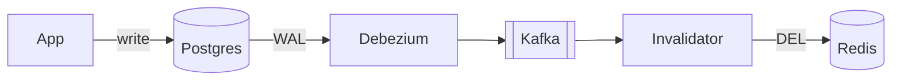

# 3.3.8 — The Consistency Problem

> **Part 3 · Scaling Services · Caching · Chapter 8 of 18**
> The races that leave a cache permanently wrong, and the small number of fixes that actually work.

---

## 🧒 ELI5 — Explain Like I'm 5

Two people are looking after the fridge and neither knows what the other is doing.

Here is how the fridge ends up **wrong forever**:

1. **Ann opens the fridge. Empty.** So she sets off to the shop to buy milk. (She's holding "old milk" in her hands, but hasn't put it in yet.)
2. **While Ann is walking**, Bob changes the milk at the shop to a new brand, comes home, and **throws out whatever is in the fridge** (nothing — it's empty).
3. **Ann arrives home** and puts the *old* milk she bought into the fridge.

Now the fridge has **old** milk and the shop has **new** milk. Nobody did anything wrong. Nobody will ever notice. The fridge stays wrong until the milk goes off (the TTL).

This is the real problem with caches. **It isn't that they go stale for a second — it's that a race can make them stale forever.**

The fixes are all versions of: *"put a short date on everything"* (TTL), *"only one person may fetch"* (locking), or *"write the date on the milk and refuse to put in older milk than what's already there"* (versioning).

---

## The fundamental race: stale set after delete

```
Time  Reader (A)                    Writer (B)                Cache      DB
────────────────────────────────────────────────────────────────────────────
t0    GET product:9 → MISS                                    empty      v1
t1    SELECT ... → returns v1                                 empty      v1
t2                                  UPDATE ... → v2           empty      v2
t3                                  DEL product:9             empty      v2
t4    SET product:9 = v1                                      **v1**     v2
────────────────────────────────────────────────────────────────────────────
      Cache holds v1 forever (until TTL). Nobody made a mistake.
```

☠️ **This race is unavoidable with plain cache-aside.** The reader's `SELECT` and its `SET` are not atomic, and a writer can slip between them. The window is small (typically the database read latency, a few milliseconds) but at high QPS "small" means "several times an hour."

**Why the TTL is not optional:** without one, that entry is wrong until something else happens to invalidate it — which may be never.

---

## The fixes, ranked

### 1. TTL on everything (mandatory baseline)

Bounds the damage. A 5-minute TTL means the worst case is 5 minutes of staleness, not permanent.

⚖️ This is a *damage limit*, not a solution. But it is the only mechanism that catches every failure — missed invalidations, crashed processes, network partitions, and bugs you haven't found yet. **Every cached entry must have a TTL.**

### 2. Delete, don't update (from [Chapter 7](07-write-patterns.md))

Prevents the writer-vs-writer race entirely. Does **not** prevent the reader-vs-writer race above.

### 3. Delete twice (delayed double delete)

```python
def update(pid, fields):
    cache.delete(key(pid))            # 1. clear before the write
    db.update(pid, fields)            # 2. write
    schedule_after(0.5, lambda: cache.delete(key(pid)))   # 3. clear again, later
```

The second delete lands *after* any in-flight reader's `SET`, wiping the stale value.

| ✅ | ❌ |
|---|---|
| Simple; no locks | The delay is a guess — too short and it misses, too long and you extend the miss window |
| Handles the common case well | Not a guarantee; a very slow reader still beats it |
| No extra reads | Two deletes per write |

Widely used in practice because it is cheap and catches most of the window.

### 4. Versioned writes (monotonic cache)

Store a version with the value and refuse to write an older one.

```lua
-- Atomic in Redis: only set if the incoming version is newer
local cur = redis.call('HGET', KEYS[1], 'ver')
if cur == false or tonumber(ARGV[1]) > tonumber(cur) then
  redis.call('HSET', KEYS[1], 'ver', ARGV[1], 'val', ARGV[2])
  redis.call('EXPIRE', KEYS[1], ARGV[3])
  return 1
end
return 0
```

The reader reads `(value, version)` from the database and writes both. A stale reader's `SET` carries an older version and is **rejected**.

| ✅ | ❌ |
|---|---|
| ✅ Actually correct for this race | Needs a monotonic version on every row (`updated_at`, `xmin`, a sequence, or an explicit version column) |
| No locks, no delays | Slightly more storage and code |
| Composable with everything else | Doesn't help if two writers pick versions inconsistently |

🎯 **This is the strongest answer** when an interviewer pushes on "what if a reader repopulates with stale data?" Postgres exposes `xmin`, MySQL has row versions, and `updated_at` works if it has sufficient resolution and monotonicity.

### 5. Single-flight / locking

Only one process may load a key at a time, and the writer takes the same lock. Correct, but adds a lock to the read path and introduces a new failure mode (lock holder dies). Combine coalescing (which you want anyway) with a **write-held lock**:

```python
def update(pid, fields):
    lock = f"lock:{key(pid)}"
    cache.set(lock, "1", nx=True, ex=5)      # readers see the lock and skip caching
    try:
        db.update(pid, fields)
        cache.delete(key(pid))
    finally:
        cache.delete(lock)
```
Readers that see the lock present serve from the database **without populating the cache** — so they cannot write a stale value.

### 6. CDC-driven invalidation (the architectural answer)

Invalidation is triggered by the **committed database change**, not by application code.



| ✅ | ❌ |
|---|---|
| **Cannot miss a committed write** — the WAL is the source of truth | More infrastructure |
| Works across services and languages | Invalidation latency of 10–500 ms |
| No invalidation code in the application at all | Ordering across keys needs care |
| Naturally handles writes made outside your app (migrations, admin tools, other services) | |

☠️ This last point is underrated: application-level invalidation **misses every write that doesn't go through your application** — a DBA running an `UPDATE`, a data migration, another service. CDC catches all of them.

---

## The three-layer version: cache + replica + primary

Real systems combine caching with read replicas, and the staleness compounds.

```
Write → primary
        ↓ (replication lag: ms to seconds)
      replica
        ↓ (cache TTL: seconds to minutes)
      cache
        ↓
      user sees data up to (lag + TTL) old
```

☠️ **The nastiest variant: populating the cache from a lagging replica.**

```
t0  User writes name = "Anna"      → primary
t1  Invalidation deletes cache
t2  A read arrives, misses, queries a REPLICA that hasn't received the write yet
t3  Cache is populated with "Ann" — the OLD value — with a fresh 5-minute TTL
    → Now stale for 5 minutes, even though replication caught up at t2.1
```

**Fixes:**
- Populate the cache from the **primary** on the invalidation path (or for a short window after any write to that entity).
- Delay the invalidation until the replica has caught up (LSN/GTID wait).
- Use the delayed-double-delete, with a delay longer than your p99 replication lag.
- CDC-driven invalidation fires *after* the change is in the WAL, and can be configured to invalidate again after replicas apply.

---

## Consistency models a cache can offer

| Model | Meaning | How |
|---|---|---|
| **Eventual** | Converges within the TTL | Plain cache-aside + TTL. The default |
| **Bounded staleness** | Never more than N seconds stale | Short TTL, enforced |
| **Read-your-writes** | You always see your own change | Write-through, or route your reads to the primary/uncached for N seconds |
| **Monotonic reads** | Never see time go backwards | Sticky routing, or versioned values |
| **Strong** | Always the current value | ❌ Don't cache. Or use a cache with linearizable semantics, which costs more than the database read |

🎯 **State which one you're providing.** *"The product cache is eventually consistent with a 60-second bound; the checkout price read is uncached and strongly consistent."* That single sentence answers most consistency follow-ups.

---

## Practical decision guide

| Data | Acceptable staleness | Strategy |
|---|---|---|
| Product name, description | Minutes | TTL only. Invalidate on write as an optimisation |
| Product price (display) | 60 s | TTL 60 s + invalidate on write |
| **Product price (checkout)** | **0** | **Don't cache** — read the primary |
| Inventory count (display) | 30 s | TTL + invalidate |
| **Inventory (reserve at checkout)** | **0** | Primary, with a lock or conditional update |
| User's own profile | 0 for self | Write-through so the author sees it; TTL for others |
| Follower count | 60 s | TTL; approximate is fine |
| **Account balance (display)** | Seconds | TTL + invalidate on transaction |
| **Account balance (before transfer)** | **0** | Primary, inside the transaction |
| Permissions | 5–30 s | Short TTL — **revocation must be fast** |
| Feature flags | 5–10 s | Short TTL + push invalidation |

**The recurring pattern, again: displays tolerate staleness; decisions do not.** The same field can be cached for rendering and read from the primary for the transaction. Saying this explicitly is one of the highest-value sentences in a caching discussion.

---

## Testing consistency

Races are hard to find by inspection. Force them.

```python
# Deterministically reproduce the stale-set race
def test_stale_set_race():
    cache.flushdb()
    db.set(9, "v1")

    def reader():
        val = db.get(9)              # reads v1
        time.sleep(0.2)              # ← the window, made large
        cache.set(key(9), val, ex=300)

    t = threading.Thread(target=reader); t.start()
    time.sleep(0.05)
    db.set(9, "v2")                  # writer
    cache.delete(key(9))
    t.join()

    assert cache.get(key(9)) == "v1"     # ← the bug, reproduced
    # Now enable versioned writes and assert it becomes "v2" or absent
```

Other tests worth having:
- Concurrent writers: assert the cache converges to the last write.
- Invalidation failure: kill Redis during a write; assert the TTL bounds the staleness.
- Replica lag: point reads at a deliberately delayed replica; assert the cache doesn't capture stale data.

---

## ☠️ Failure modes

| Failure | Consequence |
|---|---|
| No TTL | A single lost race is permanent staleness |
| Populating the cache from a lagging replica | Stale data cached with a fresh TTL |
| Caching from inside an uncommitted transaction | Phantom data after rollback |
| Application-only invalidation | Misses writes from migrations, admin tools, other services |
| `SET` instead of `DEL` on write | Writer-vs-writer race |
| Long TTL on permission or flag data | Revocations don't take effect |
| Assuming invalidation is atomic across layers | CDN and browser stay stale after Redis is fixed |
| Never testing the race | It happens in production at 3 a.m. instead |

---

## 📋 Chapter checklist

| Skill | Ready? |
|---|---|
| Draw the stale-set-after-delete race with a timeline | ☐ |
| Explain why the TTL is a damage limit, not a solution | ☐ |
| Describe delayed double delete and its weakness | ☐ |
| Write a versioned cache set and explain why it fixes the race | ☐ |
| Explain the write-held-lock read behaviour | ☐ |
| Argue for CDC-driven invalidation, including out-of-app writes | ☐ |
| Explain the cache-from-lagging-replica trap | ☐ |
| Name five consistency models a cache can offer | ☐ |
| Classify ten data types by acceptable staleness | ☐ |
| Write a test that reproduces the race deterministically | ☐ |

---

**← Previous** [3.3.7 Write Patterns](07-write-patterns.md)
**Next →** [3.3.9 🧪 Lab: The Write Drill](09-lab-write-drill.md)
