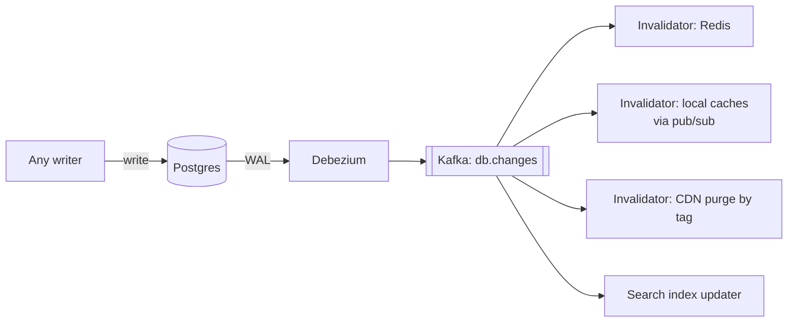

# 3.3.10 — Invalidation & Freshness

> **Part 3 · Scaling Services · Caching · Chapter 10 of 18**
> "There are only two hard things in Computer Science: cache invalidation and naming things." — Phil Karlton

---

## 🧒 ELI5 — Explain Like I'm 5

You've got milk in the fridge. The shop changed the milk. **How does your fridge find out?**

There are only four ways, and every cache system on Earth uses some mix of them:

1. **Put a date on it.** "Throw this out on Friday." You don't need anyone to tell you anything — you just check the date. Simple and it always works, but between Wednesday's change and Friday's date, you're drinking old milk. *(TTL.)*
2. **Someone rings you and says "throw out the milk."** Fast and precise — but what if you're not home, or the phone doesn't work? Then you never hear, and you drink old milk **forever**. *(Explicit invalidation.)*
3. **Write the milk's batch number on a note by the door.** When the shop changes the milk, they change the number. You compare — different number, so you ignore the fridge and go to the shop. **You never have to throw anything out; the old milk simply stops being asked for.** *(Version keys.)*
4. **Every time you want milk, phone the shop and ask "is my milk still current?"** Always right, but you're phoning constantly — you've partly lost the point of having a fridge. *(Revalidation.)*

Real systems use **1 + 2** (dates plus phone calls) or, better, **1 + 3** (dates plus batch numbers). Number 3 is the underrated one because it can't be missed and it works even for fridges you can't reach.

---

## The four mechanisms

| Mechanism | Freshness | Reliability | Cost | Works on caches you can't reach? |
|---|---|---|---|---|
| **1. TTL expiry** | Bounded by the TTL | ✅ Always works | Free | ✅ Yes |
| **2. Explicit invalidation** | Immediate | ⚠️ Can be missed | One delete per write | ❌ No |
| **3. Version keys** | Immediate | ✅ Cannot be missed | One extra read | ✅ **Yes** |
| **4. Revalidation** | Perfect | ✅ | A request per read | ✅ Yes (HTTP ETag) |

**Use TTL always** (it's the backstop), plus **2 or 3** for freshness.

---

## 1. TTL — the mandatory baseline

Every entry gets one. No exceptions.

```python
cache.set(key, value, ex=int(300 * random.uniform(0.9, 1.1)))    # 300s ± 10% jitter
```

**Choosing the value:**

$$\text{TTL} \approx \min(\text{acceptable staleness},\ \text{expected time between changes})$$

| Data | TTL | Reasoning |
|---|---|---|
| Country list | 24 h | Effectively immutable |
| Product description | 30 min | Changes rarely, staleness harmless |
| Price (display) | 60 s | Business-sensitive |
| Inventory (display) | 30 s | Changes constantly |
| Feed | 30 s | Freshness is the product |
| **Permissions** | 5–30 s | **Revocation must land quickly** |
| **Feature flags** | 5–10 s | Kill switches must work |
| Counters | 10–60 s | Approximate is fine |
| Negative entries | 15–30 s | May become positive |

⚠️ **Jitter is not optional.** Keys written together (after a deploy, a warm-up, or a mass invalidation) expire together, producing a synchronised miss storm every TTL period, forever. ±10% jitter breaks the lockstep permanently, for one line of code.

**Sliding vs absolute TTL:**
- **Absolute** — expires N seconds after write. Bounds staleness. ✅ Default.
- **Sliding** — the TTL resets on each read. Keeps hot data forever, which means **a hot key can be stale indefinitely**. Only appropriate for sessions and other data with no external source of truth.

---

## 2. Explicit invalidation

```python
def update_product(pid, fields):
    db.update(pid, fields)
    cache.delete(product_key(pid))
```

**Delete, don't update** ([Chapter 7](07-write-patterns.md)).

### The problems

| Problem | Consequence |
|---|---|
| **The write path may not know all derived keys** | Fragments, listings, search results stay stale |
| **The delete can fail** | Network error, cache down → permanent staleness (until TTL) |
| **Writes from outside the app** | Migrations, admin tools, other services bypass it entirely |
| **Multi-layer** | Deleting from Redis doesn't touch local caches, the proxy, the CDN, or browsers |
| **Not atomic with the database commit** | A crash between commit and delete leaves a stale entry |

☠️ The "writes from outside the app" case is the one people forget. A DBA fixing data with an `UPDATE` statement leaves the cache wrong, and nobody realises until a customer complains about a value that "should have changed weeks ago."

### Making it reliable

| Technique | Effect |
|---|---|
| **CDC-driven invalidation** | Driven by the WAL — cannot miss a committed write, including out-of-app ones |
| **Outbox** | Invalidation events committed with the data |
| **Retry + DLQ** | Failed invalidations are retried, then alerted |
| **TTL backstop** | Bounds the damage of any miss |

---

## 3. Version keys — the strongest general mechanism

Instead of deleting entries, **change the key** so the old entries are never requested again.

```python
def get_product(pid, locale):
    ver = cache.get(f"ver:prod:{pid}") or "0"
    key = f"prod:v3:{pid}:{ver}:{locale}"
    if (v := cache.get(key)) is not None:
        return deserialize(v)
    row = db.get_product(pid)
    cache.set(key, serialize(row), ex=300)
    return row

def update_product(pid, fields):
    db.update(pid, fields)
    cache.incr(f"ver:prod:{pid}")        # ONE atomic op invalidates everything
```

| ✅ | ❌ |
|---|---|
| **O(1)** invalidation regardless of how many derived keys exist | One extra read per request (batch it, or cache the version locally for 1 s) |
| **Cannot be partially applied** — no key is missed | Old entries linger until evicted (memory, not correctness) |
| Race-free: a stale reader writes to the *old* key, which nobody reads | Version keys themselves must be durable-ish |
| **Works at every layer**, including the CDN and the browser, by putting the version in the URL | |
| Atomic (`INCR`) | |

### The multi-layer superpower

```
/api/v3/products/9?v=12      ← browser, CDN, proxy, Redis all key on this
```

Bump the version and **every layer misses simultaneously** — including the browser cache, which you cannot purge by any other means. This is the only mechanism that gives coordinated invalidation across all six caching layers.

### Hierarchical versions

```
ver:catalog          → invalidates everything
ver:category:kitchen → invalidates a category
ver:prod:9           → invalidates one product

key = f"prod:{cat_ver}:{prod_ver}:{pid}:{locale}"
```

Bumping `ver:catalog` invalidates the entire catalogue in one operation. Very useful for schema changes and bulk imports.

⚠️ **If a version key is lost** (eviction, cache restart), it resets to 0 and old cached entries under version 0 become visible again. Mitigations: never set a TTL on version keys, exclude them from eviction (`volatile-lru` only evicts keys with a TTL), or seed the version from a monotonic source such as the row's `updated_at` timestamp.

---

## 4. Revalidation (HTTP)

The client keeps its copy and asks "is it still current?"

```http
GET /api/products/9
If-None-Match: "a7f3c1"

304 Not Modified          ← no body: bandwidth saved, freshness guaranteed
```

| ✅ | ❌ |
|---|---|
| Always fresh | A round trip on every read |
| Saves bandwidth (no body on 304) | Doesn't save origin latency, only transfer |
| Standard, works everywhere | Requires the origin to compute the ETag cheaply |

**Best combined with `stale-while-revalidate`**, so users get an instant (slightly stale) response while revalidation happens in the background.

**Bonus:** the same ETag gives you optimistic concurrency on writes:
```http
PUT /api/products/9
If-Match: "a7f3c1"
→ 412 Precondition Failed if someone else changed it first
```

---

## Event-driven invalidation architecture

The mature pattern for a multi-service, multi-layer system:



| ✅ | ❌ |
|---|---|
| Cannot miss a committed write | More infrastructure |
| Catches writes from **any** source — apps, migrations, DBAs | 10–500 ms invalidation latency |
| One consumer per cache layer; each evolves independently | Ordering across related keys needs thought |
| Replayable: reprocess the log to rebuild derived state | |

🎯 **This is the answer to give for a large system.** *"Invalidation is driven by CDC rather than application code, so it can't be missed — including for writes made outside the service — and each cache layer has its own consumer."*

---

## Invalidating derived and aggregate data

One write can affect many cached things, some of them not obviously related.

```
UPDATE products SET price = 20 WHERE id = 9
  → prod:9                       (the entity)
  → frag:product-card:9          (a rendered fragment)
  → list:category:kitchen        (a listing that shows the price)
  → search:results:"kettle"      (search results with prices)
  → cart:*:totals                (every cart containing product 9!)
  → homepage:deals               (if it's a featured deal)
```

☠️ The `cart:*:totals` case shows the limit of enumeration — you cannot know which carts contain product 9 without a reverse index.

**Strategies:**

| Strategy | How |
|---|---|
| **Version prefixes at each level** | Bump `ver:prod:9` and `ver:category:kitchen`; anything keyed on them misses |
| **Tag sets** | `SADD tag:prod:9 <key>` on write; invalidate the set |
| **Surrogate keys at the CDN** | `Surrogate-Key: product-9 category-kitchen` → purge by tag |
| **Short TTLs for derived data** | Accept staleness on aggregates; they're usually approximate anyway |
| **Don't cache the derived thing** | Cache the components and compose at read time — often the right call for carts |

**The last one deserves emphasis.** Caching composed views (cart totals, personalised pages) creates an invalidation problem with no clean solution. Caching the *components* (product prices, user data) and composing them per request is slightly more work per read and vastly simpler to keep correct.

---

## Freshness in the multi-layer stack

| Layer | Mechanism | Realistic freshness |
|---|---|---|
| Browser | TTL only, or versioned URLs | Up to `max-age`, or instant with versioning |
| CDN | Purge by surrogate key, or versioned URLs | Seconds, or instant with versioning |
| Reverse proxy | Purge request | Seconds |
| Local (in-process) | Pub/sub + short TTL | ms, or up to the TTL if pub/sub is missed |
| Redis | `DEL` or version bump | Immediate |

**End-to-end freshness = the slowest layer.** Optimising Redis invalidation is pointless if the CDN holds the value for 5 minutes.

🎯 **State the end-to-end number:** *"A price change is visible everywhere within 60 seconds — Redis immediately, local caches within 5 seconds, the CDN within 30 seconds via tag purge, and browsers within 60 seconds via `max-age`. Checkout reads the primary, so the transaction is never stale."*

---

## Monitoring invalidation

```
cache_invalidations_total{key_prefix, reason}
cache_invalidation_failures_total{key_prefix}       # ← must be ~0; alert if not
cache_invalidation_lag_seconds                      # write commit → cache cleared
cache_stale_reads_total                             # detected by sampling
cache_version_key_missing_total                     # a lost version key
```

**The sampling technique for detecting real staleness:** on ~0.1% of cache hits, also read the origin and compare. Any mismatch is a real invalidation bug, found automatically, in production. Cheap and remarkably effective — most teams never do it and never discover their stale-data bugs.

---

## ☠️ Failure modes

| Failure | Consequence |
|---|---|
| No TTL | A missed invalidation is permanent |
| No jitter | Synchronised expiry storms every TTL period |
| Sliding TTL on cached database data | A hot key can be stale forever |
| Invalidating only the entity, not derived keys | Inconsistent views of the same data |
| Application-only invalidation | Misses out-of-app writes |
| Ignoring invalidation failures | Silent staleness |
| Long TTL on permissions or flags | Revocations and kill switches don't work |
| Purge-everything as a routine | Global cold start and origin stampede |
| Version keys with a TTL | Lost version resurrects old entries |
| Caching composed views | Invalidation becomes intractable |

---

## 📋 Chapter checklist

| Skill | Ready? |
|---|---|
| Name the four mechanisms and their reliability | ☐ |
| Choose a TTL from acceptable staleness and change frequency | ☐ |
| Explain why jitter is mandatory | ☐ |
| Explain absolute vs sliding TTL and the sliding trap | ☐ |
| List five reasons explicit invalidation fails | ☐ |
| Implement version keys and explain the O(1) property | ☐ |
| Explain why version keys work across layers, including browsers | ☐ |
| Explain the lost-version-key hazard and its fix | ☐ |
| Design CDC-driven invalidation for four layers | ☐ |
| Explain why composed views shouldn't be cached | ☐ |
| Describe the 0.1% sampling technique for detecting staleness | ☐ |

---

**← Previous** [3.3.9 🧪 Lab: The Write Drill](09-lab-write-drill.md)
**Next →** [3.3.11 Eviction & Sizing](11-eviction-and-sizing.md)
