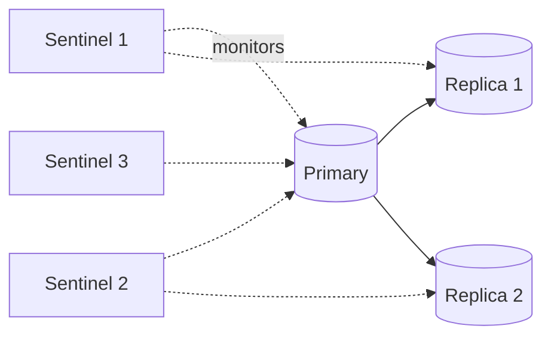

# 3.3.13 — Cache High Availability

> **Part 3 · Scaling Services · Caching · Chapter 13 of 18**
> Once you depend on a 95% hit rate, the cache is not an optimisation — it's a critical dependency.

---

## 🧒 ELI5 — Explain Like I'm 5

You planned your whole week around the fridge. You only go to the shop twice a week now, because the fridge does the rest.

**Then the fridge dies.**

Suddenly you need to go to the shop **twenty times a day**. And so does everyone else on the street, because they all had fridges too. The shop was set up to serve two visits a week per household. It cannot serve twenty a day. **The shop closes.**

Notice what happened: the fridge breaking didn't just make things a bit slower. **It broke the shop.**

So if you're going to depend on a fridge, you need a plan:

- **Have a spare fridge** that's already cold and holds the same food. *(Replicas.)*
- **Have several small fridges** instead of one big one, so losing one is a nuisance, not a catastrophe. *(Sharding.)*
- **Know that the shop can survive** everyone showing up at once — and if it can't, be prepared to **turn some people away at the door** rather than let the shop collapse. *(Load shedding.)*
- **Practise it.** Unplug the fridge on a quiet Tuesday and find out what actually happens.

---

## The core problem

```
Normal:  100,000 QPS × 95% hit rate → database sees 5,000 QPS ✅
Cache dies:  100,000 QPS × 0% hit rate → database sees 100,000 QPS ❌ (20×)
```

☠️ **Your database is provisioned for 5% of traffic.** It will not survive 100%. It doesn't just slow down — connections exhaust, queries queue, timeouts cascade, retries amplify, and the outage persists **even after the cache comes back**, because the database is now too busy to serve the miss traffic needed to refill it.

**This is the most important second-order effect of caching**, and it's what makes cache HA a genuine design problem rather than a checkbox.

---

## Layer 1 — Make the cache itself resilient

### Redis Sentinel (non-clustered)



- **≥ 3 sentinels** (an odd number) so a majority can agree. Two cannot form a quorum.
- Clients ask a sentinel for the current primary address — they must be **Sentinel-aware**.
- Failover in ~10–30 s, tunable via `down-after-milliseconds` and `failover-timeout`.

### Redis Cluster

- 16,384 slots across N primaries, each with ≥ 1 replica.
- Automatic failover per shard: replicas of a failed primary elect a new one.
- **Losing a primary costs only that shard** (1/N of keys) during the failover window.

⚠️ `cluster-require-full-coverage yes` (the default) makes the **entire cluster** refuse writes if any slot is uncovered. Set it to `no` for a cache: serving 90% of keys beats serving none.

### Managed options

| Service | Notes |
|---|---|
| **ElastiCache (Redis)** | Multi-AZ with automatic failover; asynchronous replication |
| **MemoryDB** | Durable multi-AZ transaction log — survives failover with **no data loss**; slightly higher write latency |
| **Memorystore / Azure Cache** | Similar managed models |

⚖️ **MemoryDB is the answer when a "cache" is actually holding something you can't lose** (sessions you can't rebuild, rate-limit state you must not reset). If you find yourself needing durability from Redis, either use MemoryDB or admit that the data belongs in a database.

---

## Layer 2 — Make the application survive cache loss

This is where the real work is. **Assume the cache will be gone; design for it.**

### 2.1 — Never fail a request because the cache failed

```python
def get_product(pid):
    try:
        if (v := cache.get(key(pid))) is not None:
            return deserialize(v)
    except (RedisError, TimeoutError):
        metrics.increment("cache.error")          # degrade, don't fail
    row = db.get_product(pid)
    try:
        cache.set(key(pid), serialize(row), ex=300)
    except (RedisError, TimeoutError):
        pass                                       # best-effort write
    return row
```

☠️ An unhandled cache exception turns a *degraded* system into a *down* one. The cache is an optimisation on the read path; it must never be able to fail a request on its own.

### 2.2 — Aggressive cache timeouts

```python
redis.Redis(socket_timeout=0.05, socket_connect_timeout=0.05)   # 50 ms
```

A cache lookup that takes 2 seconds is **worse than no cache** — you paid 2 s and still have to query the database. **50–100 ms is a generous timeout for something that normally takes 0.5 ms.** Fail fast to the origin.

### 2.3 — Circuit breaker on the cache

If the cache is failing, **stop calling it** and go straight to the origin. This removes the wasted timeout from every request during a cache outage — turning a 2 s p99 into a 50 ms one.

```python
if cache_breaker.is_open():
    return db.get_product(pid)      # skip the cache entirely
```

### 2.4 — Request coalescing (now essential, not optional)

With a cold or dead cache, 10,000 concurrent requests for the same key produce 10,000 identical database queries. Coalescing collapses them to one **per key** ([Chapter 5](05-read-patterns.md#request-coalescing--the-pattern-that-actually-matters)). During a total cache loss this is often the difference between survival and collapse.

### 2.5 — A local in-process cache as a second line

Even a 1–5 second local TTL means each instance queries the origin once per key per interval, instead of on every request. With 50 instances and a 5 s TTL, a key receiving 50,000 QPS produces **10 origin QPS** — not 50,000.

🎯 **A local cache is the single most effective defence against total distributed-cache loss**, and it costs almost nothing. Say this.

### 2.6 — Load shedding

If the origin cannot take the miss traffic, **reject some requests fast** rather than letting everything time out.

```python
if db_concurrency.current() > DB_LIMIT:
    if request.priority == LOW:
        raise ServiceUnavailable(retry_after=5)     # shed cheap traffic first
```

Priority order: bots and crawlers → anonymous users → free tier → logged-in users → paying customers → checkout. **Serving 70% of users correctly beats serving 100% of them a timeout.**

### 2.7 — Serve stale

If the distributed cache is unavailable but a local copy exists — even an expired one — serve it with a staleness marker. This is `stale-if-error` applied at the application layer.

---

## Layer 3 — Make the origin survivable

| Defence | Effect |
|---|---|
| **Connection pool limits** | Bound concurrent database work; excess requests fail fast instead of queueing |
| **Database-side statement timeouts** | Abandoned queries don't accumulate |
| **Read replicas** | More origin capacity to absorb miss traffic |
| **Rate limiting per endpoint** | The expensive endpoints can't consume all capacity |
| **A pre-computed fallback dataset** | Serve a static "top 1000 products" from disk if all else fails |

🔢 **Do this calculation during design:** *"At 100k QPS with a 95% hit rate, the database sees 5k QPS. If the cache dies it sees 100k. Our database caps at 12k. So we need: local caches (÷50), coalescing, and shedding above 12k — otherwise cache loss is a full outage."* That paragraph is exactly what an interviewer wants to hear.

---

## Cache warming

After a restart, failover, or deploy, the cache is empty and the origin is exposed.

| Strategy | How | When |
|---|---|---|
| **Lazy (do nothing)** | Fill on demand | Only if the origin can take the miss storm |
| **Pre-warm from a snapshot** | Redis RDB persistence — restart restores the dataset | ✅ Cheap and effective |
| **Replica promotion** | The replica is already warm | ✅ The best case — this is why replicas matter |
| **Scripted warm-up** | Load the top N keys before accepting traffic | Predictable hot sets |
| **Shadow traffic** | Mirror production reads at the new cache before cutover | Zero-downtime migration |
| **Gradual ramp** | Send 1% → 10% → 100% of traffic to the new cache | Bounds the miss storm |

⚠️ **Redis persistence is a warming tool, not a durability guarantee.** RDB snapshots are periodic; AOF with `appendfsync everysec` can lose a second. For a cache that's fine — and it means a restart resumes with a warm dataset instead of a cold one, which is worth a lot.

Full treatment: [Cold Start](14-cold-start.md).

---

## Multi-region cache availability

| Approach | Region failure behaviour |
|---|---|
| Independent cache per region | ✅ Other regions unaffected; the failed region's traffic shifts and misses locally |
| Global replicated cache | The surviving region has warm data — but cross-region replication is a complexity and cost burden |

**The realistic design:** independent regional caches. When traffic fails over from region A to region B, region B's cache doesn't have A's users' data, so it faces a partial cold start on top of double traffic. **Size region B for that**, or ramp the failover gradually.

---

## Monitoring

```
redis_up{instance}
redis_connected_clients
redis_blocked_clients                       # clients waiting on blocking commands
redis_rejected_connections_total            # ← maxclients reached
redis_keyspace_hits / misses                # hit rate
redis_evicted_keys_total
redis_master_link_status                    # replication health
redis_master_last_io_seconds_ago            # replication lag
cache_client_errors_total{type}             # timeouts, connection errors
cache_client_latency_seconds                # p99 — should be ~1 ms
cache_breaker_state
origin_qps                                  # ← watch this rise as hit rate falls
```

**Alerts that matter:**

| Alert | Threshold |
|---|---|
| Hit rate drop | > 10 percentage points below baseline for 5 min |
| Cache client errors | > 1% of operations |
| Cache p99 latency | > 10 ms |
| Replication link down | Any |
| Evictions rising sharply | Sustained increase |
| **Origin QPS approaching capacity** | > 70% — the leading indicator of cache trouble |

🎯 Alert on the **origin QPS**, not only on cache metrics. It's the thing that actually hurts, and it catches problems (a bad key-format deploy causing 0% hit rate) that cache-health metrics show as perfectly healthy.

---

## The disaster runbook

```
CACHE TIER DOWN
1. Confirm: cache errors + hit rate ~0 + origin QPS spiking
2. Immediately enable load shedding for low-priority traffic
3. Verify local caches are active (they should absorb the hottest keys)
4. Check origin: connections, CPU, replication lag
5. If the origin is failing: shed harder, up to serving a static fallback
6. Restore the cache:
   - Failover to a replica if one is healthy (warm — preferred)
   - Restart from RDB if available (warm)
   - Cold start: ramp traffic gradually; do NOT open the floodgates
7. Watch the hit rate climb; lift shedding in stages
8. Postmortem: was the origin sized for the miss storm? Was shedding automatic?
```

⚠️ **Step 6's warning is the one people get wrong.** Restoring a cold cache and immediately restoring 100% of traffic gives the origin a full miss storm on top of the backlog — the recovery attempt causes a second outage. **Ramp.**

---

## ☠️ Failure modes

| Failure | Consequence |
|---|---|
| Unhandled cache exceptions | A cache blip becomes a full outage |
| No cache timeout (or a long one) | Every request waits for a dead cache before falling through |
| No coalescing | A cold cache produces a query storm |
| No local cache | Nothing absorbs the hot keys during cache loss |
| Origin sized only for the cached load | Cache loss = origin loss |
| No load shedding | Everything times out instead of most things working |
| `cluster-require-full-coverage yes` on a cache | One lost shard disables the whole cluster |
| 2 sentinels | Cannot form a quorum; failover never happens |
| Never testing cache failure | The runbook is fiction |
| Restoring full traffic to a cold cache | A second outage during recovery |

---

## 📋 Chapter checklist

| Skill | Ready? |
|---|---|
| Compute the origin load multiplier from a hit rate | ☐ |
| Explain why the outage persists after the cache returns | ☐ |
| Configure Sentinel/Cluster correctly, including quorum size | ☐ |
| Justify `cluster-require-full-coverage no` for a cache | ☐ |
| Write cache access code that degrades instead of failing | ☐ |
| Justify a 50 ms cache timeout | ☐ |
| Explain why a local cache is the best defence against total loss | ☐ |
| Define a load-shedding priority order | ☐ |
| Give six warming strategies | ☐ |
| Say why you alert on origin QPS | ☐ |
| Recite the runbook, including the ramp warning | ☐ |

---

**← Previous** [3.3.12 Distributed Caching](12-distributed-caching.md)
**Next →** [3.3.14 Cold Start](14-cold-start.md)
