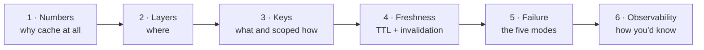

# 3.3.18 — Interview Walkthrough

> **Part 3 · Scaling Services · Caching · Chapter 18 of 18**
> All seventeen chapters, compressed into what you actually say in the room.

---

## 🧒 ELI5 — Explain Like I'm 5

You've learned everything about fridges. Now someone asks you, in an interview: *"how would you keep the milk cold?"*

You don't recite the fridge manual. You tell a short story with a beginning, middle and end:

1. **"Here's how much milk we're talking about"** — numbers first, always.
2. **"Here's where I'd put the fridges"** — and which things go in which fridge.
3. **"Here's how I'd label the bottles"** — including whose milk is whose.
4. **"Here's how I'd know when milk goes off"** — and how out-of-date is too out-of-date.
5. **"Here's what happens when the fridge breaks"** — because it will.
6. **"Here's how I'd know it's working"** — a thermometer and a taste test.

Six beats, in that order, every time. **The last two are what most people forget, and they're what interviewers are listening for.**

---

## The six-beat caching answer

Roughly 5–8 minutes spoken. Below is each beat with the words.

---

## Beat 1 — Establish the numbers (60 s)

Never say "I'd add a cache." Say **why the maths requires one**.

> "Reads are 50,000 QPS at peak, writes about 500 — a 100:1 ratio. A single Postgres node handles maybe 10,000 indexed reads per second, so I need to remove at least 80% of read traffic before it reaches the database:
>
> required hit rate = 1 − 10,000/50,000 = **80%**.
>
> Access is heavily skewed — a Zipf distribution where the top 1% of products get maybe half the views — so an 80% hit rate is comfortably achievable by caching a few percent of the catalogue. That's about 400,000 entries at 1 KB compressed, so roughly **1 GB** with overhead and headroom."

That paragraph establishes: the ratio, the constraint, the required hit rate, why it's achievable, and the size. Everything after is justified by it.

---

## Beat 2 — Choose the layers (60 s)

> "Three layers.
>
> **CDN** for anything public and identical for all users — images, JS, and the public product JSON with a 60-second TTL plus `stale-while-revalidate` and `stale-if-error`. That's latency *and* bandwidth: 500 GB/s of egress at cloud rates would be millions per year, and it also means the origin never sees most traffic.
>
> **Redis** as the main shared tier for entities and personalised data, keyed per user where relevant.
>
> **A small in-process cache** with a 1–5 second TTL on the hottest keys. That's specifically my hot-key and cache-outage defence: a key taking 10,000 QPS becomes 1 QPS per instance with a one-second TTL.
>
> I would *not* cache personalised responses at the CDN — that's how you serve one user's data to another."

---

## Beat 3 — Key design (60 s)

> "Keys are `prod:v3:{id}:{version}:{locale}:{currency}`.
>
> The **schema version** `v3` means a serialisation change doesn't break on stale entries — the two generations coexist and the old ones age out.
>
> The **entity version** is a counter I bump on write, which gives me O(1) invalidation of every derived key for that product without enumerating them — and it works at *every* layer, including browsers, if I put it in the URL.
>
> Locale and currency are in the key because they change the response. **User ID is not**, because this data is the same for everyone — putting it in would give me ten million copies and a zero hit rate. Personalised data gets its own per-user key and I compose at render time.
>
> For anything multi-tenant, the tenant ID is in the key, and I authorise **before** touching the cache — never only on the miss path, or the cache silently bypasses access control."

🎯 Those last two sentences are the security answer, and very few candidates give it unprompted.

---

## Beat 4 — Freshness (60 s)

> "Every entry has a TTL — that's non-negotiable, because it's the only mechanism that catches a *missed* invalidation. With TTL jitter of ±10%, so keys written together don't expire together.
>
> On writes I **delete** rather than update. Update creates a race: two concurrent writers can leave the slower one's older value in the cache permanently. Delete is idempotent and order-independent.
>
> Explicit invalidation is best-effort, so I'd drive it from **CDC** — Debezium on the WAL — rather than from application code. That can't miss a committed write, and it catches writes that don't go through the service at all: migrations, admin tools, other services.
>
> Staleness bounds: product data 5 minutes, prices 60 seconds, permissions 10 seconds. And the **checkout path reads the price and inventory from the primary** — display data tolerates staleness, decisions don't."

⚠️ That final distinction — *displays tolerate lag, decisions don't* — is one of the highest-value sentences in the whole topic.

---

## Beat 5 — Failure modes (90 s)

The beat that separates candidates.

> "Five things go wrong.
>
> **Stampede** — a hot key expires and a thousand concurrent requests all query the database. Fixed with request coalescing: a `SET NX` lock so one loader goes to the origin and the rest wait, with a lock TTL and a bounded fallback so a dead leader can't deadlock everyone.
>
> **Penetration** — requests for IDs that don't exist always miss, so the cache protects nothing and an attacker can bypass it entirely. Fixed with negative caching on a short TTL, plus a Bloom filter if the ID space is large enough that the bad IDs don't repeat.
>
> **Avalanche** — mass simultaneous expiry, or losing the cache. TTL jitter for the first; snapshot persistence and warm replica failover for the second.
>
> **Hot key** — one key on one shard. The local cache handles it; key replication if not.
>
> **Total cache loss** — and this is the important one. At a 95% hit rate the database is provisioned for 5% of traffic. If the cache dies it gets **20×** what it can handle, and it doesn't just slow down: it can't serve the misses needed to refill the cache, so the system doesn't recover on its own. So: local caches to absorb the hot set, coalescing so each key costs one origin call, and automatic load shedding when the hit rate collapses and origin load spikes — shedding bots and anonymous traffic first, protecting checkout.
>
> Recovery has to be **ramped** — restoring full traffic to a cold cache causes a second outage."

🎯 If you say nothing else, say this beat. It demonstrates you understand that **a cache changes your failure model, not just your latency**.

---

## Beat 6 — Observability (45 s)

> "Hit rate is a first-class SLI, labelled by key prefix — a global 90% can hide one prefix at 5%. I'd alert if it drops more than 10 points below baseline, because the classic silent failure is a key-format mismatch after a deploy: nothing errors, the cache reports perfect health, and the system is quietly 10× slower and 10× more expensive.
>
> I'd also alert on **origin QPS** rather than only on cache metrics, because that's what actually hurts.
>
> And I'd run a **staleness sampler**: on 0.1% of hits, also read the origin and compare. That's the only way to detect missed invalidations in production — no infrastructure metric shows wrong-but-fast data."

---

## Common follow-ups, with answers

| Question | Answer |
|---|---|
| **"What if the cache goes down?"** | Beat 5's last paragraph. Also: cache access is wrapped so an error degrades to the origin instead of failing the request, with a 50 ms timeout and a circuit breaker so a dead cache doesn't add 2 s to every request. |
| **"How do you invalidate?"** | Delete on write, driven by CDC; version prefixes for group invalidation; TTL as the backstop. Never update-in-place. |
| **"How do you pick the TTL?"** | From acceptable staleness and change frequency, per data type. Permissions in seconds because revocation must land; product descriptions in minutes. Always with jitter. |
| **"What about consistency?"** | Eventual, with a stated bound. The specific race is: a reader misses, reads the old value, a writer commits and invalidates, then the reader writes stale data with a fresh TTL. Fixed with versioned cache writes so an older version can't overwrite a newer one — or delayed double delete as the cheap mitigation. |
| **"Cache-aside or read-through?"** | Cache-aside, because a Redis outage then degrades us to database-only rather than taking us down. |
| **"How big should the cache be?"** | Measure the hit-rate-vs-size curve, size at the knee plus 30%. Then check it against required hit rate from origin capacity. |
| **"How do you handle a celebrity/hot key?"** | Local cache with a 1-second TTL first — 10,000 QPS becomes 1 per instance. Key replication or CDN if that's not enough. |
| **"What about multi-region?"** | Independent cache per region so reads are always local, with invalidation broadcast globally. Size each region for a partial cold start on failover. |
| **"Would you cache the rendered page?"** | Only the public shell, at the CDN. Composed per-user views create an invalidation problem with no clean solution — cache the components and compose per request. |
| **"How do you know it's working?"** | Beat 6. |

---

## What not to say

| ❌ | Why it's weak |
|---|---|
| "I'd add Redis." | No numbers, no justification, no trade-off |
| "We'll cache everything." | No hit-rate reasoning; no memory budget |
| "The cache makes it fast." | Ignores the failure model, which is what's being probed |
| "Cache invalidation is hard, ha ha." | The quote is not an answer |
| "We'll use a long TTL for a better hit rate." | Ignores staleness; unacceptable for prices or permissions |
| "The database can handle it if the cache fails." | Only if you've done the arithmetic — usually it can't |
| Naming a technology with no mechanism | Buzzword stacking; scores zero |

---

## The 30-second version

If you have almost no time:

> "Reads are 100:1 over writes and heavily skewed, so I need an 80% hit rate to fit the database's capacity — about 1 GB of Redis. CDN for public content, Redis for entities and per-user data, plus a one-second in-process cache for hot keys. Keys carry a schema version and an entity version so invalidation is O(1) and works at every layer; tenant ID is in the key and authorisation happens before the cache. Delete on write driven by CDC, with a jittered TTL as the backstop. The important part is failure: at a 95% hit rate the database is sized for 5% of traffic, so cache loss is 20× — I need local caches, request coalescing, and automatic shedding, and recovery has to be ramped. I'd alert on hit rate per prefix and on origin QPS, and sample 0.1% of hits against the origin to catch staleness bugs."

---

## The complete section checklist

| Chapter | Core idea | Got it? |
|---|---|---|
| 1 Mental model | Hit-rate maths; caching depends on skew | ☐ |
| 2 Layers | Closer = faster = harder to invalidate; layers multiply | ☐ |
| 3 CDN vs app | CDN saves bandwidth; app cache saves computation | ☐ |
| 4 Keys | Cardinality vs hit rate; keys are access control | ☐ |
| 5 Read patterns | Cache-aside; coalescing; negative caching | ☐ |
| 6 Read lab | Measured 88% vs 10%; 187 → 1 | ☐ |
| 7 Write patterns | Delete don't update; DB first | ☐ |
| 8 Consistency | The stale-set race; versioned writes | ☐ |
| 9 Write lab | Reproduced every race | ☐ |
| 10 Invalidation | TTL + version keys + CDC | ☐ |
| 11 Eviction & sizing | LRU/TinyLFU; the knee of the curve | ☐ |
| 12 Distributed | Consistent hashing; hot keys | ☐ |
| 13 HA | The cache is load-bearing | ☐ |
| 14 Cold start | A stable failure state, not a transient one | ☐ |
| 15 Failure modes | The ten names | ☐ |
| 16 Disaster lab | 2,110 failures → 0 | ☐ |
| 17 Security & observability | Key scoping; the staleness sampler | ☐ |
| 18 This chapter | The six beats | ☐ |

---

**← Previous** [3.3.17 Security & Observability](17-security-and-observability.md)
**Next →** [3.4.1 Dataflow Overview](../04-dataflow/01-dataflow-overview.md)
