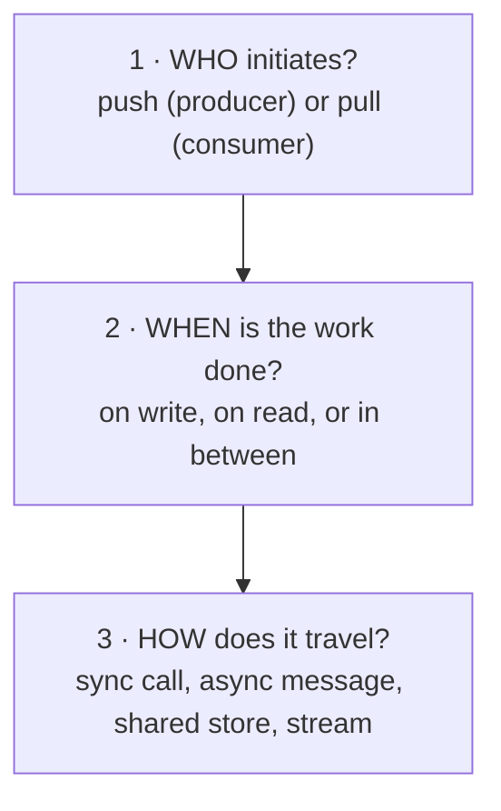
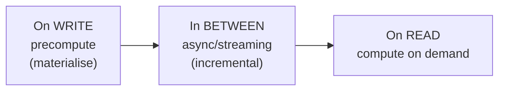

# 3.4.1 — Dataflow Overview

> **Part 3 · Scaling Services · Dataflow · Chapter 1 of 3**
> The third of the three buckets: how data moves through a system, and who does the work.

---

## 🧒 ELI5 — Explain Like I'm 5

Every system is really just **stuff moving from where it's made to where it's needed.**

Think about a newspaper.

- Journalists **write** stories. *(Writes.)*
- Readers **read** them. *(Reads.)*
- In between, someone has to **get the story from the journalist to the reader.**

And there are only really two ways to do that:

1. **Print a copy for every subscriber and post it to their house.** Lots of work up front — a million copies! — but when a reader wants the news, it's already on their doormat. Instant. *(Push, or fan-out on write.)*
2. **Keep one copy at the newspaper office, and readers come and ask for it.** No work up front. But every reader has to make the trip, and if a million people come at once, the office is swamped. *(Pull, or fan-out on read.)*

Which is better depends entirely on one question: **do more people read than write?**

If a thousand people read every story, printing copies is worth it. If nobody reads most stories, printing a million copies of each is madness.

That's the whole of dataflow. Everything else is detail.

---

## The three questions of dataflow



Every dataflow decision is one of these three. Answer them explicitly and the design writes itself.

---

## Question 1 — Push or pull?

| | **Push** | **Pull** |
|---|---|---|
| Initiated by | The producer | The consumer |
| Work happens | At write time | At read time |
| Latency to consumer | ✅ Low — it's already there | Higher — computed on demand |
| Wasted work | ⚠️ Yes, if nobody reads it | ✅ None |
| Write cost | High (× number of consumers) | Low |
| Read cost | ✅ Low | High |
| Scales badly when | One producer has millions of consumers | One item has millions of readers *and* is expensive to compute |
| Examples | Timeline fan-out, webhooks, WebSocket push, replication | Polling, on-demand aggregation, search |

**The decision rule:**

$$\text{push if } \frac{\text{reads}}{\text{writes}} \gg 1 \quad\text{and}\quad \text{fan-out is bounded}$$

Both conditions matter. High read:write ratio *alone* isn't enough — if one write must be pushed to 100 million consumers, the write becomes impossible regardless of how many reads it saves.

Full treatment: [Push vs Pull](02-push-vs-pull.md).

---

## Question 2 — When is the work done?

The same computation can happen at three different times, and the choice is a pure latency-vs-cost trade.



| | On write | In between (streaming) | On read |
|---|---|---|---|
| Read latency | ✅ Lowest | Low | Highest |
| Write latency | Highest | ✅ Low | ✅ Lowest |
| Freshness | ✅ Exact | Seconds behind | ✅ Exact |
| Storage cost | High (materialised copies) | Medium | ✅ None |
| Wasted computation | If never read | Some | None |
| Complexity | Medium | High | ✅ Low |

**Worked example — a follower count:**

| Strategy | Implementation | Cost |
|---|---|---|
| On read | `SELECT COUNT(*) FROM follows WHERE followee=?` | 200 ms on a large table, every profile view |
| On write | `UPDATE users SET follower_count = follower_count + 1` | Contention on hot rows; exact |
| In between | Increment a Redis counter; flush to the database every 10 s | ✅ Fast reads, cheap writes, ~10 s stale |

🎯 **The "in between" column is where most good designs live**, and it's the one candidates forget. Say it explicitly: *"I'd compute this incrementally in a stream processor rather than on read or on write."*

---

## Question 3 — How does it travel?

| Mechanism | Coupling | Latency | Use |
|---|---|---|---|
| **Synchronous call** | Temporal + interface | ms | The answer is needed now |
| **Async message (command)** | Interface only | ms–s | Work that must happen, but not now |
| **Event stream (log)** | None | ms–s | Something happened; many may care |
| **Shared datastore** | Total | Query time | ❌ Between services, almost never |
| **Batch job** | None | Minutes–hours | Large-volume reprocessing |
| **CDC** | None | ms–s | Keep derived stores in sync with a database |

Covered in [Part 2](../../02-microservices-and-dataflow/). The dataflow-level point: **prefer the mechanism with the least coupling that meets the latency requirement.**

---

## The four canonical dataflow shapes

### 1. Request/response (synchronous read path)
```
Client → Service → Cache → Database → Service → Client
```
The default. Simple, immediately consistent, and it couples availability.

### 2. Write-path fan-out (push)
```
Write → Service → [fan out to N consumers/stores] → each consumer's view
```
Expensive writes, cheap reads. Timelines, notifications, denormalised views.

### 3. Read-path fan-in (pull)
```
Read → Service → [query N sources] → merge → respond
```
Cheap writes, expensive reads. Search across shards, aggregations, dashboards.

### 4. Stream processing (continuous)
```
Events → Log → Stateful processor → Materialised view → Reads
```
Amortised: work happens once per event, not once per read. Part 6.

---

## Dataflow patterns in practice

| System | Shape | Why |
|---|---|---|
| Twitter timeline | Push (hybrid) | 1000:1 read:write; but celebrities force a pull fallback |
| Search | Pull + precomputed index | The index is built on write; queries fan in at read |
| Notifications | Push | The user must be told without asking |
| Analytics dashboard | Stream → materialised view | Aggregations are far too expensive on read |
| Stock ticker | Push (server-sent) | Continuous updates, many consumers |
| Email inbox | Push into per-user storage | Bounded fan-out (one recipient, or a small list) |
| Google Docs | Bidirectional streaming | Both sides produce continuously |
| Order history | Pull | Read rarely; no reason to precompute |
| Product recommendations | Precomputed batch + read-time filter | Expensive to compute, tolerant of staleness |

---

## Fan-out ratios: the number that decides

$$\text{fan-out} = \text{consumers per write}$$

| Fan-out | Example | Strategy |
|---|---|---|
| 1 | An email to one recipient | Push, trivially |
| ~10 | A group chat message | Push |
| ~1,000 | An average social post | Push |
| ~100,000 | A popular account | Hybrid |
| 100,000,000 | A global celebrity | **Pull** — push would be 100M writes for one post |

☠️ **The celebrity problem is the canonical fan-out failure.** One tweet from a 100-million-follower account, pushed eagerly, means 100 million timeline writes for a single action. At even 100k writes/sec that's 17 minutes to deliver one tweet, and it starves every other write in the system.

**The universal fix is a hybrid:** push for normal accounts (fan-out on write), pull for the small number of accounts above a follower threshold (fan-out on read), and merge at read time. Details: [Push vs Pull in Twitter Timeline](03-push-vs-pull-twitter-timeline.md).

---

## Backpressure: what happens when the consumer is slower

Any dataflow where the producer outpaces the consumer needs an answer.

| Strategy | Behaviour | Use |
|---|---|---|
| **Buffer** | Queue the excess | Bursty but bounded load |
| **Block** | Slow the producer | The producer can wait (batch pipelines) |
| **Drop** | Discard excess | Metrics, telemetry, live video |
| **Sample** | Keep 1 in N | High-volume observability data |
| **Shed by priority** | Drop the least valuable first | User-facing services |
| **Scale the consumer** | Add capacity | If the load is sustained, not spiky |

☠️ **Unbounded buffering is not a strategy** — it converts a throughput problem into an out-of-memory crash, or into hours of queue latency. Every buffer needs a bound and a documented policy for what happens at the bound.

---

## Data locality: move the computation, not the data

| Principle | Application |
|---|---|
| **Filter early** | Push predicates to the database; don't fetch 1M rows to keep 10 |
| **Aggregate at the source** | Pre-aggregate in a stream processor rather than shipping raw events |
| **Colocate compute with data** | MapReduce sends code to the data, not data to the code |
| **Denormalise for the read path** | One lookup instead of six joins |
| **Cache near the consumer** | CDN at the edge |

🔢 The reason this matters: moving 1 TB across a datacenter network at 10 Gbps takes ~13 minutes; moving the 1 KB of code that processes it takes microseconds. **At scale, data movement dominates cost** — in time and in money (cross-AZ and egress charges).

---

## Designing a dataflow: the method

1. **Draw the producers and consumers.** Who makes the data, who needs it?
2. **Compute the read:write ratio.** This decides push vs pull.
3. **Compute the fan-out.** If it's unbounded, you need a hybrid.
4. **Decide when the work happens** — write, stream, or read.
5. **Choose the transport** — the least coupling that meets the latency need.
6. **Define backpressure** — what happens when the consumer falls behind.
7. **Define the consistency contract** — how stale can the consumer's view be?

🎯 **In an interview, narrate steps 2 and 3 explicitly with numbers.** *"Reads are 1000× writes and average fan-out is 200, so I'll fan out on write — except for the top 0.01% of accounts, where fan-out exceeds 100,000 and I'll pull instead."* That single sentence is the entire timeline design, justified.

---

## 📋 Chapter checklist

| Skill | Ready? |
|---|---|
| State the three questions of dataflow | ☐ |
| Give the push-vs-pull decision rule, including both conditions | ☐ |
| Explain the three timings and name the "in between" option | ☐ |
| Apply the follower-count example to a new problem | ☐ |
| Name the four canonical shapes | ☐ |
| Explain the celebrity fan-out problem with numbers | ☐ |
| Name six backpressure strategies and why unbounded buffering isn't one | ☐ |
| Explain data locality and why movement dominates cost | ☐ |
| Run the seven-step design method | ☐ |

---

**← Previous** [3.3.18 Caching Interview Walkthrough](../03-caching/18-interview-walkthrough.md)
**Next →** [3.4.2 Push vs Pull](02-push-vs-pull.md)
