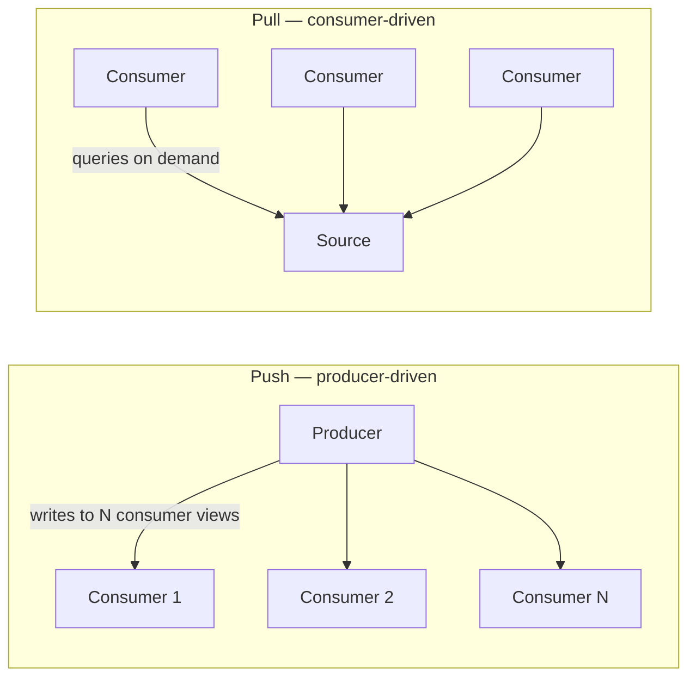

# 3.4.2 — Push vs Pull

> **Part 3 · Scaling Services · Dataflow · Chapter 2 of 3**
> The oldest trade-off in distributed systems, and the one interviewers probe most.

---

## 🧒 ELI5 — Explain Like I'm 5

Two ways to find out if your friend has replied to your message:

**Pull:** you check your phone. Then check again. And again. Most of the time there's nothing there — you just wasted a look. But your phone didn't have to do anything until you asked.

**Push:** your phone buzzes the moment they reply. No wasted looking. But now your phone has to be *awake and listening* all the time, and if a thousand friends reply at once, it buzzes a thousand times.

Which is better?

- **If replies are rare and you check constantly** → pushing is much better. (Why look 500 times to find one message?)
- **If replies are constant and you rarely look** → pulling is much better. (Why buzz 500 times for someone who checks once a day?)

That's the entire rule: **whichever happens more often should be the cheap one.**

And there's a third way, which is what most real systems actually do: **the phone checks every 30 seconds, but if something urgent arrives it buzzes immediately.** Cheap most of the time, fast when it matters.

---

## The two models



| | **Push (fan-out on write)** | **Pull (fan-out on read)** |
|---|---|---|
| Work at write | O(consumers) | O(1) |
| Work at read | O(1) | O(sources) |
| Read latency | ✅ Lowest — precomputed | Higher |
| Write latency | Higher (or async) | ✅ Lowest |
| Storage | N copies | ✅ One copy |
| Wasted work | If nobody reads | ✅ None |
| Freshness | ✅ Exact at write time | ✅ Exact at read time |
| Breaks when | Fan-out is huge | Read fan-in is huge, or reads are frequent |

---

## The decision framework

### 1. The read:write ratio

$$\text{total work}_{\text{push}} = W \times F \qquad \text{total work}_{\text{pull}} = R \times S$$

where `W` = writes, `F` = fan-out per write, `R` = reads, `S` = sources per read.

**Push wins when `W × F < R × S`.**

```
Twitter-like: W = 6,000 writes/s, F = 200 followers
              R = 300,000 reads/s, S = 200 followees
  push: 6,000 × 200   = 1,200,000 units/s
  pull: 300,000 × 200 = 60,000,000 units/s
  → push is 50× cheaper ✅
```

```
An audit log: W = 10,000 writes/s, F = 1,000 potential viewers
              R = 10 reads/s, S = 1,000 sources
  push: 10,000 × 1,000 = 10,000,000 units/s
  pull: 10 × 1,000     = 10,000 units/s
  → pull is 1,000× cheaper ✅
```

🎯 **Do this arithmetic out loud in an interview.** It converts an "it depends" into a defended decision in fifteen seconds.

### 2. The fan-out bound

Even when push wins on average, a **single unbounded fan-out** can make it impossible.

```
Average fan-out 200  → 6,000 × 200 = 1.2M writes/s ✅ feasible
One account with 100M followers → 100,000,000 writes for ONE post ❌
```

☠️ **This is why almost every real system is a hybrid.** The average case says push; the tail says pull.

### 3. Read frequency vs staleness tolerance

If consumers read rarely, pushing to them is wasted work. If they read constantly and need freshness, pushing is essential.

---

## The hybrid (the answer to almost every real problem)

```python
CELEBRITY_THRESHOLD = 100_000

def on_post(author_id, post_id):
    followers = get_follower_count(author_id)
    if followers < CELEBRITY_THRESHOLD:
        fan_out_on_write(author_id, post_id)     # push into each follower's timeline
    # else: do nothing — celebrity posts are pulled at read time

def get_timeline(user_id):
    pushed = timeline_cache.range(user_id, 0, 100)                  # O(1)
    celebs = get_followed_celebrities(user_id)                      # usually < 50
    pulled = [recent_posts(c, limit=20) for c in celebs]            # O(small)
    return merge_by_time(pushed, *pulled)[:100]
```

| ✅ | ❌ |
|---|---|
| Bounded write cost — no post causes 100M writes | Two code paths to maintain |
| Bounded read cost — celebrities are few per user | Merging adds read latency |
| Handles both extremes correctly | The threshold needs tuning |

⚖️ **Choosing the threshold:** set it where `follower_count × write_cost` starts to exceed your acceptable write latency budget. Typical real-world values are in the tens of thousands. Also consider *activity*: pushing to 200 followers who haven't opened the app in a year is pure waste — many systems only fan out to **active** followers and rebuild lazily for the rest.

---

## Push mechanisms

| Mechanism | Direction | Notes |
|---|---|---|
| **Fan-out on write** | Producer → consumer storage | Precomputed views; the timeline case |
| **WebSocket** | Server → client, bidirectional | Stateful connections; needs a connection tier |
| **Server-Sent Events (SSE)** | Server → client, one-way | Simpler than WebSocket, plain HTTP, auto-reconnect |
| **HTTP long polling** | Client asks; the server holds the request open until there's data | Works everywhere; a request per message |
| **Webhooks** | Server → another server | Needs retries, signatures, and idempotency |
| **Mobile push (APNs/FCM)** | Server → device, via the OS | Works when the app is closed |
| **Database replication** | Primary → replicas | Push at the storage layer |
| **CDC** | Database → consumers | Push derived from committed writes |

⚠️ **Push to clients means holding state.** A million concurrent WebSocket connections require a dedicated connection tier plus a registry mapping `user → node` and pub/sub routing ([Stateless vs Stateful](../01-horizontal-scaling/02-stateless-vs-stateful.md)). That's a real cost, and it's why polling survives.

---

## Pull mechanisms

| Mechanism | Notes |
|---|---|
| **Short polling** | Request every N seconds. Simple; wasteful; latency ≈ N/2 on average |
| **Long polling** | The server holds the request until data arrives or a timeout. Near-push latency with pull semantics |
| **Conditional requests** | `If-None-Match` → `304 Not Modified`. Cheap polling |
| **Cursor-based sync** | "Give me everything since cursor X" — efficient catch-up after being offline |
| **Read-time aggregation** | Query and merge sources on demand |

### Polling cost, quantified

```
1,000,000 clients polling every 5 s = 200,000 QPS
  ...and if 99% of polls return "nothing new", 198,000 QPS is pure waste.
```

🔢 That number is why push exists. But note the counter-argument: **200,000 stateless HTTP requests are cheaper to operate than 1,000,000 persistent connections.** Polling is often the right engineering answer despite the waste, especially for updates that can tolerate a few seconds and for clients on unreliable mobile networks.

**Adaptive polling** splits the difference: poll every 2 s while the user is active, every 60 s in the background, and back off exponentially when nothing changes.

---

## Delivery guarantees differ

| | Push | Pull |
|---|---|---|
| Consumer offline | ❌ Delivery fails — needs a queue or retry | ✅ It just fetches when it returns |
| Consumer slow | ❌ Backpressure problem on the producer | ✅ Self-limiting — it pulls at its own rate |
| Consumer restarts | ❌ May miss messages in the gap | ✅ Resumes from its cursor |
| Guaranteed ordering | Harder | ✅ Natural with a cursor |
| Load control | Producer must throttle | ✅ Consumer controls the rate |

🎯 **Pull is naturally backpressured.** The consumer asks for what it can handle. Push requires the producer to know the consumer's capacity, which it usually doesn't — this is the fundamental reason streaming systems (Kafka) are pull-based at the consumer end despite being "streaming."

---

## Worked examples

### Notifications
**Push.** The user must be told without asking. Fan-out is bounded (one recipient, or a small list), and read frequency is low relative to write. Use mobile push for closed apps, WebSocket/SSE for open ones, and store in a durable inbox so nothing is lost.

### Social feed
**Hybrid.** See [Push vs Pull in Twitter Timeline](03-push-vs-pull-twitter-timeline.md).

### Stock prices
**Push, with sampling.** Prices change thousands of times per second; humans can perceive maybe two updates per second. Push over WebSocket, but **conflate** — send the latest value at a fixed rate rather than every tick. This is a form of load shedding, and it's what real trading UIs do.

### Search results
**Pull.** Queries are unbounded in variety — you cannot precompute every possible query. The *index* is built on write (push into the index), and queries fan in at read.

### Email
**Push into per-user storage.** Bounded fan-out. The client then pulls (IMAP) or is pushed to (mobile).

### Chat
**Push for online recipients, pull for catch-up.** A message is pushed to connected devices immediately; a device that was offline pulls everything since its last cursor on reconnect. **Both paths are needed** — this dual design is the correct answer and candidates often give only half of it.

### Configuration / feature flags
**Hybrid.** Clients poll every 30 s as a baseline (simple, self-healing), plus a push channel for urgent changes (kill switches). The poll is the correctness mechanism; the push is the latency optimisation. **If the push fails, the poll still converges** — that's the important property.

---

## The middle grounds worth knowing

| Technique | What it is |
|---|---|
| **Push a notification, pull the data** | Send "something changed for you"; the client fetches the details. Tiny push payloads, no fan-out of large data, and the client controls when it does the work. ✅ Very common and very effective |
| **Push to a cache, pull from the cache** | Precompute into Redis on write; consumers read on demand. Decouples the two |
| **Long polling** | Pull semantics, push latency |
| **Push with digest/batching** | Instead of 100 pushes, send one summary. Fewer notifications, less load, happier users |
| **Conflation** | Only send the latest value per key when the consumer is slow |

🎯 **"Push a notification, pull the data"** is the single most useful hybrid and is worth naming explicitly. It gives you push latency with pull's backpressure and delivery properties.

---

## ☠️ Failure modes

| Failure | Model | Fix |
|---|---|---|
| Celebrity fan-out explosion | Push | Hybrid with a threshold |
| Pushing to inactive users | Push | Only fan out to active users; rebuild lazily |
| Polling storm (synchronised clients) | Pull | Jitter the poll interval — clients that start together poll together forever |
| Thundering herd on reconnect | Both | Exponential backoff with jitter on reconnect |
| Slow consumer blocking the producer | Push | Bounded buffer, then drop or conflate |
| Missed pushes while offline | Push | A durable inbox plus cursor-based catch-up |
| Unbounded read fan-in | Pull | Precompute, or cap the number of sources |
| Wasted polls | Pull | Conditional requests (`ETag` → 304), long polling, adaptive intervals |

⚠️ **The synchronised-polling trap is subtle and real:** a fleet of clients deployed at the same moment polls at the same moment, forever. Always jitter the interval (`interval × random(0.8, 1.2)`).

---

## 📋 Chapter checklist

| Skill | Ready? |
|---|---|
| State the push-vs-pull cost formula and apply it to two examples | ☐ |
| Explain why fan-out bounds matter independently of the ratio | ☐ |
| Write the hybrid implementation and justify the threshold | ☐ |
| Name eight push mechanisms and five pull mechanisms | ☐ |
| Quantify polling waste and give the counter-argument | ☐ |
| Explain why pull is naturally backpressured | ☐ |
| Give the correct dual answer for chat | ☐ |
| Explain "push a notification, pull the data" | ☐ |
| Explain conflation for fast-changing data | ☐ |
| Name the synchronised-polling trap and its fix | ☐ |

---

**← Previous** [3.4.1 Dataflow Overview](01-dataflow-overview.md)
**Next →** [3.4.3 Push vs Pull in Twitter Timeline](03-push-vs-pull-twitter-timeline.md)
