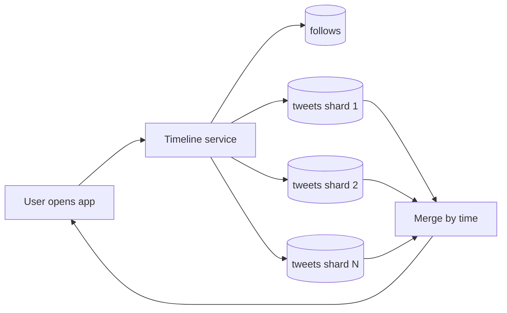
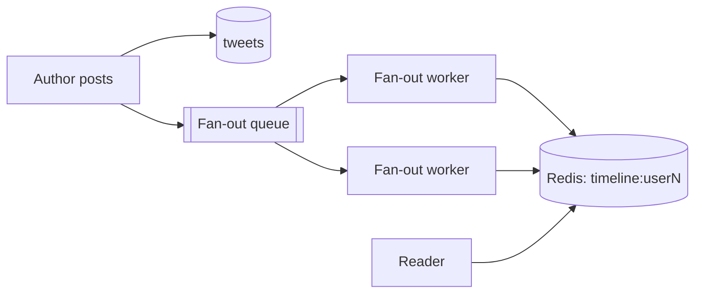
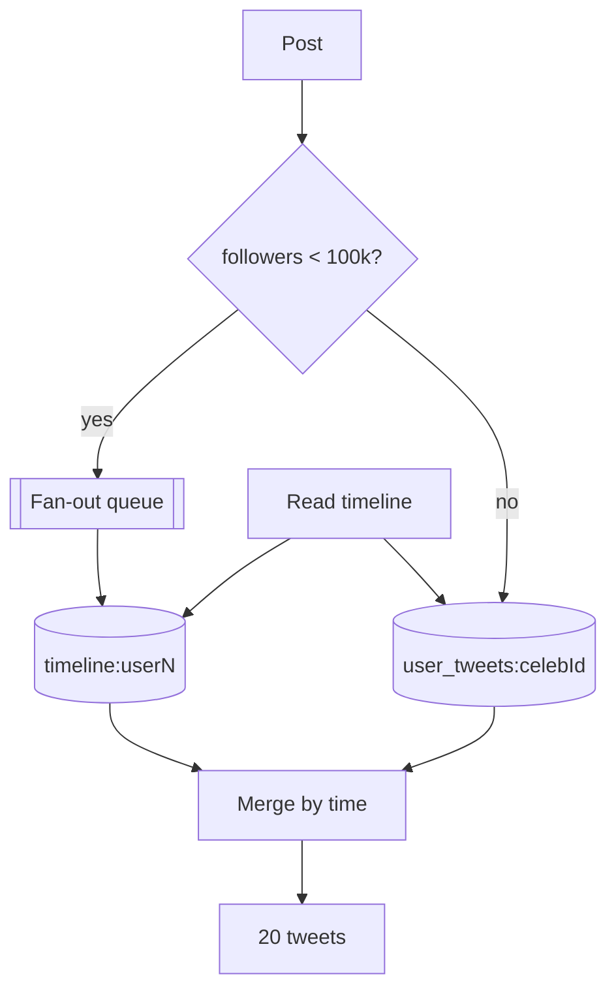

# 3.4.3 — Push vs Pull in the Twitter Timeline

> **Part 3 · Scaling Services · Dataflow · Chapter 3 of 3**
> The canonical worked example. If you can design this, you can design most feed systems.

---

## 🧒 ELI5 — Explain Like I'm 5

You follow 200 people. When you open the app, you want **the newest things those 200 people said**, in order, instantly.

Two ways to do it:

**Way 1 — the postbox.** Everyone you follow, whenever they post, **drops a copy in your postbox**. When you open the app you just read your postbox. Instant! But: when a famous person with 100 million followers posts once, someone has to drop **100 million copies** into 100 million postboxes. That's one person's single sentence causing a hundred million deliveries.

**Way 2 — the phone-around.** Nothing is delivered. When you open the app, you **ring all 200 people** and ask "what did you say recently?", then sort the answers by time. Posting is free! But *reading* means 200 phone calls, every single time you open the app — and you open it thirty times a day.

Neither works on its own.

**The answer: do both.** Normal people drop copies in postboxes (there aren't many followers, so it's cheap). Famous people **don't** — when you open the app, you read your postbox *and* ring the handful of famous people you follow, then merge the two lists.

Best of both. And it's what Twitter actually does.

---

## The requirements

```
FR1  A user posts a tweet (≤280 chars, optional media)
FR2  A user follows/unfollows another user
FR3  A user views a home timeline: tweets from people they follow, newest first

NFR  200M DAU
     Timeline read p99 < 200 ms
     A tweet appears in followers' timelines within a few seconds
     Timeline availability 99.99% (reads matter far more than writes)
```

---

## The numbers first

```
DAU                        200,000,000
Tweets per user per day    0.5
Timeline views per day     20 per user

WRITES
  100M tweets/day    → 1,200 tweets/s avg  → ~5,000/s peak

READS
  4 × 10⁹ timeline views/day → 46,000/s avg → ~150,000/s peak

READ:WRITE = ~40:1 on operations, but each read shows ~20 tweets
             → effectively 1000:1 on tweet-deliveries

FOLLOWER DISTRIBUTION (power law)
  median          ~50 followers
  mean            ~200 (skewed by the tail)
  p99             ~10,000
  top accounts    100,000,000+
```

**The cost comparison:**

```
PUSH:  1,200 tweets/s × 200 avg followers = 240,000 timeline writes/s
PULL:  46,000 reads/s × 200 followees     = 9,200,000 source queries/s

→ push is ~38x cheaper on average ✅
```

**But the tail:**
```
One tweet from a 100M-follower account = 100,000,000 timeline writes
At 240,000 writes/s of total capacity, that ONE tweet takes 7 minutes
and starves every other write in the system.
```

🎯 **Both numbers matter, and they point in opposite directions.** That tension *is* the design problem, and stating it explicitly is how you show you understand it.

---

## Design A — Pure pull (fan-out on read)

```sql
SELECT t.* FROM tweets t
JOIN follows f ON t.author_id = f.followee_id
WHERE f.follower_id = ?
ORDER BY t.created_at DESC
LIMIT 20;
```



| ✅ | ❌ |
|---|---|
| Writes are O(1) — one row insert | Reads query N sources and merge |
| No storage duplication | 150,000 reads/s × 200 followees = **30M source lookups/s** |
| Always fresh | Latency 500 ms – 2 s: unacceptable |
| Unfollow is instant | The tweets table is sharded, so this is a scatter-gather over many shards |

**Verdict:** correct, simple, and far too slow at this scale. Fine for a system with thousands of users.

---

## Design B — Pure push (fan-out on write)

```python
def post_tweet(author_id, text):
    tweet_id = tweets.insert(author_id, text)                 # 1 write
    for follower_id in follows.get_followers(author_id):      # N writes
        redis.lpush(f"timeline:{follower_id}", tweet_id)
        redis.ltrim(f"timeline:{follower_id}", 0, 799)        # cap at 800
```



```python
def get_timeline(user_id):
    ids = redis.lrange(f"timeline:{user_id}", 0, 19)          # ONE O(1) call
    return tweets.mget(ids)                                    # ONE batch fetch
```

| ✅ | ❌ |
|---|---|
| **Reads are O(1)** — one Redis range, ~1 ms | Writes are O(followers) |
| p99 well under 50 ms | **Celebrity posts are impossible** (100M writes) |
| Trivially scalable reads | Storage: N copies of every tweet ID |
| | A new follow requires backfilling their timeline |
| | Fan-out to inactive users is wasted work |

🔢 **Storage:** 200M users × 800 tweet IDs × 8 bytes = **1.28 TB** of pure IDs. That fits in a Redis cluster — and note it's *IDs only*, not tweet content, which is the key design choice making it affordable.

**Verdict:** the right default, but it cannot handle the tail.

---

## Design C — The hybrid (the answer)

```python
CELEBRITY_THRESHOLD = 100_000

def post_tweet(author_id, text):
    tweet_id = tweets.insert(author_id, text)
    if follower_count(author_id) < CELEBRITY_THRESHOLD:
        fanout_queue.publish({"tweet_id": tweet_id, "author_id": author_id})
    # celebrities: no fan-out at all. Readers will pull.

def get_timeline(user_id):
    pushed = redis.lrange(f"timeline:{user_id}", 0, 99)              # O(1)
    celebs = celebrity_follows(user_id)                               # usually < 50
    pulled = []
    for cid in celebs:
        pulled += redis.lrange(f"user_tweets:{cid}", 0, 19)          # O(small)
    merged = merge_by_snowflake_id(pushed, pulled)                    # time-ordered
    return tweets.mget(merged[:20])
```



| Property | Result |
|---|---|
| Write cost | Bounded at 100,000 per post — a few seconds via async workers |
| Read cost | O(1) for the pushed part + O(celebrities followed), typically < 50 |
| Read latency | p99 ~50 ms |
| Storage | ~1.3 TB of IDs |
| Freshness | Pushed: seconds. Pulled: instant |

**Choosing the threshold:** at 100,000 followers and 240,000 writes/s of fan-out capacity, one celebrity post consumes ~0.4 s of total capacity — acceptable. At 1M it would be 4 s, which starves normal users. Tune from your actual fan-out throughput.

---

## The details that separate a good answer from a great one

### 1. Tweet IDs, not tweet content, in timelines
Storing IDs costs 8 bytes vs ~300 bytes; 1.3 TB vs 48 TB. And a deleted or edited tweet is handled at hydration time rather than requiring you to find and rewrite 100M timeline entries.

### 2. Snowflake IDs give free time ordering
A 64-bit ID of `timestamp | machine | sequence` is **monotonically increasing by time**, so merging pushed and pulled lists is a simple numeric merge — no timestamp lookups needed. ([Unique ID Generators](../../07-patterns-and-templates/01-patterns/06-unique-id-generators.md))

### 3. Only fan out to active users
🔢 Perhaps 20% of followers have opened the app in the last 30 days. Fanning out only to them cuts fan-out work **5×**. Inactive users' timelines are rebuilt on demand when they return (a slow first load, which is fine).

### 4. Cap the timeline
800 entries is ~40 pages of scrolling. Beyond that, fall back to a pull query. Uncapped timelines grow without bound for users who follow prolific accounts.

### 5. Fan-out is asynchronous
The post request returns as soon as the tweet is stored and the fan-out job is enqueued. The user sees their tweet immediately (read-your-writes from their own `user_tweets` list); followers see it within seconds.

### 6. Hydration is a batched read
`tweets.mget([...20 ids])` is one call. Never fetch tweets one at a time — that's the N+1 problem at 150,000 QPS.

---

## The hard follow-ups

### "What happens when someone follows a new person?"

| Option | Behaviour |
|---|---|
| Backfill their timeline with the followee's recent tweets | Correct; costs one write per new follow |
| Do nothing; new tweets arrive going forward | Simpler; the timeline looks oddly empty of that person initially |
| Merge at read time until the next natural rebuild | ✅ Good compromise |

**Unfollow is harder:** the followee's tweets are already sitting in the follower's timeline list. Options: filter at hydration time (check the current follow set — cheap, and it's the usual answer), or rebuild the timeline asynchronously.

### "How do you handle deletes?"
Because timelines store IDs, deletion is handled at hydration: the tweet fetch returns nothing and the entry is skipped. **No timeline rewriting required.** This is the payoff of storing IDs.

### "What if the fan-out worker falls behind?"
Monitor queue lag. Mitigations: prioritise fan-out for active users, scale workers on queue depth, and if lag exceeds a threshold, **degrade celebrities downward** — temporarily treat accounts above a lower threshold as pull-only, cutting fan-out volume immediately.

### "How do you rank rather than just sort by time?"
Ranking breaks the simple merge, because a stable cursor no longer exists. The standard approach: **fetch a candidate set (a few hundred) from push + pull, rank it once per session, materialise the ranked list into a session cache, and paginate over that frozen list by index.** ([Pagination](../../01-introduction/02-api-design/03-pagination.md#ranked--personalised-feeds))

### "What about the write path for the tweets themselves?"
Sharded by `tweet_id` (Snowflake) for even distribution, with a secondary `user_tweets:{user_id}` list (a Redis list or a Cassandra partition keyed by user) for the pull path and for profile pages.

### "How do you make the read path 99.99% available?"
Timelines live in a replicated Redis cluster; on a total cache miss, fall back to the pull query against the tweets store (slower but functional). The read path never depends on the fan-out pipeline being healthy.

---

## The generalisation

This exact structure recurs constantly:

| System | Push | Pull | Hybrid trigger |
|---|---|---|---|
| Twitter/X timeline | Normal accounts | Celebrities | Follower count |
| Instagram feed | Normal accounts | Celebrities | Follower count |
| Facebook News Feed | Friends (bounded ~5,000) | Pages/groups with huge audiences | Audience size |
| Slack channels | Small channels | #general with 50,000 members | Member count |
| Email lists | Small lists | Newsletters (use a delivery service) | Recipient count |
| Notifications | Direct notifications | Broadcast announcements | Audience size |
| YouTube subscriptions | Small channels | Channels with millions of subscribers | Subscriber count |

🎯 **The rule to state:** *"Fan out on write when the fan-out is bounded; fan out on read when it isn't; and set the threshold from your fan-out throughput budget."*

---

## The full answer, spoken (90 seconds)

> "Reads are about 1000× writes in terms of tweet-deliveries, so I want the read path to be O(1) — that means fan-out on write, pushing tweet IDs into a per-user Redis list capped at 800 entries. That's 200M users × 800 × 8 bytes ≈ 1.3 TB, which is affordable because I'm storing IDs, not content.
>
> But pure push breaks on celebrities: one post from a 100-million-follower account is 100 million writes, which at our fan-out capacity would take seven minutes and starve everyone else. So it's a hybrid — push below 100,000 followers, and for accounts above that, don't fan out at all. At read time I merge the pushed timeline with a pull from the handful of celebrities that user follows, which is typically fewer than fifty.
>
> IDs are Snowflake, so they're time-ordered and merging is a numeric merge. Fan-out is asynchronous off a queue, and I only fan out to users active in the last thirty days, which cuts the work about five-fold; inactive timelines are rebuilt on demand.
>
> Deletes and unfollows are handled at hydration time rather than by rewriting timelines — that's the payoff of storing IDs. And if the fan-out queue falls behind, I lower the celebrity threshold temporarily, which immediately cuts fan-out volume."

---

## 📋 Chapter checklist

| Skill | Ready? |
|---|---|
| Compute push vs pull cost for the timeline | ☐ |
| Explain why pure pull and pure push both fail | ☐ |
| Write the hybrid post and read paths | ☐ |
| Justify the threshold from fan-out throughput | ☐ |
| Explain why timelines store IDs, not content | ☐ |
| Explain how Snowflake IDs make merging trivial | ☐ |
| Quantify the active-users-only optimisation | ☐ |
| Answer the follow, unfollow, and delete questions | ☐ |
| Explain ranked-feed pagination | ☐ |
| Explain how to degrade when fan-out lags | ☐ |
| Deliver the 90-second answer | ☐ |

---

**← Previous** [3.4.2 Push vs Pull](02-push-vs-pull.md)
**Next →** [4.1.1 Data Structures Behind Databases](../../04-data-storage/01-data-structures-behind-databases/01-data-structures-behind-databases.md)
